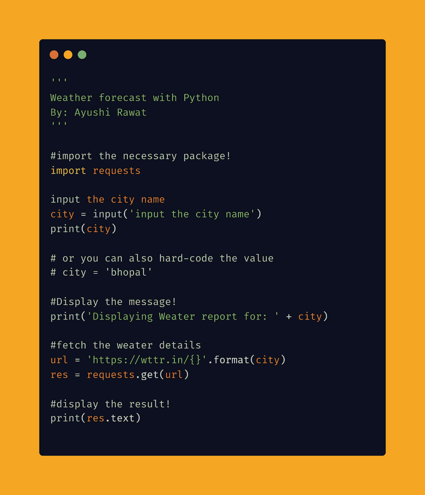
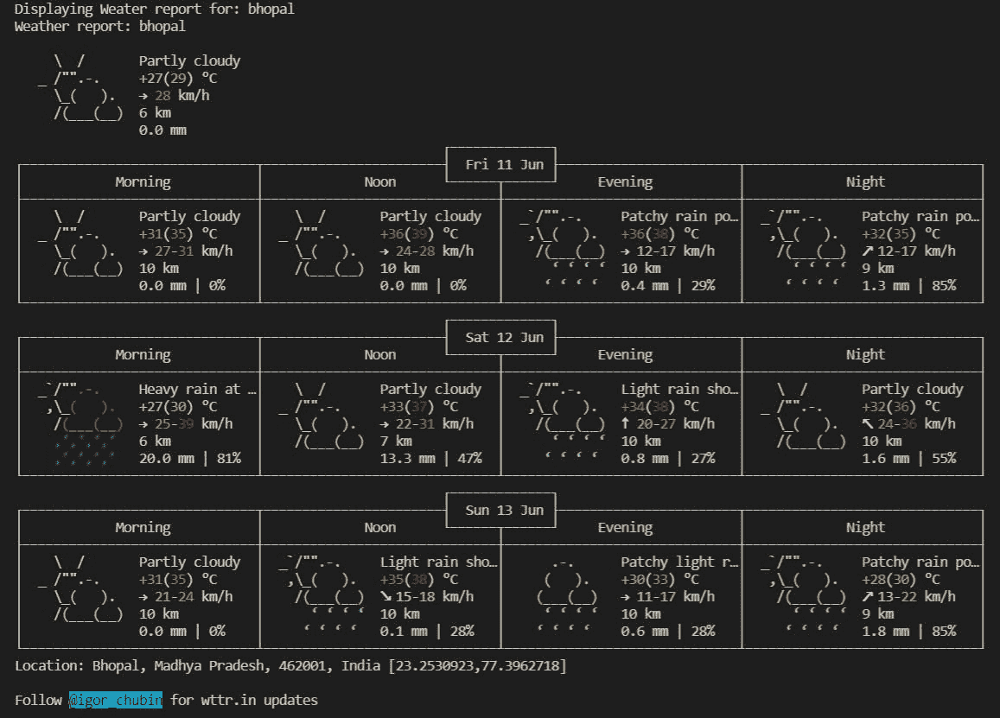

# 使用 Python 预测天气

> 原文：<https://medium.com/analytics-vidhya/forecast-weather-using-python-e6f5519dc3c1?source=collection_archive---------1----------------------->

读者你好！


天气是我们大气中每天发生的事件的组合，在世界的不同地方是不同的，并且在几分钟、几小时、几天和几周内变化。下雨和阴沉的云、刮风的蓝天、寒冷的雪和湿热是非常不同的情况，但它们都是全天候的。根据维基百科的定义:

> 天气是大气的状态。

在这篇博文中，我们将学习如何预报天气细节。我们将看到用 Python 实现的几行代码。

[查看 python 的终极资源库](https://github.com/ayushi7rawat/Ultimate-Python-Resource-Hub)。发现有用就掉颗星！有什么要补充的吗？开个 PR 就一样了！

[ayushi 7 rawat/Ultimate-Python-Resource-hub Python 的终极资源枢纽:都在一个地方—ayushi 7 rawat/Ultimate-Python-Resource-hubgithub . com](https://github.com/ayushi7rawat/Ultimate-Python-Resource-Hub)

你可以参考我的 YouTube 视频教程来看一个工作教程，以便更好地理解和一步一步的指导。

# 这个博客将会涵盖什么

```
1\.    What is wttr?
2\.    What is requests Module
3\.    How to forecast the weather using Python
```

*让我们开始吧！*

# wttr 是什么？

> wttr——查看天气的正确方法！

wttr.in 是一个面向控制台的天气预报服务，它支持各种信息表示方法，比如面向终端的 ANSI 序列用于控制台 HTTP 客户端(curl、httpie 或 wget)，HTML 用于 web 浏览器，或者 PNG 用于图形查看器。

[wttr.in](http://wttr.in/) 使用 [wego](http://github.com/schachmat/wego) 进行可视化，使用各种数据源获取天气预报信息。

如果你想了解更多，可以参考 [wttr 的 GitHub Repo](https://github.com/chubin/wttr.in) 。

# 使用的模块:请求模块:

Requests 是一个简单而优雅的 HTTP 库。它允许您非常容易地发送 HTTP/1.1 请求。请求官方支持 Python 2.7 & 3.5+。

如果你想了解更多，你可以参考[请求模块文档](https://docs.python-requests.org/en/master/)。

现在，您已经熟悉了*请求模块*的基础知识，并掌握了 *wttr、*的基本知识，我们可以前进到*编码部分。*

# 该编码了！

你可以在我的 [GitHub 资源库](https://github.com/ayushi7rawat/Youtube-Projects/tree/master/Weather%20Forecast)中找到所有代码。发现有用就掉颗星。



为了访问 Python 库，需要将其安装到 Python 环境中

```
pip install requests
```

现在，我们需要将包导入到 python 脚本中。使用以下命令来完成此操作。

```
import requests
```

现在我们已经使用命令`import requests`导入了库，让我们继续。

让我们要求用户输入他/她希望获取天气详情的城市名称。

```
city = input('input the city name')
print(city)
```

如果您只想自己检查，也可以硬编码该值。

```
city = 'bhopal'
```

现在，让我们显示一条简单的消息。

```
print('Displaying Weather report for: ' + city)#output:
Displaying Weather report for: bhopal
```

让我们定义 URL，我们将利用`format`在这里将城市作为参数传递。

```
url = 'https://wttr.in/{}'.format(city)
```

是时候使用`requests`模块了。

```
res = requests.get(url)
```

我们得到的数据存储在`res`中。我们将利用`text`方法提取我们想要的天气细节，并显示结果。

```
print(res.text)
```

这是天气预报的样子:



是不是很美？就这样，结束了！我希望这篇文章对你有用！请在下面的评论中分享。我创建关于职业、博客、编程和生产力的内容，如果你对此感兴趣，请与你的朋友和关系人分享这篇文章。你也可以订阅我的时事通讯，在我每次写东西的时候得到更新！

谢谢你的阅读，如果你已经到目前为止，请喜欢这篇文章，它会鼓励我写更多这样的文章。请分享您的宝贵建议，感谢您的真诚反馈！

我强烈建议你看看 YouTube 上的视频[还有别忘了订阅我的频道。我很乐意在](https://www.youtube.com/watch?v=jAOkWehMF6E)[Twitter](https://twitter.com/ayushi7rawat)|[LinkedIn](https://www.linkedin.com/in/ayushi7rawat/)与你联系。

你绝对应该看看我的其他博客:

*   [Python 3.9:你需要知道的一切](https://ayushirawat.com/python-39-all-you-need-to-know)
*   [GitHub CLI 1.0:你需要知道的一切](https://ayushirawat.com/github-cli-10-all-you-need-to-know)
*   [如何制作自己的谷歌 Chrome 扩展](https://ayushirawat.com/how-to-make-your-own-google-chrome-extension-1)
*   [从 Python 运行 Javascript】](https://ayushirawat.com/run-javascript-from-python)
*   [使用 Python 自动化 WhatsApp](https://ayushirawat.com/automate-whatsapp-using-python)
*   [使用 Python 自动提供 Cowin 疫苗槽](https://ayushirawat.com/automate-cowin-vaccine-slots-availablity-using-python)
*   [什么是竞技编程](https://ayushirawat.com/what-is-competitive-programming-or-beginners-guide)

## 资源:

*   【scied.ucar.edu/learning-zone/how-weather-wo.. 
*   [en.wikipedia.org/wiki/Weather](https://en.wikipedia.org/wiki/Weather)
*   [github.com/chubin/wttr.in](https://github.com/chubin/wttr.in)
*   [pypi.org/project/requests](https://pypi.org/project/requests/)
*   [docs.python-requests.org/en/master](https://docs.python-requests.org/en/master/)

在我的下一篇博客文章中再见，保重！！