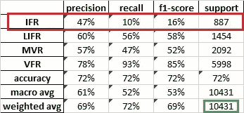

# 用人工智能预测维戈机场的飞行规则

> 原文：<https://medium.com/analytics-vidhya/forecasting-flight-rules-with-ai-at-vigo-airport-levx-ce3e4d12ab84?source=collection_archive---------24----------------------->

飞行规则是飞机在各种气象条件下飞行所采用的规则和程序。通过这个[链接](https://www.aviationweather.gov/taf/help?page=plot)，我们可以看到所有与飞行规则相关的气象条件。

我们的目标是通过机器学习来提高气象模型的准确性。为此，我们需要一个包含输入变量(历史气象模型结果)和输出数据(气象站的实际数据)的数据库。独立变量是气象模型的输出。气象站测量因变量。经过训练的机器学习算法将从每天更新的气象模型中获取变量，并预测一个气象变量。

气象模型是由来自加利西亚(西班牙)的公共气象服务机构 Meteogalicia 维护的 WRF 模型。该模型的分辨率为 4 公里。我们从该站获得由模型提供的最近的十个点输出。这篇文章是集中在维哥机场气象站与国际民航组织的指示:LEVX。下图中可以看到距离 de Vigo 机场气象站最近的十个气象模型点。数字表示从模型输出到气象站的距离，单位为 Km。

在这种情况下，我们要预测每小时 24 小时的飞行规则气象条件。我们可以在几个气象网页上看到实际的飞行状况为[有风](https://www.windy.com/?42.598,-8.770,5,i:pressure)。

我在 Kaggle 中建立了一个数据集，其中包含了构建机器学习系统所需的所有文件。你可以在《T4》中看到。

有一个叫做 operational_LEVX 的笔记本链接到这个数据集。笔记本读取实际的气象模型和一个扩展名为“. al .”的文件。如果我们想得到飞行规则预报，所有的“文件”都包含“额外树”算法。文件名为 fr_et_LEVX_p10R4KmD0.al，其中:

飞行规则变量

et:额外树算法

LEVX:国际民航组织指示性机场

p10R4Km:表示我们选择离气象站最近的十个点，气象模型的空间分辨率为 4Km

D0:表示您预测今天(第 0 天)的所有 0 点钟时间(UTC)。D1 意味着明天(第一天)

对于每个小时，我们可以得到四种可能的结果。这是一个分类问题。

目视飞行规则。天花板高于地面 3000 英尺，水平能见度大于 5 英里。

**MVFR:** 边缘目视飞行规则。离地 1000 到 3000 英尺的天花板和/或 3 到 5 英里的水平能见度。

**IFR:** 仪表飞行规则。离地高度 500 至 1000 英尺以下和/或水平能见度 1 英里至 3 英里以下。

**LIFR:** 低仪表飞行规则。地面以上 500 英尺以下的天花板和/或水平能见度小于 1 英里。

输出文件是一个包含四张工作表的 Excel 文件。

第一个表(ml_results)在行中包含所有预测的时间，在列中包含四种可能的结果。表格中充满了概率。

ml _ 输出文件 operational_LEVX 中的模型表

第二张纸(下图)是精密纸。前四列是可能的机器学习输出。最后一栏(全部)是每个实际产量或气候学的百分比。前四行是真实的气象数据。例如，第一列意味着当机器学习模型预测“IFR”时，实际输出是:47%“IFR”，21%“LIFR”，25%“MVR”，7%“VFR。”熵代表每个模型输出的信息量。每个模型输出都有一个概率质量分布(PMF)和与之相关的熵。我们也可以计算气候学的熵(最后一栏)。当 PMF 给我们尽可能多的信息时，一个细胞是 100%，其余的细胞是 0%。在这种特殊情况下，熵是 0。当所有输出的概率相同或 PMF 为均匀分布时，PMF 可能提供的信息最少。

精密薄片

信息量并不意味着高质量的信息！你需要检查以下表格:ml_class_report。

在这种情况下，我们“随机”搜索了 10431 个(绿色方块)测试真实数据。我们有四个输出:仪表飞行规则、LIFR、MVR 和目视飞行规则。IFR 的精度为 47%。当模型输出是 IFR 时，你应该在 47%的情况下期待这个真实的结果。当实际输出是 IFR 时，模型只在 10%的时间里预测这个准确的结果！！。f1_score 是精度和召回率的调和平均值。我们还得到了总体准确率(72%)、宏以及加权精度和召回率。支持列是测试集中实际输出的数量。

最后一张纸是用五个随机折叠交叉验证的(ShuffleSplit 系统)

交叉验证

**结论**

我鼓励对大气科学和机器学习感兴趣的人使用 AI 和相关的笔记本 operational_LEVX 在维戈机场测试 Kaggle 数据集:[天气预报。感谢大家的阅读和评论！](https://www.kaggle.com/jorgerobinat/weather-forecasting-at-vigo-airport-using-ai)