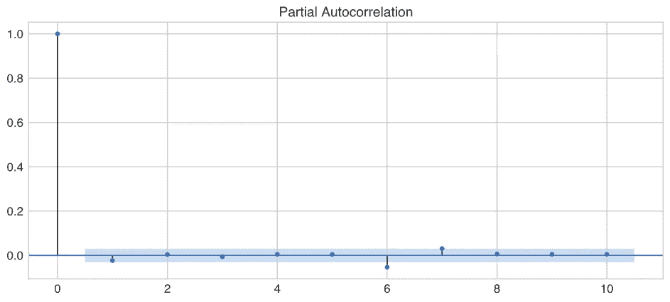

# 用 ARIMA 模型预测谷歌的股价

> 原文：<https://medium.com/analytics-vidhya/forecasting-googles-stock-price-with-arima-modeling-1148cd8496c8?source=collection_archive---------4----------------------->

Github repo for this can 发现[此处](https://github.com/mdominguez2010/predict-stock-price-arima)

在 Gamestop 在 subreddit r/wallstreetbets 的惨败之后，我对股票市场产生了浓厚的兴趣。它预示着极度富有的机会。如果你只能对一只股票，你可以永远改变你的生活。很多人追求这个梦想，然而也有很多人的梦想被粉碎，就像汤姆·布拉迪对堪萨斯城酋长队所做的那样。

为什么？

影响股票价格的变量数不胜数。普通人不可能完全理解所有这些是如何工作的。处理数以万计的数据点是人脑无法处理的。但是也许一台机器可以…

免责声明:在我开始之前，必须声明—本文绝不是任何形式的交易建议，而仅仅是一个简单的数据科学项目。准确预测股票价格变动需要高度复杂的模型，但事实并非如此。

目的:创建一个简单的时间序列模型来预测谷歌的股票价格。

**方法论:**

1.  使用 TD Ameritrade 的 API 检索数据
2.  清理并可视化数据
3.  计算回报
4.  平稳性检验:迪基-富勒检验
5.  使用 ACF 和 PACF 图表选择参数
6.  建立 ARIMA 时间序列模型
7.  用实际值绘制预测值
8.  做检测
9.  分析结果

**导入库**

我将使用以下 python 库来执行我的分析:

```
# Libraries for handling data
from information import client_id
import requests
import numpy as np
import pandas as pd
from datetime import datetime
import random# For visualizations
import plotly.graph_objects as go
import matplotlib.pyplot as plt# For time series modeling
import statsmodels.api as sm
from statsmodels.tsa.stattools import adfuller
from statsmodels.graphics.tsaplots import plot_acf, plot_pacf
from statsmodels.tsa.arima_model import ARMA
```

**使用 TD Ameritrade 的 API 检索数据**

TD Ameritrade 有一个像样的股票价格 API，它不是超级健壮，但足以获得我们需要的数据。有关如何开始使用 TD Ameritrade 的 API 的好教程，请查看:

我的自定义函数从 TD Ameritrade 的 API 请求和提取数据:

**清理并可视化数据**

检查未知值或 NaN(非数字)值:

```
dataframe[dataframe.isna().any(*axis*=1)]
```

绘制数据:


从 TD Ameritrade API 检索

**计算收益**

适当的时间序列要求数据是平稳的。这意味着均值和标准差与时间无关。为此，我们对数据进行一阶差分(计算日收益率)。

绘图回报:


**平稳性测试:迪基-富勒测试**

平稳性意味着收益的均值和标准差与时间无关。这一点很重要，因为它考虑到了预测模型的稳定性和某种程度的确定性。

为此，我们必须首先计算滚动平均值和标准偏差

绘制滚动平均值和标准偏差的回报


现在我们可以进行迪基-富勒测试了:

使用 p 值< 0.05, we can reject the null hypothesis that there is a unit root, which is a fancy way of saying there is a discernible patter. Since we reject the null hypothesis, the data is therefore stationary! We can now proceed with the time-series modeling process.

**选择参数使用 ACF 和 PACF 图表**

anARIMA 模型的参数定义如下:

*   **p** :模型中包含的滞后观测值的个数，也称为滞后阶数。
*   **d** :原始观测值被差分的次数，也叫差分程度。我们的数据有一次差异(每日回报)
*   **q** :移动平均线窗口的大小，也叫移动平均线的顺序。

制作自相关和偏自相关图表有助于我们选择 ARIMA 模型的参数。

ACF 为我们提供了每个“y”值与前 n 个“y”值相关程度的度量。

PACF 是部分相关函数，它给出了由 n 个滞后分隔的两个“y”值之间的相关量(样本),排除了它们之间所有“y”值的影响。

advancedcommunicationsfunction 高级通信功能


PACF



上面的图表显示 ACF 和 PACF 的读数给了我们 6 的滞后“p”和 6 的滞后“q”

**建立 ARIMA 时间序列模型**

**绘制预测与实际**


**进行预测**

现在是我们期待已久的时刻…


**分析结果**

让我们看看我们的预测。我们离实际股价有多近？让我们画出残差(误差)的分布图


尽管大部分误差接近于零，但其中太多误差远离零，这意味着许多预测与实际相差甚远。这可能意味着巨大的损失(这就是为什么你不应该把这个模型用于交易目的，而只能用于教育目的)。

*   我们模式的 AIC 很小，为-20964.701。但是这就等同于一个好的模型吗？大概不会。
*   如果我们检查误差(预测-收盘价)，平均绝对误差约为 6.8，这可能会导致重大损失。
*   模型预测的误差一度达到 144，这些交易会导致巨大的损失。

有问题吗？评论？联系我:

电子邮件:[md.ghsd@gmail.com](mailto:md.ghsd@gmail.com)

领英:[https://www.linkedin.com/in/marcosdominguez2018/](https://www.linkedin.com/in/marcosdominguez2018/)

推特:[https://twitter.com/mdcruz2010](https://twitter.com/mdcruz2010)