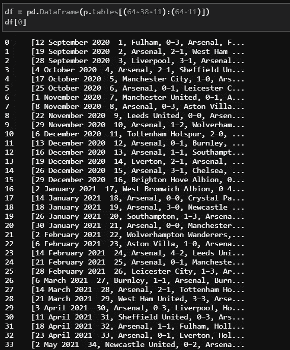
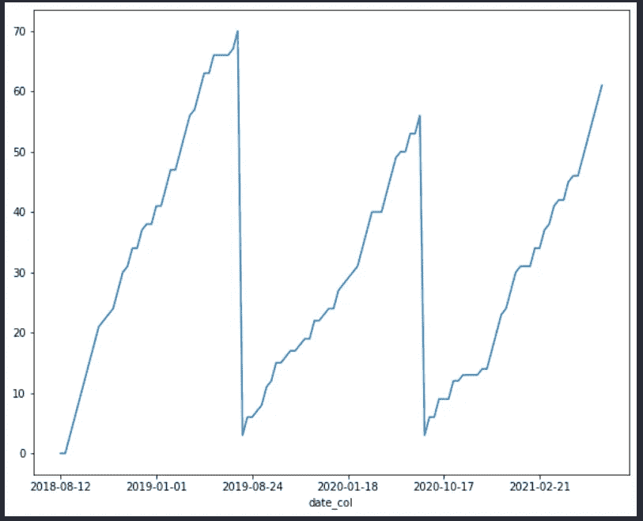
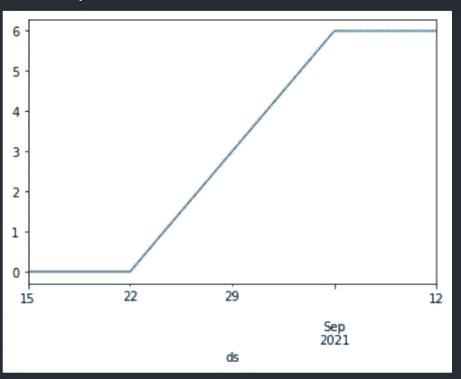
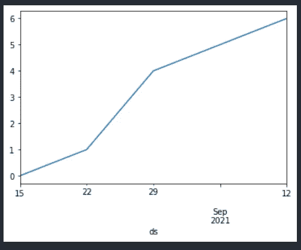
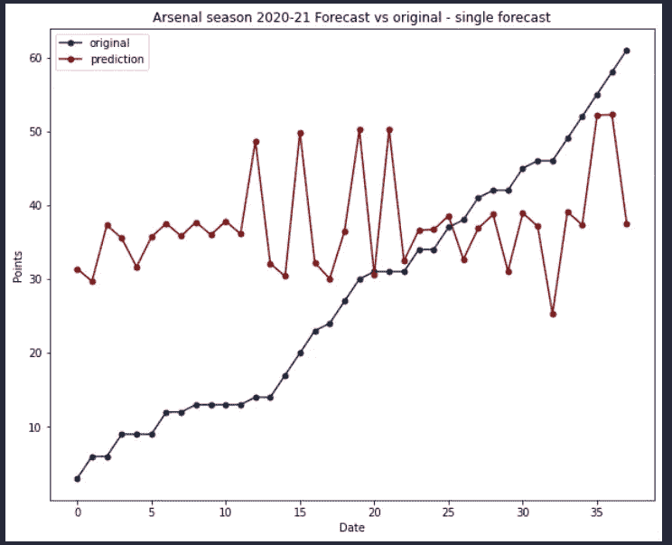
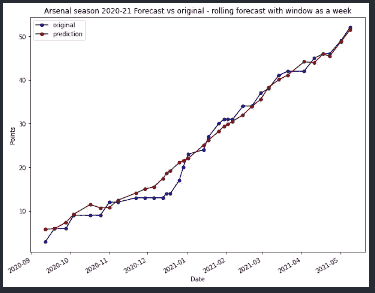
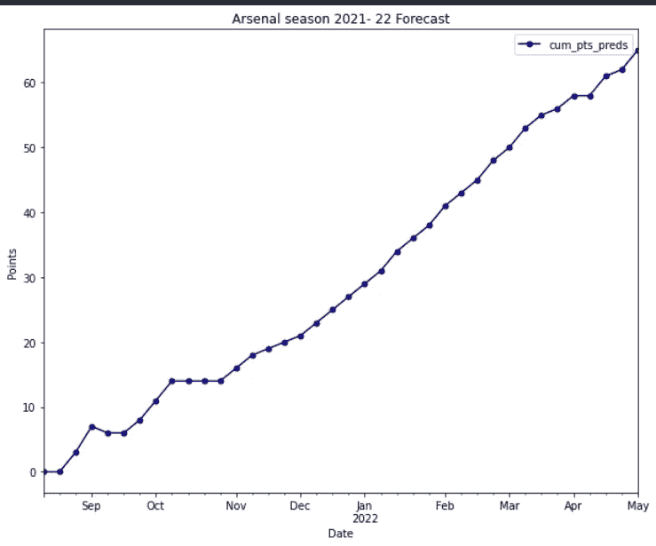

# 用 Prophet 预测我心爱的阿森纳在 EPL 2021/22 赛季的表现

> 原文：<https://medium.com/analytics-vidhya/forecasting-my-beloved-arsenal-performance-for-epl-2021-22-season-using-prophet-ea6167825b11?source=collection_archive---------9----------------------->

我是一个超级阿森纳球迷，老实说，我有点痴迷于他们。我的大部分空闲时间都用来观看阿森纳过去踢过的精彩比赛。尽管我说他们做得不好，但这对整个足球世界来说是一个令人担忧的迹象，因为在我看来，阿森纳踢了过去十年中最有趣的足球，仅次于巴塞罗那的年轻一代。由于我喜欢机器学习，我有这个想法来预测阿森纳在即将到来的 2021/22 赛季英超联赛中会获得多少分。所以我想建立一个预测解决方案的模型，并在这里尝试预测阿森纳在接下来的赛季中会得到的结果和积分。因此，让我们马上着手解决这个问题。

**数据准备:**

为了创建任何模型，我们至少需要最少量的数据，所以在这里我使用了一个 web scraper 包[html-table-parser-python 3](https://pypi.org/project/html-table-parser-python3/)，它从我们搜索的网站上抓取表格。请跟随这个来自[极客帮极客](https://www.geeksforgeeks.org/scrape-tables-from-any-website-using-python/)的例子来了解更多。在我们的例子中，我只刮到了阿森纳过去三个赛季(即 2018-2021)的 EPL 成绩。因此，当你浏览网站时，你会看到网站上有很多表格。举例来说，当我刮阿森纳的一个赛季时，我碰巧看到了下面的表格。

因此，表以列表的形式出现，这些列表必须转换成数据框才能进一步处理。在检索这些表之后，我们需要做一些基本的处理，将它们转换成模型可消费的方式。请找到我使用的处理步骤，你可以添加更多的功能，如果希望进一步

代码片段

上面的代码片段将添加一些功能，如裁判、球队是否有主场优势、比分等。我们可以添加其他功能，如温度，天气，每支球队的护身符球员，节日效果和所有这些功能也将有助于建模很多。因此，我们最终的数据帧将如下所示。我又创造了一个变量***【PI】***，它告诉我们阿森纳赢得那场比赛的相对概率。该特性的推导在下面的[笔记本](https://www.kaggle.com/vishnunkumar/data-preparation)中完成。基本上，它根据每个对手在前几个赛季相对于阿森纳的积分得出一个数值。

**基础 EDA:**

由于我们已经完成了数据的预处理，让我们在数据集上做一个简单的 EDA，以了解阿森纳在特定条件下的表现。

*   **主场优势:**

正如任何球队在任何运动中所期望的那样，阿森纳在主场比赛时也获得了更多的分数。

*   **裁判影响:**

由裁判为阿森纳执法的比赛

因为大多数比赛都是由这六位裁判执法的:迈克尔·奥利弗、阿特金森、安东尼·泰勒、j .莫斯、M .迪恩和 p .蒂尔尼。在比赛如何进行的问题上，每个队肯定都有很多发言权。

当比赛由不同的裁判执法时得到的分数

考虑到阿森纳的历史，在过去的三个赛季中，当麦克·迪恩执法时，阿森纳获得了更多的积分，这是一个奇怪的事实。近年来形势已经发生了变化，也许麦克·迪恩真的不喜欢温格。

**造型**

因为我把这当成一个预测问题，所以让我们试试来自脸书的开源库，为时间序列 [fbprophet](https://facebook.github.io/prophet/) 建模。那么我们先简单了解一下什么是时间序列，简单来说任何依赖于时间为变量的序列都是时间序列。基本上，时间序列由三部分组成

*   趋势:它是时间序列随时间移动的方式，即它如何变化(不系统变化的长期成分)
*   季节性:该部分表示时间序列的循环性质，即时间序列的重复程度——每周、每月、每年等。(具有循环或周期性波动的短时间成分)
*   残差:非理想时间序列的剩余部分。如果我们计算时间序列的季节性和趋势部分，我们将得到时间序列的理想情景，但残差是使它们区别于理想情景的因素。(不规则的波动)

时间序列通常具有两种性质:加法和乘法。如果你的季节性成分加入到你的趋势中，那么它是相加的，如果你的季节性随着你的趋势快速变化，那么它基本上是一个相乘的时间序列。

由于 Prophet 期望输入数据是某种格式的，所以我们必须按要求处理数据。因为数据只有每场比赛的分数，所以让我们分别得到每个赛季的累计分数。最后，训练数据如下所示。

正如我们所见，该序列具有倍增的季节性，因为季节性项会发生变化，或者高度依赖于趋势。因为 prophet 只需要日期和值列，所以我们只能使用这两个列，除非我们想使用一些回归变量。

Prophet 接受两个变量作为输入，一个是日期列，另一个是要训练和预测的值，我们可以修改参数，如季节性、回归变量、如何拟合季节性和趋势项的约束。

*   让我们尝试在没有任何回归变量的情况下，仅使用每个季节的累积点作为因变量来对数据进行建模。因此，训练数据如下所示，拟合模型后，我们得到以下结果

*   使用关于游戏是在家玩还是在外玩的信息。

*   添加关于裁判和主场优势的信息

从上面的图和预测中我们可以看出，回归变量对训练有很大的影响，有了更多的回归变量，我们可以更好地训练模型并提高其效率。在第一种情况下，没有任何回归变量，模型似乎只适合之前看到的系列值，而在第三种情况下，我选择了过去三个赛季中为阿森纳执法最多比赛的前五名裁判，以及他们在哪里参加这些比赛的信息。另一种改进时间序列预测的方法是尝试建模的滚动方法，我们用数据窗口训练模型，因为这种方法只考虑最近的历史数据，而忽略了过去的历史数据，你可以查看我在下面的另一篇文章

 [## 用简单的方法进行时间序列预测

### 你听过预言这个词吗？如果不是，让我用简单的方式告诉你。如果有人告诉你，你是我的唯一…

medium.com](/analytics-vidhya/time-series-forecasting-in-a-simple-way-29b363e5be06) 

为了说明滚动法预测如何改善 Prophet 等自回归模型的结果，我在整个数据集的前两个季度拟合了模型，并在第三个季度进行了预测，您可以看到如下结果:

一次性预测

窗口 7 滚动预测—即一周内的培训

在第一幅图中，我拟合了前两个赛季的模型，并对整个第三个赛季进行了预测，而在第二幅图中，我通过向训练数据集添加 7 天进行了增量训练，并对随后的 7 天进行了预测。你可以在我提到的文章中找到更多关于这个逻辑的内容。这里的问题是，当你减小窗口大小时，结果会改善，但如果我们使用自回归模型，这并不总是你的理想情况。理想情况下，所需的数据量与预测范围成正比。

最后但同样重要的是，我预测了阿森纳在 2021-22 赛季将获得的积分，输入变量是日期，主客场比赛，PI 值。结果如下:

看起来阿森纳可能在最后一个比赛日得到 65 分，这可能非常接近或远离实际值，但如果我们包括更多的特征，如谁打了更多的比赛，天气条件，比赛时间等，我们可以取得更好的结果。我将致力于此，并尝试改进模型，看看我能否预测到 2022 年 5 月的实际值。现在我的预测是他们最终会得到 65 分。

您可以从这里找到相关的笔记本:

*   [预测-笔记本](https://github.com/Vishnunkumar/football_analytics/blob/main/Forecasting_time-series/prophet-forecasting.ipynb)
*   [预处理-笔记本](https://github.com/Vishnunkumar/football_analytics/blob/main/Forecasting_time-series/Table_parsers.ipynb)

伙计们，我非常感谢你们在这期间给我的时间和支持。注意安全，保重。下次再见。