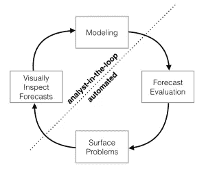
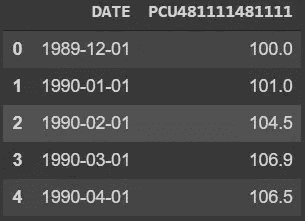
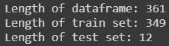
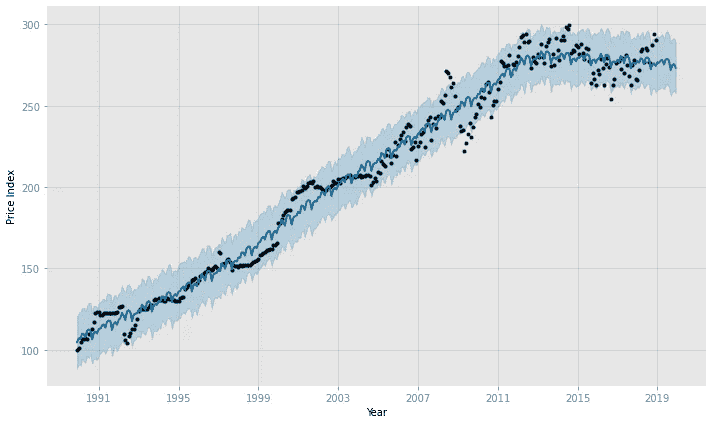
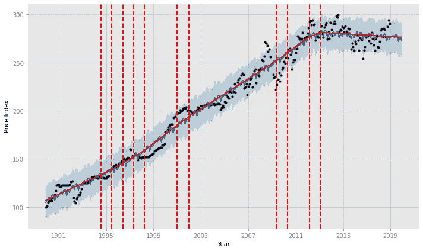
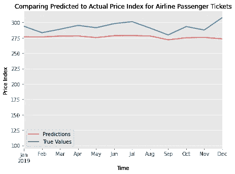
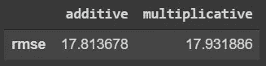

# 使用脸书先知库进行预测

> 原文：<https://medium.com/analytics-vidhya/forecasting-using-facebooks-prophet-library-ce628e76586b?source=collection_archive---------1----------------------->


# 什么是先知？

2017 年，脸书开源了 Prophet——一个配备了 Python 和 R 语言版本的易用工具的预测库。虽然它被认为是 ARIMA 模型的替代品，但当应用于具有强烈季节性影响的时间序列数据和几个季节的历史数据时，Prophet 确实大放异彩。

默认情况下，Prophet 是一个加法回归模型。它还专门用于预测业务数据。根据 Taylor 和 Letham 的说法，Prophet 模型有四个主要组成部分:

1.  分段线性或逻辑增长曲线趋势。Prophet 通过从数据中选择变化点来自动检测趋势的变化。
2.  使用傅立叶级数模拟的年度季节性分量。
3.  使用虚拟变量的每周季节性成分。
4.  用户提供的重要节假日列表。



预言家的预测过程

使用 Prophet 预测的过程是这样的:数据分析师将获得一个时间序列数据集，并将其设置为与 Prophet 库兼容。然后，分析师将开始建模，并手动输入他们认为最能产生最佳预测结果的参数。如果存在需要人工干预的问题，Prophet 将标记这些问题并让分析师知道，以便他们可以重新检查预测并根据反馈重新调整模型。

# 预言家职业

“脸书预言家”值得了解和深入研究，它不仅易于实施，而且还针对具有以下任何特征的时间序列数据集进行了优化:

1.  异常值和/或缺失值
2.  强烈的多重“人类尺度”季节性
3.  已知的重要节日
4.  历史趋势变化
5.  至少有几个月(最好是一年)历史的每小时、每天或每周观察

# 在 Google Colab 上与 Prophet 合作

在本节中，我们将使用 Google Colab 作为我们的环境。如果你以前从未使用过 Google Colab，但想继续学习，请查看我制作的快速简单的 Google Colab 漫游,让你体验一下 Google Colab！

## 安装我们的驱动器

首先，让我们在 Google Colab 的新笔记本中运行下面的单元格，以安装我们的 Google Drive:

```
from google.colab import drivedrive.mount(‘/content/drive’, force_remount=True)
```

Google Colab 已经安装了 fbprophet，所以我们不需要担心 pip 安装任何东西。相反，我们可以立即将 Prophet 模型和其他基本库导入到下一个单元中:

```
from fbprophet import Prophet
import pandas as pd
```

现在我们已经设置好了，我们可以加载时间序列数据集了！如果你想使用与本博客相同的数据集，请在此下载时间序列数据集[。](https://github.com/Lewis34cs/fb_prophet_blog_notebook/blob/main/air_passenger.csv)

## 读取 CSV 文件

首先，我们将设置一个变量来引用新数据帧的位置。

```
df = pd.read_csv(‘../datasets/air_passenger.csv’)
```

接下来，我们通过查看前 5 行来检查数据帧。

```
df.head()
```



查看前 5 行

## 设置列名

Prophet 的一个奇怪之处是数据集的列必须被专门称为“ds”和“y”。为了使我们的数据框架与 Prophet 兼容，我们必须通过调用以下命令来更改我们的列名:

```
df.columns = [‘ds’, ‘y’]
```

Prophet 的另一个要求是，我们需要确保我们的“ds”列包含 DateTime 对象。我们可以通过调用以下命令来确保它包含 DateTime 对象:

```
df[‘ds’] = pd.to_datetime(df[‘ds’])
```

## 创建训练集和测试集

现在，我们已经成功地更改了列名，并将“ds”列转换为包含 DateTime 对象，我们现在可以创建我们的训练集和测试集了！对于这个博客，我们将让 Prophet 模型预测 12 个月后的训练集，然后将这些预测与我们的测试集进行比较。因此，让我们定义我们的训练和测试集:

```
# defining the number of observations we want to predict
nobs = 12train = df[:-nobs]
test = df[-nobs:]
```

如果我们查看训练集和测试集的长度，我们应该看到测试集包含 12 个观察值，而训练集包含除这 12 个观察值之外的所有内容。

```
print(f"Length of dataframe: {len(df)}\n"
      f"Length of train set: {len(train)}\n"
      f"Length of test set: {len(test)}")
```



查看每组的长度

## 定义我们的先知模型

一旦我们确认了训练集和测试集的长度是正确的，我们就可以创建一个 Prophet 模型的实例，然后使模型适合训练集。

```
# Creating an instance of the Prophet model
prophet = Prophet()# fitting Prophet model to the train set
prophet.fit(train)
```

下一步，我们必须创建一个存储 Prophet 模型预测的地方。幸运的是，fbprophet 提供了一个非常有用的方法来创建一个新的数据框架来存储我们模型的预测。我们将创建一个名为“future”的变量，该变量将保存对一个新数据帧的引用，该数据帧包含训练集中所有值的日期以及我们希望从训练集中预测的观察值的数量:

```
future = prophet.make_future_dataframe(periods=nobs, freq=’MS’)
```

为了将模型的预测包含到这个新的数据框架中，我们将创建另一个名为“预测”的变量来保存模型的预测。

```
forecast = prophet.predict(future)
```

为了方便地查看我们模型的预测信息，我们可以简单地说:

```
fig1 = prophet.plot(forecast)
```



此外，我们还可以通过导入和使用函数 add_changepoints_to_plot 来查看曲线中轨迹可能发生变化的变点:

```
from fbprophet.plot import add_changepoint_to_plotfig1 = prophet.plot(forecast)# viewing the points in time where the trajectory of the price index changed
a = add_changepoints_to_plot(fig1.gca(), prophet, forecast)
```



浅蓝色是 95%的置信区间

## 将预测值与实际值进行比较

现在我们已经在预测数据框架中获得了预测，我们可以将预测值绘制成测试集的真实值。要查看预测值和真实值，我们只需创建一个“ax”对象来绘制预测数据框，然后将轴链接到测试数据框。我们还可以设置 x 轴的限制，以便只查看目标 12 个月范围内的预测值和实际值。



预测值与真实值的比较

太好了——但是我们怎么知道我们的模型是否真的表现良好呢？我们可以从 statsmodels 库中导入一个均方根误差函数，将我们预测的 RMSE 与真实值进行比较:

```
from statsmodels.tools.eval_measures import rmse
```

为了确保我们将正确的变量输入到预测参数中，我们将创建一个名为“y_pred”的新变量。请记住，预测变量包含的最后 12 行以上是我们的预测，因此我们需要分隔我们的预测值并指定“yhat”列，以确保我们的“y_pred”变量是对包含 12 个月预测的数组的引用。我们还可以定义“y_true ”,以便在使用 RMSE 函数时看起来更好。

```
# Remember nobs = 12y_pred = forecast.iloc[-nobs:][‘yhat’]
y_true = test['y']rmse(y_pred, y_true)
```

请记住，使用 RMSE，很难判断一个模型的表现有多好——在比较一个模型是否比另一个模型表现得更好时，最好使用它。为了展示一个示例，让我们比较一下加法先知模型和乘法先知模型之间的 RMSE，看看哪种季节性模型在我们的数据集上表现得更好:



比较加法和乘法季节性

在我们的时间序列数据集上进行训练时，使用加性季节性似乎比乘性季节性给我们的模型带来了稍好的结果。如果你想了解我在这篇博客中使用的笔记本，你可以在这里找到它。感谢阅读！

## 引文

1.  泰勒，肖恩和本·勒撒姆。"预言家:大规模预测."research.fb.com/blog/2017/02/prophet-forecasting-at-scale.，2017 年 2 月 23 日，脸书研究中心