# 使用自然语言处理形式化非正式文本

> 原文：<https://medium.com/analytics-vidhya/formalizing-informal-text-using-natural-language-processing-dd2032a0fc2b?source=collection_archive---------5----------------------->


图片来自[皮克斯拜](https://pixabay.com/?utm_source=link-attribution&utm_medium=referral&utm_campaign=image&utm_content=2724442)的比利亚纳·约万诺维奇

*他们说英语是一种有趣的语言。尽管如此，对于非母语人士来说，学习英语一直是一项极具挑战性的任务。他们发现很难理解对以英语为母语的人来说如此明显的细微差别和微妙之处。任何语言的症结都源于它的语法，而英语语法的晦涩也无助于理解这种语言。然而，事情正在发生变化。全球化当然影响了非母语人士通过看电影、读书或听新闻和体育评论来提高他们的英语水平。就非正式对话、信息或推特而言，他们对此没有任何问题。然而，语法错综复杂的正式英语仍然困扰着他们。本案例研究旨在设计一个系统，使用自然语言处理技术将非正式英语文本转换为正式英语文本。*

## 业务问题:

该系统应该能够生成正式的英文文本，给定其非正式的形式。非正式文本可以是任何东西，从随机的推文到漫画摘录。正式文本应该具有非正式文本所期望的句法上正确的含义。它应该能够纠正语法，标点符号，如果可能的话，甚至大写。举个例子，

非正式输入:你在说什么

**正式输入:**你在说什么？

## 业务限制:

非正式文本是指有大量缩写和拼写错误的文本。因此，系统必须纠正这些单词。考虑到文本的非正式形式，系统应该能够实时生成文本，以避免延迟问题。此外，在试图生成语法正确的文本时，它不应该改变底层文本的含义，因为这可能会对手头的任务产生反作用。

## 数据集:

公开可用的标准化数据集非常稀缺。幸运的是，新加坡国立大学社交媒体文本规范化和翻译语料库可用于此案例研究。语料库是为社交媒体文本规范化和翻译而创建的。它是通过从新加坡国立大学英语短信语料库中随机选择 2000 条消息来构建的。这些信息首先被规范化成正式的英语，然后被翻译成我们可以忽略的正式的汉语。此处可下载[语料库。](http://www.comp.nus.edu.sg/~nlp/sw/sm_norm_mt.tar.gz)

## **早期作品:**

虽然技术进步加快了自然语言处理的研究，但它在很大程度上集中在词嵌入和自然机器翻译等工作上。因此，作为自然语言处理的一个应用，文本形式化仍然处于萌芽阶段。下面列出了一些开拓文本形式化的作品。

1.  [使用递归神经网络的句子校正:](https://cs224d.stanford.edu/reports/Lewis.pdf)

这项工作由斯坦福大学的 Gene Lewis 发表，目的与本案例研究相同。作者建议将文本中发现的 ASCII 字符嵌入到 94 维的 one-hot 编码向量中，以创建字符级模型。类似地，单词级嵌入也被用于实验这两种方法。在训练模型时，向量被留下来学习。该模型由长短期记忆(LSTM)细胞组成，能够捕捉潜在角色之间的隐含关系。递归神经网络有两种变体，分别具有一个和两个隐层。为了估计输出概率，作者选择了 softmax 层，因为它能够产生每个字符的归一化概率。对于训练，使用了小批量随机梯度下降和交叉熵损失函数，这也是我们在这里提出的函数。
根据困惑值报告结果，1 层模型在字符级版本上达到 5.014，在单词级版本上达到 1.533。2 层模型在字符级版本上实现了 5.278 的困惑值，在单词级版本上实现了 1.490 的困惑值。这些值明显低于基线 unigram 模型，表明该模型确实能够转换标准英语格式的文本。作者因此得出结论，更多的数据将允许我们的神经网络更准确地翻译。

2.亲爱的先生或女士，请允许我介绍 GYAFC 数据集:语料库，
正式文体转换的基准和度量:

这一风格转换领域的不朽著作由 Sudha Rao 和 Joel Tetreault 在 Grammarly 出版，通过汇编近 110，000 对正式和非正式句子的数据集来解决数据短缺问题。在主题专家的帮助下，我们做出了巨大的努力来转换原始的非正式文本句子。非正式文本由雅虎问答语料库组成，来自不同领域，如娱乐&音乐和家庭&平等分配关系。由于两个领域的正式程度不同，作者分别报告了两个领域的结果。使用神经机器翻译模型的各种组合，如具有注意机制的编码器-解码器模型来训练数据集。这些模型是根据各种方案的总体排名进行评估的，如正式性、流畅性和意义保持性。这个项目的目的是通过制作一个基准数据集来启动正式文体转换领域，作者们取得了令人印象深刻的成果。

3.[利用预先训练好的神经网络的正式规则
风格转移:](https://www.aclweb.org/anthology/D19-1365.pdf)

上述研究论文已由 Yunli Wang 等人发表。作者提出了一个系统，以利用早期基于规则的方法进行正式文体转换。他们使用简单的基于规则的方法对输入文本进行预处理，例如将第一个字母大写，处理拼写错误，并将其附加到带有<eos>字符的基础非正式文本中，以形成输入序列。他们使用 Grammarly 的雅虎问答正式语料库(GYAFC)数据集来测试他们的结果，因为这是一个由 100k 个非正式和正式句子对组成的大数据集。该模型不是从零开始训练的，而是使用最新模型(如 GPT-2)上的预处理数据进行微调。使用的评估度量是评估 n-gram 重叠的 BLEU 分数，PINC 是指示输出句子和输入之间的不相似性的辅助度量。PINC 分数为 0 表示输入和输出句子是相同的。随着 GPT-2 模型分数的提高，作者证明了在普通非正式文本上串联非正式文本及其预处理形式确实有益于训练模型。</eos>

4.[在线交流中正式性的实证分析:](https://cs.brown.edu/people/epavlick/papers/formality.pdf)

这项工作由 Ellie Pavlick 和 Joel Tetreault 发表，根据英语文本的正式程度，在有序的 7 点李克特量表上进行分类，标签从-3(非常非正式)到 3(非常正式)。文本是从社区问答论坛、博客、电子邮件和新闻中收集的。注释是众包的，每个句子的注释由 5 个不同的注释者平均。作者为每一个句子推导出 11 个特征，如大小写、标点、可读性、主观性、词性标注等。来训练分类器。通过在各种基线度量上使用预测和人类注释之间的 spearman 相关系数来评估分类器的性能，所述基线度量诸如句子长度、Flesch 标度、F 分数、3-gram 困惑度和基线岭回归分类器。该分类器优于所有基线模型，从而证明可以使用机器学习技术来量化句子的正式性。

5.[用于语言内部和跨语言风格之间翻译的多任务神经模型:](https://www.aclweb.org/anthology/C18-1086.pdf)

本研究改进了 Rao 和 Xing Niu 等人所做的工作，目的是设计一个多任务学习模型，既能进行双向的英语正式迁移，又能进行法语到英语的正式翻译。对单语形式转换数据和双语翻译数据进行联合训练。通过使用自动和人工评估来进行评估。建模部分包括设计三个模型，通过实现共享编码器和解码器来联合执行 FT 和 FSMT。NMT 的架构包括一个双向编码器，一个大小为 512 的 1012 LSTM 层(Bahdanau 等人，2015)，一个大小为 512 的多层感知器注意力，以及大小为 512 的单词表示。BLEU 评分比 Rao 和 Tetreault 的早期作品提高了约 2-3%。

## 扩充数据集:

由于我们仅限于 2000 个标记的数据点，我们可以增加数据集来解决这种数据匮乏的问题。对于数据扩充，我们可以使用`**nlpaug**`库。出于我们的目的，同义词扩充和拼写扩充是合适的技术。对于数据集中的每个正式句子，我们将首先添加同义词扩充对，以获得 4000 个实例。最重要的是，我们将应用拼写扩充来获得总共 8000 个实例。

## 数据预处理:

数据集的结构是非正式的文本，后面是正式的更正，然后是中文翻译，各占一行。通过读取数据的文本文件，我们将创建一个包含两列的 pandas 数据框架，即非正式文本和正式文本。因为文本是从消息和一般对话中收集的，所以我们将保留大小写、标点符号和停用词。

我们将设计的模型被称为序列到序列模型，因为我们提供文本序列作为输入，并期望文本序列作为输出。说到序列到序列模型，可以根据标记化的级别进行两种区分，即。单词级和字符级。在对这两种类型的标记化进行实验时，我们发现字符级标记化器取得了更好的结果，这是给定数据集大小的情况下所预期的，因此我们将在本案例研究中关注这一点。

现在，编码器的输入应该用句首和句尾标记进行编码，因为这将使编码器能够知道每个句子的跨度。我们可以分别使用“”标记来启动和终止。对于解码器，输入应在末尾附加“”标记。举个例子，

**编码器输入** : <我是泰国人。你是做什么的？>

**解码器输入** : <我是泰国人。你是做什么的？

**解码器输出**:我是泰国人。你是做什么的？>

在分割数据之前，我们将查看 encoder_inp、decoder_inp 和 decoder_out 的长度分布，以了解我们需要将数据嵌入的输入形状。

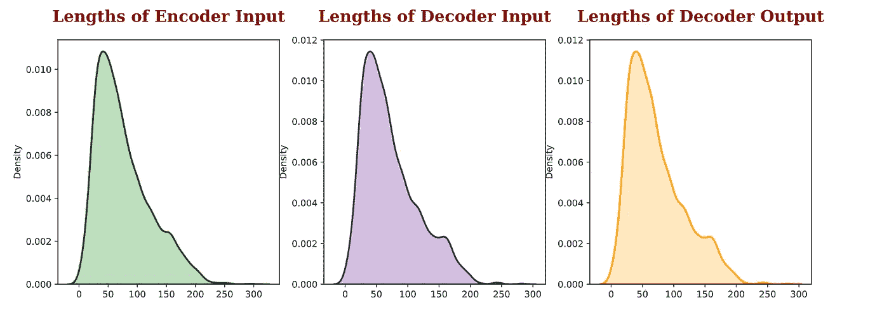

数据集中序列长度的分布

正如我们所看到的，大多数句子的长度在 50 个字符左右，几乎所有的句子长度都小于 200 个字符。因此，为了统一，我们可以过滤掉长度超过 200 的句子。现在，我们可以将数据分为训练集、验证集和测试集。由于我们的数据较少，我们将使用大约 90:05:05 拆分，以使用更多数据来训练模型。

## 标记和填充数据:

将数据符号化意味着用数字对句子进行编码。这些数字由词汇表中的唯一 id 分配。因此，特定的句子将由该句子中出现的单词的唯一 id 来编码。我们将为非正式和正式数据分别创建两个标记化器。填充是指附加一个公共 id(即通常为 0)以使所有的句子长度相同。正如我们前面看到的，我们可以将句子长度设为 200 个字符。

## 设计简单的编码器-解码器网络:

seq2seq 模型由两个子网络组成，即编码器和解码器。左边的编码器接收来自源语言的序列作为输入，结果产生输入序列的紧凑表示，试图总结或压缩它的所有信息。然后，该输出成为解码器的输入或初始状态，解码器也可以接收另一个外部输入。在每个时间步长，解码器基于接收到的输入及其当前状态生成其输出序列的元素，并为下一个时间步长更新其自身的状态。这里有一个简单的图形表示，说明我们的模型将如何工作。

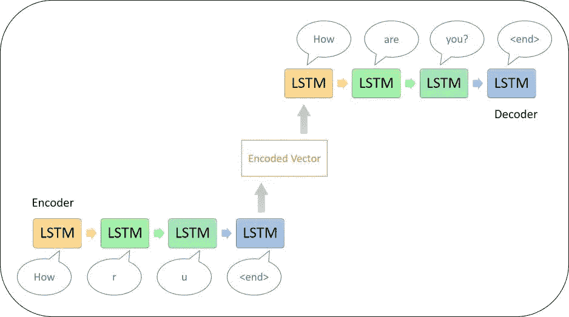

顺序编码器-解码器

## 设计编码器:

编码器将把源句子的连续单词嵌入作为每个时间步长的输入，并使用当前状态和 LSTM 隐藏状态将其信息编码到编码向量中。因此，在编码器的输出端，我们得到一个源句子的编码向量，它可以被认为是一个潜在的信息向量。

编码器

## 设计解码器:

解码器被设计成与编码器相同的 LSTM 单元链，其中第一个单元的隐藏状态是编码器向量，其余单元接受来自前一个单元的隐藏状态。

解码器

## 设计编码器-解码器模型:

既然我们有了编码器和解码器模型，现在我们可以将它们集成到编码器-解码器模型中。我们将添加一个额外的密集层作为输出层，使用 softmax 函数计算其输出，以获得输出词汇表中每个标记的概率。

编码器-解码器

## 训练编码器-解码器模型:

现在，我们可以使用稀疏分类交叉熵作为损失函数和 adam 优化器来训练编码器-解码器模型，其中默认学习率为 0.0001，该默认学习率可以在平台上使用回调来降低。该模型在 27 个时期后收敛，利用简单的编码器-解码器模型实现了 0.5212 的验证损失。

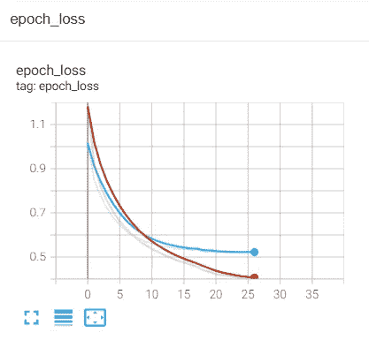

编码器-解码器模型的张量板日志

关于评估，我们在测试集上得到 0.454 的 Bleu 分数。这绝不是部署模型的好成绩，但测试集只包含大约 90 个句子。这个分数可以作为未来模型的基线度量。

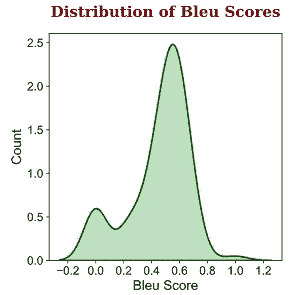

使用编码器-解码器模型的 Bleu 分数分布

该分布显示，对于大多数句子，该模型实现了大约 0.6 的 bleu 分数。让我们使用这个模型生成一个随机预测。

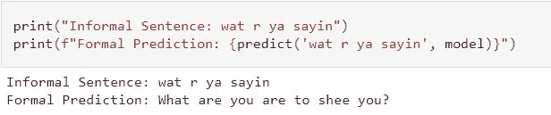

使用编码器-解码器模型的预测

该模型将单词“wat”、“r”、“ya”分别更正为“What”、“are”和“you”，并将第一个字母大写。它还正确地引入了“？”最后。但更重要的是，预测没有意义，也没有说服力。这个问题可以通过在大型数据集上训练模型来解决。

## 注意力模型:

虽然简单的编码器-解码器 seq2seq 模型对于较短的序列工作得很好，但是对于较长的序列却非常困难。这是因为特定时间步长的输出令牌可能依赖于编码器不久前解析的令牌。但是解码器模型只知道当前步骤的输出标记。这就是注意力模型的用武之地。它在编码器和解码器之间引入了一种简单的架构，使解码器能够考虑所有先前时间步长的编码器的加权输出。

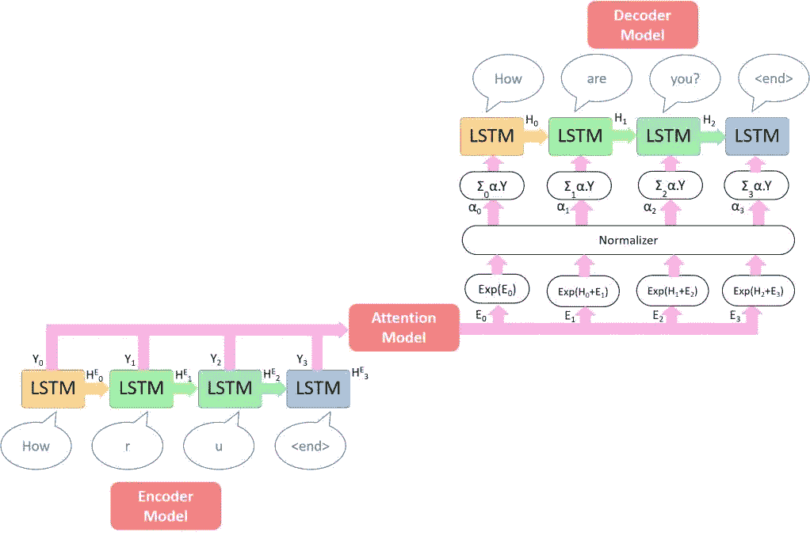

注意机制

上图显示了基于注意力的编码器-解码器模型的机制。正如您所看到的，编码器模型与简单的编码器-解码器模型的唯一不同之处在于，它为每个时间步长以及隐藏状态生成一个输出。然后，将所有编码器输出馈送到注意力模型，在该模型中，计算与所有编码器输出相对应的权重，以使解码器能够在进行预测时专注于某些标记。然后，通过用在前一时间步的隐藏状态的级联输出的指数和注意力权重对基础真值令牌进行加权来进行预测，从而计算解码器的输入。

注意力模型的重要部分是计算输出编码器标记的权重，也称为注意力权重。这些权重通过使用特定的评分函数来计算。在本案例研究中，我们将考虑三种评分函数，即 Dot、General 和 Concat。

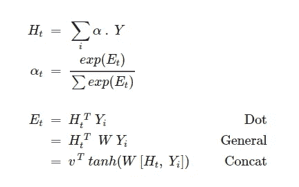

计算注意力模型中权重的评分函数

因此，总的来说，我们将使用 Dot、General 和 Concat 评分函数来训练三个基于注意力的编码器-解码器模型。

## 设计编码器:

编码器将把源句子的连续单词嵌入作为每个时间步长的输入，并使用当前状态和 LSTM 隐藏状态将其信息编码到编码向量中。因此，在编码器的输出端，我们得到一个源句子的编码向量，它可以被认为是一个潜在的信息向量。总而言之，编码器将保持与早期相同。

## 设计注意力模型:

注意力模型以先前时间步长的解码器隐藏状态和编码器输出的形式接受两个输入，并计算注意力权重。

注意机制

## 设计时间步长解码器:

对于每个时间步长，时间步长解码器将对解码器的前一个时间步长的输出和由注意力模型计算的注意力权重实施串联操作。

时间步长解码器

## 设计解码器:

解码器模型只是在每个时间步长调用时间步长解码器，并生成最终的输出令牌。

解码器

## 设计最终模型架构:

基于注意力的编码器-解码器模型获取输入序列的元组作为输入，并使用子类化 API 实现编码器、注意力、时间步长解码器和解码器模型。

基于注意力的顺序编码器-解码器

## 使用点评分函数训练注意力模型:

为了训练该模型，首先，我们将使用点评分函数和自定义损失函数来训练该模型，该函数将在计算损失时屏蔽序列的填充零，以提供更可靠的损失度量。有关这方面的更多信息，请参考 TensorFlow 文档。在训练该模型时，通过 adam optimizer 以 0.0001 的默认学习速率(可以使用回调在平台上降低该学习速率)，该模型在 23 个时期后收敛，在验证集上实现 0.3774 的验证损失，这优于简单编码器-解码器模型的验证损失。

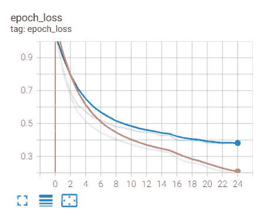

具有点计分功能的模型的张量板测井

该模型在测试集上实现了 0.505 的 BLEU 分数，这明显优于基线编码器-解码器模型。让我们检查一下 bleu 分数的分布。

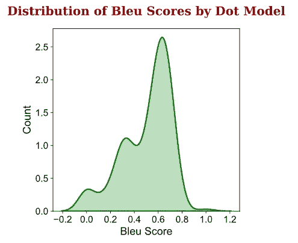

使用点评分函数的 Bleu 分数分布

分布显示，具有点评分功能的模型对于大多数句子实现了大约 0.7 的 bleu 评分。让我们使用这个模型生成一个随机预测。

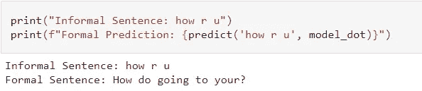

使用具有点评分功能的模型进行预测

该模型将单词“how”更正为“How ”,并将字母“h”大写。它还试图将单词“u”更正为“you ”,但没有成功，而是错误地预测了“your”。它还引入了正确的标点符号“？”。但更重要的是，预测没有意义，也没有说服力。这个问题可以通过在大型数据集上训练模型来解决。

## 使用通用评分函数训练注意力模型:

现在，我们将使用前面提到的通用评分函数和自定义损失函数来训练模型。在训练该模型时，通过 adam 优化器以 0.0001 的默认学习率(该默认学习率可以使用回调在平台上降低)，该模型在 50 个时期后收敛，在验证集上实现 0.2196 的验证损失，这优于简单编码器-解码器模型以及具有点评分功能的模型。

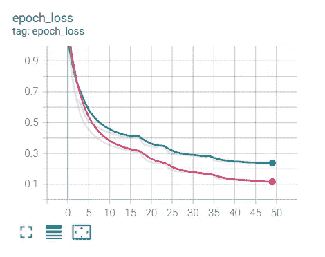

具有一般评分函数的模型的张量板测井

该模型在测试集上实现了 0.5096 的 BLEU 分数，这明显好于基线编码器-解码器模型，并且略微好于具有点评分函数的模型。让我们检查一下 bleu 分数的分布。

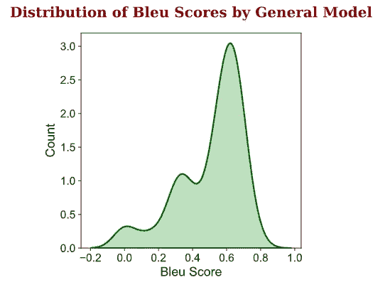

使用通用评分函数的 Bleu 分数分布

该分布示出了具有通用评分函数的模型对于大多数句子实现了大约 0.6 的 bleu 评分，但是略好于点模型。让我们使用这个模型生成一个随机预测。

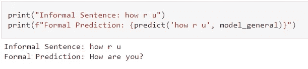

使用具有通用评分函数的模型进行预测

正如预期的那样，验证损失较低，与具有点评分功能的模型不同，该模型非常准确地预测了正式文本。它还正确地引入了大写和标点符号。

## 使用 Concat 评分函数训练注意力模型:

现在，我们将使用前面提到的 concat 评分函数和自定义损失函数来训练模型。在训练该模型时，通过 adam 优化器以默认学习速率 0.0001(可以使用回调在平台上降低该学习速率)，该模型在 20 个时期后收敛，在验证集上实现 0.4160 的验证损失，这优于简单编码器-解码器模型的验证损失，但不优于具有一般评分函数的模型。

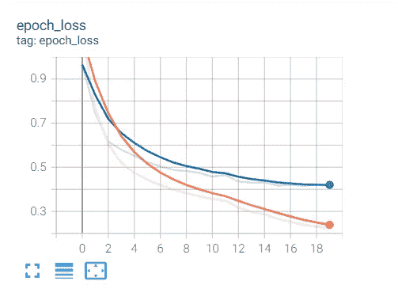

具有 Concat 评分功能的模型的张量板日志

该模型在测试集上获得了 0.459 的 BLEU 分数，这并不比具有一般评分函数的模型更好。让我们检查一下 bleu 分数的分布。

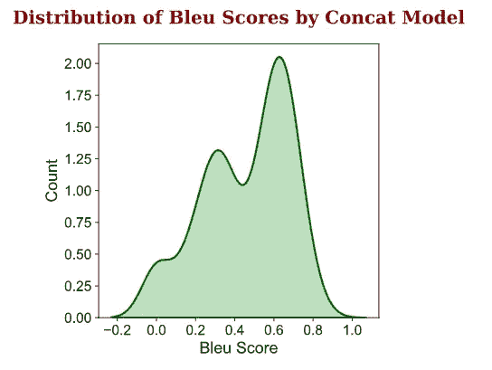

该分布示出了具有 concat 评分函数的模型对于大多数句子实现了大约 0.65 的 bleu 评分，但是比一般模型稍好。让我们使用这个模型生成一个随机预测。

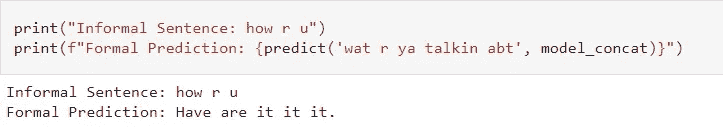

使用具有串联评分函数的模型进行预测

该模型将非正式单词“r”更正为“are”。它还更正了大写。但更重要的是，预测没有意义，也没有说服力。这个问题可以通过在大型数据集上训练模型来解决。

## 误差分析:

具有一般评分功能的模型在三个模型中表现最好。现在，我们将通过检查模型做出的最佳和最差预测来分析该模型在测试数据集上的行为。为此，我们必须对模型在测试集上获得的 bleu 分数进行排序，然后打印相应的预测。

```
**Best Predictions:**
--------------------------------------------------
**Informal Input** : Okay.
**Expected Output** : Ok.
**Predicted Output** : Ok.
**Bleu Score of Prediction** : 1.0

**Informal Input** : So what are you doing now? Can 1 pastime you to a walk? See? Then Iodin maybe pass in by where you bequeath later.
**Expected Output** : So what are you doing now? Can I interest you to a walk? See? Then I maybe pass in by where you leave later.
**Predicted Output** : No. I just want to watch that someone ask you a few dollars on Friday. So if you want to go for the party.
**Bleu Score of Prediction** : 0.7071067811865476

**Informal Input** : You prefer other day's onr lyou want Monday em Thursday soy you can comming directly? Or DO you have fire days? You choose, because you aire the only on studying.
**Expected Output** : You prefer other days or you want Monday and Thursday so you can come directly? Or do you have free days? You choose, because you are the only one studying.
**Predicted Output** : You are having a good time too. Thanks for the dinner. I just want to watch movies. I was thinking of asking you and have to do then going?
**Bleu Score of Prediction** : 0.7001600475627672====================================================================
**Worst Predictions:**
--------------------------------------------------
**Informal Input** : Okeh, and so later call me.
**Expected Output** : Ok, then later call me.
**Predicted Output** : Ok. I want to there later.
**Bleu Score of Prediction** : 0.0

**Informal Input** : Okay. Then dont be late ah
**Expected Output** : Okay. Then don't be late.
**Predicted Output** : Ok. I am not crazy.
**Bleu Score of Prediction** : 0.0

**Informal Input** : How ' s they shopping?
**Expected Output** : How's the shopping?
**Predicted Output** : How about you and message me and sit with you then.
**Bleu Score of Prediction** : 0.0
```

关于预测的重要观察是，无论是最佳预测还是最差预测，该模型都能够纠正拼写错误、大写字母和标点符号。具有较高 bleu 分数的预测具有更多与基本事实重叠的词。然而，最糟糕的预测是在有很多拼写错误和大写不正确的情况下，因为模型对此很敏感。然而，该模型是在非常少的数据上训练的，因此在像 GYAFC 语料库这样的大型数据集上有很大的改进空间。

## 总结:

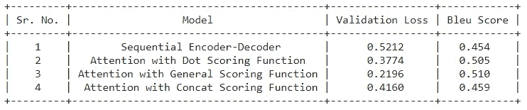

所有模型的总结

具有点评分函数和串联评分函数的模型没有产生令人满意的预测。但是具有通用评分函数的模型表现得非常好，并且也实现了最低的验证损失。虽然数据扩充和注意力模型的引入显著提高了性能，但是可以通过使用大型数据集来进一步提高性能。但是现在，具有一般评分功能的模型适合我们的部署目的。

**使用 Flask 服务器的部署:**

为了部署应用程序，我们可以在任何云服务上使用 Flask API。为了简单起见，让我们将应用程序部署在本地服务器上。在部署之前，确保运行时没有延迟限制。如果延迟无法忍受，请尝试降低模型复杂性或训练后量化。更多详情，请参考[此处](https://www.tensorflow.org/lite/performance/post_training_quantization)。下面给出的应用程序是一个 python 脚本，它只是使用训练过的超参数加载具有通用评分函数的训练过的模型，并进行预测。

现在，是时候看看我们的应用程序了。

## 未来工作:

正如在案例研究中多次讨论的，正式风格转换的最大挑战是收集带标签的数据集。除此之外，没有公开可用的数据集。深度学习的真正力量是在大型数据集上训练时。因此，像 GYAFC 这样的大型语料库(不幸的是我无法访问)可能会产生更好的结果。

**更新**:我找到了[【NAIST】Lang-8 学习者语料库](https://sites.google.com/site/naistlang8corpora/)，虽然它更倾向于语法纠正，但我们可以用于我们的目的。如果时间允许，我也会这样尝试。敬请关注。

## **参考文献:**

> [*利用递归神经网络进行句子校正*](https://cs224d.stanford.edu/reports/Lewis.pdf)
> 
> [*基于注意力的神经机器翻译的有效方法*](https://nlp.stanford.edu/pubs/emnlp15_attn.pdf)
> 
> [*注意力是你所需要的一切*](https://arxiv.org/pdf/1706.03762v5.pdf)
> 
> [*人物级文字代同*](https://keras.io/examples/generative/lstm_character_level_text_generation/)
> 
> [注意*神经机器翻译*注意](https://www.tensorflow.org/tutorials/text/nmt_with_attention)
> 
> [*应用人工智能教程*](https://www.appliedaicourse.com/)

## Github 资源库:

> [https://github.com/shubham859/Formalizing-Text-using-NLP](https://github.com/shubham859/Formalizing-Text-using-NLP)

## Linkedin 个人资料:

> [https://www.linkedin.com/in/shubham859](https://www.linkedin.com/in/shubham859)

感谢你阅读这篇文章，我希望你像我写这篇文章一样喜欢它。