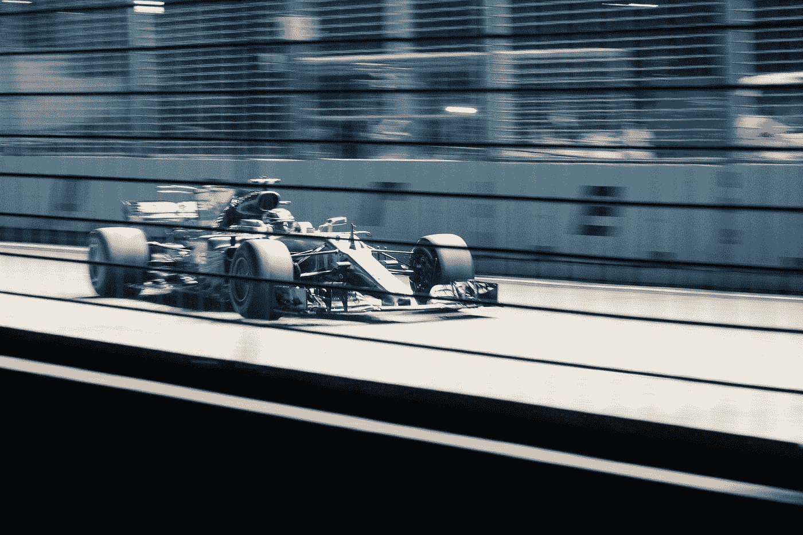
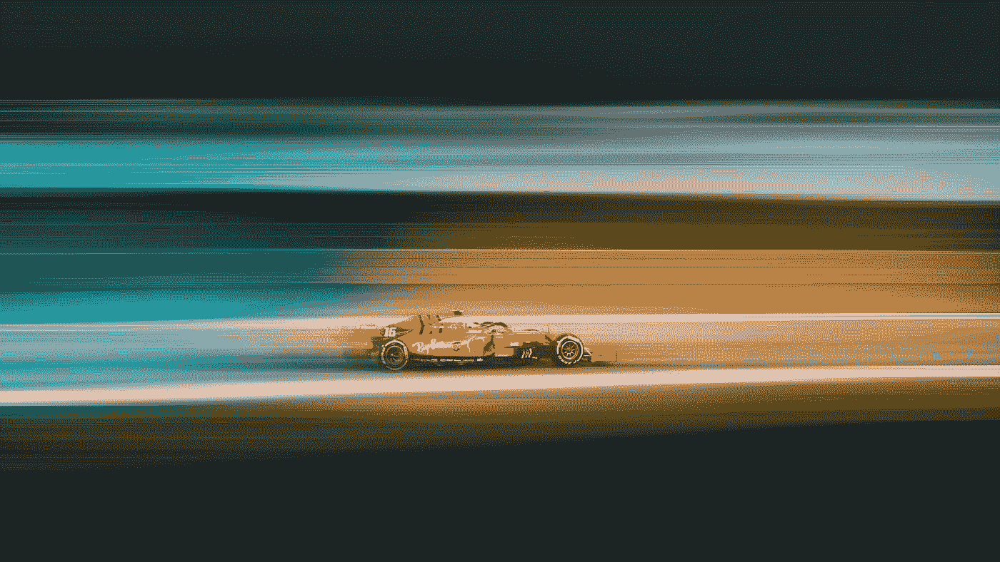

# 公式 1 &大数据分析

> 原文：<https://medium.com/analytics-vidhya/formula-1-big-data-analytics-cf333ddb6779?source=collection_archive---------2----------------------->

从我记事起，我就一直喜欢看 F1。但是，我从来没有能够告诉任何人为什么！直到我攻读大数据理学硕士学位，一切才明朗起来，我喜欢比赛中来自实时信息的分析、技术细节和数据导向的策略，并且能够看到这如何转化为比赛中的最终位置。

准备好接受一些新搜索到的事实和大量的数据讨论吧！！

一级方程式赛车是数据驱动的智能系统，速度可以达到 200 英里/小时以上。去过太空的人比驾驶 F1 赛车的人还多！

这些一级方程式赛车是汽车技术的巅峰。数百个传感器监控每辆车的各个方面，包括单圈时间、轮胎和刹车温度、空气流量和发动机性能。当你观看比赛时，成百上千的故事在幕后展开，例如轮胎磨损、引擎健康和车手反应。

很少有运动像一级方程式赛车那样广泛使用数据分析——它影响着汽车的设计、驾驶方式以及比赛的播出方式。

在采用数据分析之前，一场比赛的成败完全取决于车手在赛道上的瞬间决策。然而，到了 20 世纪 70 年代，遥测系统的尺寸和复杂程度已经缩小到可以安装在车辆上来提供其运行信息的程度。

到 20 世纪 80 年代，电子系统普遍安装在 F1 赛车上。最初，存储仅限于单圈的数据，当车队需要收集数据时，司机会收到信号，打开遥测系统。这些数据随后将从车上移除，并传输到车库的计算机系统中进行进一步分析。

到 20 世纪 90 年代末，开发出了“突发”遥测技术，在比赛期间将无线电信号从赛车发送到车库，给维修站工作人员提前警告赛车的物理状况。这些突发被流数据所取代，这些流数据通过管道被送回车库，然后再送到工厂。它已经发展成为 F1 大奖赛运行和计划的一个重要方面。

赛前模拟、分析师和维修站工作人员的实时决策、赛后分析以及广播体验都受到当今实时数据流的影响。

在整个车辆和驾驶员中，几个传感器持续跟踪和传输数据。这些数据流为团队提供了肉眼看不到的秘密视角。]

> 例如，梅赛德斯 AMG F1 W08 EQ Power+汽车装载了 200 个传感器，在一个周末的比赛过程中传输数百万个数据点。据报道，汽车传输的数据超过 300GB。Williams*声称，在一场比赛中，它在任何时候都收集了超过 1000 个通道的数据。而红牛的 RB12 赛车安装了大约 100 个传感器，收集 10，000 个部件的数据。

云计算本身也有其作用。这些关键数据中的一部分以专门的形式发送到车库，供机械师和工程师使用，而更大的数据集则被传输到安全服务器，操作室和工厂的团队成员可以访问这些数据。

因为每支车队只允许一定数量的人在赛道旁，所以大部分的赛前和赛后分析都是由车队总部的成员完成的。他们实时分析数据，将数据与 GPS、天气数据和比赛内容结合起来，以提供每场比赛的分析概览。

然后，所有这些信息被组合、分析并用于制定竞赛策略。这些信息随后被传递给与车手联系的赛道旁分析师。

梅赛德斯(曾经)与数据分析和集成公司 Tibco Software 合作，组建了一个数据分析师虚拟团队来处理种族数据。例如，可以检查每个细节以确定问题发生在哪里——汽车的轨迹、轮胎压力、重量、赛道状况和各种其他变量被收集到一个数据库中，供分析师筛选并确定哪里出了问题(或对了)。

我们看到这些品牌联盟变得越来越普遍——例如迈凯轮认知，红牛/ IBM！

Pitstop 实践也使用数据进行了优化。进站一直是 F1 比赛输赢的关键部分，工作人员接受训练，以军事精度完成任何轮胎或机头的更换。

一个车手确实，而且经常因为延误而输掉比赛。车队可以在练习赛后从赛车和维修站设备中筛选视频片段和数据，从而节省关键的几秒钟。2016 年，威廉姆斯团队的四名维修站工作人员获得了生物传感器，这些传感器测量了心率变异性、恢复时间、呼吸频率和估计的核心温度。

利用比赛中收集的大量数据，汽车可以被重新设计。在一场比赛之后，这些数据被用来在模拟中开发汽车的系统，直到下一个比赛周期。迈凯轮声称，通过这样做，它可以在一天内获得比一周赛道测试更多的成绩。

数据也广泛用于开发和测试，无论是通过计算流体动力学(CFD)模拟气流及其与表面的相互作用，还是基于之前收集的数据模拟实际汽车行为的驾驶员“在环”模拟器。

F1 数据革命对广播公司来说也是一个福音:观众可以看到进站时间、部门时间、DRS 收费、热图(显示赛车的哪些部分暴露在最高温度下)的信息，收听比赛工程师和车手之间的精选直播广播，并了解发送给车队的一些直播数据流，让他们了解比赛。

大数据在这里比在其他任何地方都更能推动重大决策。随着数据分析的范围和应用在更广阔的世界中不断扩大，F1 必将利用科技行业带来的任何优势，云计算、预测分析、预测智能、机器学习和指令性智能将在这项运动的未来发挥更大的作用。

第二部分现在出来了— [这里](https://itstomrobertson.medium.com/formula-1-big-data-analytics-part-2-8119fa30bd01)