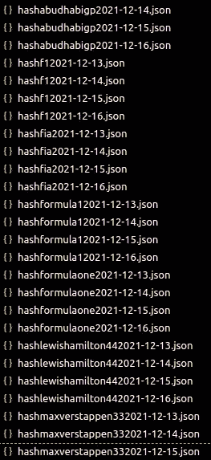

# 一级方程式决赛推特分析:刮痧

> 原文：<https://medium.com/analytics-vidhya/formula-1-final-round-twitter-analysis-scraping-5a78669025c?source=collection_archive---------11----------------------->

## 了解如何使用 snscrape 收集您在 Twitter 上最喜欢的话题的数据。


Abed Ismail 在 [Unsplash](https://unsplash.com?utm_source=medium&utm_medium=referral) 上拍摄的照片

我是一个相对较新的 F1 车迷，嗯，我从小就开始看，我看过迈克尔·舒马赫历史性的世界车手锦标赛，也看过费尔南多·阿隆索以历史性的方式赢得的首个冠军，揭穿了有史以来最伟大的冠军之一。2007 年决赛，最不可能的冠军基米·莱科宁和刘易斯·汉密尔顿在最后一个弯道获得了第一个冠军，这对我的国家来说是一个巨大的挫折。

但是没有什么比 2021 年发生的事情更重要，马克斯·维斯塔潘对奖杯的第一次尝试令人印象深刻，汉密尔顿的赛季呢？伙计，这是一段时间以来世界上最令人印象深刻的比赛之一。

但本赛季发生的所有事情都因阿布扎比的最后一场比赛事件而蒙上了阴影，当时尼古拉斯·拉蒂菲在 58 圈的第 53 圈撞车，将安全车带入赛道清理混乱，比赛总监迈克尔·马西面临着巨大的压力，要给世界最后一圈，不幸的是，他做出了一系列糟糕的决定。

在这篇文章中，我将对 Twiter 上的主要标签进行数据收集，以检查该平台用户的看法如何，一些记者、有影响力的人，甚至是[的司机](https://www.instagram.com/p/CXv8vfcNtER/)都表示，由于今年的 Homeric 冠军争夺战，用户的看法不太友好。

# 哪些标签会被使用？


加里·巴特菲尔德在 [Unsplash](https://unsplash.com?utm_source=medium&utm_medium=referral) 上的照片

这是文章的核心，一个错误的标签，一切都可能有偏差，所以我必须在这里 peaky。我不会使用任何类似#F1xed 或#IStandWithLewisHamilton 的东西，因为这些看起来有偏见，但我不会忘记今年的粉丝群有明显的划分，所以像# MaxVerstappen33 和#LewisHamilton44 这样的标签被考虑在内，因为它们应该是明显的对立面。

但为了更好地发布推文，我将更多地关注平台上任何 F1 粉丝都使用的更通用的标签，例如 F1 官方的比赛标签。在 TagsFinder 上搜索后，将使用的标签列表如下:

*   #f1
*   #配方一
*   #公式 1
*   #国际汽联
*   #abudhabigp
*   #MaxVerstappen33
*   #LewisHamilton44

# 将如何实施？


照片由[阿诺德·弗朗西斯卡](https://unsplash.com/@clark_fransa?utm_source=medium&utm_medium=referral)在 [Unsplash](https://unsplash.com?utm_source=medium&utm_medium=referral) 拍摄

本文的目标是为每一天的每个标签生成一个 JSON 文件，其中包含从 2021 年 12 月 12 日到 2021 年 12 月 15 日 4 天内收集的所有推文，我不考虑 16 日的任何事情，因为梅赛德斯声明称他们不会在国际上诉法院对管家的决定提起上诉。

关于 JSON 文件的决定是由于它处理大量数据的能力，如果你不明白我是如何做出这个决定的，我推荐阅读一篇文章，这篇文章来自 eduCBA 上的 Priya Pedamkar。

为了从 Twitter 中检索信息，将使用 snscrape 库，因为它对提取的 tweets 的数量没有太多限制，可以使用标签和日期作为过滤器。从每个标签中可以检索到 50，000 条推文，总共有 1，400，000 条推文。

这个统计很重要，因为这是一个备受关注的话题，因此需要大量的推文，这就需要开发者帐户每月收集 200 万条推文。

# 刮之前

要开始这个抓取，您需要下载 snscrape 库，但是这里有一个技巧，直接从 GitHub 下载您的包比从 pip 下载更好，因为对于开发人员来说，提交一个错误修复比重新加载 pip 库中的所有文件更快。

使用这个程序你唯一需要的要求就是有 Python 3.8 或更高版本，而且很好用。

因此，在您的终端上键入以下内容:

```
pip install git+https://github.com/JustAnotherArchivist/snscrape.git
```

然后就起来了！

# 我们刮吧！


照片由[张秀坤镰刀](https://unsplash.com/@drscythe?utm_source=medium&utm_medium=referral)在 [Unsplash](https://unsplash.com?utm_source=medium&utm_medium=referral) 上拍摄

这里非常重要的一点是，snscrape 是一个通过命令行工作的程序，而且，它不需要任何类型的认证，因为它是直接从 web 上抓取的。

代码非常简单，如下所示:

```
import osdates = ["2021-12-13", "2021-12-14", "2021-12-15", "2021-12-16"]hashtags = ["f1", "formula1", "formulaone", "fia", "abudhabigp", "maxverstappen33", "lewishamilton44"]for hashtag in hashtags:
    for date in dates:
        os.system(f"snscrape --jsonl --max-results 50000 twitter-   hashtag '{hashtag} until:{date}' > hash{hashtag}{date}.json")
        print(f"Scrape {hashtag} on {date} done!")
    print(f"Scrape of {hashtag} done!")print("All done!")
```

让我向您介绍一下，首先导入了`os`库操作系统，因此可以从代码中执行终端命令，然后提供了一个日期列表，因此可以对其进行迭代，还提供了一个标签列表。首先，程序遍历标签，然后遍历日期。

现在是 snscrape 部分，在这里我们将使用基本语法，调用程序，用`--jsonl`通知文件的类型，然后是废弃所需的 tweets 数量`--max-results 50000`，你想要的搜索类型`twitter-hashtag`，提供 hashtag 和你想要抓取的日期限制`'{hashtag} until:{date}'`，最后是你想要存储数据的文件名`> hash{hashtag}{date}.json`由于这段代码需要一段时间才能完成， 我放了一些输出来声明它在哪里，也是基于循环，最后一个输出是发送一个通知，说明一切都完成了，中间发生的任何错误都可能被 snscrape 显示出来。

在这里，我想对马丁·贝克(Martin Beck)发表一篇令人难以置信的关于如何使用 snscrape(snscrape)的教程(T10)，他在这个项目上给了我很大的帮助。虽然，我的台词和他的还是有一些区别，除了教程上用了关键词`twitter-search`之外，我用`twitter-hashtag`的原因很明显。

但是我从这个工具中学到的最重要的东西是，因为我是在 giving day 搜索帖子，所以只用关键字`until:`就足够了。另一个重要的教训是，我在我的约会中增加了一天，你可能已经注意到了，因为关键词是搜索的上限，所以后面的任何内容都可能被删除，下一个问题是，5 万条推文太多了吗？嗯，我不这么认为，但是你可以看看我关于这个项目的下一篇文章，在那里我将清理所有这些数据。

这里有一个关于这个项目的警告，从平台中提取所有这些 tweet 花费了大量的时间，我不会很快再次运行它来检查准确的时间，但是代码的第一个改进是打印运行的总时间，以控制抓取所有 tweet 所需的小时数。

# 结论

取消比赛当天到几天后的所有推文成功实现了，我检查了文件，所有文件都有各种语言的所需数量的推文。以下是我的 VSCode 窗口中一些文件的打印件:



VSCode 上的文件列表。(图片鸣谢:作者)

接下来，我将批量清理所有这些数据，然后创建一个. csv 文件来存储所有相关信息。谢谢你阅读它。

下一站见，保重！