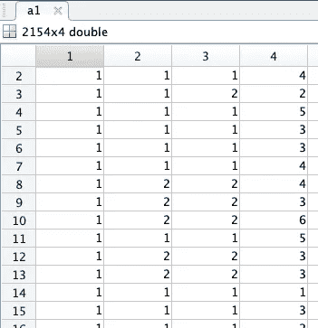

# 神经网络前向传播深潜 102

> 原文：<https://medium.com/analytics-vidhya/forward-propagation-deep-dive-102-bbeabe4d2fb2?source=collection_archive---------11----------------------->


前向传播是神经网络的重要组成部分。这并不像听起来那么难；-)

这是我的神经网络系列的第 2 部分。如果你只是想要代码，欢迎从第一部分的开始，或者跳到第五部分的。

因此，为了执行梯度下降或成本优化，我们需要编写一个成本函数，它执行:

1.  [正向传播](https://shaun-enslin.medium.com/forward-propagation-deep-dive-102-bbeabe4d2fb2)
2.  [反向传播](https://shaun-enslin.medium.com/backward-propagation-deep-dive-103-60390714d2b0)
3.  [计算成本&坡度](https://shaun-enslin.medium.com/cost-and-gradient-calculation-in-neural-networks-deep-dive-104-2e16f26ce3f3)

**在本文中，我们正在处理(1)正向传播。**

在图 1 中，我们可以看到去掉了很多细节的网络图。我们将重点介绍第二级的一个单元和第三级的一个单元。这种理解可以复制到所有单位。(ps。一个单位是下面的一个圆圈)


图 1:神经网络正向传播

**我们在正向道具中的目标是计算 A1，Z2，A2，Z3 & A3**

这样我们就可以看到 X 特征，见图 2，更多数据信息，见[第 1 部分](https://shaun-enslin.medium.com/explaining-neural-networks-101-a36356113cbd)。


图 2

# 初始重量(θs)

事实证明，对于梯度下降来说，这是一个相当重要的话题。如果你没有处理过梯度下降，那么先检查[这篇文章](/geekculture/gradient-descent-in-matlab-octave-954160e2d3fa)。从上面可以看出，我们需要 2 组砝码。(用表示)。*我们仍然经常称这些重量为θ，它们的意思是一样的*。

我们需要一套 2 级的 thetass 和一套 3 级的 theta。每个θ是一个矩阵，大小为(L) * size(L-1)。从而形成上面:
-θ1 = 6×4 矩阵
-θ2 = 7×7 矩阵

我们现在必须猜测哪个初始 thetas 应该是我们的起点。这里，epsilon 来拯救我们，下面是 matlab 代码，可以轻松地为我们的初始权重生成一些随机的小数字。

```
function weights = initializeWeights(inSize, outSize)
  epsilon = 0.12;
  weights = rand(outSize, 1 + inSize) * 2 * epsilon - epsilon;
end
```

如上所述，在对每个θ的大小运行上述函数后，我们将得到一些很好的小随机初始值，如图 3 所示

。对于上面的图 1，我们提到的权重指的是下面矩阵的第 1 行。


图 3

现在，我们有了初始重量，我们可以继续进行梯度下降。然而，这需要一个成本函数来帮助计算成本和梯度。在我们计算成本之前，我们需要执行正向传播来计算我们的 A1、Z2、A2、Z3 和 A3，如图 1 所示。

**正向传播**

根据图 1，让我们计算 A1。你可以看到它几乎是我的 X 的特征，我们在前面添加了硬编码为“1”的 bias 列。下面是实现这一点的 matlab 代码:

```
a1 = [ones(m, 1) X];
```

现在，结果将为您提供图 4 中 A1 的结果。特别注意前面增加的偏差栏“1”。



图 4

很好，A1 完成了，让我们继续 A2。在我们得到 A2 之前，我们将首先运行一个假设来计算 Z2。一旦你有了假设，你就可以通过 sigmoid 函数得到 A2。同样，根据图 1，将 bias 列添加到前面。

```
z2 = a1*Theta1';
a2 = [ones(size(z2, 1), 1) sigmoid(z2)];
```

您可以看到下面的 sigmoid 函数:

```
function g = sigmoid(z)
 g = 1.0 ./ (1.0 + exp(-z));
end
```

您的结果将如图 5 所示，注意第 1 列中的偏差。


好了，我们快到了…现在在 A3 上，让我们做与 A2 相同的事情，但是这一次，我们不担心添加偏差列。

```
z3 = a2*Theta2';
a3 = sigmoid(z3);
```


你可能会问，“为什么我们保留 Z2 & Z3”。嗯，我们在反向传播中需要这些。所以我们最好把它们放在手边；-).

# 结论

所以，我们已经学会了神经网络的前两步，也就是

1.  初始化我们的重量(θ)
2.  执行正向传播

您可以继续阅读我系列的下一篇文章，那就是[执行反向传播](https://shaun-enslin.medium.com/backward-propagation-deep-dive-103-60390714d2b0)。

*顺便说一句，如果你正在寻找一门关于机器学习的伟大课程，我可以强烈推荐这门* [*课程*](https://www.coursera.org/learn/machine-learning) *。*