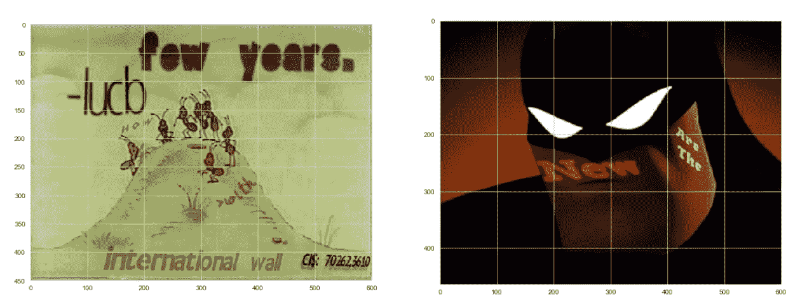
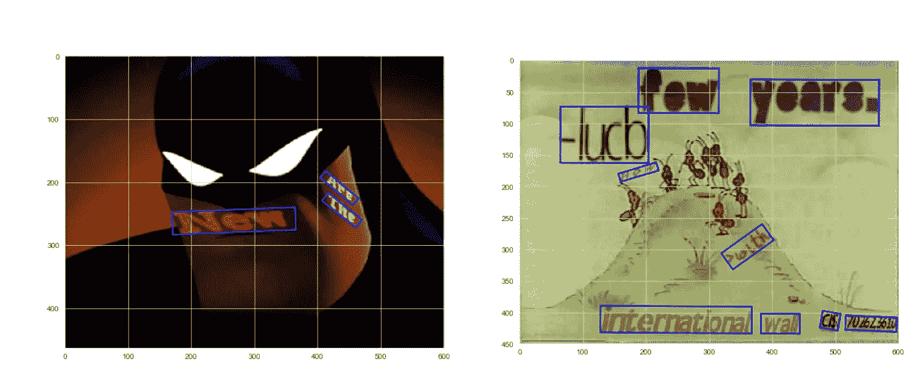
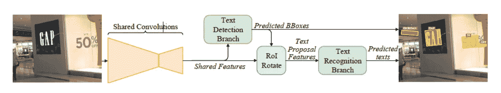
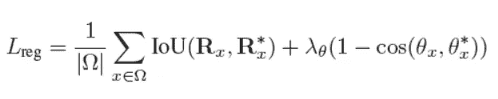

# FOTS:用统一的网络快速定位文本

> 原文：<https://medium.com/analytics-vidhya/fots-fast-oriented-text-spotting-with-a-unified-network-76e665afc449?source=collection_archive---------4----------------------->

在日常生活中，我们会遇到许多自然图像/场景包含一些文本的地方，我们会在脑海中处理这些文本以获得其意图。因此，自然语言处理在分析文本中起着至关重要的作用，并且通常当这些文本被视为自然图像时，文本识别成为 ML/DL 中的一个重要领域。例如，在现实生活中，我们在海报、交通标志、商店、横幅等中看到文本。因此，这些文本定位(检测文本位置并提取文本)成为一项重要的技术，可用于实现许多其他 ML/DL 实际应用，如文档分析、无人驾驶汽车等。

# 业务问题陈述

在现代世界中，自动化在许多现实世界的领域中是首选的。为了支持它，在某些情况下，图像处理/计算机视觉(CV)和自然语言处理(NLP)通过深度学习技术对此提供了重要支持。当涉及自动驾驶汽车、扫描文档、图像扫描/信息检索、汽车/机器人导航等自动化时，处理图像并从中提取信息非常有用。在现实生活的图像中，我们看到图像中的文本可以在大小、字体、方向等方面变化，这成为从图像中提取它们的一个挑战。这里，提取意味着检测图像中的文本并识别文本，以便我们可以将它们作为自然语言使用，而不是图像的一部分。

# **机器学习问题陈述**

根据业务需求和研究论文，文本识别可以由两个子问题组成。首先，我们需要在边界框的帮助下检测图像中的文本。之后，我们只需要考虑识别的边界框部分，其中边界框内的文本将被提取为普通的自然文本。在研究论文中，除了检测和识别之外，还考虑了文本方向，因为可能存在具有不同方向的文本。这被称为 ROIRotate(感兴趣区域旋转)。

文本定位

对于文本检测，我们可以使用 VGG-16，ResNet-50 等与 Deconv 层。同样，对于识别，我们可以使用 CNN 与身高最大池和 RNN 模型(LSTM/GRU)。这里我们用的是 GRU。

# **数据集**

在这个实现中，我们使用两种类型的数据集。一个是 Synth 数据集，我们有一些自然图像，上面手动粘贴了一些文本，这样可以有效地训练模型来检测图像中的文本并识别它。第二个是 ICDAR2015 数据集，它包含许多从现实世界中拍摄的具有不同大小、字体和方向的文本的纯自然图像。它有助于模型很好地处理包含文本的真实世界图像。

合成数据集:[https://www.robots.ox.ac.uk/~vgg/data/scenetext/](https://www.robots.ox.ac.uk/~vgg/data/scenetext/)

ICDAR 数据集:【https://rrc.cvc.uab.es/?ch=4】T2&com =任务

我们需要在下载数据集之前注册。

# 探索性数据分析

## 基于 Synth 数据的 EDA

我们总共有 200 个文件夹，每个文件夹大约有 4293 张图片。我们总共有 80 万张图片，这是一个庞大的数据集。为了使其在计算上可行，我们从每个文件夹中提取了样本图像，每个文件夹都包含一种特定类型的图像，这些图像对文本和图像对象进行了细微的修改，如下所示。

图像上的 EDA:

不同类型的图像(豹纹和巧克力色)

蚂蚁和蝙蝠侠的照片

我们绘制了图像的高度和宽度的 PDF 图进行分析。

从图中，我们可以看到大多数图像的高度大约在 580 到 630 之间。高度在 390 和 420 之间的图像很少。

从图中，我们可以看到大多数图像的高度在 300 到 500 之间。有些图像的高度介于 550 和 630 之间。所以我们可以将图像的大小调整为(512，512，3)。(3-用于 RGB 通道)

边界框上的 EDA:

在 Synth 数据集中，我们有一个包含图像路径、边界框坐标和相应文本的 gt 文件。我们可以提取这些信息并准备一个数据帧供以后使用。

我们已经观察到边界框坐标类似于(2，4，15)，其中第一个值代表其 X 或 Y 坐标。那么第二个值代表边界框的点的索引(一个边界框有 4 个点)。最终值是指该图像中边界框的数量。我们可以提取这些值，并在从指定路径获得的图像上绘制边界框，如下所示。

正如你所看到的，所有的文本都被矩形框包围着。对于给定的图像，我们需要预测文本检测模型中每个文本/单词的边界框的坐标。基于图像中出现的单词数量，我们可以有多个边界框。

大多数图像不到 20 个框，平均有 5 到 6 个框。

类似地，我们可以分析边界框的高度和宽度，并检查无效/异常框。但实际上，随着图像大小的变化，边界框的坐标值可以与其他值相差很大。但是如果你绘制图像和边界框，它看起来会很正常。我们收集了一些图像，它们的边界框带有异常坐标值，但是通过绘图，看起来很正常。

## 基于 ICDAR2015 数据的 EDA

这些图像是真实世界的图像，我们总共有 1000 张图像，如下所示。

在这个数据集中，所有图像的高度和宽度都不变，分别为 1280 和 720。

我们有一个单独的文本文件专门用于每个图像，它包含了关于边界框坐标和文本的信息。但是这里的坐标值设置与 Synth 数据集完全不同。文本文件包含多行，每一行引用一个单词及其相应的边界框坐标。因此每行至少有 9 个值(8 个坐标值，最后一个是实际文本)。在建模之前，我们需要将 Synth 和 ICDAR 边界框值转换成一个通用的结构。因此，我们提取了这些信息，并为 ed a 创建了一个类似于 Synth 数据框的数据框。

我们需要忽略文本中的“###”值，因为这些值对最终用户没有用。下面是一些带有边框的 ICDAR 图像示例。

由于这些是真实世界的图像，每个图像可以包含许多文本和边界框。

大多数图像的边界框在 10 到 50 之间。但是有许多微小的文本和许多文本区域。所以我们看到很少的图像有大量的边界框。

# 数据生成/地面实况生成

到目前为止，我们只有原始图像和边界框坐标的值。但是在模型中，我们不能直接使用它们。因此，我们需要一个生成器函数，它可以将图像、文本和边界框值作为输入，并生成组织良好的矩阵/张量值，因为模型只能处理数值。

## 用于文本检测的数据生成

根据 FOTS 的论文，对于给定的图像路径，我们需要检索图像、它的边界框坐标值和文本。然后，我们需要产生以下渠道。

1.  **评分图:**根据像素是否包含文本，评分图对于图像中的每个像素只包含 0 或 1。基本上，它设置它是否是一个文本区域。
2.  **Geo map:** 它有 5 个通道，其中 4 个通道是指一个像素到边界框的距离(左、右、上、下)，最后一个通道是指边界框的方向角。这些值仅适用于那些属于文本区域的像素。
3.  **训练掩码:**该值代表一个“无关”区域。它基本上是一个没有文本或者文本远离那些部分的区域。它将在训练检测模型时使用。

下面是检测数据生成器的代码片段。

我们有其他的实用函数来支持生成器，比如 shrink_poly，check_and_validate_poly，rectangle _ from _ parallelogram 等等。(Github Repo 中的详细信息—查看链接)

## 用于文本识别的数据生成

在文本识别的情况下，它需要精确文本的图像(不得包含周围的对象)。在 ICDAR 数据集中，我们可以下载带有相应文本的文本 word 图像。但是对于 Synth 数据集，我们需要手动生成单词图像和实际单词。代码片段如下。

现在我们有了一组图像和相应的文本。我们可以用它创建一个数据框架，并混合 Synth 和 ICDAR 数据，如下所示。

将创建一个识别生成器，它将使用此数据框并生成图像数据和矢量化文本，以便在识别模型训练期间使用它们。在我们的例子中，我们需要每个单词图像的大小为(64，128，3)，文本向量的长度为 25。

# FOTS 建筑

整个架构由以下三部分组成:

1.  共享卷积
2.  文本检测分支
3.  认可处。

一个额外的分支是 ROIRotate，在文本检测之后使用。

1.  **共享卷积:**这个分支使用 ResNet 模型，在每一层之后，图像大小减少一半。然后，去卷积层会逐渐恢复这些大小。

共享 conv 图层

在上述架构中，橙色层是使用 imageNet 数据预先训练的 ResNet 层。我们从 Res2、Res3 和 Res4 获得输出，并在各自的解卷积层中重用它们。在要素地图大小为原始输入的 1/32 的 Res5 图层之后，将使用一系列去卷积图层。在将输入提供给下一层之前，之前的输出与 Deconv 输出之间存在残余连接。最后我们得到输出特征图，它的大小是原始输入的 1/4。现在，这个特征图将用于文本检测分支。

2.**文本检测分支:**文本**检测分支从共享卷积中取输入。它的实现类似于 EAST paper(高效准确的场景文本检测器)。在这个分支中，我们在输入中增加了两个反卷积层，这样它的大小就和图像输入的大小一样了(512，512，64)。现在一个全卷积网络后，会给出 6 个信道(1 个分数图，5 个 geo-map)。在我们获得给定图像的这些特征图/通道之后，NMS(非最大抑制)和 IOU 分数将用于获得边界框。**

NMS 链接:[https://medium . com/analytics-vid hya/non-max-suppression-NMS-6623 e 6572536](/analytics-vidhya/non-max-suppression-nms-6623e6572536)

IOU 评分:[https://medium . com/@ nag San 16/object-detection-IOU-intersection-over-union-73070 CB 11 f 6 e](/@nagsan16/object-detection-iou-intersection-over-union-73070cb11f6e)

**roiorotate:**它基本上将定向文本框转换为轴平行的框，这将有助于文本识别，因为我们不必再次处理定向。

3.文本识别分支:这个分支负责从检测和旋转后得到的文本图像中获取文本标签。这里，输入图像仅包含文本，没有任何具有形状(64，128，3)的周围对象。我们有矢量化的文本输出，可以转换回文本。该识别分支由一系列 conv 和海最大池层组成，最终将使用 LSTM/GRU 层，然后是 softmax 输出层，如下所示。

文本识别体系结构

# 损耗

我们在 FOTS 有两种模式(文本检测、文本识别)。所以他们会用各自的损失函数如下。

## 文本检测分支丢失

文本检测模型使用骰子损失和 IOU 分数作为其损失函数。

**骰子损失:**该损失通过与地面真值进行比较，确定像素是否是边界框边界的一部分(1 或 0)。参见[https://medium . com/ai-salon/understanding-dice-loss-for-crisp-boundary-detection-bb 30 C2 e 5 f 62 b](/ai-salon/understanding-dice-loss-for-crisp-boundary-detection-bb30c2e5f62b)。

IOU 损失:这种损失有助于为文本区域获得合适的边界框。它指并集上的交集。在这种情况下，它还考虑了方向损失。参见[https://medium . com/node flux/distance-iou-loss-an-improvement-of-iou-based-loss-for-object-detection-bounding-box-regression-4c BDD 23d 8660](/nodeflux/distance-iou-loss-an-improvement-of-iou-based-loss-for-object-detection-bounding-box-regression-4cbdd23d8660)

现在总的检测损耗如下，

这里，L_cls 指芯片损耗，L_reg 指 IOU 损耗。

下面是检测损失函数的代码片段。

## 文本识别部门的损失

在识别分支中使用的损失函数是 CTC 损失，其有助于将文本图像转换成实际的文本标签。参见[https://keras.io/examples/vision/captcha_ocr/](https://keras.io/examples/vision/captcha_ocr/)，[https://stack overflow . com/questions/64321779/how-to-use-TF-CTC-loss-with-variable-length-features-and-labels](https://stackoverflow.com/questions/64321779/how-to-use-tf-ctc-loss-with-variable-length-features-and-labels)

# 培训模型

我们有两个模型，即文本检测和文本识别，我们必须分别训练。我们已经有发电机来处理数据。最后，通过推理，我们可以使用 ROIRotate 一次性使用这两个模型。

采样后我们有 10k Synth 图像和 1000 个 ICDAR 图像，我们可以用它们来训练检测模型。然后，利用从 Synth 生成的单词图像和下载的 ICDAR 中给定的单词图像，我们可以训练识别模型。

## 文本检测模型训练

Deconv 操作需要一个自定义 Deconv 层，它将在 ResNet 层之后使用，最后，我们将使用完全连接的卷积层，它最终将为(512，512，3)的输入提供 6 个通道(512，512，6)的输出。它使用骰子损失和 IOU 损失作为其损失函数。

下面是检测模型的代码片段。

首先，用 Synth 图像对模型进行 50 个时期的训练，学习率为 0.0005，批次大小为 3。回调函数可以用来获得更好的性能。损失时期图如下。

然后用 ICDAR 数据训练同一个模型(可以用来自 Synth 和 ICDAR 数据的混合图像一次性训练)。它使用 Synth 数据中使用的相同参数进行训练。损失时期图如下。

## 文本识别模型训练

文本识别使用单词图像和文本向量进行训练。它使用 ctc_loss 作为它的损失函数。给定(68，128，3)和文本向量的输入，它为每个 vocab 索引产生 256 个向量的输出(这里是 its (256，99))。

下面是识别模型的代码片段。

在训练识别模型时，诸如 ReduceLROnPlateau、EarlyStopping 和 ModelCheckpoint 之类的回调函数被用于更好的控制和性能。该模型以 0.001 的学习率被训练了 50 个时期。在 epoch 18，训练停止了，因为我们已经使用了上面的回调。损失时期图如下。

在两段训练结束后，模型权重被保存以备后用(推断)。

# 推理管道

训练完两个模型后，这是使用模型生成边界框和预测文本的最后一步。基本上给定一个输入图像，我们将在文本检测模型的帮助下预测得分图和地理图。通过 NMS 和 IOU，我们可以得到包围盒，并通过旋转把它们转换成轴平行盒。现在，对于每个框，我们将运行识别模型来获取文本标签。

我们有两条管道用于文本检测和文本识别以及文本检测。检测管道返回带有边界框的输入图像，而识别管道返回带有边界框的图像和其中的文本标签。

检测和识别管道的代码片段如下。

对于给定的图像，我们使用这些管道来给出可以在推理中显示的输出。

使用检测管道，通过仅使用 Synth 数据训练的模型进行文本检测的输出:

使用检测管道通过 Synth 和 ICDAR 数据训练的模型进行文本检测的输出:

如我们所见，探测器模型总体运行良好。

现在在最后的推理中，我们创建模型的对象并加载权重。然后，对于给定的输入，我们使用这些模型和管道类来给出最终输出。

在识别管道的帮助下，使用 Synth 和 ICDAR 数据训练的文本检测和文本识别模型的结果:

文本识别模型的表现不如预期，因为我们用非常少的数据训练了该模型。

# 部署

对于部署，我们需要一个 webapp，以便用户可以进行交互，并为他/她选择的任何给定输入获得带有边框和文本信息的输出图像。这里，我们构建了一个 streamlit 应用程序，如下所示。

# 未来的工作

1.  正如我们已经观察到的，我们在检测中没有使用足够的数据，特别是在识别模型中没有使用足够的数据来提供更好的性能。所以有了高计算能力，我们可以尝试更多的图像和不同类型的图像。
2.  我们可以利用模型架构和各种超参数来改进模型。

# 参考

1.  [https://arxiv.org/pdf/1801.01671.pdf](https://arxiv.org/pdf/1801.01671.pdf)
2.  https://www.appliedaicourse.com/
3.  【https://github.com/Masao-Taketani/FOTS_OCR 
4.  [https://github.com/jiangxiluning/FOTS.PyTorch/tree/master/FOTS](https://github.com/jiangxiluning/FOTS.PyTorch/tree/master/FOTS)

# 链接

GitHub 库:[https://github.com/Amlan-Gopal/fots](https://github.com/Amlan-Gopal/fots)

LinkedIn Id:[https://www . LinkedIn . com/in/am LAN-gopal-dhalasamanta-451570128](https://www.linkedin.com/in/amlan-gopal-dhalasamanta-451570128)