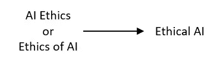
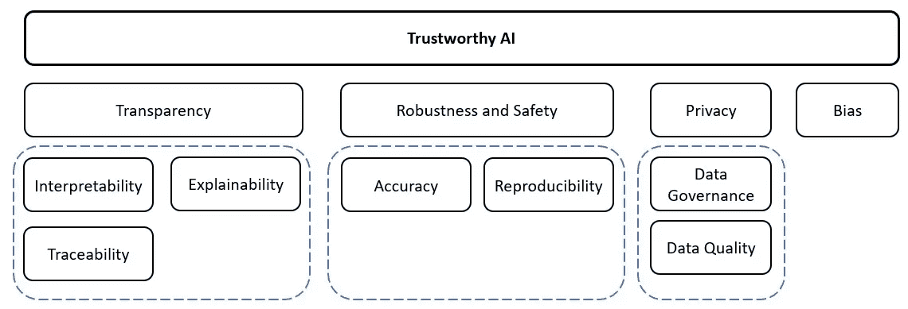

# 伦理人工智能的基础:可解释性和信任的概念和原则

> 原文：<https://medium.com/analytics-vidhya/foundations-of-ethical-artificial-concepts-and-principles-of-explainability-and-trust-ccfec94765f2?source=collection_archive---------1----------------------->

## 全球性公司应该关注行为，而不是简单地遵守法律

# 摘要

人工智能(AI)技术在金融机构和金融犯罪风险管理系统中的广泛使用，鼓励了围绕基于 AI 的技术带来的道德挑战和风险的辩论。人工智能技术对人类的发展具有重大影响，因此它们提出了一些基本问题，如我们应该如何处理这些系统，系统本身应该做什么，潜在的风险是什么，以及我们如何控制这些风险。

随着人工智能的发展，一个关键问题仍然存在，那就是如何解决与其应用相关的伦理和道德挑战。

在这篇文章中，我们定义了伦理人工智能，阐述了可信人工智能的概念，并确定了它的基本概念，原则和风险。

# 1.介绍

金融机构在个人、社区和企业的金融福祉中发挥着核心作用。在金融服务领域，银行正在重塑其业务模式，越来越多地使用人工智能来自动化和优化各种系统和功能的运营。人工智能正在彻底改变金融服务行业，人工智能工具正在整个银行部署，从客户前端到后台办公室。人工智能用于更有效地检测可疑交易和洗钱，在信用风险评估中发挥强大作用，或更有效地改善客户体验。

凭借摄取和分析海量数据的能力，人工智能技术有能力帮助金融机构更好地了解他们的客户，获得洞察力，并更快更有效地识别欺诈或安全违规行为。虽然人工智能技术有望帮助简化和改善服务，但公司做出的决定会对人们产生重大影响，例如批准或拒绝信贷，取消抵押贷款赎回权，或决定是否支付人寿保险索赔。从单个公司的角度来看，这些都是重大的责任——总的来说，会对经济和国家产生重大影响。

出于创建最佳性能人工智能模型的愿望，许多组织将运营和执行因素置于可解释性和信任概念之上。随着世界越来越依赖算法来做出广泛的决策，技术和商业领袖将承担解释模型如何选择其结果的任务。复杂的人工智能算法允许组织从以前无法获得的数据中释放洞察力。然而，这些系统的黑盒性质意味着业务用户不容易理解决策背后的逻辑。

金融机构正在利用数据和人工智能来创建可扩展的自动化解决方案，但与此同时，他们也在扩大自己的声誉、监管和法律风险。人工智能刺激了前所未有的商业收益，但在此过程中，政府和行业领导者必须解决各种道德挑战和困境，如机器学习偏见、数据隐私问题、人工智能工具的鲁棒性、可解释性和可解释性以及整体透明度，以建立对人工智能技术采用的完全信任。

为了遵循开发和实施人工智能技术的策略，组织应该考虑建立人工智能伦理框架和准则。现有的法律和法规适用于处理人工智能，同时实施新的独立人工智能法规。金融机构在使用人工智能时会面临法律、道德和声誉风险。除了法律风险，金融机构还需要关注人工智能的伦理问题。现在，公众辩论的焦点是公司应该如何行事，而不仅仅是遵守法律。全球公司面临的一个挑战是，在人工智能能力不断发展的情况下，在可能存在文化差异的多个管辖区中，确定一套一致的道德标准和价值观。

# 2.伦理人工智能

在过去的几年里，关于人工智能伦理的讨论已经从一个学术问题转变为一个政治和公共辩论的问题。即使“机器伦理”的概念是在 2006 年左右提出的，但伦理人工智能仍处于起步阶段，是一个复杂而错综复杂的概念。伦理人工智能到底是什么，它试图完成什么？

伦理人工智能是人工智能系统特有的技术伦理学的一个分支，它关注的重要问题是人类开发人员、制造商和操作员应该如何行事，以最大限度地减少人工智能在社会中可能产生的伦理伤害，无论是来自不道德的设计、不适当的应用还是误用。伦理人工智能是先进技术伦理的一部分，专注于机器人和其他人工智能系统和代理。这个概念研究与人工智能相关的伦理原则、规则、指导方针、政策和法规。此外，伦理人工智能是一套价值观、原则和技术，采用广泛接受的标准来指导人工智能技术开发和使用中的道德行为。从广义上讲，与人工智能相关的伦理学可以被定义为处理实体(例如，人类、智能机器人、代理等)的道德义务和责任的学科。).

就在几年前，关于“人工智能伦理”的讨论还只是非营利组织和学者的专利。今天，世界上最大的科技公司正在组建快速增长的团队，以解决大规模数据的广泛聚合、分析和使用所产生的道德问题，特别是当这些数据被用于训练机器学习模型时，这是人工智能的一个子领域。

图 1

人工智能伦理不是简单的‘善或恶’。甚至不是一小群人能解决的问题。公司正在投资于伦理问题的答案，因为他们已经意识到一个简单的事实:未能操作数据和人工智能伦理是对底线的威胁。未能达到标准会使公司面临声誉、监管和法律风险，但这还不是全部。未能实施人工智能道德会导致资源浪费，分析开发和部署效率低下，甚至根本无法使用数据来训练人工智能模型。换句话说，人工智能伦理的成功在于其预测的伦理质量，产品的伦理质量，以及其对人类产生影响的伦理质量。

人工智能伦理的范围涵盖了诸如人工智能系统中的偏见、数据隐私和透明度等直接关注的问题；中期关注，如人工智能对经济、就业和社会的影响；以及对人工智能系统达到超智能可能性的长期担忧。人工智能伦理介绍了组织伦理关注的三个主要领域:

隐私和数据治理

偏见和公平

透明度

稳健性和安全性

**图 2** :可信人工智能框架

# 3.伦理人工智能基础

3.1 隐私和数据治理

隐私和数据治理与防止损害隐私的原则密切相关，隐私是一项特别受人工智能系统影响的基本权利。防止对隐私的损害还需要足够的数据治理，包括所用数据的质量和完整性，它在人工智能系统将被部署的领域中的相关性，它的访问协议，以及以保护隐私的方式处理数据的能力。

*隐私和数据保护*。人工智能系统必须在生态系统的整个生命周期中保证隐私和数据保护。这包括用户最初提供的信息，以及在用户与系统交互的过程中生成的关于用户的信息(例如，AI 系统为特定用户生成的输出，或者用户如何响应特定推荐)。人类行为的数字记录可能让人工智能系统不仅可以推断个人的偏好，还可以推断他们的性取向、年龄、性别、宗教或政治观点。为了让个人信任数据收集过程，必须确保收集到的关于他们的数据不会被用于非法或不公平地歧视他们。

*数据的质量和完整性*。所用数据集的质量对人工智能系统的性能至关重要。当收集数据时，它可能包含社会构建的偏见、不准确、错误和失误。这需要在训练任何数据集之前解决。此外，必须确保数据的完整性。将低质量的数据输入人工智能系统可能会改变它的行为，特别是在自学系统中。在规划、培训、测试和部署等每个步骤中，必须测试和记录所使用的流程和数据集。这也应该适用于不是内部开发而是从第三方获得的人工智能系统。

*获取数据*。在任何处理个人数据的组织中(无论某人是否是系统的用户)，都应该制定管理数据访问的数据协议。这些协议应该概述谁可以访问数据以及在什么情况下可以访问数据。只有具备访问个人数据的能力和需求的合格人员才能这样做。

3.2 偏见和公平

数据偏差

基于人工智能的系统具有显著的经济优势和机会，但如果很难理解它们是如何工作的，那么围绕它们可以做多少事情存在限制。例如，在消费贷款领域，整个行业都在担心一个系统可能保留的偏见；以前收集的任何数据都可能有意或无意地带有偏见。例如，自然语言程序(NLP)模型被用来预测句子或段落中的下一个单词。因为它已经在维基百科的数据中接受了训练，它在“男人”和“科学家”、“女人”和“家庭主妇”之间建立了联系。“这个模型发现了维基百科文本中已经存在的偏见。因此，算法可以用作助手，但最终应该由人类做出最终决定。消除偏见的部分解决方案在于省略特定变量，创建包容性数据集，确保每个人都有代表。

3.2.2 数据和算法公平性

此外，数据驱动技术通过从记录复杂社会和历史模式的数据集构建推论来实现准确性和有效性，这些模式本身可能包含偏见和歧视的文化结晶形式。谈到补救人工智能系统中歧视和不公平的危险，没有什么灵丹妙药。因此，架构算法模型和使用中的公平性和偏差缓解问题没有简单或严格的技术解决方案。也就是说，公平意识设计和实施的最佳实践(在非技术自我评估层面以及技术控制和评估手段层面)在确保公正、道德上可接受和有益的结果(公平和公正地对待受影响方)方面大有可为。

负责任的数据获取、处理和管理是算法公平性的必要组成部分。如果人工智能项目的结果是由有偏见的、妥协的或扭曲的数据集产生的，受影响的当事人将不会受到充分的保护免受歧视性伤害。项目团队应牢记以下数据公平性的关键要素:

*代表性*:根据具体情况，弱势群体或受法律保护的群体在数据样本中的代表性不足或过度可能导致弱势群体在训练模型的结果中系统性地处于不利地位。为了避免这种类型的抽样偏差，领域专业知识对于评估收集或获取的数据与要建模的基础群体之间的拟合度至关重要。如果可能，技术团队成员应提供补救方法，以纠正取样中的代表性缺陷。

*适用性和充分性*:在数据收集和获取过程中需要考虑的一个重要问题是，收集的数据量是否足以满足项目的预期目的？收集或获取的数据量对已训练模型输出的准确性和合理性具有重大影响。数据样本不够大，不足以充分丰富地代表待分类人群成员的重要或合格属性，可能会导致不公平的结果。不充分的数据集可能不公平地反映在产生与人工智能系统的期望目的一致的合理结果时应该合理权衡的质量。在这方面，具有技术和政策能力的项目团队成员应合作确定数据量是否足够和适合目的。

*源完整性和测量精度*:有效的偏差缓解始于数据提取和收集过程的最开始。测量的来源和工具都可能将歧视性因素引入数据集。当作为输入纳入训练数据时，有偏见的先前人类决策和判断(如有偏见的评分、排名、采访数据或评估)将成为模型的“基础事实”，并复制系统输出中的偏见。为了确保歧视性的无害，数据样本必须具有最佳的源完整性。这包括确保或确认数据收集过程涉及合适、可靠、公正的测量来源和可靠的收集方法。

*及时性和新近性*:如果数据集包含过时的数据，那么底层数据分布的变化可能会对训练模型的概化产生不利影响。假设这些分布漂移反映了变化的社会关系或群体动态，这种关于潜在人口的实际特征的准确性的损失可能会将偏差引入 AI 系统。为了防止出现歧视性结果，应仔细检查数据集所有元素的及时性和新近性。

*相关性、适当性和领域知识*:理解和利用最适当的数据源和数据类型对于构建一个健壮、公正的人工智能系统至关重要。对潜在人口分布和项目预测目标的扎实领域知识有助于选择最佳相关的测量输入，有助于确定解决方案的合理解决方案。领域专家应该与数据科学团队密切合作，以帮助确定最合适的类别和度量来源。

结果的公平性

作为这种对歧视性非伤害、知情数据的最低保护的一部分，必须考虑如何定义和衡量人工智能系统的影响和结果的公平性。在结果公平领域，关于如何正确分类模型支持的决策的结果是公平和公正的，存在着很大的信仰差异。不同的方法和原则正在被纳入:一些侧重于人口均等，一些侧重于个人公平，另一些侧重于错误率在亚人口中的公平分配。

结果公平性的确定应该在很大程度上取决于考虑结果公平性的特定用例，以及将选择的标准合并到人工智能系统结构中的技术可行性。这意味着确定公平性的定义应该是整个项目团队的合作和多学科的努力。在生产的预处理、建模或后处理阶段，各种公平方法涉及多种类型的技术方法。这些技术方法在我们已经强调的算法公平性的更大画面问题方面具有有限的范围。

许多正式的方法只在具有分布或分配结果的用例中起作用。为了进行群体比较，这些方法需要获得关于敏感/受保护属性的数据(这些数据往往不可用或不可靠)以及关于潜在人口分布的准确人口统计信息。

3.3 透明度

透明度是产生信任和人工智能采用的基本要求。与此同时，法规遵从性和模型安全性也要求公司在模型中设计一定程度的可解释性和可解释性，并包含与人工智能系统相关的元素的透明度:数据、模型和系统。透明的 AI 使人类能够理解 AI 黑匣子中正在发生的事情。这意味着它完全是关于人工智能为什么以及如何决定一些事情。人工智能的透明性将帮助用户认识到人工智能的决定何时是不正确的。

3.3.1 可解释性和可解释性

在机器学习(ML)和透明人工智能的背景下，可解释性和可解释性经常互换使用。虽然它们关系非常密切，但有必要区分这两个概念。

可解释性是在一个系统中可以观察到因果关系的程度。或者，换句话说，它是给定输入或算法参数的变化，你能够预测将要发生什么的程度。它能够查看算法，并清楚地识别正在发生的事情。

同时，可解释性是机器或深度学习系统的内部机制可以用人类术语解释的程度。人们很容易忽略可解释性的细微差别，但可以这样考虑:可解释性是指能够在不知道原因的情况下辨别机制。可解释性是能够非常准确地解释正在发生的事情。

可解释性和可解释性的中心问题是，通过在开发过程中增加一个额外的步骤，实际上增加了多个步骤。从一个角度来看，这看起来像是试图用更大的复杂性来解决复杂性。

透明度作为人工智能道德的一项原则，包含以下含义:

一方面，透明人工智能涉及给定人工智能系统的可解释性，即知道模型如何以及为什么在特定上下文中以这种方式运行，从而理解其决策或行为背后的基本原理的能力。这种透明性通常被称为“打开人工智能的黑匣子”。它涉及内容的澄清和可理解性或可解释性。

另一方面，透明的人工智能涉及可解释性，允许人类看到模型是否经过彻底测试并有意义，以及他们可以理解为什么做出特定的决定

设计和实现透明人工智能有三个关键任务。

*过程透明的任务*:在向受影响的利益相关者提供解释时，需要证明道德合法性、非歧视性和公众可信度的考虑在导致自动化决策或行为的设计和实施过程中是端到端有效的。通过在整个人工智能项目生命周期中遵循以下概述的最佳实践，以及通过设计问责制框架实施稳健的适用性措施，将为这项任务提供支持。

*结果透明的任务*:在向受影响的利益相关者提供解释时，有必要通过用非专业人员可以理解的简单语言展示一个模型在特定的决策或行为环境中是如何以及为什么表现出它的方式，来阐明内容和解释结果。因此，澄清和沟通其决策或行为背后的基本原理是至关重要的。这种解释应该具有社会意义，因为解释的术语和逻辑不应该简单地复制统计模型的技术含义和基本原理的形式特征，而应该翻译成人类实践的日常语言，因此在决策或行为所包含的因素和关系方面是可以理解的。

*结果透明*的任务:向受影响方解释系统做出的合乎道德、合法、非歧视性的决策。它应该从结果透明度中提取内容，并根据整个设计和使用流程中坚持的标准来权衡该解释:道德、法律、非歧视、公平和可信。从一开始就利用一种最佳的方法来实现过程透明性，应该支持和保护这种对规范性解释和结果证明的需求。

3.4 技术稳健性和危害预防

实现可信人工智能的一个关键组成部分是技术鲁棒性，这与预防伤害的原则密切相关。技术稳健性要求开发人工智能系统时采取预防风险的方法，并以某种方式使其可靠地按预期运行，同时最大限度地减少无意和意外的伤害，并防止不可接受的伤害。

*抵御攻击的能力和安全性*。人工智能系统应该受到保护，以免被对手利用。攻击可能以数据为目标，并导致数据中毒或底层基础设施，包括软件和硬件。如果人工智能系统受到攻击，例如在敌对攻击中，数据以及系统行为可以被改变，导致系统做出不同的决定，或者导致它完全关闭。为了使人工智能系统被认为是安全的，应该考虑人工智能系统可能的非预期应用和恶意行为者对系统的潜在滥用，并且应该采取措施来防止和减轻这些情况。

*准确度*。准确性是衡量人工智能系统进行正确分类的能力的一种方式，例如，将信息正确分类到正确的标签中，或者基于数据或模型进行正确预测、建议或决策的能力。一个明确的、结构良好的开发和评估过程可以支持、减轻和纠正不准确预测带来的意外风险。当偶然的不准确预测不可避免时，重要的是系统能够指出这些错误的可能性有多大。在人工智能系统直接影响人类生活的情况下，高水平的准确性尤为重要。

*可靠性和再现性*。至关重要的是，人工智能系统的结果是可重复的，以及可靠的。一个可靠的人工智能系统是一个在各种输入和情况下都能正常工作的系统。这是仔细检查人工智能系统和防止意外伤害所必需的。再现性描述了使用相同的数据和工具，尽可能精确地实施实验和计算程序，以获得与原始工作相同的结果的能力。换句话说，当在相同条件下重复时，它表现出相同的行为。这使得科学家和决策者能够准确地描述人工智能系统做什么。

*鲁棒性*。鲁棒性的目标可以被认为是人工智能系统在恶劣条件下可靠而准确地运行的目标。这些条件可能包括对抗性干预、实施者错误或强化学习(RL)范式中自动学习者的目标执行偏差。因此，稳健性的度量是系统的完整性的强度及其在应对困难条件、敌对攻击、干扰、数据中毒和不良强化学习行为时的运行稳健性。

# 4.用好的 Actimize 把 AI 的风险降到最低

金融犯罪风险管理中的责任人工智能

在 NICE Actimize，我们认识到减轻人工智能风险的几个指示性组成部分，并将人工智能伦理中体现的原则和准则与 Actimize 科学界正在进行的讨论联系起来。为了在您的分析解决方案和人工智能决策系统中获得降低风险的能力，我们建议关注以下基于根本的方法和最佳实践:

提供关于人工智能当前前景的客观观点，重点关注偏见、隐私、透明度和健壮性等方面。这包括在数据偏差、数据隐私、模型可解释性和可解释性方面与人工智能相关的风险的技术讨论。同样，将人工智能嵌入风险管理框架。

介绍人工智能领域目前正在积极开发的科学解决方案，以降低风险。

提出一系列建议，提出与政策相关的考虑因素，以引起监管和模型治理的注意，从而为人工智能系统建立一套标准和认证工具。

尝试在人工智能技术中实现标准，以及在 NICE Actimize 的产品和服务中嵌入人工智能组件，应该考虑几个思考途径。这些途径包括:

引入标准化方法来评估人工智能模型的可信度，特别是确定它们在用于训练的数据、统计模型的类型或使用环境等因素方面的作用领域；

通过发布有关人工智能模型已知漏洞的良好实践和解决这些漏洞的技术解决方案，提高 NICE Actimize 人工智能社区的意识；

促进机器学习模型概念的透明度，强调对于对用户基本权利有潜在负面影响的人工智能系统，需要一种可解释的设计方法。

# 5.摘要

理解和解决与人工智能相关的伦理和道德问题仍处于起步阶段。人工智能伦理不是简单的‘好与坏，以及‘善与恶’。甚至不是一小群人能解决的问题。

与人工智能相关的伦理和道德问题非常关键，现在就需要讨论。金融服务组织需要根据他们的决策和行为在人类现实中扮演的重要角色来理解这些系统。这些结果的社会背景非常重要，因为它们实际上以直接和道德后果的方式影响个人和社会，这些结果不仅需要从统计逻辑、技术原理和社会背景的角度来理解和解释，还需要从它们对人的不同影响的合理性的角度来理解和解释。

更深入地研究可信人工智能的技术和交付方面，可以看出这些概念和原则如何直接符合这些类型系统的不同需求水平。当考虑如何使决策和解决问题的人工智能系统的结果对受影响的各方完全透明时，应该考虑人类推理的多维视角，因为它更有效地解决了各方可能存在的问题。

# 参考

[1] Abiteboul，s .等人，(2015 年)。数据，负责任。ACM Sigmod 博客。

2 ACM 美国公共政策委员会。(2017).关于算法透明度和问责制的声明。

[3]阿达迪等人。艾尔。, (2018).窥视黑盒子内部:对可解释人工智能的调查(XAI)。IEEE 接入，6，52138–52160。

[4]阿加瓦尔等人。艾尔。, (2018).削减接近公平分类。

[5]艾现在研究所。(2018).算法影响评估:公共机构的可问责自动化。

[6]亚历山大，v .等人，(2018 年)。为什么要相信一个算法？人类行为中的计算机，89，279–288

[7] Amodei，d .等人，(2016 年)。人工智能安全的具体问题。

[8] Bell，d .等人,《扩大规模:社会科学的数字数据服务》。英国数据服务。

[9] Bibal，a .等人，(2016 年)。机器学习模型和表示的可解释性:导论。

[10] Bracamonte，V. (2019 年)。透明可信的机器学习面临的挑战。KDDI 研究公司。

[11]卡洛，R. (2017 年)。人工智能政策:初级读本和路线图。UCDL 版本，51，399。

[12]卡德，D. (2017)。机器学习中的“黑盒”隐喻。走向数据科学。

[13]陈等(2014)。基于态势感知的代理透明性。马里兰州阿伯丁试验场:美国陆军研究实验室

[14]方，R. C .等。艾尔。, (2017).通过有意义的扰动对黑盒的可解释的解释。IEEE 计算机视觉国际会议论文集(第 3429–3437 页)。

[15]谷歌。(2019).人工智能治理问题透视

[16]哈蒙·罗南等人，(2020 年)。人工智能的鲁棒性和可解释性。

[17]约翰·杰伊刑事司法学院(2017 年)，《洗钱中的道德和偏见:关于什么使我们“好”的技术研究》。

[18]《数据库管理杂志》(2020)。人工智能伦理

[19] Kemper，j .等人(2018 年)。对谁透明？没有批判的观众就没有算法的责任。信息、交流与社会，1–16。

[20] Kemper，j .等人(2018 年)。对谁透明？没有批判的观众就没有算法的责任。信息、交流与社会，1–16。

[21] Keng Siau (2018 年)。人工智能的伦理和道德问题

[22] Morley，j .等人，(2019 年)。从什么到怎样。人工智能伦理工具、方法和研究的概述，以将原则转化为实践。

[23]默多克等人。艾尔。, (2019).可解释的机器学习:定义、方法和应用。

[24]尼古拉·法比亚诺(2019)。道德与个人数据保护

[25] Pedreschi 等人艾尔。, (2019).黑盒人工智能决策系统的有意义的解释。AAAI 出版社。

[26] Samuel Lo Piano (2020)，机器学习和人工智能中的伦理原则。

[27] Schaefer，k .等人，(2016 年)。影响自动化中信任发展因素的荟萃分析:对理解未来系统中自主性的影响。人为因素，58(3)，377–400。

[28]《哈佛公报》(2020 年)。人工智能和机器学习时代的承诺和潜在陷阱。

[29]蒂洛·哈根多夫(2020 年)。人工智能伦理学。

[30]Varshney，k .等人，(2017 年)。机器学习的安全性:信息物理系统、决策科学和数据产品。大数据，5(3)，246–255。

[31]维尔马等人(2018 年)。解释了公平性定义。

[32]冯·赖特(2004 年)。解释和理解。纽约伊萨卡:康奈尔大学出版社。

[33]沃尔顿博士(2004 年)。一种新的辩证解释理论。哲学探索，7(1)，71–89。

[34]张等。艾尔。, (2018).决策的公平性因果解释公式。出席第 32 届 AAAI。