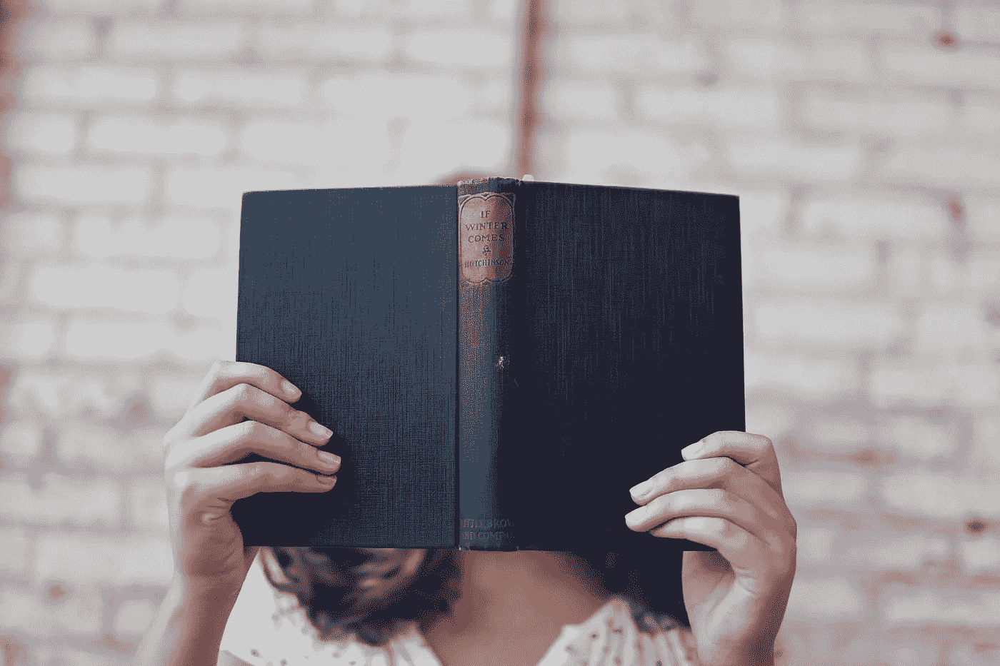
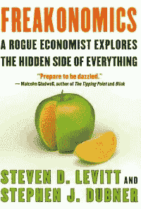
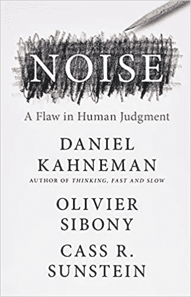
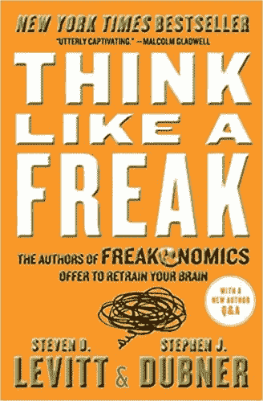
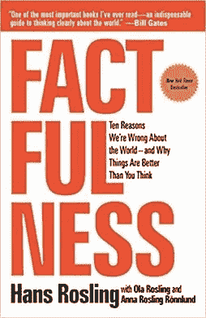

# 📚你应该读的关于数据和人类偏见的四本书

> 原文：<https://medium.com/analytics-vidhya/four-books-about-data-and-human-bias-72b566387a72?source=collection_archive---------2----------------------->

来自 Pexels

在推荐四本关于数据和人类偏见的书之前，我先问你一个简单的问题。石油和数据有什么共同点？他们似乎属于不同的世界，因为炼油厂听起来像一座工业大教堂。通常，它位于海洋中央，用它的长塔制造出长长的影子。

**尽管如此，数据和石油行业有很多东西可以分享**:它们都是世界经济的重要燃料:前者为汽车、塑料和药品提供资金，而后者为各种在线设备和服务提供动力。他们也创造了新的基础设施、商业、垄断和经济。或许数据通过挑战当前的法规和商业模式，以一种更具破坏性的方式做到了这一点。

如果你对这个现象感兴趣，可以看看**我过去喜欢读的四本关于数据的书**。

# 魔鬼经济学:一个流氓经济学家探索一切事物隐藏的一面

这不会是你第一次读到史蒂芬·列维特和史蒂文·哈勃的书。他是一名美国经济学家，研究过犯罪、政治和体育等多个主题，利用数据深入理解日常社会中这些动态的因果关系。

例如，在本书的第一章，作者展示了相扑选手在比赛中作弊的情况。然而，赛事组织者自 1946 年以来首次因假球取消了 2011 年在东京举行的盛大赛事。其他主题包括三 k 党和房地产经纪人的信息控制，毒品交易的经济学，给孩子起名的社会经济模式，以及合法堕胎在减少犯罪中的作用。

尽管一些统计学家批评这本书的方法，但这本书很吸引人。

# 噪音:人类判断的缺陷

丹尼尔·卡内曼可以说是地球上最有影响力的行为经济学家。其作品“**思考快与慢**”为理解决策过程提供了一个令人惊叹的场景。去年，他带着另一个人类判断失误的故事回来了。

为什么医生看同样的病人会给出不同的诊断？为什么陪审员会根据有罪者的皮肤来给其他人判刑？还是按照一天的时间？为什么没有人能逃脱这种判断失误？这些案例用研究来解释，以支持噪音导致公平、健康、安全、时间使用和财富的相当大的后果。书中反复出现的一句话是“**哪里有判断，哪里就有噪音，而且噪音比你想象的还要多**”。

但是**并非一切都失去了:**在[一书的最后](https://www.amazon.com/Noise-Human-Judgment-Daniel-Kahneman/dp/0316451401)，作者提出了一系列减少偏见的实践，以改善个人和组织的决策过程。

# 像怪物一样思考:《魔鬼经济学》的作者提议重新训练你的大脑

另一个创造性地讲述故事和统计数据的例子得到了**马尔科姆·格拉德威尔**的认可，他在[Amazon.com](https://www.amazon.com/Think-Like-Freak-Authors-Freakonomics/dp/0062218344/ref=sr_1_1?crid=2IQ8VB1BSO2EP&keywords=think+like+a+freak&qid=1641812200&s=books&sprefix=think+like+a+freak%2Cstripbooks-intl-ship%2C178&sr=1-1)评论中说:

> 在《像怪物一样思考》中的一个精彩瞬间，史蒂芬·列维特和史蒂芬·都伯纳问了一个问题:孩子和成人谁更容易被愚弄？[……]这就是杜布纳和莱维特的前两本书《魔鬼经济学》和《超级魔鬼经济学》的内容。这是关于我们需要对这个世界抛给我们的诡计和问题采取的态度。对于这种态度归结为什么，杜布纳和莱维特有一套处方。尽管如此，归根结底，还是要把自己放在孩子的思维中，向上凝视双重提升:不要抱有期望，为简单的解释做好准备，让你的注意力不时地游走。”

这一期的主题是点球、[吃热狗](https://alessandromarchesin.com/2021/08/23/how-to-use-hot-dogs-to-solve-problems/)和彩票。同样，打破常规的思维会抓住你，教你如何用下面的**战术**像一个怪物一样思考:

*   首先，收起你的道德指南针。如果你已经决定了要做什么，就很难看清一个问题。
*   学会说“我不知道”——直到你能承认你还不知道的事情。几乎不可能学到你需要的东西。
*   像孩子一样思考——因为你会提出更好的想法和更好的问题。
*   参加激励大师班，因为激励主宰着我们的世界，不管是好是坏。
*   学会说服那些不想被影响的人——因为正确很少足以赢得胜利。
*   学会欣赏放弃的好处——因为如果你不愿意放弃今天的无用之物，你就无法解决明天的问题。

# 真实性:我们对世界错误的十个原因——以及为什么事情比你想象的要好

2018 年**比尔盖茨**强调[这本书](https://www.amazon.it/Factfulness-Reasons-Wrong-Things-Better/dp/147363749X/ref=sr_1_1?__mk_it_IT=%C3%85M%C3%85%C5%BD%C3%95%C3%91&keywords=Factfulness%3A+Ten+Reasons+We%27re+Wrong+About+the+World+%E2%80%93+and+Why+Things+Are+Better+Than+You+Think&qid=1641813898&sr=8-1)是他推荐的夏季值得一读的五本书之一。

**你知道吗，黑猩猩比我们更了解这个世界在贫困、人口和学校教育方面的情况？汉斯·罗斯林试图理解为什么人们对世界数据有如此错误的看法:问题在于人们不知道他们不知道的东西，并用确凿的偏见掩盖了这种无知。**

罗斯林建议根据收入等级(而不是典型的发达/发展中框架)将世界分成四个等级**,并提出了阻止我们看到世界真正进步的十种本能。**

不仅如此，我认为这本书有助于理解当这么多糟糕的事情同时发生时，如何为这个世界做些什么:作者认为，你确实无法拯救每个人。尽管如此，你可以把注意力集中在目前造成最大痛苦的原因上，或者集中在努力能带来最大利益的领域上。例如，尽管有各种可能的原因导致某人死亡，心血管疾病仍然是导致死亡的主要原因，这方面的一点点改善就可以挽救数百万人的生命。

你呢？你读过那些书吗？你还有其他关于数据和偏见的书推荐吗？