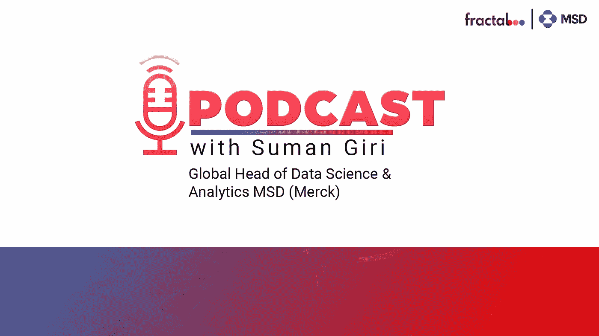

# 分形播客与萨加尔沙阿特色苏曼吉里(MSD)

> 原文：<https://medium.com/analytics-vidhya/fractal-podcast-with-sagar-shah-featuring-suman-giri-msd-541bbbf1c453?source=collection_archive---------0----------------------->

# 介绍

在不断颠覆的数据科学、生命科学和分析领域，跟上行业的最新趋势和事件至关重要。为了让观众保持参与和更新，Fractal 经常与数据科学行业的特立独行者一起主持一系列播客。Fractal 的客户合作伙伴 Sagar Shah 邀请默克数据科学分析全球负责人 T2·苏曼·吉里通过播客进行了一次富有启发性的谈话，讨论了渗透该领域的最新趋势、新冠肺炎·疫情对 T4 制药行业的影响以及更多类似的热门话题。

以下是这位领导人的一些对话摘录，供大家收听分形播客并做笔记。

与苏曼·吉里(MSD)的对话

# 分形播客摘录

## Sagar Shah:制药业如何受到当今动荡的经济的影响？

苏曼吉里:嗯，不像其他行业那样！首先，除了少数例外，药物相当缺乏弹性。人们会继续生病，所以需求不像在其他领域那样是消费能力的函数。众所周知，由于 covid，一些制药公司做得相当好。我相信在过去的一周里我听到了一些数字，SAP 指数在过去的一年左右下跌了 20%，但是制药指数上涨了 3%。这让你对我们在总体经济中的表现有所了解。投资者对我们公司的大多数积极展望都是由我们强大的产品和渠道推动的。

## Sagar Shah:人工智能分析如何帮助推动工作中的竞争优势？

**苏曼·吉里:**我们在产品生命周期的每个阶段都使用数据科学，从研究到制造和商业化。因此，数据科学对于理解我们治疗的疾病及其流行程度、创建个性化医疗策略以及加快我们设计和开发新药的速度至关重要。对于我们开展业务的商业领域中的在线产品而言，目前存在大量复杂的数据科学，尤其是在预测、计算商业营销的效果、审查促销内容的合规性、竞争威胁分析以及为医疗保健专业人员创建个性化参与策略以使他们了解药物及其益处方面。还有一些用例，如自动数据匹配、罕见疾病患者发现，以及更多机器学习和分析被大量利用的情况。

## Sagar Shah:你是如何为你的人工智能和分析团队发展职业生涯的？

**苏曼吉里:**我们正在努力考虑留住人才！我们在一般市场的竞争优势是我们对影响力的不懈关注。我们知道，今天的分析和数据科学人员有多种选择；他们可以在任何地方工作，因为每个行业和每个公司都需要数据科学人才。但是，你是愿意用你所拥有的技能让瓶子变得更加多彩，还是愿意去拯救生命呢？所以这是一个有效的命题，我们用它来关注我们所做的事情的“为什么”。但我们也注意到，影响只是一个方面，我们正在确保我们的人才库主要是移动的，以便他们可以跨不同的垂直行业移动，并对业务有良好的了解。我们现在与 Analytics Vidhya 有合作关系。我们还提供管理和技术方面的发展机会。我们还鼓励参与各种事情，如建设加速器和与其他大学和顶点的伙伴关系。我们想让它成为一个有趣且令人满意的工作场所。

## Sagar Shah:在建立成功的分析团队方面，你目前面临哪些挑战？

**苏曼吉里:**多半是天赋！商业基金分析需要技术和领域专业知识；我们追求的是一个罕见的独角兽人才库，人们希望感觉到他们是社区的一部分，他们有一个增长图，他们对自己从事的工作和他们想如何做有发言权。所以，我们会留意这一点。作为一个领导团队，我们的大部分时间都花在了如何创建一个能够大规模实现所有这些不同方面的结构上，我认为这是最困难的部分。

## Sagar Shah:在接下来的几年里，哪些新的数据来源将帮助制药公司，尤其是默克公司？

**苏曼·吉里:**我们如此关注影响，以至于我们可以更多利用的一个数据源是健康的社会决定因素(SDOH)，这有助于促进健康公平，并真正确保我们的产品具有预期的影响。因此，围绕这一点还有很多工作要做！商业和联合数据集中有一个新的标记化结构，允许您将消费者活动与您的索赔数据和 LCP 参与数据相匹配。像 Liebrand 和 Datavant 这样的公司正在这一领域发挥作用，使您能够利用现有数据做许多更有趣的事情，否则您通常不会这样做。我们也看到了很多成像和实验室数据，甚至在商业方面；可能有可以通过它们解决的用例。最后，我非常看好合成数据的前景和潜力，因为它可以在没有数据的领域扩大规模，还具有隐私保护的意义。除了你可以购买、购买和生成的数据之外，合成数据是我感到兴奋的东西。

## Sagar Shah:未来几年，分析和人工智能将如何改变制药行业？

**苏曼吉里:**我们已经听说了‘阿尔法褶皱’在深井前的工作。因此，他们承担了这个蛋白质折叠问题，这是药物发现的一部分，并大规模解决了它。现在下一个前沿是蛋白质结合，比如药物可以结合的候选蛋白质是什么。我相信这将是下一个圣杯，因为人工智能在制药行业的潜力，特别是药物发现。在商业方面，这也是我们所代表的，我们有很大的潜力来审视我们在过去这么多年中以特定的方式所做的工作，并在人工智能中使用所有的新技术进步。所有这些进步都有可能彻底改变我们效率稍低或不太准确的做事方式，并将它们提升到一个新的水平，这样我们就可以真正发挥我们所知道的影响力。

## Sagar Shah:过去十年以来，你的人工智能之旅进展如何？

苏曼·吉里:作为研究生教育的一部分，我学习了数据科学和机器学习，主修数学。在论文期间，我的研究重点是能源分解。我专注于获取单源、多通道信号，并将其分解为单独的源。我在寻找一个可以发挥我的技能并产生影响的行业。我热衷于解决有意义的问题，医疗保健听起来像是一个不错的探索空间。我登陆了保险这边，在 Atena 工作；然后，我去了 Highmark，这是一家同行供应商，它给了我一个关于医疗保健生态系统的有利位置。我将转而从事一段时间的咨询工作，再次担任数据科学的角色，这样我就可以了解这个行业是如何运作的。在过去的两年里，我一直在默克工作，因为这是一个我接触不多的行业，而生命科学是我目前工作的领域。总的来说，我开创了一个职业生涯，在美国医疗保健生态系统中导航，并利用数据科学使事情变得更好，产生更大的影响。

## 萨加尔·沙阿:每天让你兴奋的是什么？

**苏曼·吉里:**除了我所做的事情的潜力之外，确保有人得到他们需要的治疗并延长他们的生命是我的一大动力。即使当我感到有点沮丧时，环境的影响也能帮助我保持动力。如果要我确定最让我兴奋的事情，那就是构建和设计大规模系统的潜力。由于我们经营的治疗领域不同，制药行业本质上是一个系统，用来衡量不同治疗领域和不同市场中被问到的相同问题。与我认识的最聪明的人一起工作来构建真正可扩展的系统让我兴奋不已。

## 萨加尔·沙阿:在未来的 5-10 年里，什么样的趋势可能会实现？

**苏曼·吉里:**它必须是 Web 3.0，因为它是第一方数据，主要是从保护隐私的角度来看。我非常相信 Web 3.0 的前景。商业组织，特别是那些依赖于联合数据的商业组织，将不得不适应他们创建第一方数据策略的方式。元宇宙再次变大，我不知道是否有人意识到，但在未来 5-10 年内，我们将看到首批几个切实的用例出现。在接下来的 5 到 10 年里，量子计算将开始发现我们今天的计算能力无法解决的问题。我非常希望并支持的一个趋势是，负责任和可持续的人工智能越来越多地成为我们对话的一部分，成为我们构建和扩展用例时所遵循的过程的一部分。

苏曼，感谢你抽出时间分享对制药行业的见解。我们被你们的热情所吸引，迫不及待地想看到元宇宙和人工智能将如何扩展他们在制药行业的角色。

# 结论

我们希望大家对制药行业有一个总体的了解，以及人工智能如何在行业转型中发挥重要作用。观看详细的分形贴在这里。苏曼·吉里强调了数据科学的重要性，以及它如何有助于了解各种疾病，并创造个性化的策略来创造治疗疾病的药物。我们希望听到您对人工智能、分析和制药行业合作的看法。所以，请在下面评论分享！

*原载于 2022 年 11 月 25 日*[*【https://www.analyticsvidhya.com】*](https://www.analyticsvidhya.com/blog/2022/11/fractal-podcast-with-sagar-shah-featuring-suman-giri-merck/)*。*