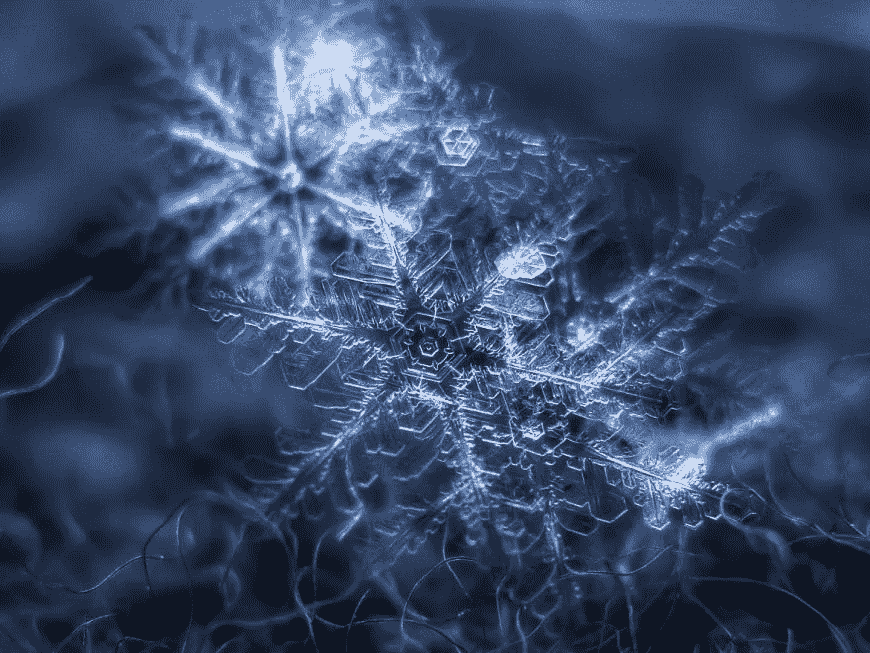
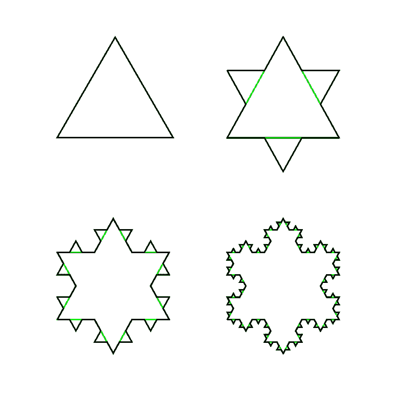
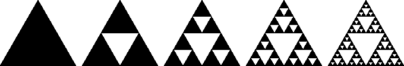
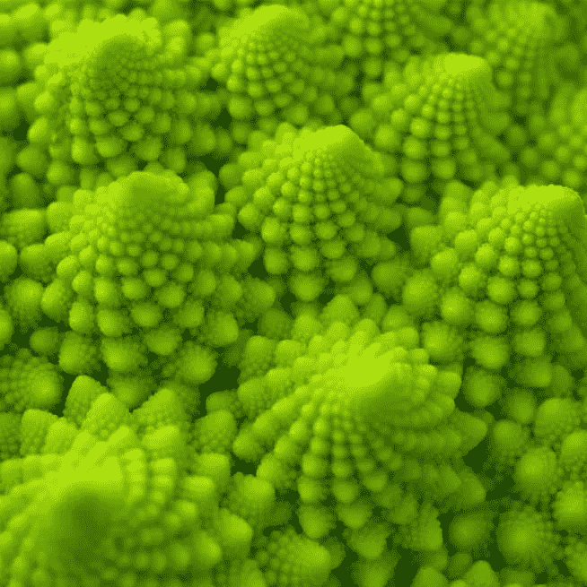
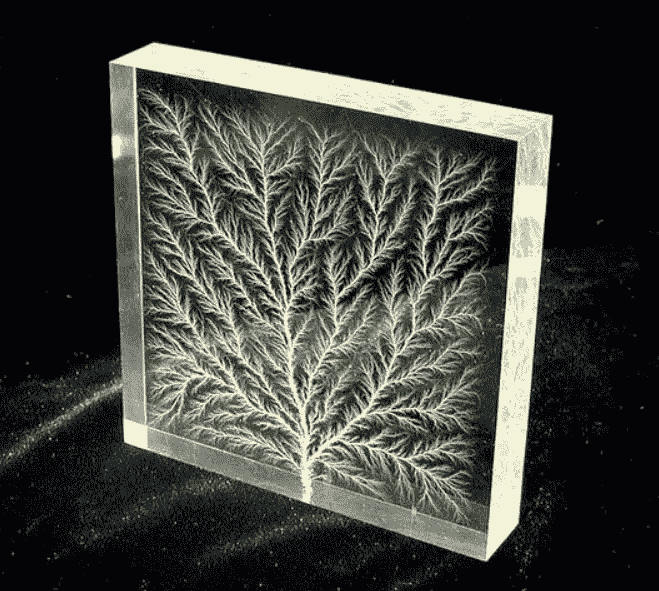
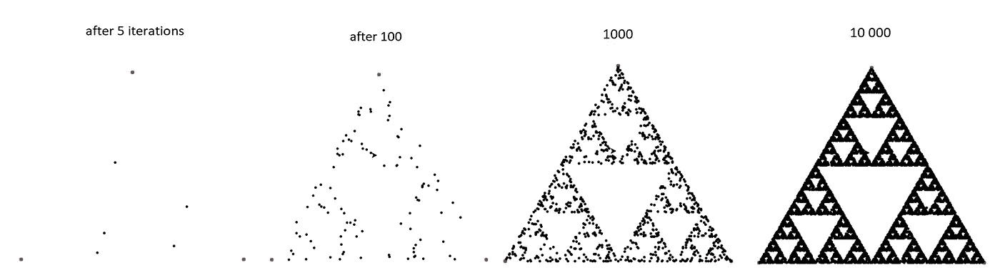
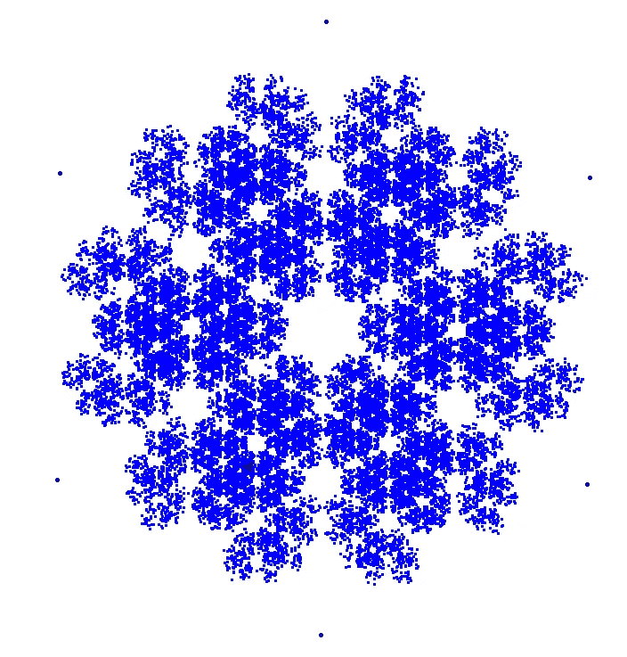

# 分形和混沌游戏

> 原文：<https://medium.com/analytics-vidhya/fractals-and-the-chaos-game-d116a21cf6fe?source=collection_archive---------20----------------------->

奥尔加和阿列克谢[https://www.flickr.com/photos/chaoticmind75](https://www.flickr.com/photos/chaoticmind75)

W 当我在寻找一些如何提高我的 Python 学生(从初学者到中级初级学校的学生)的注意力和参与度的灵感时，我也在寻找一些关于算法如何工作的有趣的图形示例。不用说，这个例子需要足够简单，以便向 13 岁左右的小学生解释，并且需要图形部分，因为这确实是最适合年轻人(不仅仅是年轻人:)的东西

这就是我如何遇到混沌游戏的，一个简单的算法如何创造美丽形状的例子，如果使用足够的迭代。

下面这篇短文包含三个部分:

1.  **分形的定义和例子**
2.  **自然界中的分形**
3.  **混沌游戏**

# **1。分形的定义和例子**

根据[维基百科](https://en.wikipedia.org/wiki/Fractal)分形是[欧氏空间](https://en.wikipedia.org/wiki/Euclidean_space)的[自相似](https://en.wikipedia.org/wiki/Self-similarity)子集，其[分形维数](https://en.wikipedia.org/wiki/Hausdorff_dimension)严格超过其[拓扑维数](https://en.wikipedia.org/wiki/Topological_dimension)。不同层次的分形看起来是一样的。

本质上，这意味着分形的每个部分都与它的整体形状相似。最好用例子来描述。

**科赫雪花**
科赫雪花可以由一个等边三角形构建而成，每一个下一阶段都是通过取出三角形边的中间部分的 1/3，并用两条长度为 1/3 的 60 度角的线来代替。

科赫雪花—[https://commons.wikimedia.org/w/index.php?curid=1898291](https://commons.wikimedia.org/w/index.php?curid=1898291)

分形的另一个例子是 Sierpinski 三角形，其整体形状为等边三角形，递归地细分为更小的等边三角形。下面你可以看到迭代 1 到 5。

[https://commons.wikimedia.org/w/index.php?curid=1357937](https://commons.wikimedia.org/w/index.php?curid=1357937)

还有许多更复杂的分形例子，包括****【曼德尔布罗集】。**我鼓励你自己去寻找更多的例子。**

# **2.**自然界中的分形****

**那些数学上的“欧几里得空间的自相似子集”不仅仅是生活在数学方程中的理论概念。原来，大自然就是关于分形的。西兰花是一个巨大的分形结构，它的一小部分很像整个蔬菜:**

****

**演职员表:朗姆酒田园猿/flickr**

**下面一块有机玻璃暴露在强电流下，内部燃烧出分形分支图案。这可以被认为是瓶装的闪电。**

****

**照片:伯特·希克曼/维基共享资源**

**蕨类植物是类似分形形状的另一个例子:**

****

**大卫·莱纳[https://www.flickr.com/photos/lehnerda/](https://www.flickr.com/photos/lehnerda/)**

**还有很多，和上一节一样，我鼓励你自己搜索，找到更多关于这个有趣主题的信息。**

# **3.混沌游戏**

**在这个游戏中，分形是通过迭代创建一系列点来创建的，从最初的随机点开始，其中序列中的每个点都是前一个点和其中一个顶点之间距离的给定[分数](https://en.wikipedia.org/wiki/Fraction_(mathematics))。**

**以下是它在实践中的工作原理，创建了 Sierpinski 三角形:**

1.  **创建等边三角形并标记每个顶点的位置(下面用红色标出)**
2.  **在三角形内选择任意一点，并标记一个点**
3.  **随机选择三角形的三个顶点之一**
4.  **计算到所选顶点的距离并除以 2**
5.  **向点 3 中选择的顶点移动点 4 中计算的距离**
6.  **做一个圆点**
7.  **从第 3 点开始重复**

**下面是经过几次迭代后创建的内容:**

****

**ISierpinski 三角——混沌游戏**

**当我向学生们展示这一点，并解释如何使用 Python 代码简单地实现这一点时，他们开始将这一算法应用于其他图形，如正方形、五边形等。试图找出发生了什么。一个学生提出了六边形的附加规则，即在下一次迭代算法中不能选择与前一次迭代相同的顶点。这是显示的内容:**

****

**干得好，迈克尔！**

**看起来像雪花，不是吗？**

**如果你想亲自查看许多其他基于正方形和其他图形的混沌游戏示例，请查看维基百科[。](https://en.wikipedia.org/wiki/Chaos_game)**