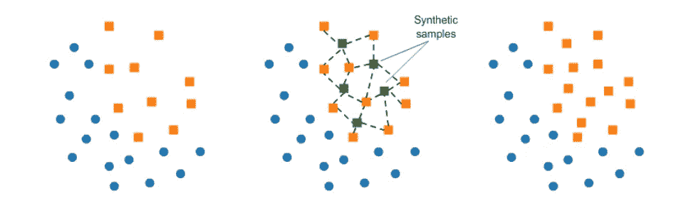
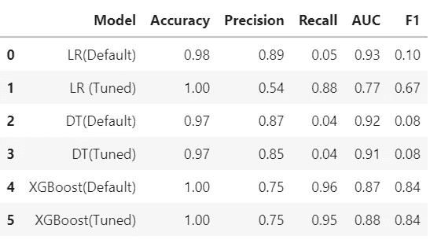

# 欺诈检测:信用卡

> 原文：<https://medium.com/analytics-vidhya/fraud-detection-credit-card-ec529cb2aeff?source=collection_archive---------22----------------------->

新冠肺炎·疫情影响了很多事情。其中一个领域是网上交易，这是大规模增加。这自动使信用卡交易的使用发生了巨大的变化。信用卡交易中的欺诈活动并不是一个新问题，但不可否认的是，欺诈活动比以前增加了很多。

如果我们从建模技术的角度来看，欺诈检测没有什么明显的挑战。其中一些列举如下:

1.  数据不平衡(有偏差的类数据)
2.  数据可用性
3.  ML 模型的可解释性

还有其他挑战。在这篇博客中，我们将讨论用于检测欺诈案件的**预测模型**。数据集可以在[这里](https://www.kaggle.com/mlg-ulb/creditcardfraud)找到。在解决这个案例研究时，很少有人会面临挑战。下面列出了其中的一些:

**处理数据不平衡问题的技巧:**

1.  在大多数 sklearn 分类器建模库中使用属性“ **class_weight** ”。例如:

```
xgb_model = XGBClassifier(class_weight='balanced')
```

除了**平衡的**之外，一个可以传递包含两个类(在我们的例子中是 0/1)权重的字典。默认情况下，其值为**无**。

更准确地说，我们可以按照下面的公式来理解类权重的计算:

```
w_1 = number_of_samples/(number_of_classes * number_of_samples_in_class_1)
```

希望这对于很好的理解班级分布有所帮助。通常“平衡”给出更好的结果。如果有极端的情况，那么尝试手动给出重量。我们还有另一种技术，即击打。

2. **SMOTE** : **合成少数过采样技术**

正如它的名字一样，它传达了为少数类生成合成数据的技术。它的工作方式是从少数类中随机选取一个点，并计算该点的 k-最近邻。如果是你头上的锣，请参考下图:



SMOTE 技术

合成点被添加到所选点及其相邻点之间。请参考下面的代码片段来实现:

```
*# import libraries* import imblearn
from imblearn.over_sampling import SMOTE

smote = SMOTE()*# Fit the predictor and target variable*
X_smote, y_smote = smote.fit_resample(X, y)
```

利用 X_smote 和 y_smote 进行进一步的建模活动。如果没有安装“imblearn ”,请参考下面的代码片段:

```
sudo pip install imbalanced-learn
```

这将解决我们建模的一个主要问题。

信用卡交易中的欺诈行为问题是一个典型的分类问题。其中我们必须预测特定案例是**欺诈**还是**非欺诈**。

为了解决这个问题，我尝试了 3 种不同的建模技术，并尝试了这三种技术的优化版本。在对任何技术建模之前，确保数据是可伸缩的。否则，这可能导致对模型特征重要性的错误解释。

1.  **逻辑回归**

*   确保数据彼此不相关。在相关数据的情况下，必须在建模前移除相关变量。

请参考下面的代码片段:

```
# LR Model
log_reg = LogisticRegression(class_weight='balanced')
reg_model = log_reg.fit(X_train, y_train)
```

2.**决策树**

请参考下面的代码片段:

```
# Decision Tree Classifier Model
dt = DecisionTreeClassifier(max_depth=3, class_weight='balanced')
dt.fit(X_train, y_train)# Tuned model 
dt_final = DecisionTreeClassifier(max_depth=3, 
                                  class_weight='balanced', 
                                  min_samples_leaf=100,
                                  criterion='gini')
dt_final.fit(X_train, y_train)
```

3. **XGBoost**

请参考下面的代码片段:

```
# XGBoost model
xgb_model = XGBClassifier(class_weight='balanced')
xgb_model.fit(X_train, y_train)# Hyper parameter tuned model
xgb_final = XGBClassifier(class_weight='balanced',
                                learning_rate=0.2,
                                max_depth=4,
                                min_child_weight=11,
                                n_estimators=100)xgb_final.fit(X_train, y_train)
```

**车型汇总:**

我们可以看到下面的模型摘要:



所有 3 种模型的总结

**结论:**

很难选择更好的模型，因为大多数模型都有很好的精度。准确性将无法对此用例做出好的解释。由于我们有一个有偏见/不平衡的类，所以最好使用精度和召回来评估模型。更准确地说，我们应该关注**回忆分数**。

根据我们的评估矩阵，我们可以选择 XGBoost。我们还可以通过对超参数调整和 SMOTE 技术进行更多的探索来提高这个分数，这是我没有使用过的。

你可以在这里找到完整的代码。