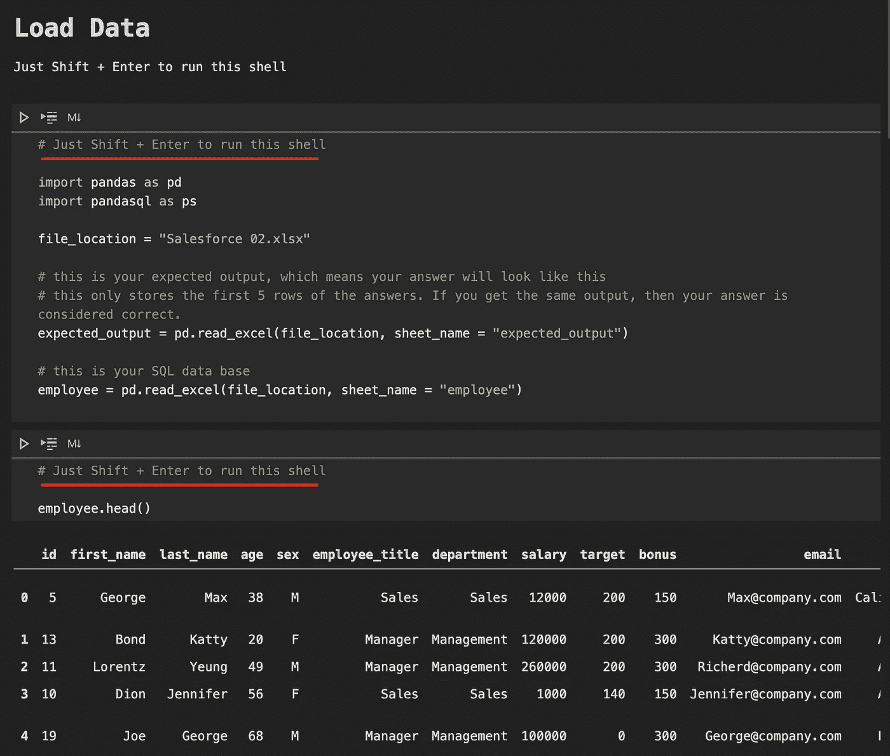

# 包含数据集和答案的免费 SQL 练习(真实面试问题)——sales force(Easy)第 1 部分

> 原文：<https://medium.com/analytics-vidhya/free-sql-exercise-real-interview-questions-with-data-set-and-answer-salesforce-easy-part-1-806a2322c6b5?source=collection_archive---------10----------------------->

在 [Unsplash](https://unsplash.com/s/photos/salesforce?utm_source=unsplash&utm_medium=referral&utm_content=creditCopyText) 上由 [Austin Distel](https://unsplash.com/@austindistel?utm_source=unsplash&utm_medium=referral&utm_content=creditCopyText) 拍摄的照片

根据 techrepubic.com[的调查，数据科学职位的招聘信息中被提及最多的前 3 项技能是:](http://techrepubic.com)

1.Python (72%)

2.R (64%)

3.SQL (51%)

Python 肯定是不可或缺的，而 SQL 技能排在第三位。作为一名数据分析师，我无法想象没有 python 和 SQL 的日子。

在任何一天，数据分析师或市场分析师可能会使用 SQL 查询从公司数据库中提取数据，或者使用 Python 技能分析检索到的数据，最后将发现的有趣故事报告给决策者或利益相关者。

这是一份令人满足的工作，尤其是对于像我这样总是充满好奇心和求知欲的人来说。数据分析师并不是数据之路的终点。一个人可以在获得几年的经验后走得更远，并可以进入更高级的角色，如数据科学家。

因此，练习并掌握 SQL 永远不会有坏处；事实上，几乎所有的数据分析师面试都需要它。(所以，我们的练习题不仅仅是普通的 SQL 题，是我在网上搜集的真实世界的 SQL 面试题。这样就不用把宝贵的时间浪费在无意义的练习上了。)但是，当您自己的公司没有使用任何 SQL server 时，找到免费的 SQL 数据库进行练习总是一个问题。这也是我多年前开始学习 SQL 时的问题。现在有一些付费平台你可以订阅来练习。然而，并不是每个人都有决心投身于数据领域，也不是每个人都负担得起这些 SaaS 平台的价格。

如果你是他们中的一员，无论什么原因，你只是想多练习，还不准备付钱，你来对地方了。因为我准备写一系列文章给 SQL 学习者，或者任何一个正在刷工作面试的数据分析师和业务分析师的求职者。在这些文章中，我将包括我从互联网上收集的 SQL 面试问题，并将提供数据集，当然还有我对该特定问题的答案。

但是，我没有为连接提供任何远程 SQL server。相反，我将把所需的数据集放在一个 excel 文件中，我们通过 Python 和 Pandasql 库来练习我们的 SQL 查询。我将把所有需要的 python 语法放在一个 Jupyter 笔记本文件中，你所要做的就是在每篇文章中下载我的 Jupyter 笔记本，并把你的 SQL 查询放在三重引号之间！

只需 Shift + Enter 来运行这些 shells，您不需要任何 python 语法。

就是这样，你不需要担心任何 python 语法，我已经为你做好了。你所需要做的就是输入 SQL 语法来解决问题。

只需在这里输入您的 SQLite 查询，然后按 Shift + Enter。

好了，我们开始吧！

该系列的前几篇文章将是 Salesforce 的 SQL 面试问题。

# **问题 1:**

*难度:容易*

**平均工资**

将每个员工的工资与其所在部门的平均工资进行比较。输出部门名称、员工的名字、工资和部门的平均工资。查看预期输出

点击这里下载[数据文件，点击这里](https://positivehk.com/wp-content/uploads/2021/05/01.zip)下载 Python Jupyter 笔记本文件。

虽然 Pandasql 使用 SQLite，但有些人在使用窗口函数时可能会遇到问题。如果您遇到语法错误，很可能您的 SQLite 已经过时。请将其更新到最新版本。关于如何将 SQLite 升级到最新版本，请参考本文。[https://stack overflow . com/questions/55508830/how-to-upgrade-SQLite-3-8-2-to-3-8-3](https://stackoverflow.com/questions/55508830/how-to-upgrade-sqlite-3-8-2-to-3-8-3)

小贴士:

1.这个问题很简单，只要你应用平均函数，以及函数的过度分割。

2.在 SQLite 中，数据类型存储类有整数、实数和文本。为了将数据类型从一种改为另一种，我们使用 CAST()函数。

# 问题 2:

*难度:容易*

**销售部每个人的工资**

返回一个只有销售部门员工达到目标 150 或以上的表。输出员工的名字。最后，按名字降序排列表格。

点击此处下载[数据文件，点击此处下载](https://positivehk.com/wp-content/uploads/2021/05/02.zip)Python Jupyter 笔记本文件。

小贴士:

1.这个问题不需要特殊函数。where 函数已经足够好了。

我希望你喜欢免费的 SQL 练习。如果您对这些问题有任何其他答案，请张贴在评论区，以便其他学习者可以受益于更多的替代答案。

你可能也会对这篇文章感兴趣:[基础营销分析](https://towardsdatascience.com/fundamental-marketing-analytics-f875018391d5?source=your_stories_page-------------------------------------)和熊猫[数据争论备忘单](https://towardsdatascience.com/pandas-data-wrangling-cheat-sheet-2021-cf70f577bcdd)

非常感谢您阅读我的文章，我一直在为数字营销、数据分析、分析和 Python 写作。请点击下面的链接来看看。

【https://elartedm.com/marketing-blog/】数字营销 : [数字营销](https://elartedm.com/marketing-blog/)

[另一个数字营销和机器学习](https://positivehk.com/category/%E5%B0%88%E6%AC%84/digital-marketing-blog/):[https://positivehk.com/category/%E5%B...](https://positivehk.com/category/%E5%B0%88%E6%AC%84/digital-marketing-blog/)

数据科学:[https://lorenzoyeung-io.medium.com/](https://lorenzoyeung-io.medium.com/)