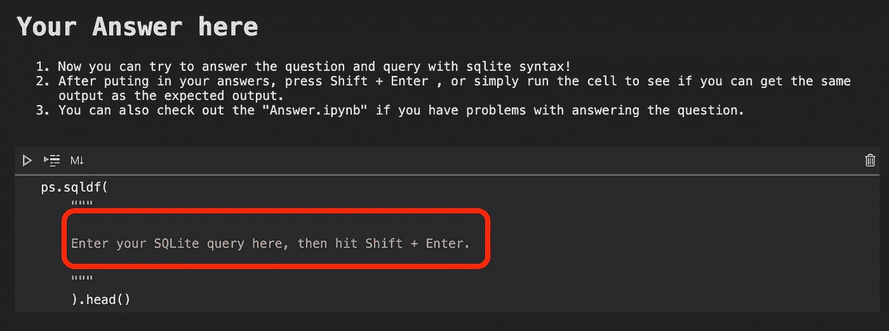

# 带数据集和答案的免费 SQL 练习(真实面试问题)——sales force(中等难度)第 1 部分

> 原文：<https://medium.com/analytics-vidhya/free-sql-exercise-real-interview-questions-with-data-set-and-answer-salesforce-medium-a3bd3f853808?source=collection_archive---------3----------------------->

Bram Van Oost 在 [Unsplash](https://unsplash.com/s/photos/tesla?utm_source=unsplash&utm_medium=referral&utm_content=creditCopyText) 上拍摄的照片

根据 techrepubic.com 的调查，数据科学职位的招聘信息中被提及最多的前三项技能是:

1.  Python (72%)
2.  2.R (64%)
3.  3.SQL (51%)

Python 肯定是不可或缺的，而 SQL 技能排在第三位。作为一名数据分析师，我无法想象没有 python 和 SQL 的日子。

因此，练习并掌握 SQL 永远不会有坏处；事实上，几乎所有的数据分析师面试都需要它。(所以，我们的练习题不仅仅是普通的 SQL 题，是我在网上搜集的真实世界的 SQL 面试题。这样就不用把宝贵的时间浪费在无意义的练习上了。)然而，当您自己的公司没有使用任何 SQL server 时，找到免费的 SQL 数据库进行练习总是一个问题。

如果你是他们中的一员，无论什么原因，你只是想多练习，还不准备付钱，你来对地方了。因为我要为 SQL 学习者和正在准备工作面试的数据科学求职者写一系列文章。在这些文章中，我将包括我从互联网上收集的 SQL 面试问题，并将提供数据集，当然还有我对该特定问题的答案。

**如何使用这个练习**

但是，我没有为连接提供任何远程 SQL server。相反，我将把所需的数据集放在一个 excel 文件中，我们通过 Python 和 Pandasql 库来练习我们的 SQL 查询。我将把所有需要的 python 语法放在一个 Jupyter 笔记本文件中，你所要做的就是在每篇文章中下载我的 Jupyter 笔记本，并把你的 SQL 查询放在三重引号之间！

您需要:

1.下载 zip 文件(包括数据文件和 ipynb 文件)。)

2.解压并运行 Question.ipynb 文件(如果你不知道如何运行，点击这个[链接](https://www.dataquest.io/blog/jupyter-notebook-tutorial/)

3.对每个单元格按“Shift + Enter ”,直到您看到“您的答案在此”会话。将您的 SQL 查询答案放在这里。

4.再次按“Shift + Enter”检查您的答案。

5.如果您不知道如何输出类似预期的输出，请运行 Answer.ipynb。

就是这样，你不需要担心任何 python 语法，我已经帮你搞定了！

上次我分享了 Salesforce 的两个更简单的面试问题。如果你还没有尝试过它们，你可以在这里得到 [**带数据集和答案的免费 SQL 练习(真题面试题)—sales force(Easy)Part 1**](https://lorenzoyeung-io.medium.com/free-sql-exercise-real-interview-questions-with-data-set-and-answer-salesforce-easy-part-1-806a2322c6b5)**，以及** [**带数据集和答案的免费 SQL 练习(真题面试题)—sales force(Easy)Part 2**](https://lorenzoyeung-io.medium.com/free-sql-exercise-real-interview-questions-with-data-set-and-answer-salesforce-easy-part-2-dc3a763ec879)**。**在本文中，我将与您分享另外 2 个 SQL 真实生活面试问题。这是中等难度，希望你会因此而兴奋！记住，熟能生巧。我们做得越多，我们就越熟练。

# **问题 1:**

*难度:中等*

**每年的新车型**

下面是各公司 2019 年和 2020 年的新产品表。输出公司名称，以及每家公司 2020 年新产品比上年的净额。

点击此处下载[数据文件，点击此处](https://positivehk.com/wp-content/uploads/2021/05/Salesforce-Medium-01.zip)下载 Python Jupyter 笔记本文件和解决方案。

小贴士:

1.一年的产品总数减去上一年的产品总数的差额就是净额。

2.你可能想你的情况下，当功能。

# **问题 2:**

*难度:中等*

**找出经理 1 下目标最高的员工**

找到目标数最高的员工，他们也在经理 id 1 下工作。输出他的名，姓，和他达到的目标。

点击这里下载[数据文件，这里下载 Python Jupyter 笔记本文件和解决方案](https://positivehk.com/wp-content/uploads/2021/05/Salesforce-Medium-02.zip)

小贴士:

1.您可能需要使用 MAX()函数。

2.并且您将希望使用 WHERE manager_id=1

我希望你喜欢免费的 SQL 练习。如果您对这些问题有任何其他答案，请张贴在评论区，以便其他学习者可以受益于更多的替代答案。

你可能也会对这篇文章感兴趣:[基础营销分析](https://towardsdatascience.com/fundamental-marketing-analytics-f875018391d5?source=your_stories_page-------------------------------------)和熊猫[数据争论备忘单](https://towardsdatascience.com/pandas-data-wrangling-cheat-sheet-2021-cf70f577bcdd)

非常感谢您阅读我的文章，我一直在为数字营销、数据分析、分析和 Python 写作。请点击下面的链接来看看。

【https://elartedm.com/marketing-blog/】数字营销 : [数字营销](https://elartedm.com/marketing-blog/)

[另一个数字营销和机器学习](https://positivehk.com/category/%E5%B0%88%E6%AC%84/digital-marketing-blog/):[https://positivehk.com/category/%E5%B...](https://positivehk.com/category/%E5%B0%88%E6%AC%84/digital-marketing-blog/)

数据科学:[https://lorenzoyeung-io.medium.com/](https://lorenzoyeung-io.medium.com/)