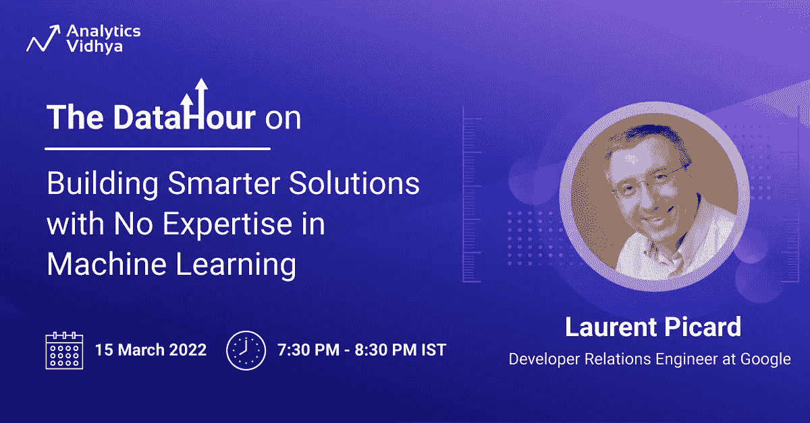

# 免费网络研讨会:无需 ML 专业知识即可构建更智能的解决方案

> 原文：<https://medium.com/analytics-vidhya/free-webinar-building-smarter-solutions-with-no-expertise-in-ml-8d190e194c0a?source=collection_archive---------0----------------------->

ML？API？AutoML？我们能在几个小时或几天内建造什么？没有任何专业知识？

在这个免费的数据小时中，我们来看看谷歌开发者关系工程师**劳伦特·皮卡德**的**如何在没有机器学习专业知识的情况下构建更智能的解决方案**

🗓️: 2022 年 3 月 15 日星期二

🕓:IST 晚上 7:30—8:30

在这个现场演示会议中，Laurent 将演示如何从现有的机器学习模型中受益，以及如何使用 AutoML 技术创建自定义模型。你也将是现场演示的活跃玩家，所以不要把你的智能手机调成飞行模式！

快一点！

现在免费注册👇

[**在这里注册！**](https://datahack.analyticsvidhya.com/contest/datahour-building-smarter-solutions-with-no-expert/?utm_source=medium&utm_medium=newsletter)