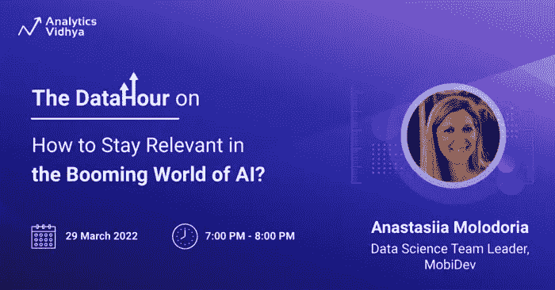
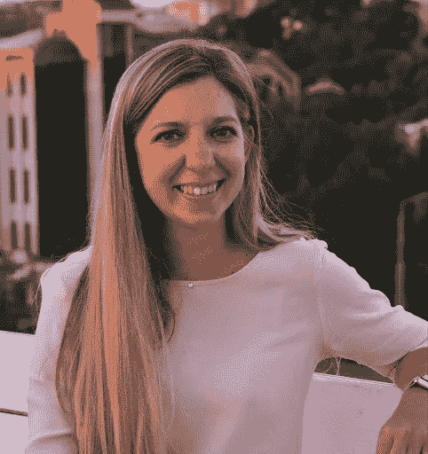

# [免费网络研讨会]如何在蓬勃发展的人工智能世界中保持相关性？

> 原文：<https://medium.com/analytics-vidhya/free-webinar-how-to-stay-relevant-in-the-booming-world-of-ai-4b39db9b0180?source=collection_archive---------0----------------------->

## 标记您的日历！

亲爱的读者们:

我们很高兴为您带来另一场激动人心的网络研讨会！是的，你没听错！

> *如今 AI 蓬勃发展的是什么？你应该学会什么才能走在潮流的前面？*

加入 MobiDev 数据科学团队负责人 Anastasiia Molodoria 的 Datahour，获得这些问题的答案！

> [***现在免费注册***](https://datahack.analyticsvidhya.com/contest/datahour-what-is-booming-today-in-ai-and-how-to-be/?utm_source=medium&utm_medium=newsletter&utm_campaign=datahour) ***！***

# 关于网上研讨会

在本次网络研讨会中，您将熟悉最受欢迎的人工智能方向，并了解从哪里开始才能在这些领域成功工作。

Anastasiia 将涵盖商业用例，以更深入地了解人工智能集成在解决现实世界问题方面的价值。此外，您还将深入了解成功交付 ML 产品应采取的主要步骤。以及当你事先不知道你的 ML 研究的确切产出时，如何向企业提供正确的期望。

**先决条件:**学习的热情和对数据科学的一些基本了解！

# 本次网络研讨会面向谁？

*   希望在数据科学领域建立职业生涯的学生和新生
*   希望转向数据科学职业的工作专业人士
*   希望加快职业发展的数据科学专业人士

# 了解演讲者！

**Anastasia molo doria |数据科学团队负责人 MobiDev**

Anastasiia Molodoria 在预测建模、NLP(自然语言处理)、数据处理和深度学习方面拥有强大的数学背景和经验。她成功地为零售商和产品技术公司集成了 ML、DL 和 NLP 解决方案，考虑日常任务的优化和自动化以及提高业务效率。目前，她在 MobiDev 担任数据科学团队负责人。

# 结束注释

我们希望您对参加本次网络研讨会感到兴奋。Anastasiia 将从她职业生涯的整体学习中为我们提供人工智能的全球视角。

通过 [**在此**](https://datahack.analyticsvidhya.com/contest/datahour-what-is-booming-today-in-ai-and-how-to-be/?utm_source=medium&utm_medium=newsletter&utm_campaign=datahour) 注册，抓住这个绝佳的机会，那也是免费的！

如果你错过了我们之前举办的数据小时会议，去我们的 [YouTube 频道](https://www.youtube.com/playlist?list=PLdKd-j64gDcDv3qhAveXqBQQKbDktkfRX)看看录像。

如果您希望举办网上研讨会或在注册时遇到困难，请通过 editor@analyticsvidhya.com 与我们联系