# 从狗到分类器

> 原文：<https://medium.com/analytics-vidhya/from-dogs-to-classifiers-2baf495e6a27?source=collection_archive---------21----------------------->

将复杂性分解成 corgi 步骤

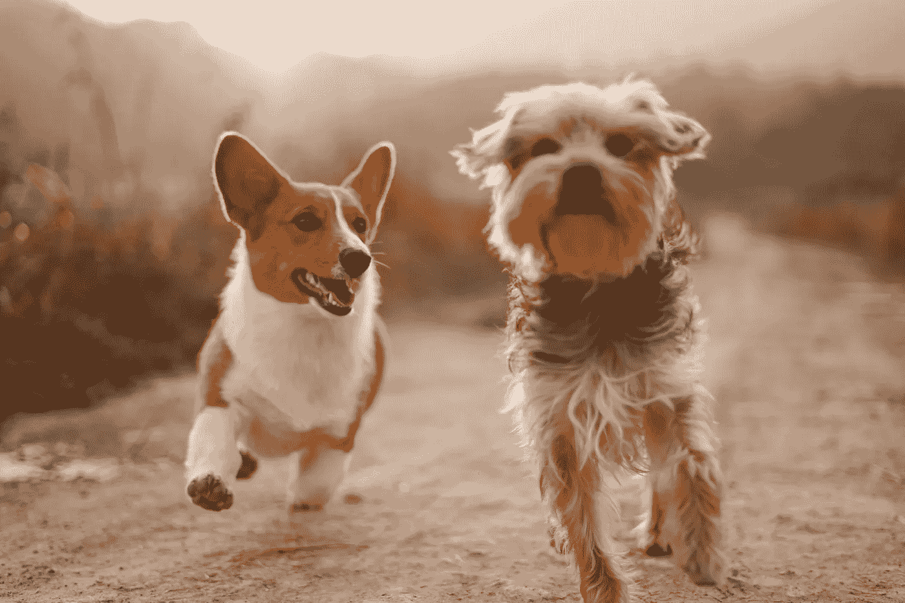

照片由[https://unsplash.com/@alvannee](https://unsplash.com/@alvannee)拍摄

有时候，你不必选择快乐而不是效率，在那些罕见的时刻，你会全力以赴。需要准备一个使用神经网络的顶点项目，但仍然以获得乐趣为目标？小狗来救援了！

**问题陈述**

所以首先要做的是。这个项目的目的是使用卷积神经网络(CNN)来帮助预测狗的品种。你可能会说品种不重要，重要的是蓬松度。事实上，出于许多原因，狗的品种识别被认为是必不可少的，特别是为了了解单个品种的状况、健康问题、互动行为等等。如果我创建的模型证明是成功的，它可以用于减少对大量未标记的狗图像数据进行分类所需的人工工作量。

好消息是，有了当代的机器学习框架，如 TensorFlow 和用于图像识别的预训练模型，这项任务可以相当准确地完成，而无需花费太多精力和时间及资源。不过那都是理论，还是看看实践中如何吧！

**解决问题的策略**

我决定建立一个可以在 web/app 中使用的管道来处理用户拍摄的真实图像。该模型接受任何用户提供的图像作为输入。如果在图像中检测到狗，它将估计狗的品种。另一方面，如果检测到人类，它将提供一个相似的狗品种…哦，这是个阴谋！(你可以从下面判断，结果可能会变得真的令人不安，所以我正式将这个项目标记为 PG-13。)

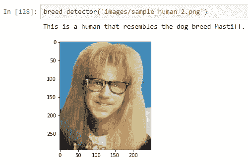

作者图片

**指标**

我的旅程始于从零开始建立 CNN，其结果是准确率低于 4%。尽管结果并不令人满意，但考虑到模型过于简单，这是可以预料的。然而，需要注意的是，准确性不是一个人在训练模型时应该关注的通用指标:虽然它可能对某些目的很有用，但对其他目的来说，可能最好使用 precision、recall 或 F1。我之所以决定使用准确度，是因为狗品种数据集的类别相对平衡，因此一个简单的准确度分数似乎就足够了。

**数据探索和可视化**

Udacity 给我提供了几个数据集:一个是狗的，另一个是人类的。

人类数据集由 13，233 张人脸图像组成，我用 OpenCV 算法检测了这些图像， [Haar 基于特征的级联分类器。](https://docs.opencv.org/master/db/d28/tutorial_cascade_classifier.html)

狗数据集由 133 个狗品种类别和 8，351 幅图像组成，其中 6，680 幅图像用于训练，835 幅用于验证，836 幅用于测试。整个小狗数据集被用来训练我的 CNN 模型。

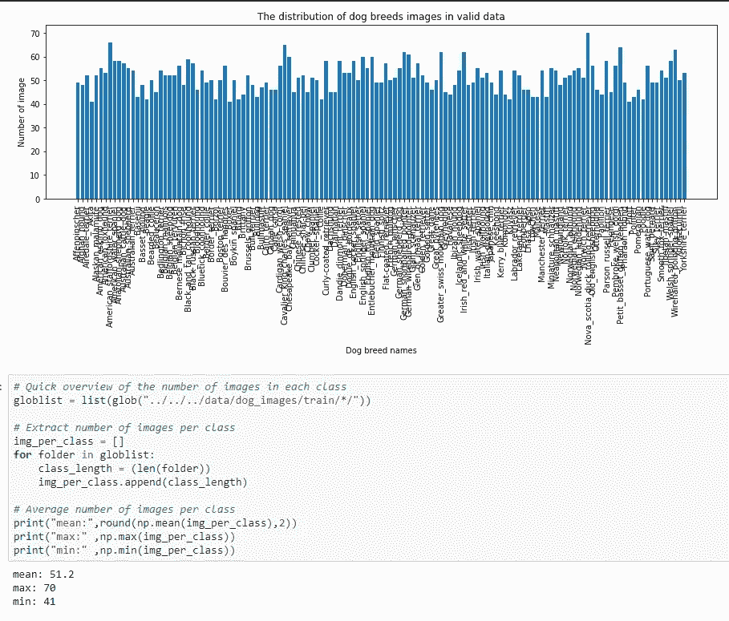

作者图片

正如你从上面看到的，每个品种的狗平均有 50 张图片，最少的是 41 张，最多的是 70 张。虽然我以前提到过代表性相当平衡，但现在你们自己可以看到这一点。

**数据预处理**

*人类图像:*在应用任何人脸检测算法之前，将图像转换成灰度是标准做法。因此，我使用了 detectMultiScale(gray)函数，该函数执行存储在 face_cascade 中的 Haar cascade 分类器，并将灰度图像作为参数。

*狗图片:*这些图片有不同的大小和尺寸，所以作为预处理步骤的一部分，我必须将所有图片缩小到 224 x 224 像素，以适应我的网络架构。然后，图像被转换为 4D 张量，应用预处理 _ 输入来为 Keras 中的任何预训练模型准备好 4D 张量。

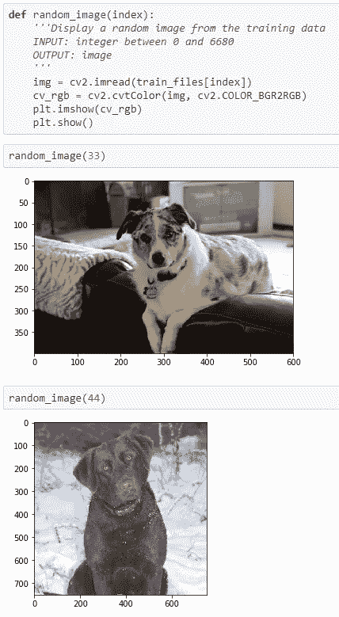

作者图片

**实现&建模**

我使用了以下能够提供最佳结果的架构:

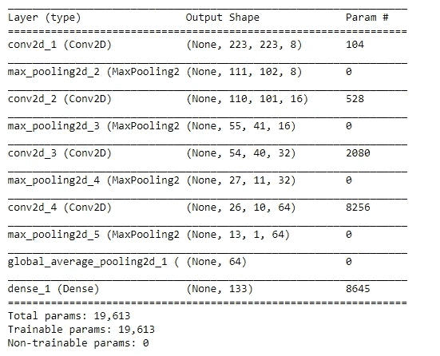

作者图片

*   我定义了**四个递增大小的卷积滤波器**(从 8 到 16 到 32 到 64)。
*   我使用 2 的**步幅，因为它跑得比 1**快得多(1**跑得慢且不准确)。**
*   我选择了 **GlobalAveragePooling** ,因为它是 CNN 中推荐的，以减少空间维度用于分类目的。
*   我选择了 **5 个时期**，因为这是达到> 1%精度所需要的全部时间。
*   我使用了 **MaxPooling** 层来减少 CNN 层输入图像的尺寸，这也应该抵消了过度拟合的危险。

我试着在没有池层的情况下运行 CNN，但是它运行得很慢，准确性也很低。这是因为池通常用于降维。在这里使用是安全的，因为相邻像素很可能是相似的，下采样不会降低分类器检测图像的能力。

**细化&超参数调谐**

CNN 的第一版远非史诗。它的准确率低于 4%！但是让我们保持乐观:它仍然比随机的要好，但是是的，还有很大的改进空间。首先，我尝试使用 VGG16 模型，它返回了 39%的准确率。然后我换了一个不同的预训练模型，Inception V3。这就是事情变得有趣的地方…

首先，我从 Inception V3 中获得了瓶颈特性，然后为它构建了一个架构。它在使用全局平均池时表现最佳，因为该方法减少了每个特征图的维度，同时保留了最重要的信息，这使得它成为一种高效而整洁的架构。我确保添加一个下降层，这将减少过度拟合。模型的最后一层用于预测狗的品种类别。

**模型评估和验证**

回到简单的 OpenCV 人脸检测器，它的表现相当好:它能够识别所有人的 100%；然而，它也确定了 11%的狗是人类…

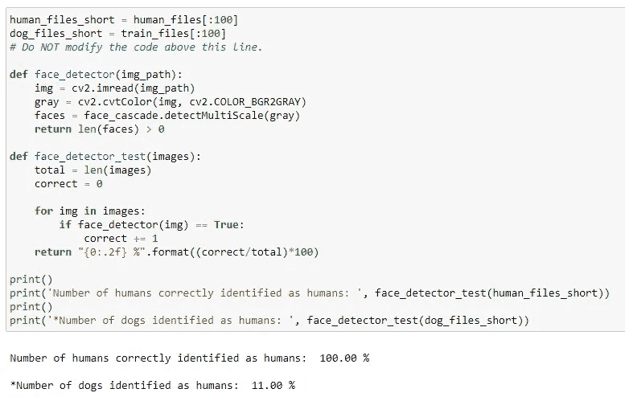

作者图片

另一方面，狗检测器能够确认所有狗 100%是狗。

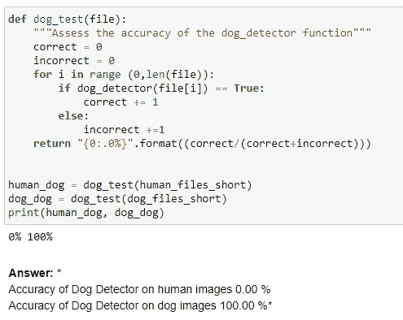

作者图片

使用犬种分类模型，训练准确度(在 50 个时期之后)达到 95%以上，而验证准确度低得多(85%)。此外，测试精度仅达到 80%，表明该模型不幸地过度拟合。这可能是因为我们仍然使用非常小的数据集，只有 133 个类别和 6，680 幅训练图像。但是，嘿，情况可能会更糟！

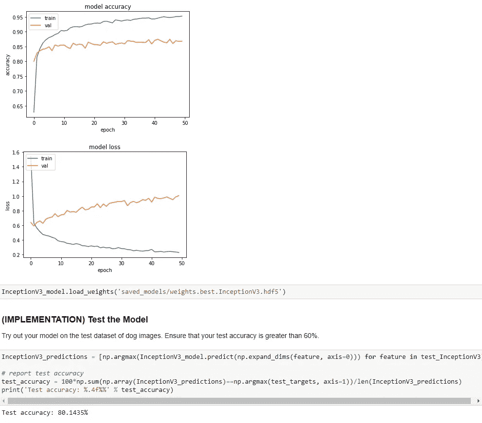

作者图片

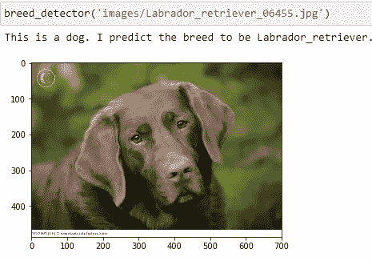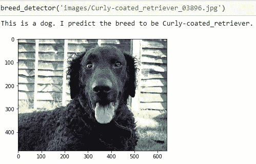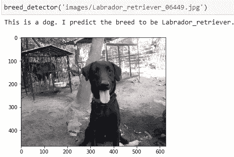

作者图片

**结论**

我从一个准确率只有 3.7%的 CNN 模型开始，使用迁移学习训练了两个准确率分别为 39% (VGG-16)和 80% (Inception-V3)的模型。我发现具有挑战性的是选择正确的模型以及漫长的训练时间。另一方面，我发现有趣的是，当提供一个人的图像时，模型识别出一个相似的狗品种。除了我们自己的巨蟒先生，还有谁会给我看一张人类的照片并声称它像一只獒犬？

**改进**

我的模型表现如预期:很好，但不完美。该算法仍然可以改进:人们可能会改变超参数，增加训练数据集，并使用会引入图像变化的数据增强技术，因此该模型可以更好地概括其学习，并进一步提高准确性。

**资源**

Udacity 提供了数据集，因此不需要外部资源。实际完成的工作可以在我的 Git 上找到。