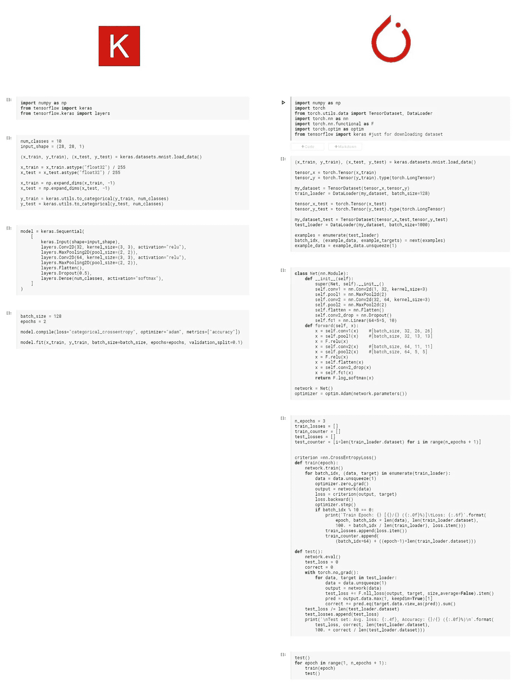

# 从喀拉斯到皮托尔彻

> 原文：<https://medium.com/analytics-vidhya/from-keras-to-pytorch-722fa3b65cce?source=collection_archive---------6----------------------->

所以。出于某种原因，您必须将您的完美的 Keras 模型转换为 PyTorch。也许你想尝试一个新的框架，也许这是一份工作的要求(因为 Keras 在大多数招聘信息中已经失宠)，也许这实际上是你现在的工作任务。

当我有同样的目标时，我读过几本 PyTorch 指南，但它们看起来都有点复杂，我看不出 PyTorch 和 Keras 代码之间有什么相似之处:



两个框架中的简单 CNN。

这里没有简单的一行程序和常见的`.fit`和`.predict`方法，而是有几个非常冗长的循环。同样，在 PyTorch 中，你*继承自类*。如果你主要在 Jupyter 笔记本上工作，你很可能不知道那是什么意思，因为通常它不是必要的。

我花了相当多的时间试图破译 PyTorch 发生了什么，通过这篇文章，我想帮助其他人跳过这一阶段。请注意，我不会深究*为什么*有些事情是这样做的，而另一些不是。相反，我专注于用最少的努力编写工作代码的过程。记住这一点，我将向您展示如何用 PyTorch 重写 Keras 代码。一旦你有了一个非常基本的工作模型，你就可以堆叠更多的层，添加扩展等等。但是现在，让我们让它工作。

对于这项任务，我们将使用 MNIST 数据集和来自 [Keras MNIST 示例](https://keras.io/examples/vision/mnist_convnet/)的代码。就像那个例子一样，我们将经历编写 ML 代码的一般步骤:

*   进口
*   数据加载和准备
*   模型描述
*   模型训练和评估

对于每一步，我将向您展示相应的 PyTorch 代码，并解释其中一些复杂的部分。

# 进口

Keras:

PyTorch:

到目前为止没什么令人惊讶的。

# 数据加载和准备

Keras:

PyTorch:

我们已经从 Keras 加载了相同的 MNIST 数据集，然后将其转换为张量。张量是 PyTorch 数据结构，你可以把它们想象成稍微复杂一点的 n 数组。然后我们将它们转换成 TensorDataset，并定义了一个数据加载器。Dataloader 是一个特殊的对象，它帮助将数据以块的形式输入到模型中。实际上，当整个数据集不适合我们的 RAM 时，这是很有用的。

`.type(torch.LongTensor)`将我们的地面真实答案转换为浮点型，因为默认情况下，Torch 在看到整数类型时会惊慌失措。

通过`example_data.unsqueeze(1)`，我们为数据增加了一个额外的维度。之前，我们有一个 28x28 图像的数组([128，28，28])，现在我们有一个*单通道*图像的数组([128，1，28，28])。

# 模型描述

Keras:

PyTorch:

这是两个框架之间的第一个大区别——模型架构被分成两部分。首先，我们定义了层，然后定义了路径，我们的数据必须在训练过程中进行。这背后的逻辑是[一些层是可训练的(它们存储权重)，而 forward 方法中的层只是修改张量](https://stackoverflow.com/questions/59642925/pytorch-can-we-use-nn-module-layers-directly-in-forward-function)。

您也可以在这里使用`nn.Sequential`，并以 Keras 方式定义您的模型(conv2d 和 relu 都作为层)，但是您会更经常地遇到用`nn.Module`定义的网络。[更多关于那个](https://discuss.pytorch.org/t/when-should-i-use-nn-modulelist-and-when-should-i-use-nn-sequential/5463/2)。

另一件事是 PyTorch 更希望你计算张量维度，这些维度有很多不匹配的方式。我使用这些工具来帮助我:

`print(network)` —将非常基本的内容打印到 about in_channels 中。

```
network = Net()
print(network)
>>>
Net(
  (conv1): Conv2d(1, 32, kernel_size=(3, 3), stride=(1, 1))
  (pool1): MaxPool2d(kernel_size=2, stride=2, padding=0, dilation=1, ceil_mode=False)
  (conv2): Conv2d(32, 64, kernel_size=(3, 3), stride=(1, 1))
  (pool2): MaxPool2d(kernel_size=2, stride=2, padding=0, dilation=1, ceil_mode=False)
  (flatten): Flatten(start_dim=1, end_dim=-1)
  (conv2_drop): Dropout(p=0.5, inplace=False)
  (fc1): Linear(in_features=1600, out_features=10, bias=True)
)
```

`torchsummaty.summary(network)` —打印更详细的描述，类似于 Keras 的`model.summary()`命令。

```
from torchsummary import summary
...
network = Net()
summary(network, (1, 28, 28))
>>>
----------------------------------------------------------------
        Layer (type)               Output Shape         Param #
================================================================
            Conv2d-1           [-1, 32, 26, 26]             320
         MaxPool2d-2           [-1, 32, 13, 13]               0
            Conv2d-3           [-1, 64, 11, 11]          18,496
         MaxPool2d-4             [-1, 64, 5, 5]               0
           Flatten-5                 [-1, 1600]               0
           Dropout-6                 [-1, 1600]               0
            Linear-7                   [-1, 10]          16,010
================================================================
```

`print(x.shape)` —追踪张量形状的最简单工具。

```
def forward(self, x):
    x = self.conv1(x)
    print(x.shape)
>>>
torch.Size([2, 32, 26, 26])
```

# 模型训练和评估

在 Keras 中，整个训练过程只需调用一个`.fit`方法即可完成:

然而，在 PyTorch 中，您需要手动编写整个训练和测试循环。无需深究太多理论，伪代码中的神经网络训练循环如下所示:

```
for every epoch:
    for every batch:
        load data;
        pass data through network;
        calculate losses;
        calculate gradients;
        adjust network weights through backpropagation.
```

此时，您可能想知道:


不幸的是，是的。

在 PyTorch 中是这样的:

这个过程非常简单，虽然有些冗长，但是有两点我想详细说明一下:

*   `network.train()`和`network.eval()`就是这样做的——它们为我们的模型打开训练或评估模式。例如，丢弃层在评估期间没有意义，因此在评估模式中关闭[。](https://discuss.pytorch.org/t/model-eval-vs-with-torch-no-grad/19615)
*   `optimizer.zero_grad()`在开始反向传播之前，将梯度设置为零。我们需要这样做，因为 PyTorch 在随后的反向过程中累积梯度，当您开始训练循环时，您应该将梯度归零，以便您[正确地进行参数更新](https://stackoverflow.com/questions/48001598/why-do-we-need-to-call-zero-grad-in-pytorch)。

我们的 PyTorch 之旅到此结束。现在我们有了一个可以工作的 MNIST 模型，从这里开始，你有希望为你的特定任务修改这个代码时会有更少的问题。

如果你有额外的问题，评论，或者只是想分享一些东西——请在这里随意评论，或者在 [twitter](https://twitter.com/soo_underground) 或 [telegram](https://t.me/soo_underground) 上给我发消息。

有用的链接:

*   [喀拉斯 MNIST 的例子](https://keras.io/examples/vision/mnist_convnet/)。
*   [PyTorch CIFAR-10 示例](https://pytorch.org/tutorials/beginner/blitz/cifar10_tutorial.html)。
*   [类似 PyTorch 的闪电文章](https://towardsdatascience.com/converting-from-keras-to-pytorch-lightning-be40326d7b7d)。