# 从一级防范到夏令时:多伦多电力需求数据中隐藏的洞见

> 原文：<https://medium.com/analytics-vidhya/from-lockdown-to-daylight-savings-hidden-insights-from-electricity-demand-data-in-toronto-eff585aada66?source=collection_archive---------13----------------------->

多伦多电力需求的详细分析

图 1:多伦多美丽的地平线

多伦多是安大略省的首府，也是北美第四大人口城市，拥有超过 260 万人口和 5000 个制造业。自然，电力需求很高，其中 95%以上来自零碳排放源[ [cer-rec](https://www.cer-rec.gc.ca/en/data-analysis/energy-markets/provincial-territorial-energy-profiles/provincial-territorial-energy-profiles-ontario.html) ]。在本文中，我们将主要关注影响多伦多电力需求的各种因素。

在此分析中，我们重点关注 2017 年 1 月 1 日至 2021 年 1 月 18 日的每小时温度和需求数据。这相当于 35，496 个数据点。

## 每小时温度数据(°C)

让我们先来看看温度曲线，因为理解这一点对电力需求分析至关重要。[气象统计](https://toronto.weatherstats.ca/download.html)维护着一个整洁的每小时温度、压力、相对湿度和其他几个特征的数据库。下图是温度曲线的时间序列图。我们可以立即观察到每年重复的模式；夏季高温，冬季低温，春季和秋季温度适中(也称为肩季)。我们还可以观察到这些年来这种趋势非常微妙的增长。为了更好地理解季节性和当前值对其先前值的依赖性，让我们看看滞后图。

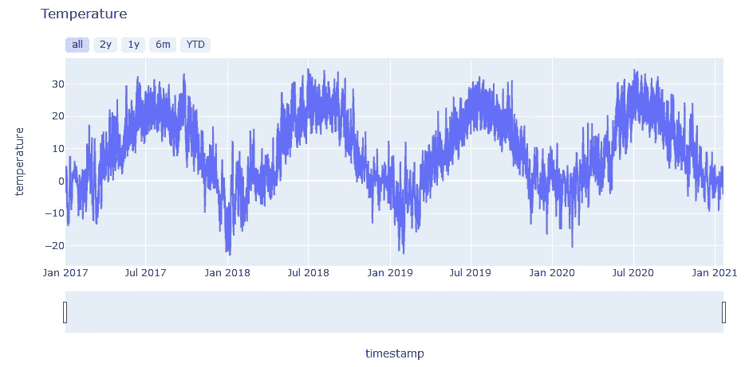

图 2:2017 年至今的逐时气温数据

简单地说，滞后图检查当前值和先前时间步长值之间的关系。滞后一小时的滞后图检查当前值与一小时前值的相关性。

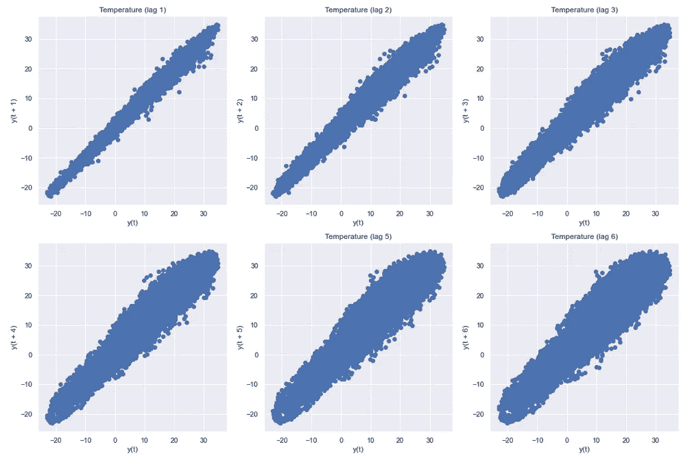

图 3:一至六小时的温度滞后图

一至六小时的滞后图如上所示。对于大约一到三个小时的滞后，可以看到很强的线性关系，并且随着滞后的增加，这种关系慢慢消失。几个值得关注的关键滞后点；(I)每天(24 小时)(ii)每年(365*24 + 6，闰年= 8766 小时)(iii)每半年(4383 小时)和(iv)每季度(~2192 小时)。

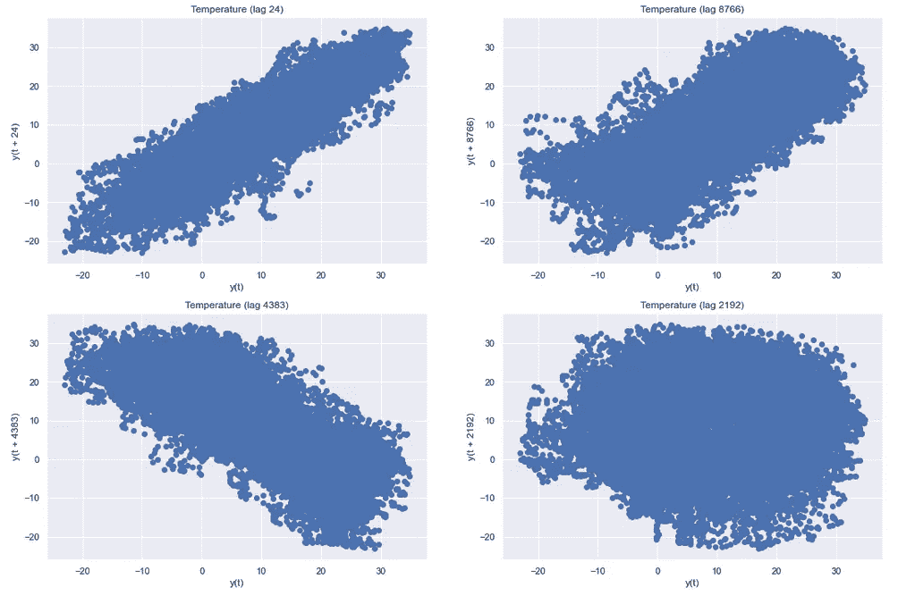

图 4:关键滞后值的温度滞后图

从上面显示的每日和每年的滞后图中，我们可以看到正相关，尽管不是很强。对于半年的滞后，我们可以看到负相关(夏季对冬季)，而对于季度滞后，则没有任何相关性。现在让我们了解电力需求概况。

## 电力需求数据(MWh)

独立电力系统运营商(IESO)是一个非营利组织，负责运营安大略省的电力市场。从 2003 年到现在，每小时的数据都可以在他们的网站上找到。为了进行这种分析，我使用了一个简单的 web 抓取代码来提取最近几年(2017 年至今)的每小时数据，下面以时间序列图的形式呈现。

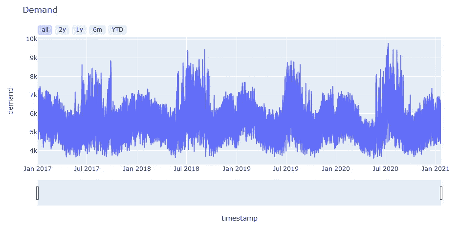

图 5:2017 年至今的每小时电力需求数据

与温度曲线一样，可以观察到每年重复的模式。我们可以注意到一年中有两个高峰，一个在夏季，一个较小的在冬季；需求略有增加(冬季)= >减少(春季)= >增加(夏季)= >减少(秋季)。我们还可以观察到 2020 年春季期间需求的显著下降。是因为正在进行的疫情吗？是因为天气的剧烈变化吗？我们很快就会知道了。

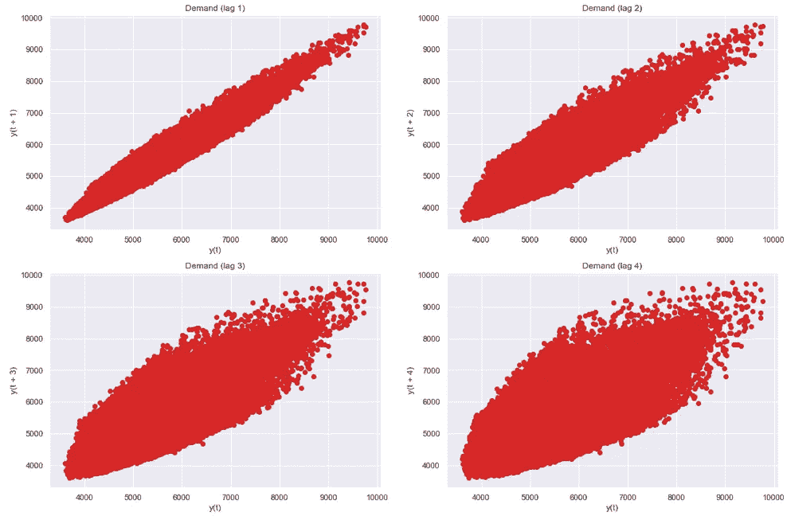

图 6:一至四小时的需求滞后图

一至四小时的滞后图如上所示。对于一个小时的延迟，我们看到一个很强的线性关系，随着延迟的增加，这种关系逐渐消失。与温度不同，即使滞后时间大于 2，需求曲线与其先前值的相关性也要小得多。因此，我们开始意识到一天中的某个时刻对需求曲线的明显影响。

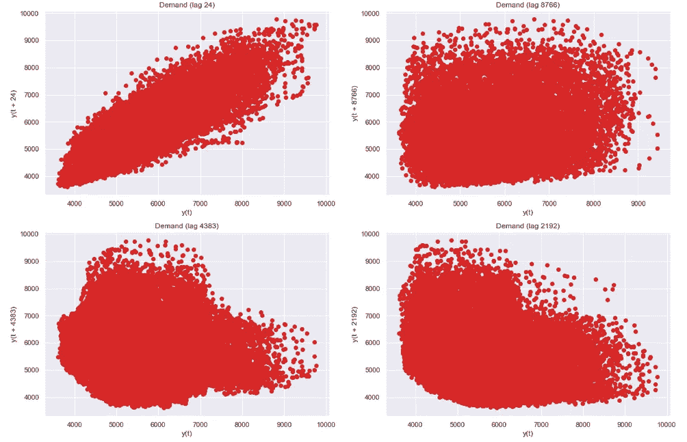

图 7:关键滞后值的需求滞后图

上图显示了前面讨论的关键滞后值的需求曲线的滞后图。我们可以立即识别出 24 小时滞后的正相关性，但是没有观察到其他相关性，甚至没有观察到年度相关性。我们刚才看到需求曲线具有年度季节性。但是滞后曲线却不这么认为。发生什么事了？

我们将闰年的 6 个小时计算在内，计算出一年的小时数为 8766。这是有道理的，因为天气是一种自然现象，取决于地球相对于太阳的位置。然而，每年额外的 6 个小时不会影响电力需求，因为我们只关心一年中的某一天或一周中的某一天。

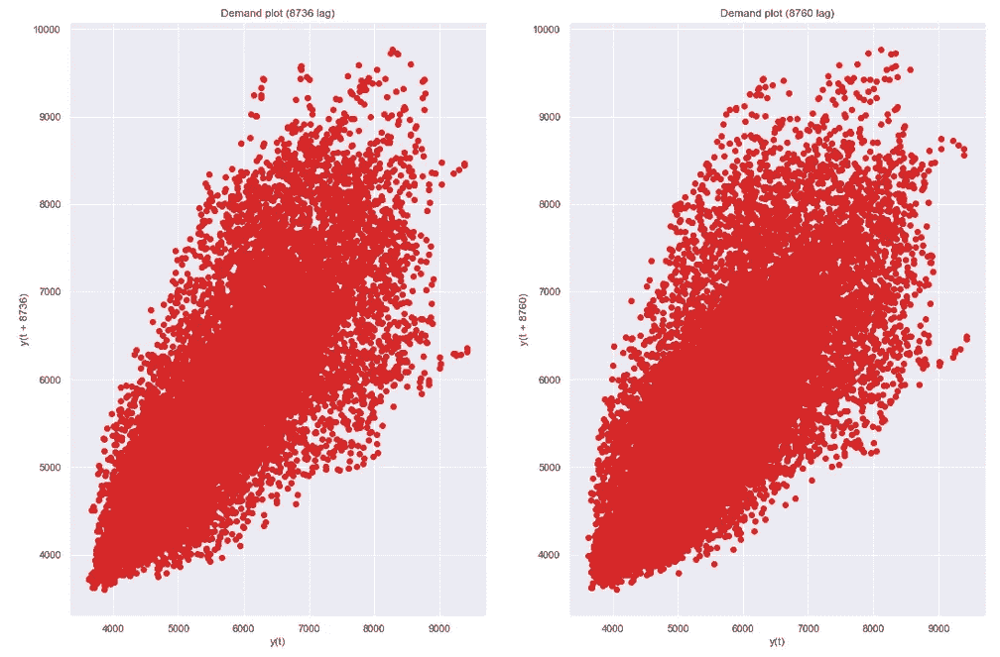

8736 和 8760 滞后的需求图

因此，我们可以将年滞后时间近似为 52*7*24 = 8736 小时，或者精确到一年(365*24 = 8760)，瞧！我们现在可以观察到这两种滞后的需求曲线呈适度正相关。我们将使用 8736 而不是 8760，因为它的相关性更强。

因此，我们发现了影响需求的各种因素——(1)温度，(2)一天中的时间，(3)一周中的日子。现在，我们将对其中的每一项以及其他一些因素进行更详细的分析，这些因素包括(4)新冠肺炎和(5)夏令时

## 影响电力需求的因素

## 一.温度

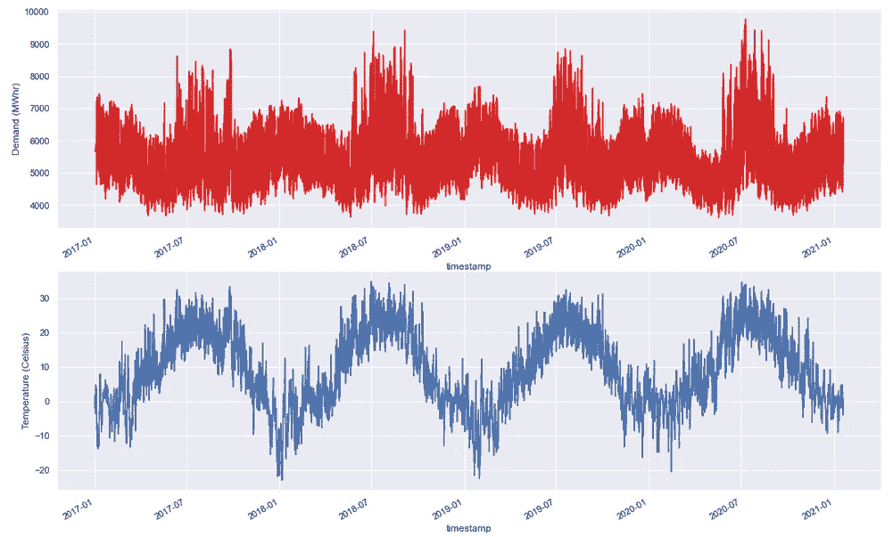

图 9:每小时数据:需求和温度

假设电力需求直接取决于温度是合理的。在夏季的几个月里，空调系统被用来提供冷却，导致更高的电力消耗。然而，在冬季，供暖系统使用天然气锅炉(在多伦多)，而不是电力。因此，夏季的需求量明显高于冬季。我们确实在冬季观察到较小的峰值，这主要是由于使用额外的照明时间和更不常见的电加热器。这种关系如上图所示。

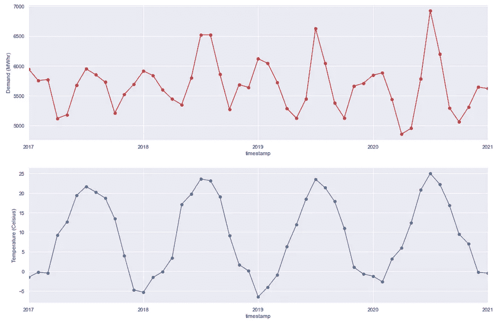

图 10:月平均数据:需求和温度

如上所示，月平均值有助于理解整体趋势。很容易看到需求和温度曲线的相应峰值。我们可以观察到需求曲线中的两个高峰—夏季(7 月)和冬季(1 月/2 月)。2017 年，两个峰值大致相同。这可能是由于相对温暖的夏季(~ 21.5 ℃)和相当寒冷的冬季(~ -5.3 ℃)。此外，2020 年(~ -1.2 ℃)和 2021 年(~ -0.5 ℃)一月份的平均气温比 2019 年(~ -6.5 ℃)和 2018 年(~ -5.3 ℃)高得多。全球变暖是一个严重的问题，人们！

如何衡量需求和温度之间的关系？我们可以看看相关系数，简单来说，它衡量的是线性关系的强度。更接近+1/-1 的值分别表示强正/负线性关系，而更接近 0 的值表示没有线性关系。

虽然温度和需求是相互关联的，但我们可以预计相关系数更接近于零，因为在夏季存在正相关关系(随着温度升高，需求增加)，在冬季存在负相关关系(随着温度降低，需求增加)。因此，我们根据温度将数据分为两类。让我们把任何高于 15 ℃的温度定义为*热*(在加拿大我们喜欢称之为热浪！)而低于 15 ℃的要*不要*。

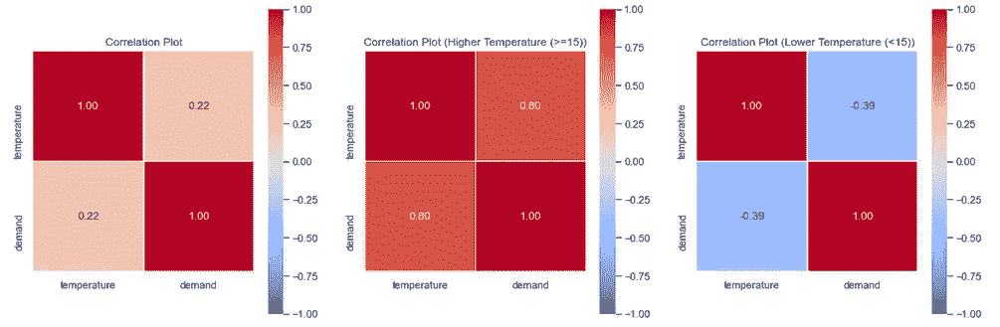

图 11:相关图:温度与需求

正如所料，当使用全部数据时，我们看到一个小值 0.22。对于*热门*类别，我们看到 0.8 的相当强的正相关性和*非热门*类别的-0.39 的小相关性。由于它们的反比关系，它是负的，并且它是非常温和的，因为基于天然气的锅炉提供大部分热量，而不是电力。

## 二。一天中的时间

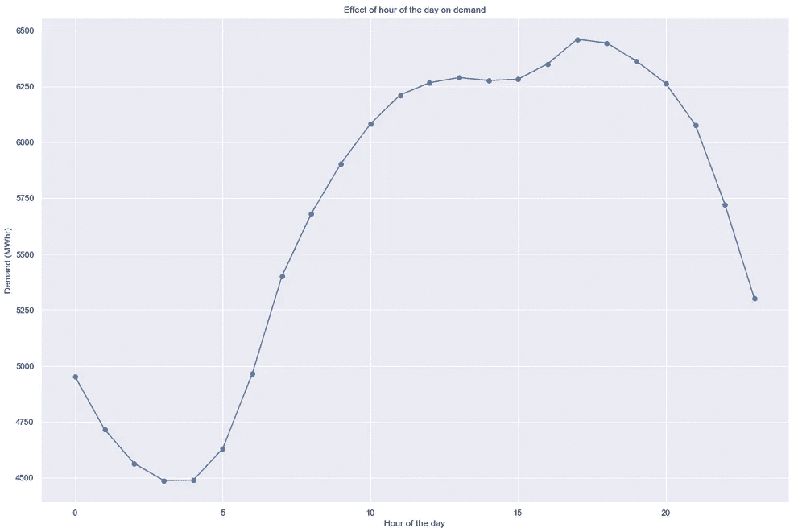

图 12:基于一天中某小时的平均电力需求

上图描绘了基于使用时间的所有 1479 天可用数据的平均电力需求。可以这样解释——我们在清晨开始这个循环，为一天做准备，打开灯、水壶和其他电器。在工作时间，办公室和制造工厂消耗大部分电力。我们大约在下午 5 点到 7 点回家，打开灯(看起来我们人类很喜欢开灯)，电视，烘干机以及其他电器，这是一个典型的高峰期。晚上 8 点以后，商业机构(商场、杂货店、餐馆)开始关门，我们准备睡觉，需求慢慢减少。

因此，很明显，一天中的时间对需求有很大的影响。我们可以使用两个类别——早上 7 点到晚上 10 点的*觉醒时间*,以及晚上剩余时间的*睡眠时间*,而不是使用 24 个类别，每个小时一个类别。

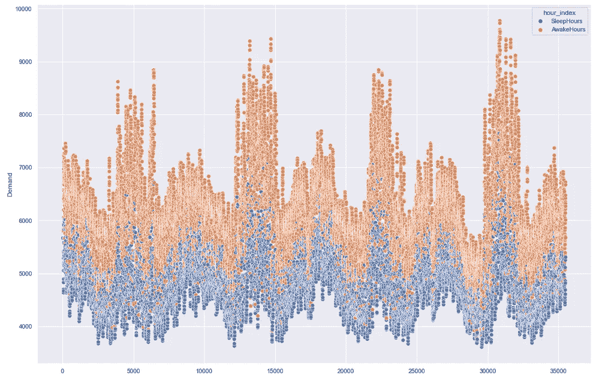

图 13:基于一天中时间的需求数据分割

自然，如上图所示，*醒着的时间*的需求明显高于*睡着的时间*。对*觉醒时间*中需求值较低的点进行分析和聚类将是一项有趣的工作。

## 三。星期几

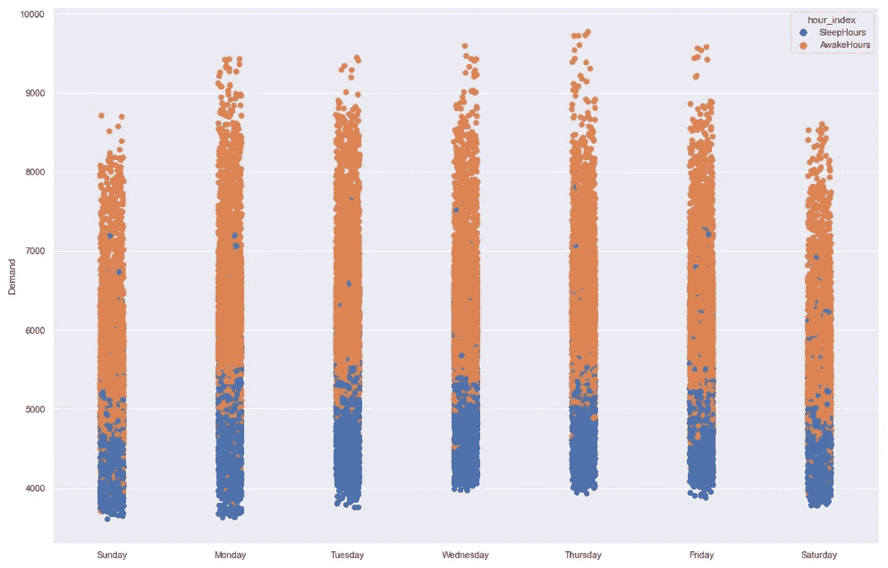

图 14:基于一周中某一天的电力需求

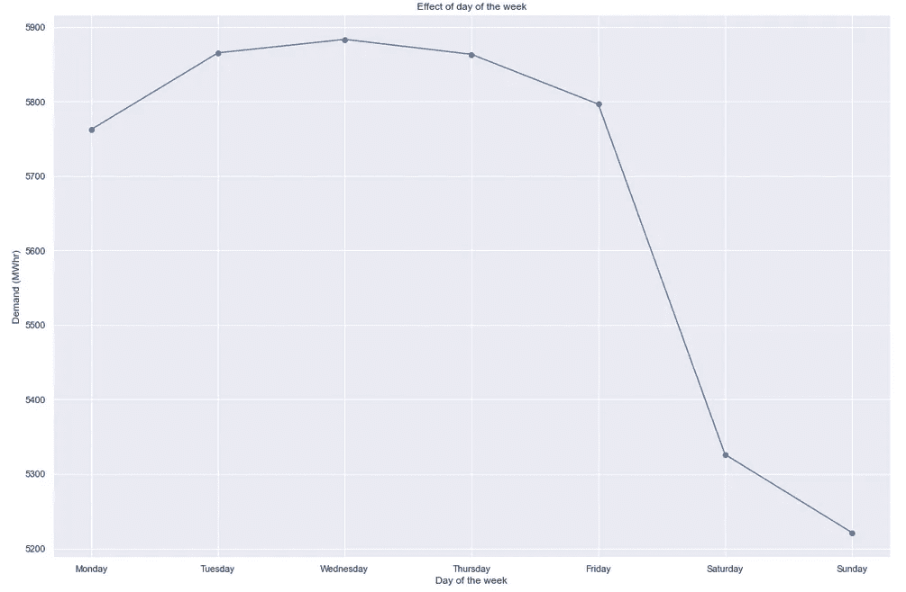

图 15:基于一周中某一天的平均电力需求

可以合理地假设，在周末，我们会看到电力需求大幅下降(办公室、制造厂关闭)。我们也可以在我们的数据中看到这种行为。第一个图显示了根据一周中的某一天划分的所有点，而第二个图显示了平均需求。周末期间的平均需求量要低 10%左右。周二、周三和周四的需求最高，而周日的需求最低。

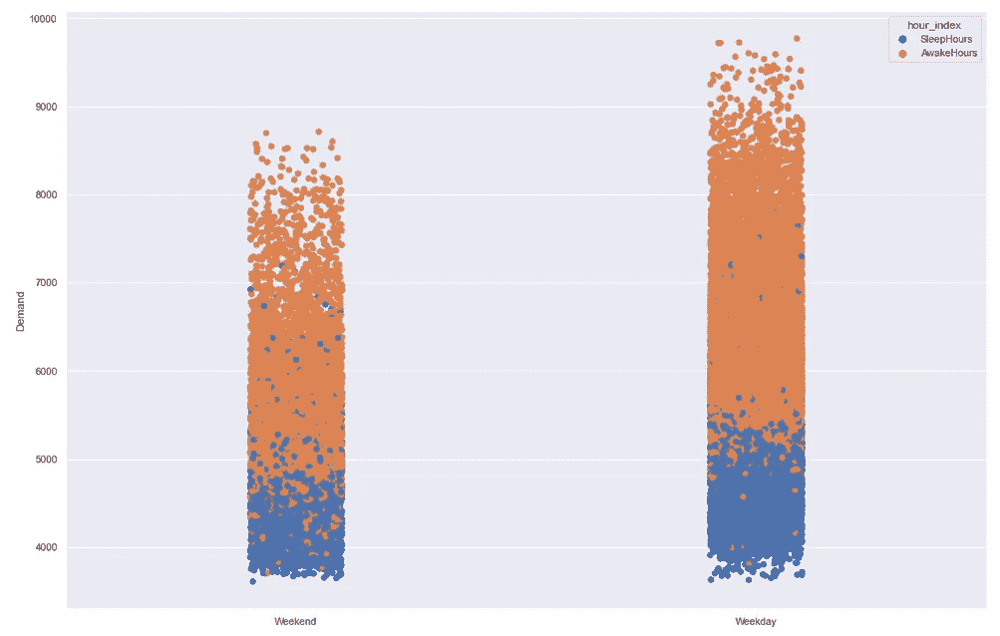

图 16:工作日和周末的需求

由于工作日和周末的需求存在显著差异，我们可以简单地用两个类别进行工作(*工作日*和*周末*)。工作日期间的平均需求约为 5834 兆瓦时，周末期间约为 5274 兆瓦时。这大约是 600 兆瓦时的差异。客观来看，1 MWh 相当于大约 [330 户人家一小时](https://www.cleanenergyauthority.com/solar-energy-resources/what-is-a-megawatt-and-a-megawatt-hour)用的电！

## **四。新冠肺炎的影响**

2020 年遭遇前所未有的全球疫情。世界各国都施加限制来遏制疫情，加拿大也不例外。特别是，安大略省在 3 月 17 日进入紧急状态，处于完全封锁状态。根据此处获得的[信息，我将年份分为几类——(一)2020 年 3 月 17 日至 2020 年 5 月 20 日和 2020 年 12 月 21 日呈现为*全面封锁* n(二)2020 年 5 月 20 日至 2020 年 6 月 24 日为*第一阶段*(三)2020 年 6 月 24 日至 2020 年 8 月 12 日为*第二阶段*(四)8 月 1 日](https://en.wikipedia.org/wiki/COVID-19_pandemic_in_Ontario#Lifting_of_restrictions_after_the_first_wave)

我们现在要检查所施加的限制是否会由于商业、娱乐和社会机构关闭而导致电力需求降低。

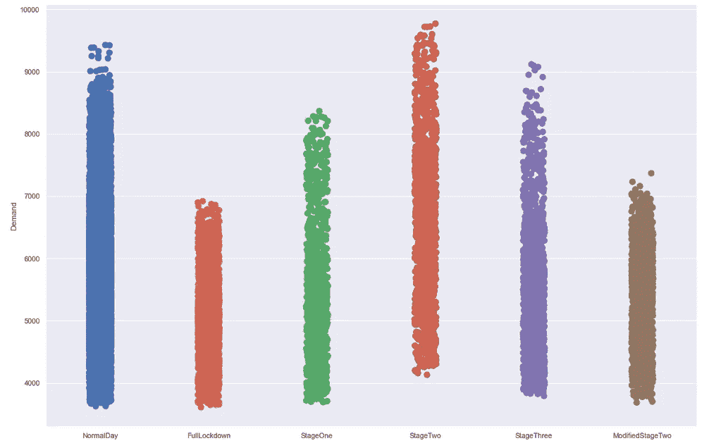

图 17:各种强制限制期间的需求

根据上面的彩色图，很容易得出这样的结论:与正常的*日*相比，在*完全锁定*期间，能源消耗显著减少。平均需求量的这一差异约为 600 MWh。我们还可以注意到，在第二阶段期间，电力需求会更高。有些事情不太对劲。

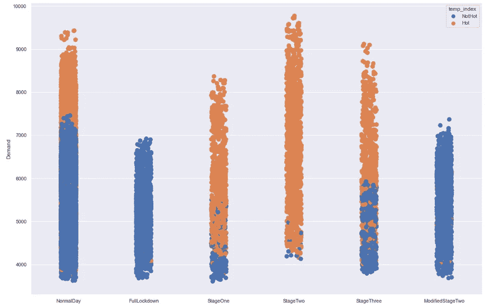

图 18:温度类别下各种强制限制期间的需求

啊，是的。我们忽略了一年中实施这些限制的时间因素。第二阶段中*的大部分点来自*热点*类别，而*完全锁定*的点主要来自*非热点*类别，如上所示。这不是一个公平的比较。第一阶段、第二阶段和第三阶段中的大多数点都出现在夏季(*高温*)，因此自然会有更高的需求值。*

为了更好地捕捉强制限制的效果，我们可以比较前几年同一天不同封锁阶段的需求值。例如，5 月 20 日至 6 月 24 日、2017 年至 2019 年的需求值可视为正常日，2020 年的需求值可视为第*阶段一*。

分别对锁定的所有五个阶段进行分析可能是乏味的，而将它们组合在一起并不能提供任何有意义的见解，如前所述。一个很好的中间立场是根据大多数点是属于*热点*还是*非热点*类别来看两组。根据上图， *FullLockdown* 和 *ModifiedStageTwo* 属于第一组，而 *StageOne* 、 *StageTwo* 、 *StageThree* 属于第二组。

**第一组**

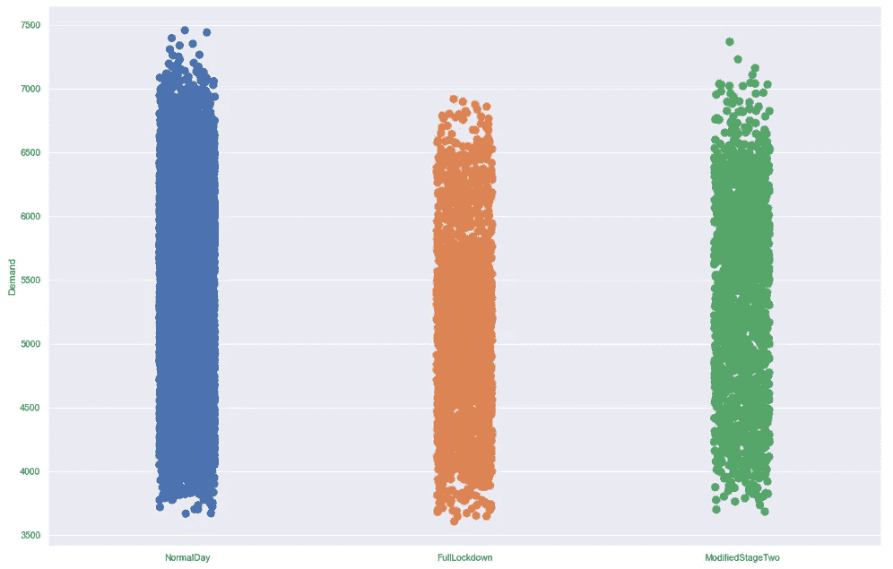

图 19:第一组中各种强制限制期间的需求

该图说明了电力需求的比较。这里的*正常日*是指与*完全锁定*和*修改第二阶段*相同的时间段，但为 2017 年至 2019 年。

*正常日、*全锁闭、*修改二级*的需求平均值分别约为 5430 MWh、5110 MWh 和 5360 MWh。平均气温分别为 4.5 摄氏度、4.2 摄氏度和 5.2 摄氏度。由于*正常日和*完全锁定日之间的温度只有 0.3 ℃的微小差异，大约 300 MWh 的减少可以主要归功于实施的*完全锁定*。此外，*修正第二阶段*期间的平均需求值更接近于*正常日*，这可能是因为对企业和商业运营的限制更加宽松。

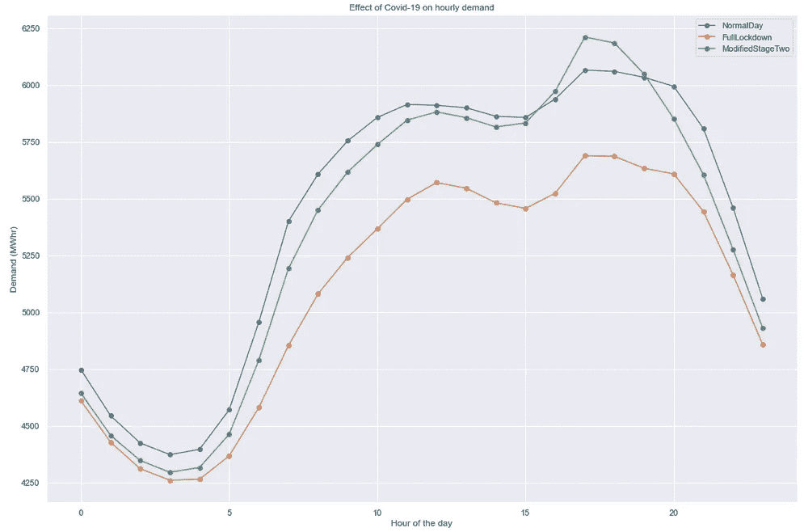

图 20:在第一组中，在各种强加的限制期间，一天中各小时的需求

如上所示，除了在*修改后的第二阶段*中下午 4 点到 5 点之间的急剧上升之外，平均每小时需求曲线的行为大致相同，与施加的限制无关。

此外，星期几的影响如下所示。在*完全锁定*和*修改第二阶段*期间，通常在周三、周四和周五的高峰已经转移到周二和周三。峰值向本周初移动了一天。在*完全锁定*期间，工作日和周末的平均消费差异约为 7%，而在*正常日*和*修改后的第二阶段*的平均消费差异约为 10%。

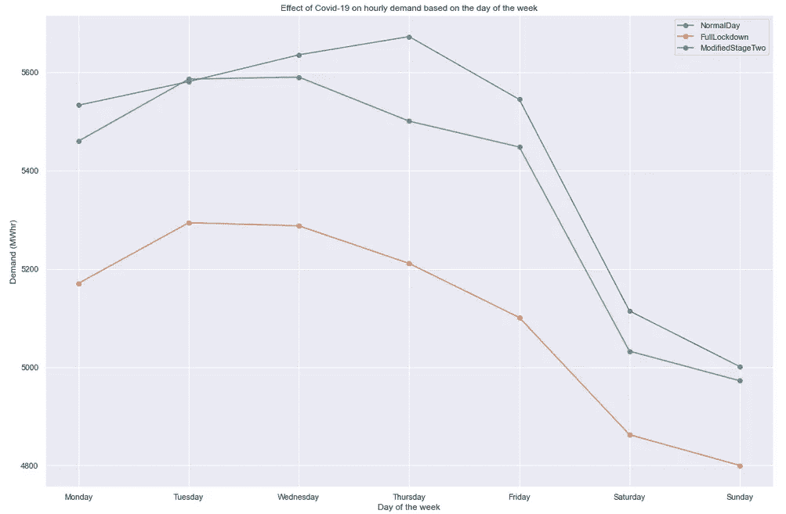

图 21:在第一组中，在各种强加的限制期间，一周中各天的需求

**热点*类别*热点**

也可以对剩余的限制时段进行类似的分析，其中大多数点主要属于*热点*类别。

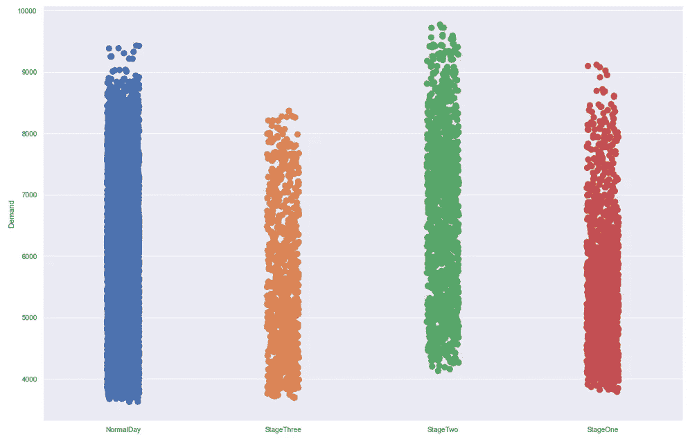

图 22:在*热*组中各种强制限制期间的需求

这里，*第二阶段*对应于平均值约为 6647 MWh 的最高需求值。这是有道理的，因为一年中最热的月份，七月，属于这一类，人们呆在家里的时间更长，导致空调用电量更高。*第一阶段*和*第三阶段*的平均需求大致相同，约为 5550 MWh，而*正常日*的平均需求为 5580 MWh。

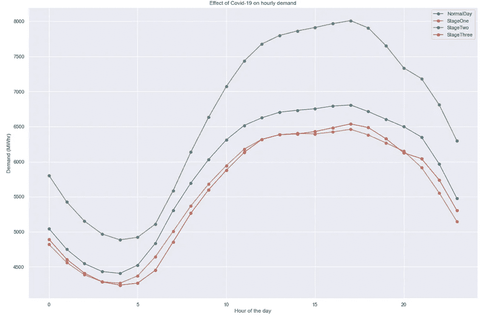

图 23:在 *Hot* 组中各种强制限制期间，一天中各小时的需求

上面显示了一天中某个小时的效果。在第二阶段的*中，我们可以立即发现明显更高的值。另一方面，电力需求的表现与正常情况下相当一致。*

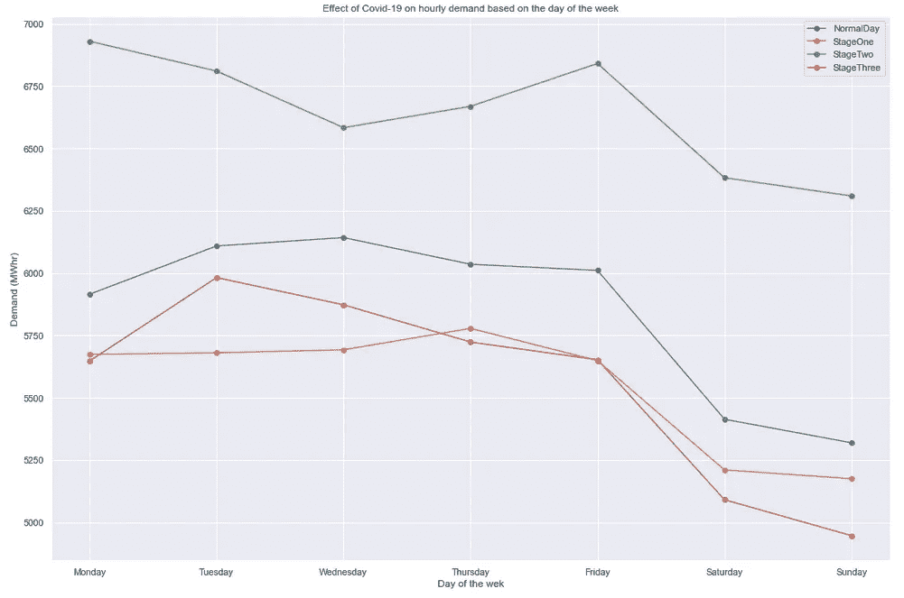

图 24:在*热点*组中各种强制限制期间，一周中各天的需求

上面介绍了一周中某一天的影响。这种行为是不稳定的，没有区分限制期和正常天数的共同模式。也就是说，工作日和周末期间，第一阶段的平均需求下降约 6%，第二阶段的平均需求下降约 7%，第三阶段的平均需求下降约 13%，正常工作日的平均需求下降约 12%。

在*完全锁定*、*第一阶段*和*第二阶段*期间，与*第二阶段*、*第三阶段*和*修改后的第二阶段*相比，周末需求的平均值相对更接近平日。这是一个有趣的观察，一个简单的解释可能是:当完全封锁最初被引入时，我们很难适应这种剧烈的变化，我们在工作日和周末的行为之间没有明确的区别。随着我们不断学习和适应这种情况，我们可以在工作日和周末之间建立一个独特的界限，类似于我们的正常行为。

## 动词 （verb 的缩写）夏令时(DST)的影响

夏令时的典型做法是在春季将时钟拨快一小时，在秋季将时钟拨回。赤道附近的国家一定想知道这到底是什么？在这些国家，日出和日落时间在一年中不会有很大的变化来证明夏令时的合理性。例如，在多伦多，冬季高峰期大约有 9 个小时的日照时间(上午 8 点到下午 5 点)，夏季高峰期大约有 15 个小时的日照时间(夏令时上午 6 点到晚上 9 点)，如下图所示。这相差了 6 个小时。每年观察到的两个不连续点对应于夏令时的开始和结束。

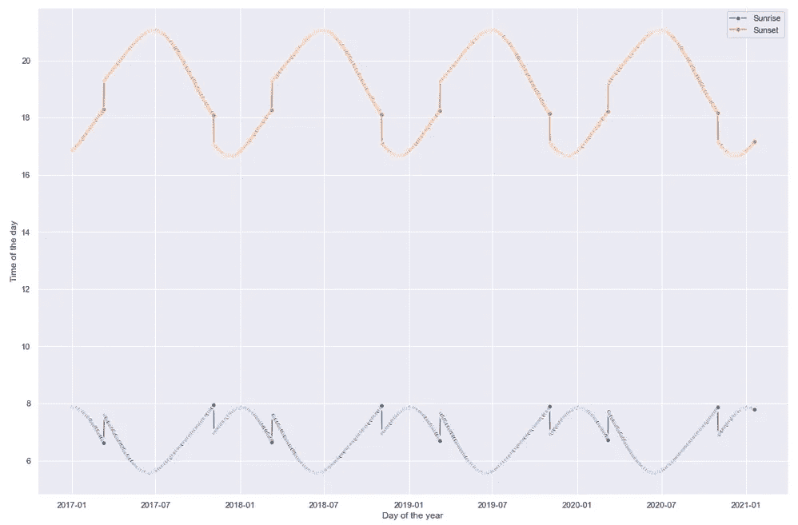

图 25:多伦多的日出和日落时间

如果全年都实行夏令时，在冬季高峰期，太阳只会在晚上 9 点升起。然而，如果不实行夏令时，夏季太阳会在早上 5 点升起，晚上 8 点落下。为了在我们所谓的*觉醒时间*更好地捕捉阳光，一年中大约有 8 个月实行夏令时。下表显示了 2010 年至 2019 年这十年中夏令时的开始和结束日期。

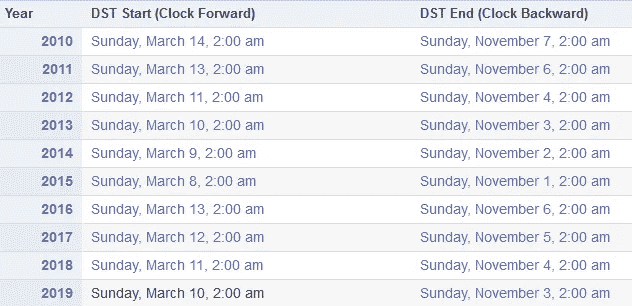

图 26:[来源]: [时间和日期](https://www.timeanddate.com/time/change/canada/toronto)

DST 时间的八个月和正常时间运行的四个月及其电力需求如下所示。夏令时期间的平均需求约为 5620 MWh，正常时间的平均需求约为 5780 MWh。

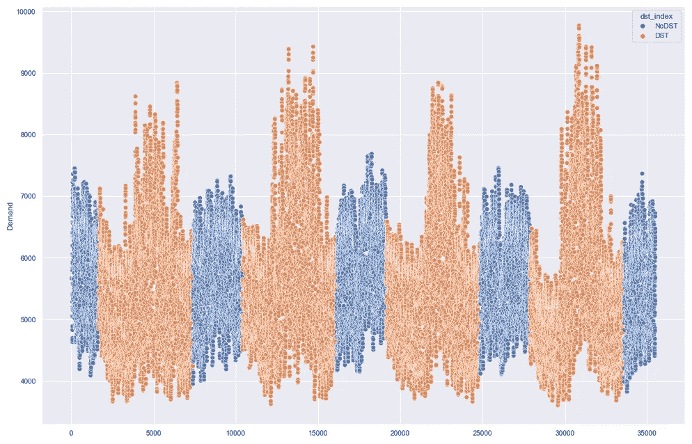

图 27:DST 和 NoDST 的需求与时间

在实施的最初几天，夏令时被认为是节约能源的一个重要因素。没有确凿的研究表明这种行为，因为很难预测不采用夏令时的能源消耗。不过，普遍的共识是，日复一日的峰值会趋于平缓。这样有什么好处？

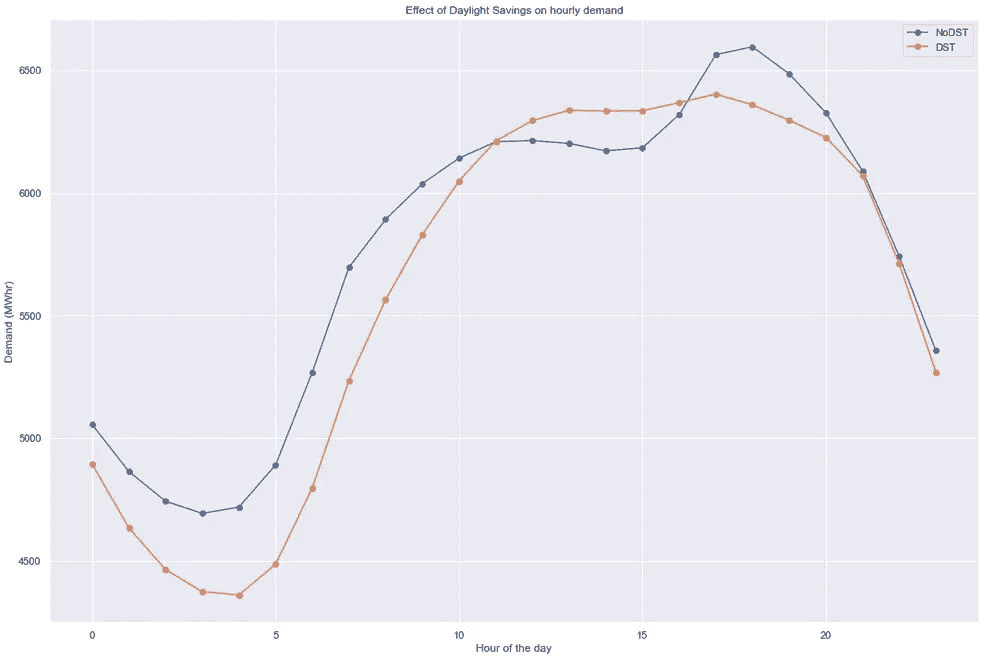

图 28:采用和不采用夏令时的每小时需求

从生产者的角度来看，实现平坦的峰值是有利的。作为消费者，我们总是在需要的时候有电。但对生产商来说，持续的需求比一个相当大的峰值更容易满足。我们确实可以在上图中观察到这种行为。通常出现在下午 5 点到 7 点的峰值在夏令时开始后变得平缓。这可以归因于几个因素，从住宅照明使用量的减少到户外时间的增加等等。

DST 一直备受争议，有几种支持和反对的观点。一些支持夏令时的人使用改善经济、增加能源节约的论点，而反对夏令时的论点通常围绕健康安全和生产率下降。也就是说，作为一个更喜欢户外运动的人，我个人喜欢白天多出来的那一点点时间。

## 结论和关键要点

在本文中，我们研究了几个因素对多伦多电力需求的影响。这篇文章的一些关键要点是:

1.  在温度曲线中可以观察到每日和每年的季节性，而在电力需求曲线中可以观察到每日和 52 周的季节性。
2.  在夏季(> 15°C)，温度和需求之间可以观察到相当强的正相关，而在冬季(< 15°C)，可以观察到非常轻微的负相关。
3.  一天中的时间对需求的大小起着主要作用，平均每天下午 5 点至 6 点左右达到高峰。
4.  与工作日相比，周末期间的电力需求明显较低。
5.  在*全面封锁—* 关闭商业和社会机构期间，由于疫情而强制实施的封锁降低了能耗。在*第二阶段——一年中最热的*月份，需求急剧增加，导致空调使用量增加。
6.  在封锁的几个阶段，可以观察到电力需求峰值有一天的偏移(接近一周的开始)。
7.  无论实施何种限制，每小时的需求行为大致保持不变。
8.  没有确凿的证据证明夏令时对需求的影响，但是观察到峰值变平，这与普遍的共识一致。

从生产的角度来看，必须有一个良好的预测，以帮助满足所需的电力需求。在以后的文章中，我将介绍各种方法，包括传统的和先进的时间序列建模技术来预测需求。

所有的数字都是用 Python 绘制的，相关的分析代码可以在我的 [Github repo](https://github.com/srpraveen97/ElectricalDemandToronto) 中找到。特别感谢我的同事尼娜·蒙泰罗( [LinkedIn](https://www.linkedin.com/in/nsmonteiro/) )提供的宝贵领域见解和深入的讨论。请在这里分享您的想法，或者在 [LinkedIn](https://www.linkedin.com/in/srpraveen97) 上与我联系。

感谢阅读！

## 参考

1.  [https://ieso.ca/en/Power-Data/Data-Directory](https://ieso.ca/en/Power-Data/Data-Directory)
2.  [weatherstats.ca](https://toronto.weatherstats.ca/download.html) 基于加拿大环境和气候变化数据
3.  [https://www.timeanddate.com/](https://www.timeanddate.com/)
4.  时间序列分析 [Nptel](https://nptel.ac.in/courses/103/106/103106123/)
5.  时间序列分析和建模 [AIEngineering](https://www.youtube.co/watch?v=-r7wB9DJtiU&list=PL3N9eeOlCrP5cK0QRQxeJd6GrQvhAtpBK)