# 从样本到总体

> 原文：<https://medium.com/analytics-vidhya/from-samples-to-population-b5486580851b?source=collection_archive---------4----------------------->

来自 [Pexels](https://www.pexels.com/photo/food-man-hands-people-6580559/?utm_content=attributionCopyText&utm_medium=referral&utm_source=pexels) 的 [cottonbro](https://www.pexels.com/@cottonbro?utm_content=attributionCopyText&utm_medium=referral&utm_source=pexels) 摄影

通常情况下，我们获得的分析数据并不是关于我们希望研究的整个人群——它只是一个样本。

出于以下原因，采样是有意义的:

1.  收集整个人口的数据是非常昂贵的。想想十年才进行一次的人口普查。
2.  人口随着时间而变化。举个例子——当你收集到完整的人口数据时，有人死去，又有新人出生。因此，您的数据在收集过程中已经发生了变化。

然而问题是，人们经常需要从手头的样本中推断出人口特征。我们举个例子。

下面是一个有 10，000 名工作成人的国家的成年人口收入的模拟数据。注意，这只是出于理解的目的。事实上，我们很少有人口数据。

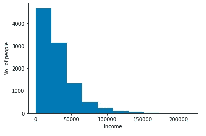

人口收入(模拟数据)

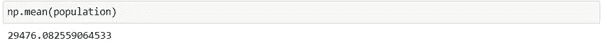

总平均

该群体的平均值约为 29.5K

我们从这个人群中取大量样本，计算他们的均值。下面的代码演示了从上述总体中抽取 10，000 个大小为 100 的随机样本，并将它们的平均值存储在一个名为 samp_means 的列表中。

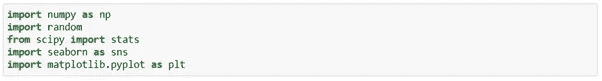

导入库

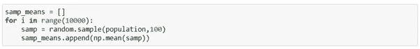

从人群中抽取 10，000 个大小为 100 的样本

这是这些样本均值的分布。

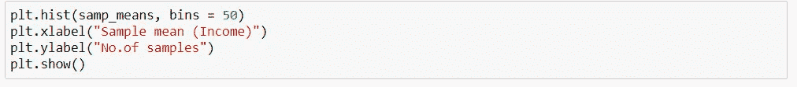

绘制样本均值分布图

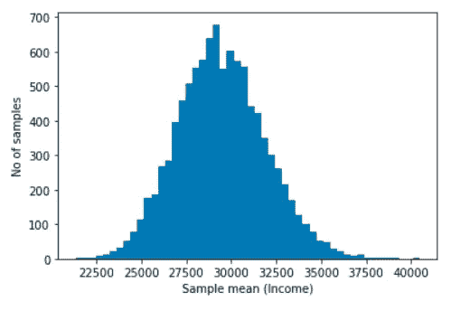

样本均值的分布

上图可能是统计学中最重要的发现之一，被称为**中心极限定理**。

尽管总体分布是高度右偏的，但样本均值的分布非常接近正态分布。不管最初的人口分布如何，这都是事实。

现在，让我们看看上述分布的特征，即平均值和标准差。

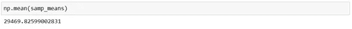

样本均值的平均值

平均值与人口平均值相差不大，即 29.5K。

根据中心极限定理，标准偏差是样本大小的函数。更具体地说，它是总体的标准偏差除以样本大小的平方根，即

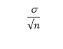

标准误差

其中，希腊字母 sigma 是总体标准偏差， *n* 是样本量。这也被称为*标准误差*。

让我们看看这是否匹配。下面的图表显示了两件事。

1.  来自数据的样本均值直方图(同上)
2.  使用正态分布公式的正态分布曲线(有黑色轮廓的曲线)，给定总体平均值和标准偏差作为标准误差

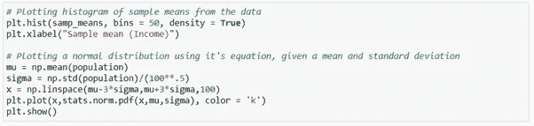

绘制分布

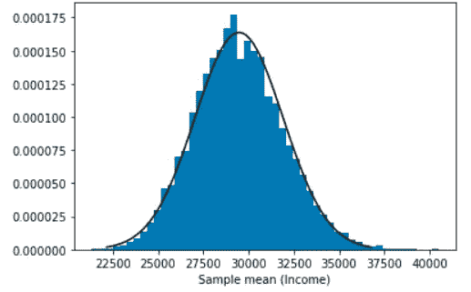

样本分布是指 v/s 正态分布使用它的公式

很接近了，不是吗。在较小的样本量的情况下，分布将被展开，而在较大的样本量的情况下，分布将变窄。

你可能会问，这一切意味着什么，它对我有什么帮助？

样本均值的分布是以总体均值为中心的正态分布，并且具有一定的标准差(即标准差)这一事实，我们可以从样本均值中找到总体均值的置信区间。

假设我们只有一个来自这个群体的大小为 100 的随机样本。

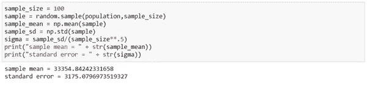

抽取一个样本并打印样本统计

*由于这个样本代表了上述正态分布的某处，我们可以计算包含总体均值的置信区间。*

下面是给定样本平均值和标准偏差(即标准误差)的 95%置信区间的代码

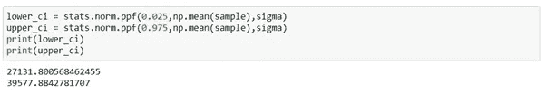

置信区间

注意——中心极限定理指出，标准误差是总体标准偏差的函数。然而，我们不知道总体的标准偏差，所以我们使用样本的标准偏差作为估计。已经表明，在足够大的样本中，这是可以做到的。

上述置信区间解释为-

如果我们从这个群体中抽取 100 人，重复这个过程足够多次，那么以这种方式构建的 95%的置信区间将包含实际的群体均值。

或者我们可以粗略地说，我们有 95%的信心，总体均值在这个范围内。

中心极限定理是推断统计学和假设检验的基石。

学分:代码学院

***你怎么看待中心极限定理？***