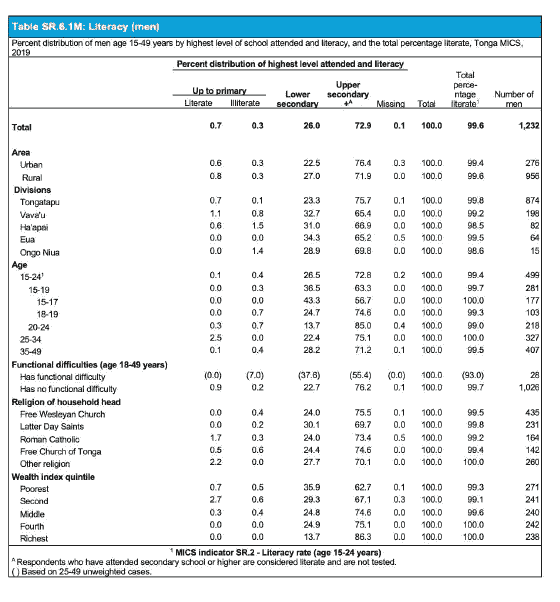
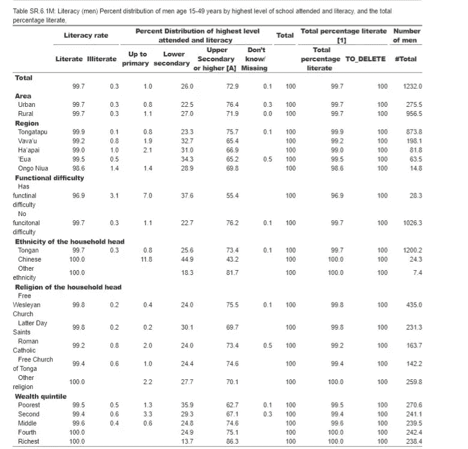

# 从 SPSS 到 R，重写调查数据列表的代码:多指标类集调查实例

> 原文：<https://medium.com/analytics-vidhya/from-spss-to-r-rewriting-code-for-survey-data-tabulation-mics-survey-example-3d72d3c813f7?source=collection_archive---------9----------------------->

住户调查是最复杂的统计数据收集和汇编工作之一。它们是由世界各地的国家统计局、其他政府机构和私人研究组织进行的。

可以使用各种工具对其中收集的数据进行分析。

对我来说，使用任何调查数据的附加值将是在不同的数据分析平台上运行分析的可能性。这为额外的质量控制检查、将一项调查的部分/模块整合到在不同平台上处理的其他调查中，或在表格旁边添加额外的报告模式(如 choropleths 或复杂的可视化)提供了可能性

在这项工作中，使用了多指标类集调查中产生的许多表格之一的 SPSS 语法，并在 r 中重新编码。多指标类集调查([多指标类集调查](https://mics.unicef.org/))是关于全世界儿童和妇女的最大的可靠统计和国际可比数据来源。为了在多指标类集调查中收集数据，访问员对 15 至 49 岁的妇女和男子、所有 5 岁以下儿童的母亲或看护人以及随机选择的 5 至 17 岁儿童发放家庭问卷和个人问卷。

出于本练习的目的，将多指标类集调查标准表格 SR.6.1M 中使用的一个 SPSS 语法文件用 r 重新编码。所有[多指标类集调查标准 SPSS 语法可在多指标类集调查网站上在线](https://mics.unicef.org/files?job=W1siZiIsIjIwMjEvMDQvMjAvMDYvMjUvMTcvMTE0LzQyX1N5bnRheF9GaWxlc18yMDA0MjAyMS56aXAiXV0&sha=71bc21b2d7d8bb4a)获得。


这是多指标类集调查中一个相当简单的表格，它显示了 15-49 岁男性的识字率。在多指标类集调查中，所有达到小学以上教育水平的男子都被认为是识字的。除了正规教育水平之外，在调查中被采访的任何没有完成小学教育或只受过小学教育的男子(问卷中的问题 MWB6)被要求朗读采访者给的卡片上的一句话(问卷中的问题 MWB14)。所有这些问题都是针对 15-49 岁男性个体的[问卷的标准问题，该问卷的模板版本也可在网上获得。](https://mics.unicef.org/files?job=W1siZiIsIjIwMjAvMDcvMjAvMjAvNTIvMDIvNDU5L01JQ1M2X1F1ZXN0aW9ubmFpcmVfZm9yX0luZGl2aWR1YWxfTWVuXzIwMjAwNjE3LmRvY3giXV0&sha=f322b2b47d0fc9b5)

像多指标类集调查和 DHS 这样的大型国际社会统计调查项目通常使用专门的高级软件进行分析，如 SPSS 或 Stata。原因很简单，比如可以创建自定义表格(SPSS 中的“ctables”功能或“collect layout”的 Stata 组合)，其中包含用于分解指标的所有相关社会经济背景特征，比如按区域(城市/农村)、地区、种族、宗教、财富五分位数以及为每次调查定义的其他特征。

这篇文章的目标是展示与开源软件相同的功能，如使用“expss”包的 R。除了列表和结果与原始结果的比较之外，使用 R 允许与其他不同的软件包集成，如上所述。

用于运行 SR.6.1M SPSS 语法的特定数据集关于*“识字率(男性)
“15-49 岁男性最高受教育程度和识字率的百分比分布，以及总识字率”*

来自[汤加 2019 年多指标类集调查](https://tongastats.gov.to/survey/mics-survey/)，其数据集也可从[在线](https://mics.unicef.org/surveys)获得。

这张特殊的表格发表在[调查结果报告](https://mics-surveys-prod.s3.amazonaws.com/MICS6/East%20Asia%20and%20the%20Pacific/Tonga/2019/Survey%20findings/Tonga%202019%20MICS%20Survey%20Findings%20Report_English.pdf)的第 64 页。



**中 SPSS** 初始段的语法看起来是这样的:

```
include "surveyname.sps".get file = 'mn.sav'.include "CommonVarsMN.sps".select if (MWM17 = 1).weight by mnweight.compute literate  = 2.
if (MWB6A >= 2 and MWB6A < 8) literate = 1\. 
if (MWB14 = 3) literate = 1.
variable labels literate " ".
value labels literate 1 "Literate" 2 "Illiterate".compute literateP = 0.
if (literate = 1) literateP = 100\. 
variable labels literateP "Total percentage literate [1]".compute layer = 0.
variable labels layer " ".
value labels layer 0 "Percent distribution of highest level attended and literacy".* add A to welevel label.
 * add value labels mwelevel 3 "Secondary or higher [A]".
* country specicif add A to welevel label.
add value labels mwelevel 3 "Upper secondary or higher [A]".compute numMen = 1.
variable labels numMen "Number of men".
value labels numMen 1 "".compute total = 1.
variable labels total "Total".
value labels total 1 " ".compute tot = 100.
variable labels tot "Total".
value labels tot 100 " ".
```

语法的这一部分(第 1-59 行)执行以下操作:计算阅读过卡片的回答者的识字率(变量‘识字’)，只考虑那些能够阅读整句话的人，增加男性的调查权重，增加识字率的百分比变量(变量‘识字’)，计算男性总数(变量‘numMen’)和总百分比(变量‘tot’)

对于 R 中的**相同代码，将需要多几行代码:**

```
---
title: "SPSS to R - recoding of a Survey Syntax"
author: "Filip Mitrovic"
output:
  word_document: default
  html_document: default
  pdf_document: default
---
## Library needed to reproduce the SPSS syntax household survey table in R are below. Author of the 'expss' package notes that it should be loaded only after the 'heaven' package.
```{r setup, echo=FALSE}library(foreign)
library (haven)
library (expss)
```### path to *.sav file with the survey dataset.```{r, results="hide"}

path = ''
setwd(path)data = read.spss('mn.sav', to.data.frame = T, use.value.labels = FALSE) ##data set is loaded with numerical values to save keystrokesdata %>% filter(data$MWM17 == 1) # selects only responses from completed interviews with men age 15-49 in the survey```
```

除了定义相同的变量:literate、literateP、tot、numMen 之外，该语法还定义了运行 spss *所需的库。R 环境下的 sav 文件。

在该段之后，执行与 SPSS 语法中相同的计算:###如 SPSS 语法中的计算能力，重写

```
```{r pressure, echo=TRUE}data = compute(data, {
  literate = 2
})data$literate<- ifelse((data$MWB6A >=2 & data$MWB6A <8), 1,
                       ifelse(data$MWB14==3,1,2))# making data numeric in R dataframe for calculations
data$literate<-as.numeric(as.character(data$literate))# adding value labels in R, comparable to 'value labels' function in SPSS. 
val_lab(data$literate) = num_lab("
                                 1 Literate
                                 2 Illiterate
                                 ")
# adding variable with overall percent of literate respondents. This is comparable to 'compute' function in SPSS. All variables have identical names as in SPSS syntax for easier reference.  
data = compute(data, {
  literateP = 0
})data$literateP<- ifelse(data$literate ==1,100,0)#recode(data$mwelevel) = c(0 ~ 0, 1 ~ 1, 2:3 ~ 2, 9 ~ 9, other ~ NA)# adds value labels to the column headings in the table in R. This is not in SPSS syntax as those are already pre-defined in the *sav dataset
data$mwelevel<-as.numeric(as.character(data$mwelevel))
val_lab(data$mwelevel) = num_lab("
1 Up to primary
2 Lower secondary
3 Upper Secondary or higher [A]
9 Don't know/ Missing
                                 ")
# computes additional columns as in SPSS syntax, for overall number of cases and a total percentage. 'numMen' and 'tot' are identical variable names as in SPSS syntax
data = compute(data, {
  numMen = 1
})data = compute(data, {
  tot = 1
})# adding variable  labels. Labels added identical as in comparable SPSS syntax. In addition labels also added to the background characteristic variables that are shown in rows. This is not seen in SPSS syntax as they are already in the *.sav file. 
data<-apply_labels(data, 
                   literateP =  "Total percentage literate [1]",
                   numMen = "Number of men",
                   HH6 = "Area", # up to variable 'mwelevel' all variables are background characteristics. 
                   HH7 = "Region",
                   mdisability = "Functional difficulty",
                   religion = "Religion of the household head",
                   ethnicity = "Ethnicity of the household head",
                   windex5 = "Wealth quintile",
                   mwelevel = "Percent Distribution of highest level attended and literacy",
                   tot = "Total",
                   literate ="Literacy rate")# adding value labels as in SPSS. next to syntax specific value labels, that are shown in the comparative document, the labels for background characteristic variables are also added. 
val_lab(data$tot) = num_lab("
1 |  " )val_lab(data$HH6) = num_lab("
1 Urban
2 Rural")val_lab(data$mdisability) = num_lab("
1 Has functinal difficulty
2 No funcitonal difficulty")val_lab(data$windex5) = num_lab("
1 Poorest
2 Second
3 Middle
4 Fourth
5 Richest")val_lab(data$religion) = num_lab("
1 Free Wesleyan Church
2 Latter Day Saints
3 Roman Catholic
4 Free Church of Tonga
5 Other religion
99 Don't know/missing")val_lab(data$ethnicity) = num_lab("
1 Tongan
2 Chinese 
3 Fijian
4 Other ethnicity 
99 Don'tknow/missing")val_lab(data$HH7) = num_lab("
1 Tongatapu
2 Vava'u
3 Ha'apai
4 'Eua
5 Ongo Niua")
```

但是除了特定于语法的变量之外，还添加了一组变量名称和标签，因为这些是在 SPSS 的*sav 文件中预定义的，但是也必须在 R 代码中引入。

现在，SPSS 中的**制表语法非常简单明了，使用“ctables”函数绑定该语法中定义的列级变量(“literate”、“literateP”、“tot”、“mwelevel”和“numMen”)，并将其与预先定义的上述背景特征变量制成表格。语法如下所示:**

```
ctables
  /vlabels variables = layer mwelevel literate display = none
  /table   total[c]
         + hh6 [c]
         + hh7 [c]
         + $mage [c]
         + mdisability [c]
         + ethnicity [c]
         + religion [c]
         + windex5 [c]
   by
           layer [c] > mwelevel [c] > literate [c] [layerrowpct.validn '' f5.1] + tot [s] [mean '' f5.1] +
           literateP [s] [mean '' f5.1]
         + numMen[s][sum '' f5.0]
  /categories variables=all empty=exclude missing=exclude
  /slabels position=column visible = no
  /titles title=
    "Table SR.6.1M: Literacy (men)"
    "Percent distribution of men age 15-49 years by highest level of school attended and literacy, and the total percentage literate, " + surveyname
   caption =
    "[1] MICS indicator SR.2 - Literacy rate (age 15-24 years)"
    "[A] Respondents who have attended upper secondary school or higher are considered literate and are not tested."
  .
```

在 R 中，制表如下:

```
```{r}
expss_output_viewer() # function to see the table in the viewer in R studio
data %>%
  tab_total_row_position("none")%>% # suppresses the total values for each row. As SPSS syntax 'ctables' does not show totals, it is disabled in R code as well
  tab_cells(tot, HH6, HH7, mdisability, ethnicity ,religion, windex5) %>% #defines rows for the table
  tab_cols(literate, mwelevel, tot) %>% # defines columns to shoe percentage for with 'tab_stat_rpct'
  tab_weight(weight = mnweight) %>% #adds weights from the dataset
  tab_stat_rpct(total_label = NULL,total_statistic = "w_cases",)%>%
  tab_cols(net(literateP, "Total percentage literate" = greater_or_equal(1), "TO_DELETE" = other))%>% #defines mean for the additional column as a different calculation method, and marks a columnt to be deleted 
  tab_stat_rpct(total_label = NULL,total_statistic = "w_cases",)%>%
  tab_cols(total(numMen))%>% # last column and different calculation method only to count total cases 
  tab_stat_cases()%>%
  tab_last_round(digits = get_expss_digits())%>%
  tab_pivot(stat_position = "outside_columns")%>%
  where(!grepl("TO_DELETE", row_labels)) %>%
   drop_empty_rows()%>%
  set_caption( "Table SR.6.1M: Literacy (men)
               Percent distribution of men age 15-49 years by highest level of school attended and literacy, and the total percentage literate, " ) #adds caption on the top of the table
```

R 代码的最终输出是这样的 html 格式。可以对 word 进行进一步的定制。



本练习的完整编织器文件也可在此处获得:

 [## RPubs

### SPSS to R——rpubs.com 家庭调查语法](http://rpubs.com/fmitrovi/805002)