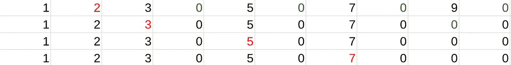

# 挫折

> 原文：<https://medium.com/analytics-vidhya/frustration-a65019e6bece?source=collection_archive---------19----------------------->


# 背景

春假最近结束了，但是我不希望我的编程技能随着学校逐渐接近尾声而下降。当我有足够的时间和我喜欢的时候，我现在就在编程。我遇到了一个问题，这个问题给了我很大的麻烦，几乎把我带到了流泪的边缘。这个问题又回到了我在第一篇文章中使用的网站 Project Euler。

它陈述:通过列出前六个素数:2，3，5，7，11，13，我们可以看到第六个素数是 13。第 10001 个质数是多少？

# 示范

有人建议我使用厄拉多塞的筛子，所以我试着用 Python 实现这个。厄拉多塞筛是一种算法，通过选择一个数字并删除该数字的所有倍数来寻找素数。例如，如果要查找所有小于 10 的质数，可以选择 2 并删除所有 2 的倍数，但不包括 2。在那之后，你将移动到下一个未被删除的号码，那将是 3。您删除所有现有的 3 的倍数，不包括 3，并标记 5。这个过程一直持续到不再有数字需要标记为止。



红色数字表示标记的数字，绿色零表示删除的倍数

一开始我是在测试是不是不用这个算法就能解决问题。我循环了一系列的数字，对于每个数字，我用它除以范围内的每个数字。这是一个非常天真的方法，因为它需要非常长的时间来运行，而且总体上很草率。

这次惨败之后，我别无选择，只能用这个当时对我来说很陌生的算法。当尝试编程时，我很难遍历列表，将它们改为 0，并使我的程序运行得更快。过了一会儿，我想出了一个像样的解决办法。

```
info = 150000
numbers = [int(number) for number in range(info)]
y = 2
for i in numbers:
    if i == 0:
        continue
    else:
        for x in range(2 * y, len(numbers), y):
            numbers[x] = 0
        y += 1

print(list(filter(lambda num: num != 0, numbers[2:]))[10000])
```

我的解决方案接受一个任意大的数的范围，并在其范围内循环。首先，我检查数字是否为 0。如果是，我跳到下一个数字，如果不是，我进入另一个 for 循环。变量 y 是第一个质数，我的循环从 2 * y 开始，这意味着 2 的下一个倍数。它以 150，000 结束，因为这是数字列表中值的数目。然后，它将迭代 2 的每个增量，将每个值变成 0。转换完这些值后，y 增加 1，重复这个过程，直到所有的质数都剩下为止。最后一行去掉了所有的 0，只留下质数供我访问。

# 思想

在这个问题上，我了解到简单地研究和分析不同种类的算法或技巧是非常有用的，因为它们可以极大地帮助你解决某个问题。例如，当确定一个范围内的哪些数字是质数时，厄拉多塞的这个筛子节省了大量时间。这个问题也坚定了我的信念，那就是不要放弃，继续工作，即使是在你沮丧或生气的时候。回想起来，我的行为非常幼稚，但它帮助我提高了整体素质。

# 参考

工程欧拉问题:[https://projecteuler.net/archives](https://projecteuler.net/archives)T2【厄拉多塞】筛子:[https://en.wikipedia.org/wiki/Sieve_of_Eratosthenes](https://en.wikipedia.org/wiki/Sieve_of_Eratosthenes)

# 放弃

我才刚刚开始探索不同类型的算法，所以我的代码会很粗糙，很难理解。我写这些文章希望能学到更多，与其他感兴趣的人分享我的学习，并在此过程中提高我的写作技能。感谢阅读。