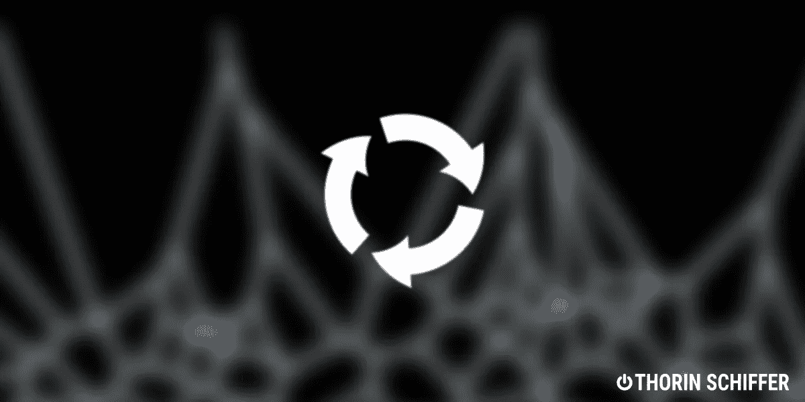
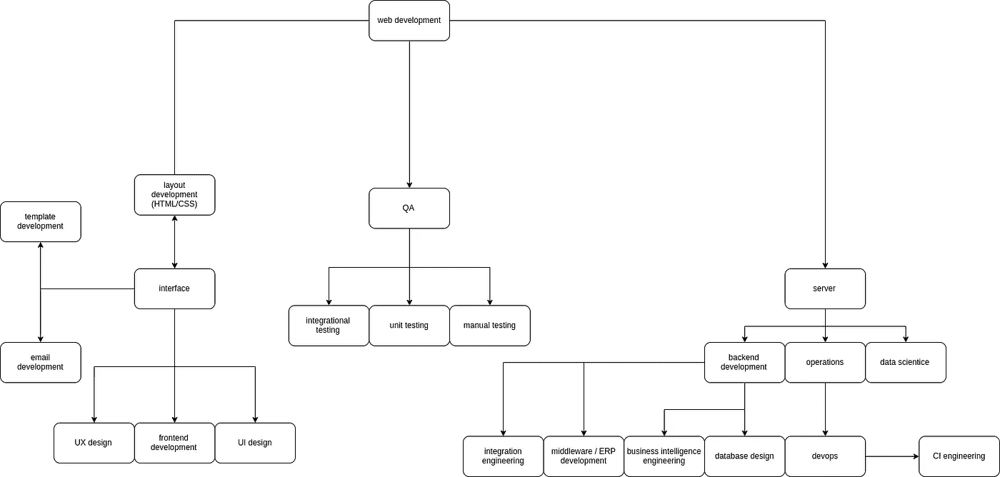

# 为什么全栈开发人员在 2022 年是一个神话

> 原文：<https://medium.com/analytics-vidhya/fullstack-my-backend-c89d1126ae57?source=collection_archive---------15----------------------->

## 开发人员的视点

## 后端全栈

从我职业生涯的一开始，我就看到类似“全栈开发人员这个”或“全栈开发人员那个”的职位描述。说一种语言并不意味着理解用这种语言写的任何东西。这是我对它的看法，也有很多图片！

> 寻找一些 Python 或 JS 自由职业者，工资高达 50€/小时？请不要犹豫[在 Twitter](https://twitter.com/SchifferThorin) 或 [Linkedin](https://www.linkedin.com/in/thorin-schiffer/) 上联系我，告诉我你的简历、空闲时间和时薪。(CET +/- 3 小时)。

对不起，英语是我的第二(第三？)语言。

# 灾难网站管理员

在互联网的早期，网站开发者的生活要容易得多:没有中国政府的机器人会黑你的多汁 22，辣 80 或舔你的远程登录；javascript 被用来创建闪亮的跑马灯，如果你提到像服务器端 javascript 这样的东西，pip 在 Fidonet 上会被标记为疯狂。猫 gif 你的主页，所有女孩都是你的。不完全是。

PHP——别忘了它的意思——个人主页解释器是一件大事。带有 SQL 占位符的 HTML 模板给了所谓的网站管理员一次改变整个页面内容的全部权力。这是一款真正的全堆栈开发设备，那是在 1995 年，那是一段美好的时光。顺便说一下，当时我 6 岁，麦当娜还是个处女。不完全是。

# 同一枚硬币的两面

技术在不断发展，很明显 UX/UI 和处理数据没有太多的共同点。保持数据库正常运行本身就是一项任务。Ops 有他们自己的方式，CSS 标准被发布并工作了一段时间，dev 仍然在整个堆栈上工作，通过模板来查看数据。那是 2005 年。

有人在午夜之后喂 Javascript，它变得不可阻挡。Javascript，尽管不可用、不稳定、支离破碎，却变得越来越强大:jquery 修补漏洞，angular 引入逻辑、抽象和责任，typescript 使其可读，ECMAscript 使其在浏览器间标准化…

谷歌发明了 V8——它自己的 javascript 引擎，有些人把它放在 chrome 的一边，这是弥赛亚:javascript 已经变异并感染了服务器。好像某人的邪恶意志不惜一切代价想要得到它。那是 2009 年。

后端呢？全世界都在关注 SQL，因为很明显，SQL 是程序员世界中最大的错误。如果你不同意或同意，请在评论中咆哮！关系数据模型和面向对象编程语言之间的语义鸿沟促使开发人员寻找解决方案。有些人试图假装它不存在，并创建活动记录 ORM(在 python Django ORM、PonyORM 中),对客户端隐藏它，而其他人试图将表结构透明地投影到代码中，将数据的复杂性进一步分散到抽象领域——数据映射器模式(sqlalchemy)。第三种感觉很受 SQL 攻击，试图颠覆简单查询语言的千年法则。呃，不好意思，结构化了。

Laganja 感觉很受 SQL 攻击。

蒙哥斯，卡珊德拉，迪纳摩斯。我们需要更多的数据库。

MVC 不再是 MVCing 了；肥皂老得要命，惹恼了所有人。RPC 导致了可怕的不可支持的企业噩梦网络，所以人们想出了它的简化版本:REST。简单的动作，众多的模型，和一些花哨的功能。脸书重新解释了 PHP 解释器(那个东西后来永远地死了)，因为他们写的蹩脚代码数量如此之大，以至于编写整个新的解释器来优化现有的代码库更容易。这就像寻找另一个星球，因为你搞砸了旧的。似曾相识？

埃隆·马斯克，再找一个翻译，来源:[https://de . Wikipedia . org/wiki/Elon _ Musk #/media/Datei:Elon _ Musk _ Royal _ society . jpg](https://de.wikipedia.org/wiki/Elon_Musk#/media/Datei:Elon_Musk_Royal_Society.jpg)

新语言，新工具。Websockets 和 http2 在后端创建了一个全新的开发流，利用了异步编程，这对于以前的后端来说是相当不典型的。Python 的 asyncio 是一个单独帖子的主题！如果你想发表一篇关于❤️ Javascript 的文章，请鼓掌，因为从第一天起，它的核心就是异步的，所以跨语言挪用的向量颠倒了。

# 安托万·德沃普斯·埃克苏佩里

在小开发者小星球的另一边，代码仍然需要部署。

自裸机时代以来，情况发生了很大变化。所有人都想进行虚拟部署:托管者，这样他们就可以充分利用他们的硬件和开发人员，因为他们想要可重复的环境和更低的运营价格。自 2005 年第一次发布以来，英特尔虚拟化技术就一直受到年轻人的青睐，并广泛应用于用户。

两种主要方法相互竞争。虚拟化者说，按位复制是一种不计成本、完全可复制的环境，适用于数千台服务器——可快速克隆且易于回滚。来自 VMware 和 VirtualBox 的虚拟机，vagger(安息吧)就是那方争论的结果。

置备者反击:完全克隆是独角兽；没有这种东西，二进制图像太大，存储和处理太贵，支持所有的硬件都有困难。《大厨》(2014)、《木偶》(2011)、《安西贝尔》(2012)都是这一部的成果。

2013 年 12 月，Docker 首次发布。如今，它是部分虚拟化的标准，也称为容器化，简而言之，是两种方法的结合。然后:云，弹性环境，系统需要更好的可维护性和服务水平，快速回滚，金丝雀部署，蓝绿部署，docker-compose，Kubernetes，AWS，GCP，Azure。

除此之外，没有质量保证，你不能创建任何严肃的软件，可能是数据科学，如果你要创建一些特别颠覆性的东西；可用性分析，当然，还有让东西看起来更好的 UI 设计。

所有这些都是由一个人完成的。那是 25 年前的事了。事情变得更加复杂了。

这张难看的图代表了我的想法，相当主观地偏向后端

让我明确地说:没有人能再独自处理这件事了。

# 想象远景🐘

混乱之球，这就是今天的它，嘿嘿。

来自隔膜:啦啦啦啦啦啦啦啦啦

我记得我在 2006 年离散数学课程的第三节——图论——的第一堂课，教授说:“图论是一门特别新的学科，所以措辞还不是很统一。有些书在不同的名字下讲述同样的事情，在同一个名字下讲述稍微不同的事情。从关于这个问题的第一份出版物到现在只有 60-70 年的时间。”我当时 16 岁，60 年对我来说并不算短。

我们现在所知的那个时代甚至没有断裂。你获得的知识和技能，你掌握的技术可能会在几年内完全过时。难怪我们并不真正理解工程团队中责任的严格定义和边界。在后端重塑对象还是在前端重塑？谁对精灵负责——设计师、布局工程师还是前端开发人员？斗争是真实的。

茹妈妈帮帮我们

还记得关于盲人和大象的寓言吗？盲人从未见过它，所以当他们不得不描述它时，他们每个人都有自己对大象的看法。我们都倾向于夸大我们对团队努力的贡献和我们经历的重要性。

想象一辆汽车是一个软件产品。设计师、前端开发人员、后端开发人员、经理、QA 工程师和 DevOps 工程师一起开发和部署它。以下是他们对大象的描述:

设计师的车

前端开发人员的车

后端开发人员的汽车

DevOps 工程师的车

QA 工程师的车

经理的车

所以你可以作为一个单独的人来解决，但只能在一定的范围内。这个矛盾，互相排斥的动机和缺乏各方面的深刻认识，会反映出一个产品的质量不好。说到底，[康威定律](https://en.wikipedia.org/wiki/Conway%27s_law)不正是这么说的吗？