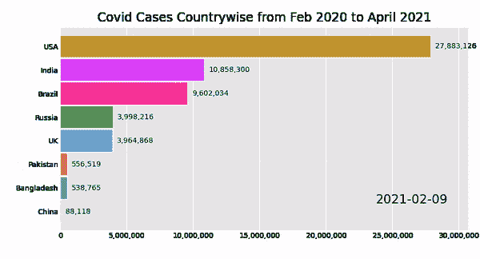
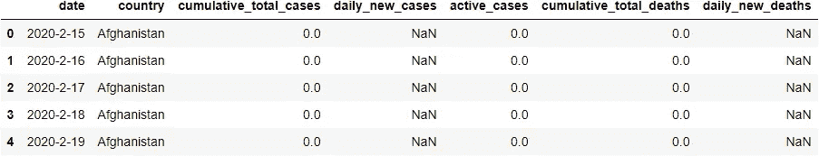
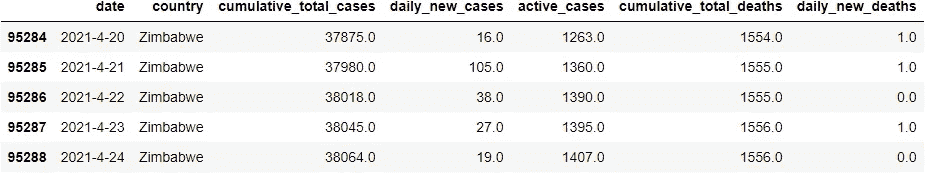
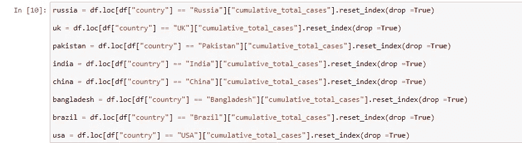
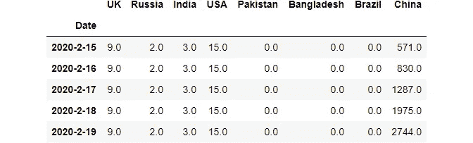
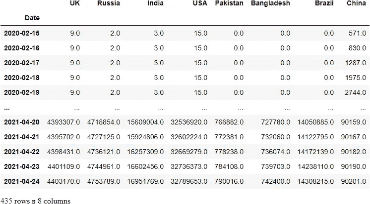
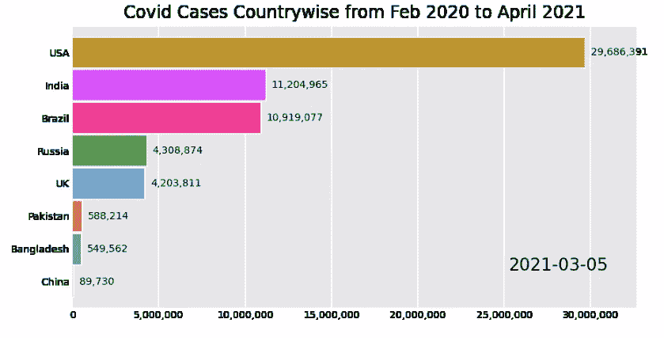

# 动画竞赛条形图:数据科学项目

> 原文：<https://medium.com/analytics-vidhya/fun-data-science-project-animated-race-bar-graph-37ec8014ec95?source=collection_archive---------4----------------------->

## 一个快速和循序渐进的初学者项目，为一个惊人的 Covid 数据集创建一个动画条形图。

我们的任务是为 2020 年 2 月至 2021 年 4 月期间全国范围内的新冠肺炎病例数创建一个动画条形图竞赛(bcr)。

*与允许您使用预加载的 bcr 数据集的其他教程不同，我们将为比赛图表栏处理和清理我们自己的数据集*



输出结果:按作者排序的图像

## 关于这个问题

我们的问题陈述将是世界各地的新冠肺炎病例记录。

*“希望是能够在黑暗中看到光明。”—德斯蒙德·图图*

## 关于数据集

可以在这里找到原始数据:[*https://github . com/shelvi 31/Animated-Bar-Graph/blob/main/world ometer _ coronavirus _ daily _ data . CSV*](https://github.com/shelvi31/Animated-Bar-Graph/blob/main/worldometer_coronavirus_daily_data.csv)

如果你想跳过数据处理和清理步骤，直接进入图形制作。下面是我修改后的数据集:[*https://github . com/shelvi 31/Animated-Bar-Graph/blob/main/corona _ dataset*](https://github.com/shelvi31/Animated-Bar-Graph/blob/main/corona_dataset)

该数据由 Joseph Assaker 于 2021 年 4 月 24 日从 woldometers.info 网站上搜集而来。该数据代表了 218 个国家。

所有国家都有从 2020 年 2 月 15 日到 2021 年 4 月 24 日的记录(每个国家 435 天)。这是中国的例外，其记录可追溯到 2020 年 1 月 22 日至 2021 年 4 月 24 日(每个国家 459 天)。

## 列摘要:

*国家:指定观察行数据的国家。*

*洲:指定被观察国家的洲。*

*total_confirmed:指定观察国家的确诊病例总数。*

*total_deaths:表示被观察国家的确诊死亡总人数。*

*total_recovered:指定被观察国家中已确认的回收总数。*

*active_cases:指定被观察国家/地区的有效案例数。*

*严重或危急:指观察国处于严重或危急状况的估计病例数。*

*total _ cases _ per _ 1m _ population:表示被观察国家每 100 万人口的总病例数。*

*total _ deaths _ per _ 1m _ population:指定被观察国家每 100 万人口的总死亡人数。*

*total_tests:指定在观察国完成的总测试次数。*

*total _ tests _ per _ 1m _ population:指定在被观察国每 100 万人口中完成的总检测次数。*

*人口:指定被观察国家的人口数量。*

## 数据集的确认

这个数据集中的所有数据都是从 worldometers.info 上搜集来的。

你可以在我的 Jupyter-notebook 上找到完整的干净代码:[*https://github . com/shelvi 31/Animated-Bar-Graph/blob/main/Animated % 20 Bar % 20g raph . ipynb*](https://github.com/shelvi31/Animated-Bar-Graph/blob/main/Animated%20Bar%20Graph.ipynb)

## 加载库

```
import pandas as pd
import os
```

## 加载数据集

```
df = pd.read_csv("worldometer_coronavirus_daily_data.csv")
```

## 处理数据集:让我们了解数据

```
df.head()
```



```
df.shape(95289, 7)df.tail()
```



由于有许多国家的数据，我们需要选择一些我们想要分析的特定国家的数据。

```
df.loc[df["country"] == "Zimbabwe"].shape Output:
(435, 7)
```

因此，我们有每个国家大约 450 天的值。

```
df.isnull().sum()Output:
date                           0
country                        0
cumulative_total_cases         0
daily_new_cases             6469
active_cases                   0
cumulative_total_deaths     6090
daily_new_deaths           19190
dtype: int64
```

## 为条形图选择国家

选择 cumulative_total_cases 列作为系列，并用国家名称对它们进行分组。我将挑选 8 个人口最多的国家和我们的邻国进行评估



代码，作者的图像

我们只有所有国家的 435 行数据。因此，我们也取中国的 435 行数据。

## 为中国处理数据

```
CHINA=[]
for i in range(0,435):
    CHINA.append(china[i])
```

## 转换为系列

```
china = pd.Series(CHINA)china.shapeOutput:(435,)
```

## 太好了！现在我们所有列的长度都在水槽里了！即 435 天的数据。

我们还需要选择日期栏。为了只检索前 459 个值，因为国家/地区的日期是重复的，我们拥有的最大天数数据是所有国家/地区的 435 天。

## 处理日期列:

```
date=[]
for i in range(0,435):
    date.append(df.date[i])
```

将列表转换为序列:

```
DATE = pd.Series(date)
```

## 串联系列以创建新的数据库

由于我们现在有不同的系列，让我们为这些系列命名，这些系列稍后将转换为 Dataframe 列

```
data = {"UK": uk,
        "Russia": russia,
        "India" : india,
        "USA": usa,
        "Pakistan" : pakistan,
        "Bangladesh" : bangladesh,
        "Brazil":brazil,
        "China": china,
        "Date" : DATE
       }corona = pd.concat(data,axis = 1)corona.set_index("Date", inplace = True)corona.head()
```



```
corona.shapeOutput:(435, 8)
```

## 检查空值(如果有)

```
corona.isnull().sum()Output:
UK            0
Russia        0
India         0
USA           0
Pakistan      0
Bangladesh    0
Brazil        0
China         0
dtype: int64
```

## 将日期转换为日期时间格式

```
corona.index = pd.to_datetime(corona.index)
```

终于！我们得到了所需的格式和国家！

我们还需要选取日期列

```
corona
```



```
corona.to_csv("corona_dataset",header=True,index=True)
```

## 太好了！我们的数据框看起来很棒，随时可以使用！

让我们现在就开始胺化条形图编码！

## 安装条形图竞赛

```
pip install bar_chart_race
```

需要注意的一点是:加载图表需要时间，所以请耐心等待。不像我，如果结果没有分分钟显示出来，不要急于找出不必要的错误或自我怀疑。

`P.s : Yes, I did waste a lot of time , thinking there is an error while there was none and graph was just taking time to load !!! :p`

```
import bar_chart_race as bcr

bcr.bar_chart_race(df=corona,filename=None,title= "Covid Cases Countrywise from Feb 2020 to April 2021")
```



输出，按作者分类的图像

我很难过地注意到，随着四月的到来，印度的病例呈指数增长，这一切导致了我写这篇博客时的恐慌、浩劫和生命损失。


输出:作者的图像

如果你遇到任何与 FFmpeg 相关的错误:这里是为你的系统解决它的一步一步的链接:[https://www.wikihow.com/Install-FFmpeg-on-Windows](https://www.wikihow.com/Install-FFmpeg-on-Windows)

## 保存种族栏图

您可以通过从图像底部的下载选项下载来保存条形图。希望你喜欢这个有趣的教程。享受并不断学习:)

## **参考文献:**

*   [https://pypi.org/project/bar-chart-race/](https://pypi.org/project/bar-chart-race/)
*   https://www.youtube.com/watch?v=Dawp5XOSEuk[号& t=350s](https://www.youtube.com/watch?v=Dawp5XOSEuk&t=350s)
*   【https://www.worldometers.info/ 