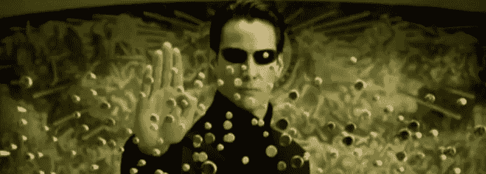

# 主题提取的乐趣

> 原文：<https://medium.com/analytics-vidhya/fun-with-topic-extraction-8aa11e0437d0?source=collection_archive---------3----------------------->



图片来源:qz.com

# **简介**

我一直在计算机视觉、自然语言处理和机器学习之间切换我的实验，上周我发现自己在摆弄自然语言处理，我想创建一个简单的主题提取器，从输入的文本中提取主题。

这个想法是建立一个即使是 10 岁的孩子也能理解的东西，并且很容易在他们的笔记本电脑上快速复制。在我看来，让一些东西在你的机器上工作比仅仅从理论上浏览一篇文章更令人满意。

PS——我在这篇文章中还有一个额外的收获，就是把提取的主题变成一个英语句子。所以，保持沉迷！

让我们开始吧！

# **预读**

与大多数文章一样，我希望您事先理解一些概念(如下所列),以便充分理解我们将要编写的代码。如果您还不知道这些概念，请不要伤心，因为我们的最终目的是建立一个工作模型，激发您对自然语言处理的兴趣——学习总是可以随后进行的。以下是列表(以及一个简单的概述):

*   **TF-IDF Tokenizer** : TF-IDF 是一种统计度量，用于评估一个单词与文档集合中的一个文档的相关程度。这是通过将两个度量相乘来实现的:一个单词在一个文档中出现的次数(术语频率)，以及该单词在一组文档中的逆文档频率。
*   **单值分解(主成分分析)**:奇异值分解(SVD)和主成分分析(PCA)是两种特征值方法，用于将一个高维数据集降维，同时保留重要信息。

# **步骤**

重复一下，我们想要完成的任务是在任何给定的文本中提取主题的关键列表。以下是待办事项清单，以及相应的代码片段(如果适用):

*   专注于你想要处理的样本文本。我将在维基百科中挑选与“金融科技”一词相对应的文本。
*   使用句子分词器将文本转换成句子列表。我们从 NLTK 包中使用 sent_tokenize 来实现这一点。

```
from nltk.tokenize import sent_tokenizepreface = "enter the input text here"
preface_tokens = sent_tokenize(preface)
```

*   接下来，我们将清理输入文本，即。去掉多余的空格，将单词转换成小写字母，去掉标点符号。

```
def clean_text(s):
        s = s.lower()
        s = s.split()
        s = " ".join(s)
        s = re.sub(f'[{re.escape(string.punctuation)}]', '', s)
```

*   然后，我们将继续删除停用词。停用词是对句子没有多大意义的英语单词。它们可以被安全地忽略，而不会牺牲句子的意义。例如，像 the，he，have 等这样的词。

```
def remove_stop_words(s):
        stop_words = set(stopwords.words('english'))
        s = s.split()
        s = [w for w in s if not w.lower() in stop_words]
        s = " ".join(s)
        return s
```

*   接下来，我们将把所有单词转换成它们的基本符号，即。agree、agreed、agreeable 都将通过引理化转换为 agree。出于我们的目的，我们将使用 NLTK 包中的 WordNetLemmatizer。

```
from nltk.stem import WordNetLemmatizer
    lemmatizer = WordNetLemmatizer()
    preface_tokens = [lemmatizer.lemmatize(w) for w in preface_tokens]
```

*   将文本转换成数字符号——我们需要这样做，因为计算机不能很好地理解文本。他们喜欢和数字打交道。因此，我们需要想出一种方法来以数字的形式表示文本。为此，我们将使用 TF-IDF 矢量器。另一个选择可能是计数矢量器，但众所周知 TF-IDF 工作得更好，所以我们将坚持使用它。

```
from sklearn.feature_extraction.text import TfidfVectorizertfv = TfidfVectorizer(tokenizer=word_tokenize, token_pattern=None)
    corpus_transformed = tfv.fit_transform(preface_tokens)
```

*   一旦我们提取了 TF-IDF 令牌，我们将开始使用单值分解计算单词得分。基于这些单词分数，我们将识别具有最高分数的前 n 个单词。这些得分最高的单词将代表输入文本谈论的主题。我们将对 n = 5 进行实验，看看我们的输出是什么样的。

```
tfv = TfidfVectorizer(tokenizer=word_tokenize, token_pattern=None)
    corpus_transformed = tfv.fit_transform(preface_tokens)
    svd = decomposition.TruncatedSVD(n_components=10)
    corpus_svd = svd.fit(corpus_transformed)feature_scores = dict(
        zip(
            tfv.get_feature_names(),
            corpus_svd.components_[0]
        )
    )topic_output = sorted(
        feature_scores, key=feature_scores.get, reverse=True
        )[:5]
```

输出(维基百科中关于“金融科技”一词的文本):

```
['financial', 'technology', 'fintech', 'companies', 'services']
```

我认为我们用来从输入句子中提取主题的简单策略效果很好。的确，我们已经能够找出输入文本中谈到的相关主题。但这只是一个无聊的话题列表；让我们试着用下面的附加文字来增加一点趣味。

# **奖金！！！**

我们已经能够成功地从输入文本中提取相关主题的列表。有没有一种方法可以让我们轻松地将这些单词转换成一个有意义的句子？确实有一个叫做 keytotext 的 python 包。

```
from keytotext import pipelinedef keytosent(s):
        nlp = pipeline("k2t-base")params = {
            "do_sample": True,
            "num_beams": 3,
            "no_repeat_ngram_size": 4,
            "early_stopping": True
            }return nlp(s, **params)
```

输出句子:

```
Fintech is a company that provides services in the financial field of banking.
```

不错——我认为 *keytotext* 在将枯燥的单词列表转换成有意义的东西方面做得不错。

让我们看看您是否可以微调参数，以进一步改善输出句子。请自己动手，并在评论区分享你的发现。

我真心希望你喜欢这篇文章——如果你能在下面留下评价/反馈，我将不胜感激。

## 学分:

1.  接近(几乎)任何机器学习问题
2.  普拉哈尔·米什拉—[https://medium . com/mlearning-ai/generating-sentences-from-keywords-using-transformers-in-NLP-e 89 F4 de 5 cf 6b](/mlearning-ai/generating-sentences-from-keywords-using-transformers-in-nlp-e89f4de5cf6b)