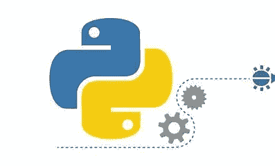

# 用 Python 进行函数编程

> 原文：<https://medium.com/analytics-vidhya/function-programming-with-python-7726493fbedd?source=collection_archive---------13----------------------->



## **什么是函数式编程？**

函数式编程语言是专门为处理符号计算和列表处理应用而设计的。函数式编程基于数学函数。一些流行的函数式编程语言包括:Lisp、Python、Erlang、Haskell、Clojure 等。

最近，函数式编程的使用越来越多。因此，许多传统的命令式语言，如 Java 和 Python 已经开始支持函数式编程技术。在本文中，假设您对函数式编程有基本的了解，我将向您介绍其中的一些技术。如果你不熟悉基本函数编程，可以查看这篇关于[函数编程](/@yannickdot/functional-programming-101-6bc132674ec5)的文章。

## **一级功能**

Python 函数是第一类对象。因此，我们可以将它们赋给变量，将它们作为参数传递给其他函数，将它们存储在字典等其他数据结构中，并将它们用作其他函数的返回值。

在下面的例子中，我们将函数赋给一个变量。这个赋值没有调用函数。它接受由 shout 引用的函数对象，并创建指向它的第二个名称 Tell。

```
***def*** Show(*Text*): return Text.upper()**print**(Show("Hello World"))Tell = Show**print**(Tell("Hello World"))**OUTPUT** HELLO WORLD
HELLO WORLD
```

由于函数是对象，我们可以将函数`Show`赋给任何变量，然后调用该变量来引用函数。例如，我们可以将它赋给变量`Tell.`

# 数据结构中的函数

与其他对象一样，函数也可以存储在数据结构中。例如，我们可以创建一个从`int`到`func.`的映射字典，这在`int`是要执行的过程的简写时很有用。

```
*#INITIALIZING DICTIONARY
dict = {* 0*: func1,
   *1***:*** *func2
}* x = input() *#GET INTEGER VALUE FROM USER*
dict[x]() *#CALL THE FUNCTION RETURNED BY DICTIONARY ACCESS*
```

# 用作参数和返回值

一个函数可以有多个参数，这些参数可以是对象、变量(相同或不同的数据类型)和函数。

函数也可以作为其他函数的参数和返回值。接受或返回函数的函数称为 [*高阶函数*](https://en.wikipedia.org/wiki/Higher-order_function) ，是函数式编程的重要组成部分。

高阶函数非常强大。正如在雄辩的 JavaScript 上深入解释的[:](https://eloquentjavascript.net/05_higher_order.html)

考虑一个例子。

假设我们想要遍历一个条目列表并按顺序打印它们。我们可以很容易地构建一个`iterate`函数:

```
**def** iterate(list_of_items):
    for item in list_of_items:
       ** print**(item)
```

这可能看起来很酷，但这只是抽象的一个层次。如果我们想在遍历列表时做一些不同的事情(而不是打印)呢？

这就是高阶函数的用武之地。我们可以创建一个函数`iterate_custom`,它接受一个要迭代的列表和一个要应用于每个项目的函数:

```
**def** iterate_custom(list_of_items, custom_func):
 **for** item **in** list_of_items:
        custom_func(item)
```

虽然这看起来微不足道，但它非常强大。

我们已经提升了一个抽象层，使我们的代码更加可重用。现在，我们不仅可以在想要打印列表时调用该函数，还可以对列表做任何涉及顺序迭代的事情。

函数也可以被返回以使事情更简单。就像我们如何在`dict`中存储函数一样，我们也可以使用函数作为控制流来决定合适的函数。例如:

```
**def** add(x, y):
    **return** x + ydef sub(x, y):
   ** return** x - ydef mult(x, y):
    **return** x * ydef calculator(opcode):
    **if** opcode == 1:
       **return** add
   ** elif** opcode == 2:
       **return** sub
    **else**:
      ** return** mult my_calc = calculator(2) #MY CALC IS A SUBSTRACOTR
my_calc(5, 4) #RETURNS 5 - 4 = 1 
my_calc = calculator(9) #MY CALC IS A MULTIPLLIER
my_calc(5, 4) #returns 5 x 4 = 20.
```

# 嵌套函数

函数也可以在其他函数内部定义，这些函数被恰当地称为*内部函数。这些对于制作*辅助函数*特别有用——小的、可重用的函数，支持主函数作为子模块。*

当一个问题需要一个特定的函数定义(参数类型或顺序)时，Helper 函数是很方便的，但是不遵循约定更容易解决问题。一个很好的例子来自[这张讲座幻灯片](http://www-inst.eecs.berkeley.edu/~cs61a/sp12/lectures/lect4-2x3.pdf)。

假设你想定义一个斐波那契函数，`fib(n)`，它有一个参数，`n`，我们必须返回`nth`斐波那契数。

定义这种函数的一种可能方式是使用跟踪斐波纳契数列的前两项的辅助函数(因为斐波纳契数只是前两个斐波纳契数的和)。

```
**def** fib(n):
   ** def** fib_helper(fk1, fk, k):
        **if** n == k:
         **  return** fk
        **else**:
           **return** fib_helper(fk, fk1+fk, k+1)    if n <= 1:
       **return** n
  **  else**:
      ** return** fib_helper(0, 1, 1)
```

将计算从函数体转移到函数参数是非常强大的，因为它减少了递归方法中可能出现的冗余计算。

# λ表达式(单一表达式函数)

我们如何定义一个函数而不给它起任何名字？我们可以应用 lambda 函数来定义短函数和在线函数，如下所示。

```
add = **lambda** x, y: x + y
add(1, 2) *#RETURNS 2*
```

这个`add`的行为与前面使用传统的`def`关键字定义的行为完全相同。

请注意，lambda 函数必须是一行程序，并且不能包含程序员编写的返回语句。

事实上，它们总是有一个隐式的 return 语句(在上面的例子中，它会说`return x + y`，但是我们省略了 lambda 函数的显式 return 语句)。

lambda 函数更加强大和简洁，因为我们还可以构造匿名函数——没有名字的函数:

`(**lambda** x, y: x * y)(9, 10) #RETURNS 90`

这是一个方便的方法，只要我们只需要一次函数，以后就不用了。例如，在填写字典时:

```
**import** collections
pre_fill = collections.**defaultdict**(lambda: (0, 0))
#all dictionary keys and values are set to 0
```

我们现在可以看看地图，过滤，并减少欣赏λ更多。

# 映射、过滤和减少

## **1。地图**

`map`是一个函数，它接受一组输入，并根据指定的函数将它们转换成另一组输入。这与`iterate_custom`功能相同。例如:

```
***def*** substract_1(*x*): **  return** x - 1
scores = [10, 9, 8, 7, 6, 5]
new_scores = ***list***(map(substract_1, scores))
#NEW SCORES ARE NOW [9, 8, 7, 6, 5, 4]
**print**(new_scores)
```

在 Python 3 中，`map`函数返回一个`map`对象，可以将其类型转换为`list`供我们使用。现在，我们可以定义一个`lambda`表达式，而不是显式定义`multiply_by_four`函数:

```
new_scores = list(map(lambda x: X-4, scores))
```

## 2.过滤器

`filter`顾名思义，就是帮助“过滤”掉不需要的项目的功能。例如，我们可能想过滤掉所有来自`scores`的奇数。我们可以使用`filter`来实现:

```
even_scores = **list**(filter(**lambda** x: (x % 2 == 0), scores))
#even_scores = [6, 8]
```

因为提供给`filter`的函数根据具体情况决定是否接受一个项目，所以该函数必须返回一个`bool`值(如上面的 lambda 函数所示)，并且必须是一元的(接受一个输入参数)。

## 3.减少

`reduce`是一个对一组数据进行“汇总”或“概括”的功能。例如，如果我们想计算所有分数的总和，我们可以使用`reduce`:

```
sum_scores = **reduce**((**lambda** x, y: x + y), scores)
#sum_scores = 32
```

这比写循环简单多了。注意，提供给`reduce`的函数需要两个参数:一个代表当前被检查的项目，一个是应用操作的累积结果。

请注意，以上只是让您开始使用 Python 进行函数式编程，尽管是彻底地开始。

此外，您可以在这个[黑客等级](https://www.hackerrank.com/domains/fp)模块中练习和探索这些概念。

感谢阅读，如果觉得有用可以考虑 clap。