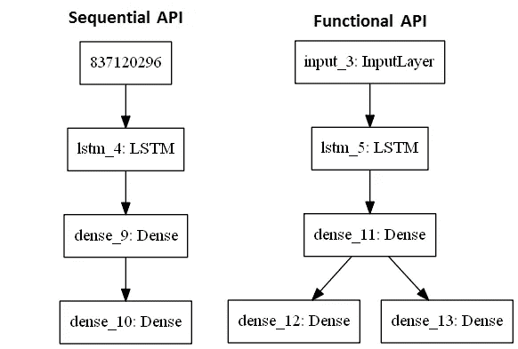
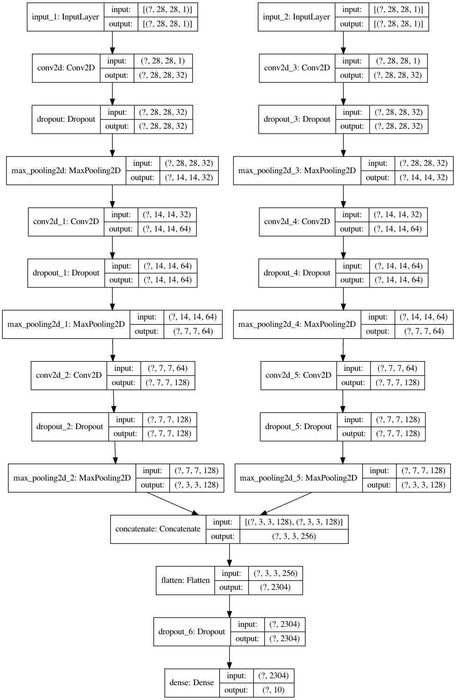

# Tensorflow 2.0 的功能 API 模型(Y 型网络)

> 原文：<https://medium.com/analytics-vidhya/functional-api-model-with-tensorflow-2-0-y-network-ed59bfd810?source=collection_archive---------7----------------------->

在这个博客中，我们将在一个**功能 API** 的帮助下创建一个 **CNN-Y-Network(2 个输入，1 个输出)**

## 顺序 API 与函数 API

一个**顺序** **API** 创建一个逐层格式的模型，它只有一个输入和输出，所以它不能创建一个可以共享层或者有多个输入或输出的模型。

一个**功能 API** 创建了一个更加灵活的模型，因此您可以轻松定义模型，其中的层不仅仅连接到上一层和下一层。事实上，您可以将层连接到(字面上)任何其他层。结果，创造了复杂的网络。

既然已经定义了 API，我将演示一个具有 2 个输入和 1 个输出的**功能 API**( Y 网络)

## 让我们开始进口

我将使用 Tensorflow API 来创建这个模型。我将使用以下这些层:密集，Conv2D，Maxpooling2D，扁平化，辍学，我们也将使用连接层来结合两个输入和一个输入层。

我们还将使用 **Mnist 数据集**测试模型，并使用 **plot_model** 函数绘制模型

## 加载数据

加载数据并转换成一种热编码格式

## 预处理数据

现在，让我们对数据进行预处理，并将其除以 255 进行归一化

## 因素

现在，让我们定义参数，如辍学率、过滤器数量、CNN(卷积神经网络)的内核大小和批量大小

## Y 网络的左支

由于该功能模型基于 2 个输入，因此让我们从第一个输入(Y 网络的左分支)开始，这里我们创建一个具有 3 层 Conv2D、Maxpooling2D 和 Dropout 的模型，其中滤波器数量随着每一层的增加而增加 2 倍

## Y 网络的右分支

它与左分支非常相似，只是 Conv2D 有一个额外的膨胀参数(这使得 3X3 内核的视野为 5X5)

## 创建并打印模型

现在，我们将使用串联层将两个分支连接起来，作为密集层的输入，密集层将作为输出。现在连接输入和输出，创建一个**功能 API 模型**，并使用 plot_model 函数绘制 Y 型网络

**标绘模型**

现在让我们来看看绘制的 Y 型网络

## 编译、运行和测试

我编译该模型，并将 Adam 算法定义为优化器，将稀疏分类交叉熵定义为损失函数。最后，我将模型与训练数据进行拟合。我们将把测试数据作为验证数据集并运行它

你可以从 [**这里**](https://github.com/Pavankunchala/Deep-Learning/blob/master/Tensorflow_Basics/Functional-Model/cnn_Y_Netwrok.py) 找到博客的代码

**PS** :如果你有任何疑问可以在这里给我发邮件[，你可以在我的 linkedin 上从](http://pavankunchalapk@gmail.com/) [**这里**](https://www.linkedin.com/in/pavan-kumar-reddy-kunchala/) 联系我，你也可以在我的 Github 上从 [**这里**](https://github.com/Pavankunchala) 查看我的其他代码(里面有很酷的东西)

我也在寻找深度学习和计算机视觉领域的自由职业机会，如果你愿意合作，请给我发邮件([pavankunchalapk@gmail.com](mailto:pavankunchalapk@gmail.com))

祝你有美好的一天！