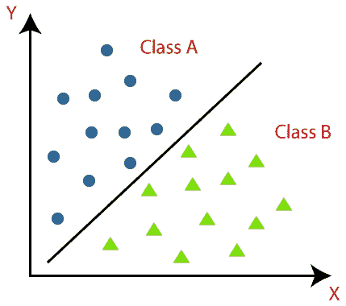
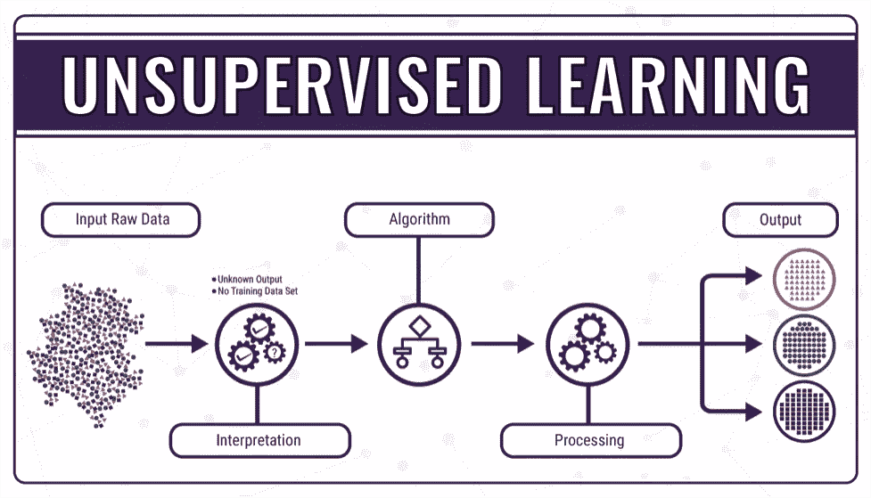
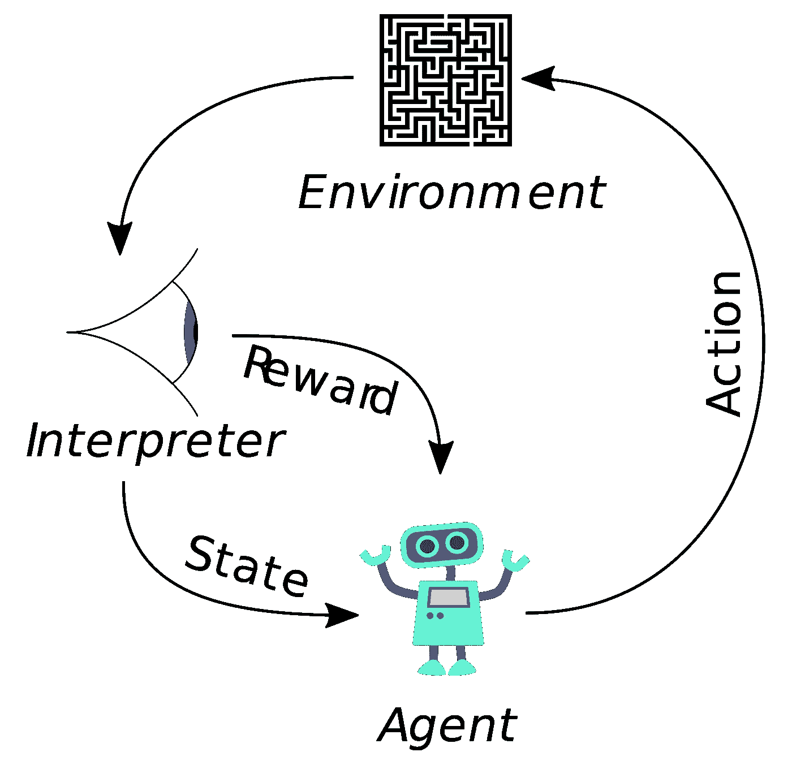

# 机器学习基础第 1 部分

> 原文：<https://medium.com/analytics-vidhya/fundamentals-of-machine-learning-part-1-23b7931c67ae?source=collection_archive---------20----------------------->

# 什么是机器学习？

*   网飞或亚马逊上的电影/东西的在线/购物推荐？答案是机器学习。
*   欺诈检测？答案是机器学习。
*   自动驾驶汽车？答案是机器学习
*   银行贷款审批？答案是机器学习。

我们没有意识到，但我们生活在一个机器学习做所有繁重工作的时代。我们正在慢慢成为机器学习产品的巨大消费者。无论是购物，电影推荐，健康相关问题。机器学习正在成为我们日常生活的重要部分。顾名思义，学习模仿人类任务的能力被称为机器学习。用更专业的术语来说，这是其定义的两种不同变体。

## 亚瑟·塞缪尔:-

一个研究领域，给予计算机无需明确编程就能学习的能力。

## 汤姆·米切尔:-

一个计算机程序被认为是从关于某个任务“T”和某个性能度量“P”的经验“E”中学习的，如果它在 T 上的性能(由 P 度量)随着经验 E 而提高。

# 为什么我们要利用机器学习来完成我们的工作？

## 不同于正常的编程范式:-

一种机器学习算法可以胜过由大量手动调整和规则集得到的算法。您还可以找到复杂问题的解决方案，对于这些问题，普通的编程范式无法给出好的解决方案。

## 适应性:-

机器学习系统可以适应新数据。

## 可扩展性:-

机器学习系统是可扩展的，可以处理万亿字节的数据。

# 机器学习方法的类型:-

机器学习系统可以根据它们在训练期间得到的监督类型进行分类。有三大类。

## 监督学习:-

在这种类型的学习中，你输入期望的解决方案，也就是算法的标签。用更专业的术语来说，它是一组(X，Y ),其中 X 是“输入”或“特征”, Y 是“输出”或“目标变量”,您可以使用算法来学习从输入到输出的映射函数。Y=f(X)。现实生活中的例子

*   市场预测
*   图像分类

典型的监督学习可用于:-

*   **回归任务**:-Y 的输出或值为连续值。市场预测是回归任务的一个例子。

回归模型:-在 x 轴上我们有特征，在 y 轴上我们有连续值。

**回归任务的算法:-**

1.  **线性回归**
2.  **支持向量机(SVM)**
3.  **决策树**
4.  **随机森林树木**
5.  **朴素贝叶斯**
6.  **套索回归**
7.  **K-最近邻(KNN)**

*   **分类任务**:-Y 的输出或值为离散值。如果有两个离散值我们称之为**“二元类”**如果有多个离散值我们称之为**“多元类”**。垃圾邮件分类器、情感分类就是其中的一些例子。

二进制类:-A 类和 B 类是两个类，被一条叫做“决策边界”的线隔开。

**分类任务的算法:-**

1.  **逻辑回归**
2.  **支持向量机(SVM)(用于分类的 SVC)**
3.  **决策树**
4.  **随机森林分类器**
5.  **朴素贝叶斯分类器**
6.  **K-最近邻(KNN)**
7.  **随机梯度下降**

# 无监督学习:-

顾名思义机器是无人监管的，标签是猜测的。系统试图在没有老师的情况下学习它。相反，它允许模型自己发现以前未被发现的模式和信息。

**与监督学习相比，无监督学习算法**允许用户执行更复杂的处理任务。虽然，与其他自然学习方法相比，无监督学习可能更不可预测。无监督学习算法包括聚类、异常检测。

## **无监督学习算法的类型:-**

## 聚类:-

当谈到无监督学习时，聚类是一个重要的概念。它主要处理在未分类的数据集合中寻找结构或模式。聚类算法将处理您的数据，并找到数据中存在的自然聚类(组)。

**用于聚类的算法:-**

1.  **K-表示**
2.  **数据库扫描**
3.  **层次聚类分析**

## **可视化和降维:-**

降维是通过获得一组主要变量来减少所考虑的随机变量的数量的过程。可以分为特征选择和特征提取。它有助于选择特征，以便我们可以建立更健壮的模型。

**使用的算法有:-**

1.  **PCA(主成分分析)**
2.  **LLE(局部线性嵌入**
3.  **T 分布随机邻居嵌入(t-SNE)**

## **关联规则学习:-**

关联规则学习是一种无监督学习技术，它检查一个数据项对另一个数据项的依赖性，并相应地进行映射，以便它可以更有利可图。它试图在数据集的变量之间发现一些有趣的关系或关联。它基于不同的规则来发现数据库中变量之间的有趣关系。

1.  **先验**
2.  **Eclat**

# 强化学习:-

这是机器学习的一种非常不同的变体。它的工作原理是奖励和惩罚。如果机器做得好，它会得到奖励，如果做得不好，它会受到惩罚。

