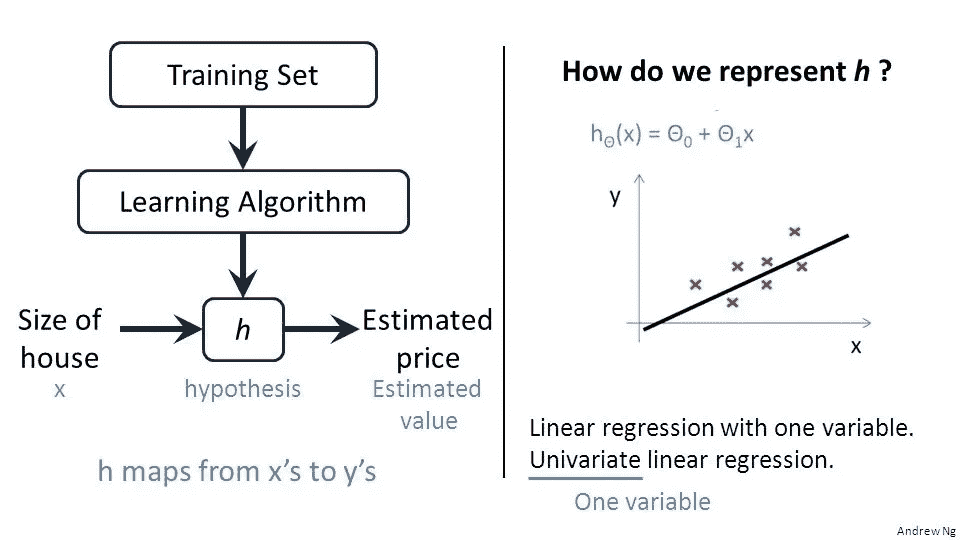
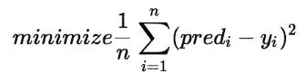
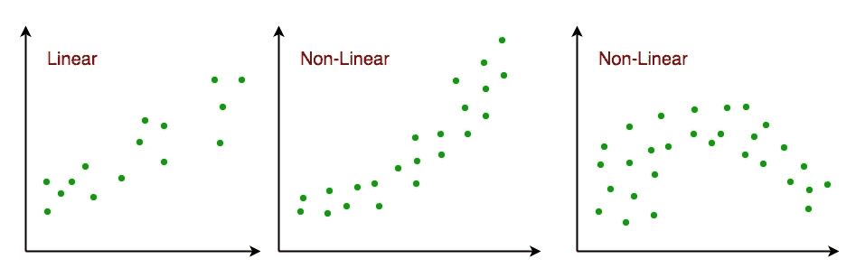
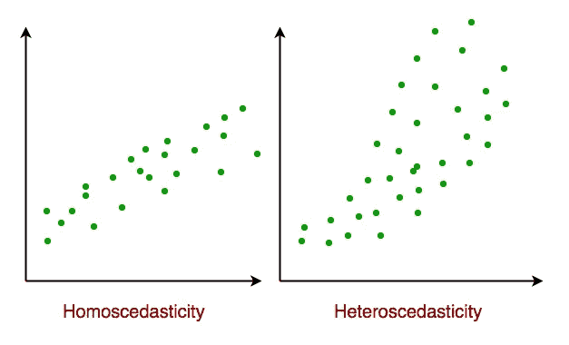
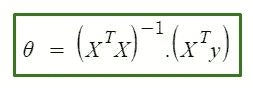

# 机器学习基础第 2 部分-线性回归

> 原文：<https://medium.com/analytics-vidhya/fundamentals-of-machine-learning-part-2-linear-regression-b7f87d804028?source=collection_archive---------16----------------------->

在本文中，我们将从头开始使用 sklearn 库实现线性回归。如果你还没有看第一篇文章，点击这个链接来获得机器学习的概述:-[https://akprpa . medium . com/fundamentals-of-Machine-Learning-part-1-23b 7931 c 67 AE](https://akprpa.medium.com/fundamentals-of-machine-learning-part-1-23b7931c67ae)

正如我们之前提到的，线性回归是一种监督学习算法，用于预测连续值。我们之所以称之为线性，是因为它试图在被称为**【X】**的**自变量**和**因变量****【Y】**之间找到一个线性关系。

假设我们有一个数据集，其中“X”为**“房屋大小”**，而“Y”为**“估计价格”**，那么学习模型将尝试找到一个**“假设”**或者简单地说，X 和 Y 之间的映射。因此，如果我们想要进行新的预测，我们可以将房屋大小输入到假设**“h”**中，并可以获得一个估计价格。对于这个只有一个特征的简单模型，假设**“h”**可以表示为:-

## **h(X) = θ0 + θ1*X**

由于我们只有一个特征，我们称之为**“一元线性回归”**。但是我们可以有一个以上的特征这些被称为**【多元线性回归】**。例如:-

## h(X)=θ0 + θ1X1 +θ2X2 +…。+θnXn

## h(X)=θ0+∑θiXi(I = 1 至 i=n)

当我们进行预测时，我们希望选择“θ”使得 **h(X)≈Y** 用于训练示例。

## 成本函数:-

我们希望最小化预测值和实际值之间的差异，因此不断更新“参数θ”非常重要，这样我们就可以得到一条拟合线，并获得最佳值，从而最小化预测值和实际值之间的误差。

我们的目的是减少这种表达。这里 n = #训练数据，y =真实值，pred=预测值。

成本函数 J

这个表达式称为成本函数(J ),它是预测值和实际值之间的**“平方误差”**。

## 梯度下降:-

为了降低成本，函数模型使用了一种非常特殊的算法，称为“梯度下降”，其思想非常简单，用零或随机值初始化参数，并迭代地尝试更新这些值并降低成本函数。

**θ - >【参数】**

选择θ以获得更稳健的预测。

**m- > #训练示例**

**X- >“输入”/“功能”**

**Y- >【输出】**

**n- > #特性**

**α - >学习率**

**Alpha(α)** 或**学习率是一个超参数**。我们需要明智地选择它，因为如果我们保持它太小，因为它需要一些时间来收敛，我们不能保持它太大，因为它开始超调。通常 **α=0.01** 或者根据你的型号你可以尝试加倍。

它也被称为**“批次梯度下降”**，因为我们一起处理整个批次。如果我们逐个例子地处理梯度下降，我们称之为**“随机梯度下降”**。

线性回归是一个被称为**广义线性模型(GLM)** 的大型模型的特例。通过使用最能描述为训练模型而给出的数据或标签的分布类型，GLMs 可用于构建回归和分类问题的模型。

## **假设:-**

以下是线性回归模型对应用该模型的数据集做出的基本假设

**1。线性关系**:-响应和特征变量之间的关系应该是线性的。可以使用散点图测试线性假设。如下所示，第一张图表示线性相关变量，而第二张图和第三张图中的变量很可能是非线性的。因此，第一张图将使用线性回归给出更好的预测。

**2。很少或没有多重共线性**:假设数据中很少或没有多重共线性。当要素(或独立变量)彼此不独立时，会出现多重共线性。

**3。很少或没有自相关**:另一个假设是数据中很少或没有自相关。当残差不是相互独立的时，就会出现自相关。

**4。同方差**:同方差描述了一种情况，其中误差项(即自变量和因变量之间关系的“噪声”或随机扰动)在所有自变量的值上都是相同的。如下所示，图 1 具有同方差性，而图 2 具有异方差性。

## 实施:-

## 正规方程:-

**正规方程**是一种使用最小二乘成本函数进行线性回归的分析方法。我们可以不用**梯度下降**直接求出θ的值。当处理具有小要素的数据集时，采用这种方法是一种有效且省时的方法。

正规方程

使用此公式，我们可以一次性获得参数θ，但有一些注意事项，我们只能将它应用于线性回归，它不适用于任何其他算法，并且 **X 转置和 X** 的乘积必须是可逆的，否则它将不起作用。