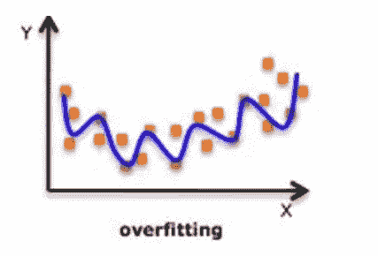
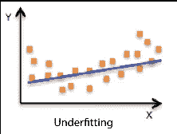
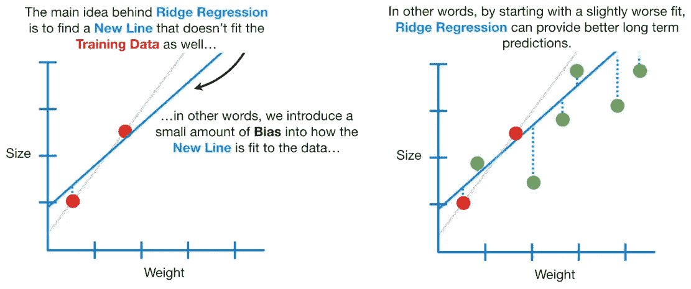
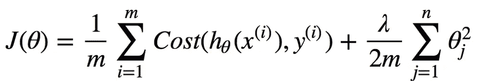
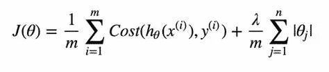
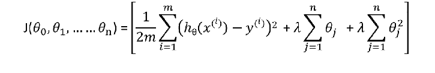
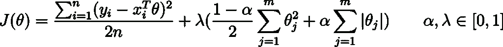

# 机器学习基础第 3 部分—回归中的正则化

> 原文：<https://medium.com/analytics-vidhya/fundamentals-of-machine-learning-part-3-regularization-in-regression-f75afd726250?source=collection_archive---------7----------------------->

在本文中，我们将在线性模型/回归中实现正则化技术。

## 先决条件:-

*   **线性回归**
*   **成本函数**
*   **梯度下降**

如果您不熟悉这些术语，那么可以考虑通读这篇文章:-

[机器学习基础第二部分-线性回归|作者阿克谢·库玛尔·雷|分析维迪亚| 2021 年 3 月|媒体](/analytics-vidhya/fundamentals-of-machine-learning-part-2-linear-regression-b7f87d804028)

在我们开始讨论线性模型或一般回归中的正则化之前。我们需要熟悉这些术语:-

## 过度拟合:-

> 简而言之，当你的模型开始吸收东西而不是从中学习时。

这个模型甚至捕捉到了噪音。

当模型开始记忆训练数据而不是学习和理解数据的潜在趋势时，就会发生过度拟合。这导致模型在新的独立数据上表现不佳。在线性回归中，成本函数是预测值和实际值之间的平方差之和，我们的目标是降低成本函数。但是在过拟合的情况下，预测值等于实际值，因此**“成本函数”的值为零**。这个模型对我们的训练集非常有效，但是当引入新的数据集时，这个模型将给出一个可怕的预测。

## 欠配:-

> 简而言之，该模型既不从数据集学习，也不吸收任何东西。

模型太简单了。

欠拟合模型对训练数据和测试数据都不太好。

模型无法理解/分析数据的潜在趋势/结构，无法从训练数据中获得关键信息。这通常发生在没有足够的训练数据或者模型做出非常简单的假设/前提时。当我们试图在非线性数据上建立线性模型时，可能会出现拟合不足的情况。

## **偏差:-**

偏差被称为 ML 模型的预测值和正确值之间的差异。偏置过高会在训练和测试数据中产生较大的误差。建议算法应始终为**低偏置**，以避免**欠拟合**的问题。
通过**高偏差**，预测的数据为直线格式，因此不能准确拟合数据集中的数据。这种拟合被称为数据的**欠拟合。**

## 差异:-

给定数据点的模型预测的可变性告诉我们数据的分布，称为模型的方差。具有**高方差**的模型对训练数据的拟合非常复杂，因此无法准确拟合之前未见过的数据。因此，这种模型在训练数据上表现得非常好，但是在测试数据上有很高的错误率。
当一个模型在方差上**高时，则称之为**数据的过度拟合**。**

## 如何克服过拟合或高方差？

*   向数据集引入更多数据。
*   **降低模型复杂度。**
*   **山脊正则化(L2 正则化)、拉索正则化(L1 正则化)和弹性网正则化。**

## 岭回归(L2 归一化):-

> **使用岭正则化(L2 归一化)的回归模型称为岭回归。**

引入一些偏差来管理高方差。

假设我们有一个数据集，该数据集只有一个要素和两个示例，如果我们尝试绘制一条连接这两个示例的线，该线将是线性的，两个数据点将**位于线**上，因此**成本函数将为零。**

但如果我们试图引入新的数据点，并要求模型做出预测，预测结果可能会非常可怕。因为模型具有**高方差或模型在训练数据上过度拟合。**

如果我们**引入一些偏差**来管理高方差，我们可以使这个模型成为一个可行的模型。这样，**成本函数将不会为零**，并且模型将能够对新的数据点做出一些有效的预测。

岭回归的新代价函数。

**m->#训练示例**

**θ - >【参数】**

**y- >【真实值】**

**h(x)——>“预测值”**

**λ- >超参数/惩罚**

*   如果 **λ=0，那么就变成线性回归。**
*   我们使用 10 倍交叉验证找到了 **λ的最佳值。**
*   **λ的值越高，我们添加到模型中的偏差就越大。**
*   如果我们对 **λ使用更高的值，那么线的斜率**将会是渐近地接近零，但决不会是零。

## 实施:-

## **套索回归(L1 归一化):-**

> **使用套索正则化(L1 归一化)的回归模型被称为套索回归。**

Lasso 回归的成本函数。

**m->#训练示例**

**θ - >【参数】**

**y- >【真实值】**

**h(x)- >【预测值】**

**λ- >超参数/惩罚**

*   如果 **λ=0，那么就变成线性回归。**
*   我们使用 10 倍交叉验证找到了 **λ的最佳值。**
*   **λ的值越高，我们添加到模型**的偏差越大，如果我们使用**更大的λ值，那么直线将变得平行于 X 轴，即斜率变为零。**

如你所见，在 Lasso 回归中，我们只添加了参数绝对值的总和**。**

## 实施:-

## 弹性净回归:-

> **弹性网回归是脊和套索的结合。**

弹性网络的新成本函数。它是脊和套索的结合。

**m->#训练实例**

**θ - >【参数】**

**y- >【真实值】**

**h(x)——>“预测值”**

**λ- >(超参数/罚值)L1、L2 归一化的两个不同的λ。**

*   如果 **λ1 和λ2 =0，则变为线性回归。**
*   我们使用 10 倍交叉验证找到了 **λ的最佳值。**

这也是弹性网成本函数的一种写法。

对于这个公式，我们有一个 **λ和一个附加项α。**

*   如果 **α=0，则成为岭回归。**
*   如果 **α=1，则变成套索回归。**

## 实施:-

## 什么时候使用脊，套索或弹性网？

> **岭回归:-** 当我们有一个小数据集，并且所有特征都非常重要和相关时。增加一些偏差有助于减少方差。
> 
> **套索回归:-** 当我们有一个包含大量特征的小数据集，并且并非所有特征都有用时。通过排除无用的特征，它有助于减少差异。
> 
> **弹性网络回归:-** 当我们有数百万个特征，并且我们事先不知道哪些是有用的/无用的特征，那么你应该选择弹性网络回归，而不是选择套索或山脊。它在处理相关参数方面也做得更好。