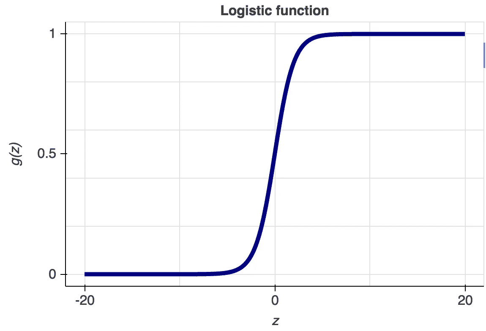
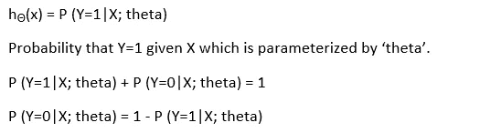
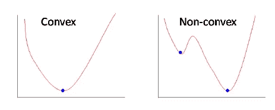
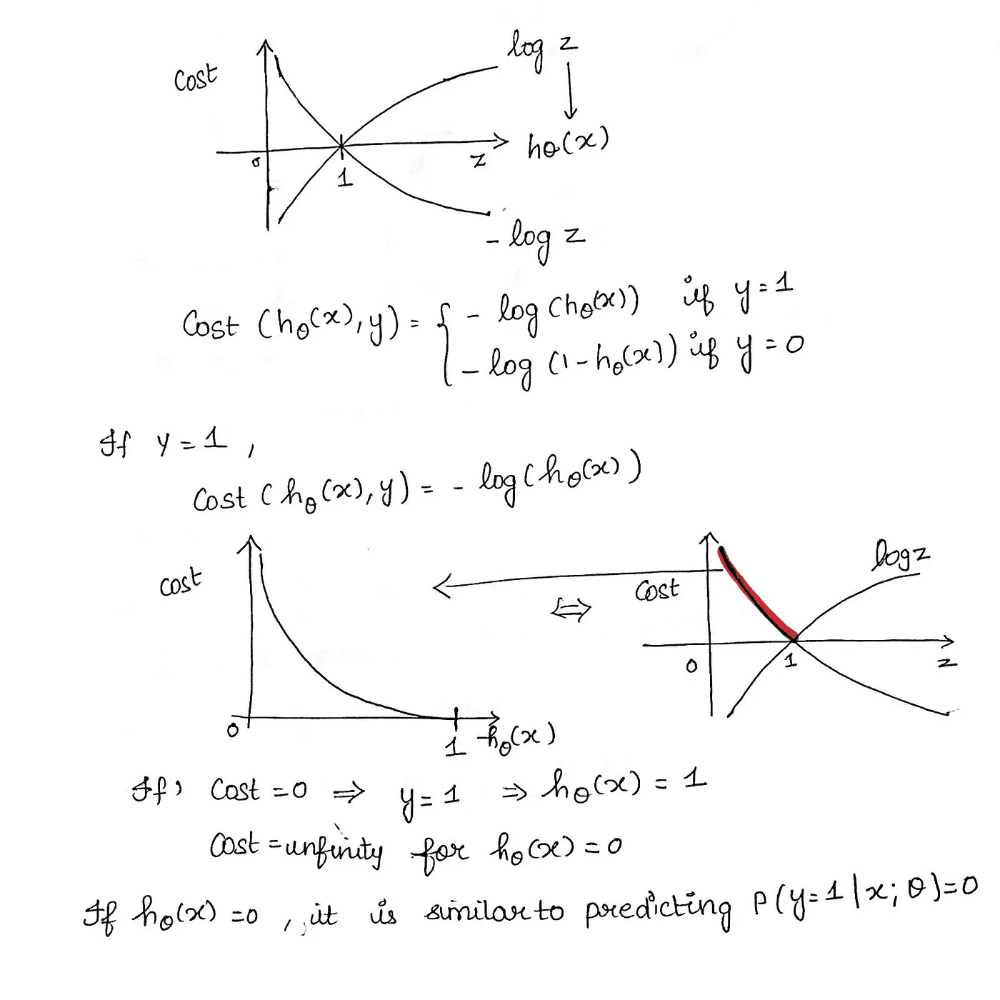
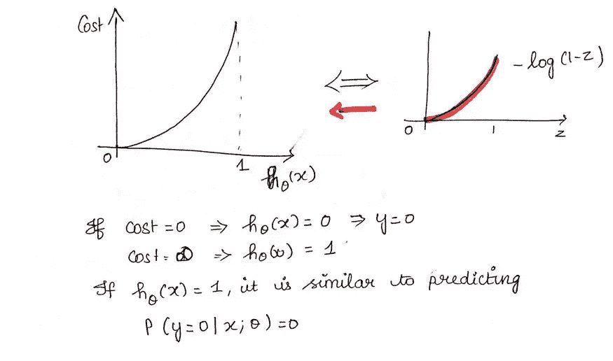
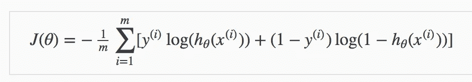
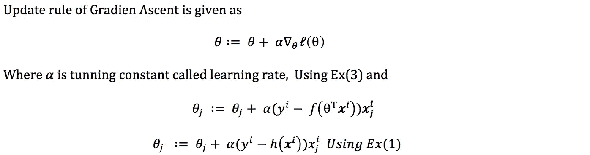
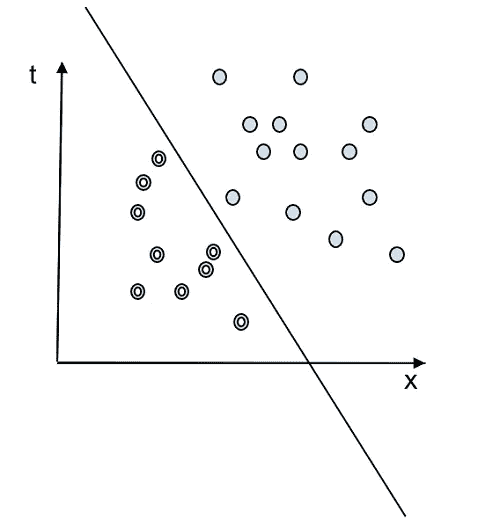
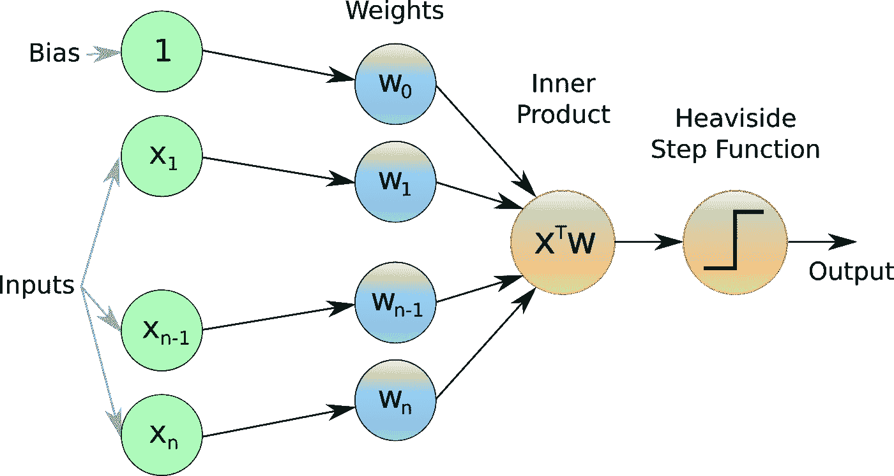

# 机器学习基础第 4 部分-逻辑回归和 PLA

> 原文：<https://medium.com/analytics-vidhya/fundamentals-of-machine-learning-part-4-logistic-regression-and-pla-19f27c769866?source=collection_archive---------10----------------------->

让我们深入研究逻辑回归和 PLA 的功能。

**先决条件:-**

**线性回归和梯度下降。**

# 逻辑回归:-

逻辑回归使用 sigmoid 函数。

我们已经讨论过线性回归，它对回归任务很有用。逻辑回归用于分类任务，其中因变量仅包含离散值。逻辑回归是一个“误称”。之所以称之为回归，是因为它利用了线性回归的基本性质。逻辑回归是根模型的子模型，被称为**“广义线性模型”**。

逻辑回归试图找到区分不同类别的最佳**“决策边界】**。它使用 **"sigmoid"** 函数，也称为 **"logistic"** ，因此它给出 0 和 1 之间的值。

乙状结肠或逻辑函数。

**g(z) = 1/(1+ exp(-z)) (sigmoid 或逻辑函数)**

如您所见，如果 **z 是一个非常大的数字**，那么 **g(z) ≈ 1** 的值和当 **z 非常小时 g(z) ≈ 0** 。

## 假设:-

我们希望我们的假设给出 0 到 1 之间的值，这是一个估计的概率。

**h(X) = g(θ。T*X)**

**g(z) = 1/(1+ exp(-z))**

**h(X) = 1/(1+ exp(-θ。T*X))**

**X :-输入，g(z) :- Sigmoid 函数，h(X) :-假设。**

这个假设的输出是一个估计的概率。这用于推断在给定输入 x 的情况下，预测值与实际值之间的可信度。

假设背后的数学。

## 决策界限:-

为了预测数据属于哪一类，可以设置一个阈值。基于该阈值，将所获得的估计概率分类。

也就是说，如果**预测值≥ 0.5** ，则归类为 1 类，否则归类为 0 类。

决策边界可以是线性或非线性的。多项式阶可以增加，以获得复杂的决策边界。

## 成本函数:-

线性回归使用**均方误差**作为其成本函数。如果这用于逻辑回归，那么它将是参数(θ)的非凸函数。梯度下降只有在函数是凸的情况下才会收敛到全局极小值。

成本函数解释。

成本函数解释。

**简化成本函数:-**

成本函数的最终形式。

**m:-#例题**

**y:——真实值**

**h(x) :-预测值**

## 梯度上升:-

在看到成本函数和 sigmoid 函数之后，现在让我们考虑一个算法，它可以将这两个函数结合起来，并给出我们想要的结果。算法是**梯度上升**算法。

所以梯度上升是一种寻找可微函数局部最大值的迭代优化算法。该算法沿着在成本函数曲线的每个点计算的梯度方向移动，直到满足停止标准。

梯度上升

说得够多了，让我们开始实施吧。

## 实施:-

# PLA(感知学习算法):-

PLA 或感知器学习算法是用于分类问题的最古老的监督学习算法之一。在分类问题中，因变量只包含离散值，它们也被称为**【标签】**。在一个数据集中，我们可以有两个或两个以上的标签。建议使用 PLA 进行**二元类分类**，其中类是线性可分的。

在这种情况下，这两类是线性可分的。

分隔这两个类的线被称为**“决策边界”**。该算法想要找到将平原分成两个区域的最佳决策边界。如果点位于边界的右侧，它们就是正标签数据。如果它们位于边界的左侧，它们被称为负标签数据。让我们试着找到这条线。

## 感知器假设:-

设**【g】**为某种函数，**【z】**为输入。该函数只接受输入，如果输出大于或等于零，则返回 **"1"** 正标签，否则返回 **"0"** 负标签。

**如果 z≥0，g(z) = 1，否则为 0**

**X:——数据集/自变量的特征(x1，x2，x3…… )**

**W :-参数的权重(w0，w1，w2 ......)。)w0 是偏置。**

**g(z) :-激活函数/亥维赛阶跃函数。**

**我们简单的假设是:-**

**h(X) = g(W.T*X)**

为了简单起见，我们在 x 中包括偏差“x0”。

## 算法:-

我们尝试调整 W 的权重，以得到一条将平原分成两半的线。为此，我们需要尝试不同的 w 值。

中国人民解放军（the People's Liberation Army）

**给定训练集:-**

**{(x1，y1)，(x1，y2)，……。}**

**选择一个错误分类的点:-**

**g(W.T*x1)！= y1，然后**

**更新 W 的值:-**

**W= W+ alpha*(y-h(x))*x**

**y:——真实值**

**h(x) :-预测值**

**W :-重量/参数**

这是 PLA 的一次迭代，我们需要对所有训练数据点重复该过程。

**“alpha”**是**学习率**。

## 实施:-