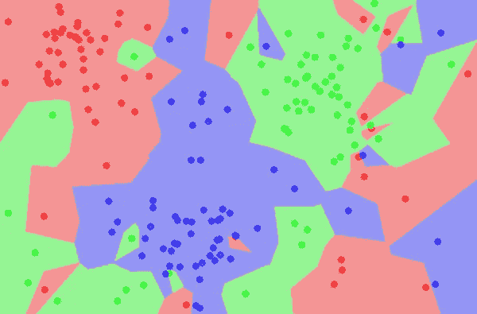
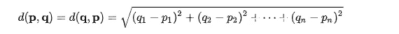
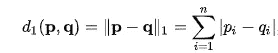
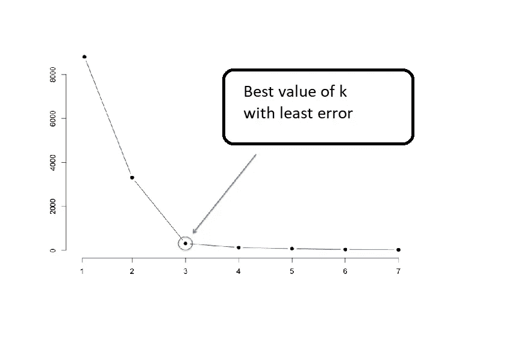

# 机器学习基础第 5 部分- KNN(K 近邻)

> 原文：<https://medium.com/analytics-vidhya/fundamentals-of-machine-learning-part-5-knn-k-nearest-neighbors-905e66229a0b?source=collection_archive---------20----------------------->

在这篇文章中，我们将讨论一个非常著名的机器学习算法，它既用于分类，也用于回归。

> **‘物以类聚’**

KNN 算法基于这样的假设，即具有相似输入的数据将具有相似的输出。KNN 算法假设相似的事物存在于附近。换句话说，相似的东西彼此更接近。

相似数据点彼此保持接近。

**现在的问题是如何衡量这些点之间的相似性？**

有很多方法可以找到它，你可能对其中一些很熟悉。但是用的比较多的是点与点之间的距离。

# **测距:-**

找到相似数据点的基本方法之一是找到它们之间的距离，如果它们很接近，距离会更小，这表明它们属于同一类。相反，如果距离很大，这意味着他们不相似，他们不属于同一类。

**现在如何测量两点之间的距离？**

## 欧几里德距离:-

等等，我们以前没用过这个吗？是的，你是对的，我们已经用了很久了。这是最基本和最短的距离查找技术，定义如下:

p 和 q 是 n 维平面中的数据点。

它对大的差异高度敏感。因为它对具有较大差异的距离求平方，并对计算产生巨大影响。

## 曼哈顿距离:-

它也被称为*城市街区、出租车距离、蛇形距离或 L1 范数*，它计算点坐标之间的绝对差之和。

p 和 q 是 n 维平面中的数据点。

## ***闵可夫斯基距离:-***

用于找出任意给定两点 ***p*** 和 ***q*** 之间的距离的通用形式如下所示，也称为 ***【闵可夫斯基距离】*** :

p 和 q 是 n 维平面中的数据点。

这种形式看起来不像欧几里德和曼哈顿吗？

你可以称这个公式为求两点间距离的根公式。欧几里得和曼哈顿是这个根公式的子公式。

**如果 a =1 那么，叫做曼哈顿距离。**

**若 a =2 则称之为欧氏距离。**

**若 a =∞则称之为切比雪夫距离。**

## 切比雪夫距离:-

对于切比雪夫距离，两点之间的距离是它们沿任意坐标维度的最大差值。

p 和 q 是 n 维平面中的数据点。

# KNN 算法:-

*   在具有 n 个特征和不同类别/标签的训练集中加载具有 m 个示例的数据集。
*   初始化 K(超参数)，邻居的数量。
*   计算测试数据点和训练数据点之间的距离。
*   将示例的距离和索引添加到有序集合中。
*   按距离从小到大(按升序)对距离和索引的有序集合进行排序。
*   从排序的集合中挑选前 K 个条目。
*   获取所选 K 个条目的标签。
*   如果是回归，返回 K 个标签的平均值。
*   如果分类，返回 K 个标签的模式(拥有最多票数的类别)。

# 如何挑选 K 的最佳值？

*   如果 K = 1，则查看邻居并将数据点映射到与邻居相同的类(用于分类)/值(用于回归)。
*   如果 K = 100 那么，这将使模型 ***过于一般化*** ，而 ***偏高*** 和 ***欠拟合。*** 测试和训练数据的性能都不好。
*   如果 K = m(数据集中的样本数)，则将所有数据点映射到数据集中最大的类。

## 调整参数 K:-

*   总是尝试为 k 选择奇数值。这有助于打破类之间的平局。
*   尝试根据不同的 k 值绘制验证数据点的**错误率**

K =3 似乎很适合算法。

当您绘制不同 K 值的错误率之间的图表时，您会发现在某个点之后，错误率**将不会显示任何显著下降。**

*   你也可以试试 **K =floor(sqrt(m))** 其中 m 是数据集中的例子数。这只是一个神奇的数字，似乎在大多数情况下都有效。

## 重要事项:-

在使用 KNN 之前，确保你的数据集是完全缩放的。

## 优点:-

1.  KNN 是一种简单的数据分类方法。
2.  KNN 既可用于分类，也可用于回归。
3.  这是一种非参数学习。它不会对基础分布做出任何假设，也不会尝试对其进行估计。

## 反对意见:-

1.  容易受到异常值或不平衡数据集的影响。
2.  计算开销很大。
3.  在大型数据集上表现不佳。

够了，让我们编码吧。

# 实施:-