# MLOps 基础—第 1 部分| m lops 简介

> 原文：<https://medium.com/analytics-vidhya/fundamentals-of-mlops-part-1-a-gentle-introduction-to-mlops-1b184d2c32a8?source=collection_archive---------1----------------------->

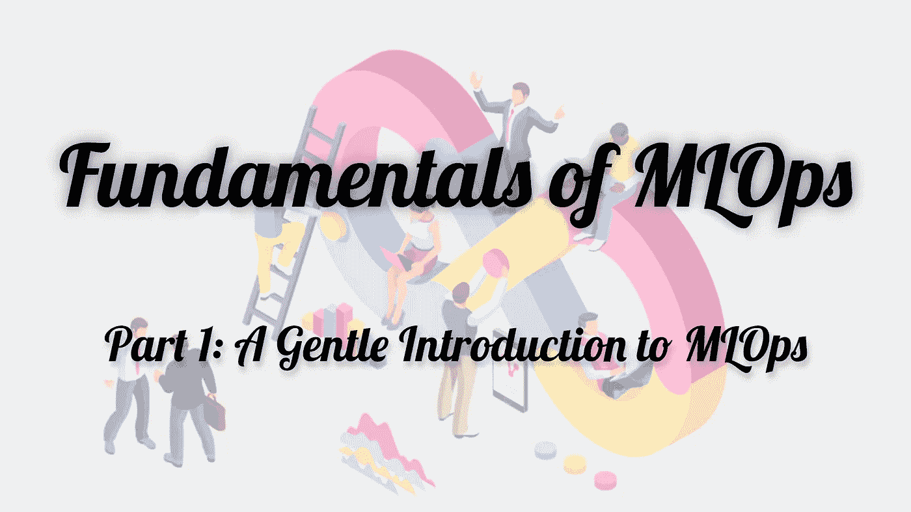

有没有想过组织如何构建、部署、维护、调整、再培训和重新部署大规模人工智能应用？在当今快节奏的行业中，维护和部署可伸缩的应用程序，同时能够快速适应不断变化的消费者需求是至关重要的。

*通过这个关于****MLOps****基础的 4 篇博客系列，你将了解到 DevOps 长期实践与新兴机器学习领域相结合背后的一些核心思想。你将接触到 ML 模型生命周期的各个阶段，包括数据版本化、实验、评估&监控。为了巩固这些原则，您还将有机会利用各种 ML 操作管理工具&框架，如****【DVC】****，****py caret****，****ML flow****&****FastAPI***

*到本系列结束时，您将已经培训、试验了&在 AWS 上部署了一个生产就绪的 ML 模型，&使用 FastAPI 服务它。*

# 内容

*   介绍
*   DevOps 原则的兴起和采用
*   MLOps 去神秘化
*   ML 工作流生命周期
*   MLOps 原则
*   MLOps 解决方案的优势
*   与 MLOps 相关的挑战
*   面向 MLOps 的工具和基础架构
*   采用 MLOps
*   结束语
*   附加参考

# 介绍

机器学习(ML)是一种人工智能(AI)技术，允许系统根据经验而不是显式编程来自动学习和改进。近年来，无论是在学术界还是在现实世界商业挑战的解决方案中，ML 都获得了极大的兴趣。曼梯·里正在通过使医疗保健、教育、运输、食品、娱乐和各种装配线等行业现代化来彻底改变世界。然而，当用于生产时(很容易被掩盖), ML 世界的一些苦涩事实是:

*   将 ML 模型部署到产品中比创建它们花费的时间要长得多
*   实际的 ML 代码只是真实 ML 系统的一小部分，而生产环境中的基础设施是广泛而复杂的

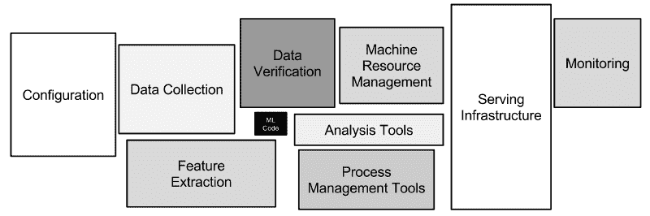

***图片来源:*** [*机器学习系统中隐藏的技术债务*](https://papers.nips.cc/paper/2015/file/86df7dcfd896fcaf2674f757a2463eba-Paper.pdf)

从历史上看， **~85 %的 ML 车型从未投产**。调查报告也表明，只有大约 60%的项目从原型成功进入生产阶段(T3)，这也发生在那些拥有不错的人工智能经验的组织中。此外，这类产品和服务的交付期限通常以月为单位，而理想情况下，它们应该以小时(或最多以天)为单位。根据 [2020 年企业机器学习状况报告](https://info.algorithmia.com/hubfs/2019/Whitepapers/The-State-of-Enterprise-ML-2020/Algorithmia_2020_State_of_Enterprise_ML.pdf?utm_campaign=The%20Batch&utm_source=hs_email&utm_medium=email&utm_content=80984419&_hsmi=80984419)，开发具有 ML 功能的系统的人面临的主要挑战是规模、版本控制、模型可再现性和对齐利益相关者。

这些研究应该足以让人们认识到这样一个事实:尽管看起来很简单，但将 ML 研究引入学术界以构建生产就绪和可用的 ML 系统需要比人们想象的更多的考虑。

最终，ML 系统归结为开发和实现计算机代码。因此，尽管有一些鲜明的对比，这些系统的管理与传统的软件开发不相上下也就不足为奇了。为了理解如何提高 ML 系统的可操作性(部署和维护)*(通过 MLOps)* ，我们首先需要理解 **DevOps** 的一些基本原则，这些原则已经被证明可以提高组织比传统软件开发过程更快地交付应用和服务的能力。

# DevOps 原则的兴起和采用

*由于 MLOps 的根源来自于几个 DevOps 原则，因此有必要花些时间了解 DevOps 理念&的一些实践。本部分致力于提供 DevOps 文化、实践、工具&采用的快速概述。*

DevOps 指的是将开发 *(Dev)* & IT 运营*(Ops)*与优化从创意到最终用户的价值流的主要目标相结合的一套实践和工具。这通常通过以下方式实现:

*   缩短软件系统开发生命周期
*   为[连续交付](https://continuousdelivery.com/)提供高质量的软件

DevOps 通常旨在克服编写代码的团队 *(Dev)* 和管理用于运行和管理产品的基础设施和工具的团队 *(Ops)* 之间的制度分歧。

## DevOps 实践和工具

DevOps 实践反映了持续改进和自动化的理念，包括:

*   持续发展
*   连续测试
*   持续集成
*   连续交货
*   持续部署(CD)
*   连续监视
*   基础设施作为代码

DevOps 实践的追随者经常使用某些 DevOps 友好的工具作为他们 DevOps *“工具链”*的一部分。这些工具的目标是进一步简化、缩短和自动化软件交付工作流程的各个阶段。下图清晰地描绘了 DevOps 生命周期的各个阶段&以及与每个阶段相关的重要工具。

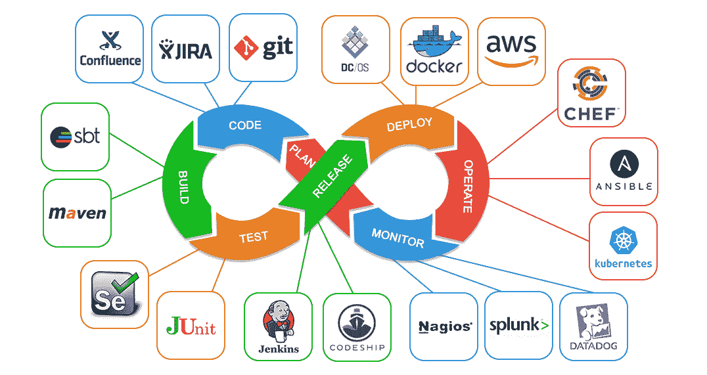

***图片来源:*** [*DevOps 不带 DevOps 工具*](https://faun.pub/devops-without-devops-tools-3f1deb451b1c)

## DevOps 文化和心态

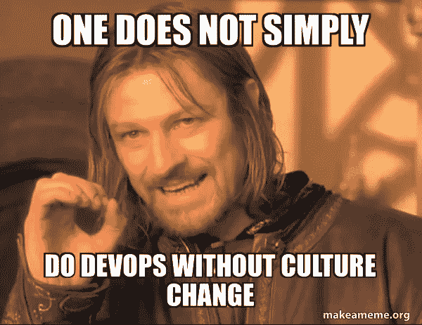

***图片来源:*** [*作者*](https://makeameme.org/meme/one-does-not-9bb26cc246) 创作

虽然 DevOps 可能会参考很多技术方案，但是为了做那些实践，我们需要人。因此，要实现这样的解决方案，首先关注人员、协作和心态对于成功实现 DevOps 至关重要。这可能是思维方式的重大转变。以下是开发运维心态的一些基本价值观:

*   关注我们的利益相关者和他们的反馈，而不是简单地为了改变而改变
*   努力在可重复的流程和框架之外不断创新和改进
*   启发和分享协作，而不是创造一个筒仓
*   衡量整个组织的绩效，而不仅仅是业务线的绩效
*   通过精益质量交付来促进学习文化，而不仅仅是工具和自动化

## 采用 DevOps

在过去的 15 年中，成千上万的组织采用了 DevOps 工作方式，以便更有效地适应业务问题。一些利用 DevOps 文化扼杀 it 的公司包括亚马逊、沃尔玛、网飞、脸书、诺德斯特龙等。

DevOps 会留下来——理由很充分。许多人认为这是不可能的，但 DevOps 成功地将业务用户、开发人员、测试工程师、安全工程师和系统管理员聚集在一个统一的过程中，专注于满足客户需求。

## 合并 ML 和 DevOps 的动机

在 AI/ML 的世界中，数据科学家(如软件开发人员)必须与各种其他团队密切合作，包括业务、工程和运营团队，以操作 ML 模型。与 ML 模型操作化相关的挑战与软件生产的挑战非常相似，DevOps 在软件生产中显示了它的价值。DevOps 实践的成功及其被几个软件开发组织迅速采用，也促使人们使用类似的原则来简化和改进机器学习系统的开发、部署和维护。

# MLOps 去神秘化

MLOps 或机器学习操作是一个相对较新的学科，旨在通过实现使机器学习可重复、协作和连续的基本概念，弥合 ML 模型的实验和生产之间的差距。

维基百科对 MLOps 的定义是:

> MLOps 是将实验机器学习模型引入生产系统的过程。

虽然乍看起来似乎是 **MLOps = ML + DevOps** *(因为它很大程度上借鉴了 DevOps 的概念)*，但这并不是 MLOps 最准确的表述。尽管它们有相似之处，但有一个关键的不同点将 DevOps & MLOps 分开:虽然软件代码是*静态的*(相对而言)，但数据总是在变化，这意味着 ML 模型必须不断学习和适应更新的输入。这种环境的复杂性，以及机器学习模型由代码和数据组成的事实，是 MLOps 成为一个新的独特领域的原因。

由于*数据工程*为解决生产中的 ML 难题提供了不可或缺的重要工具和概念，MLOps 可以定义如下:

> MLOps 是位于 ML、DevOps &数据工程之间的**交叉点的一套实践，其目的是在生产中可靠有效地部署和维护 ML 系统**

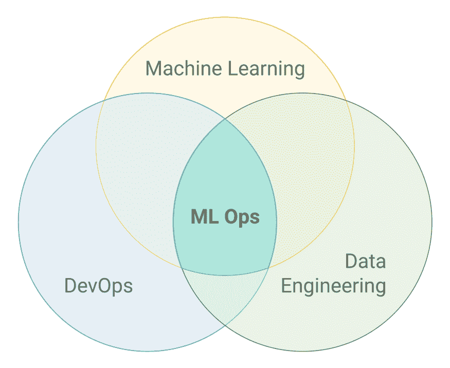

***图片来源:*** [*通向 MLOps 之路:作为工程学科的机器学习*](https://builtin.com/machine-learning/mlops)

MLOps 应对的其他一些特定于 ML 的挑战如下所述:

*   数据和超参数版本化
*   模型的迭代实验和评估
*   生产监控，以确保模型在新/未知数据下的性能
*   生产中计算能力(基础设施)的动态扩展

由于它为构建和部署端到端的 ML 系统提供了过多的工具和机会，MLOps 在数据科学家、ML 工程师和 AI 爱好者中获得了很大的吸引力。虽然 MLOps 相对来说还处于萌芽阶段，但数据科学界普遍认为它是围绕机器学习的最佳实践和指导原则的总称&而不是单一的技术解决方案。

# ML 工作流生命周期

为了理解 MLOps 中潜在的各种原则，我们首先需要看看典型的机器学习工作流生命周期是什么样子，以便我们可以认识到每个阶段的问题以及 MLOps 实践如何解决这些问题。下图描述了一个高层次的概述&一个典型的 ML 系统的核心步骤的详细表示:

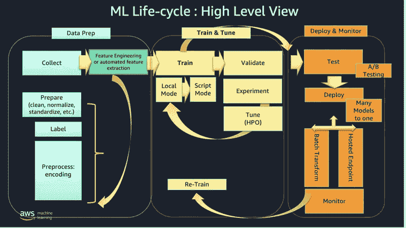

***图片来源:*** [*ML 生命周期:高层概述*](https://awsfeed.com/whats-new/machine-learning/architect-and-build-the-full-machine-learning-lifecycle-with-aws-an-end-to-end-amazon-sagemaker-demo)

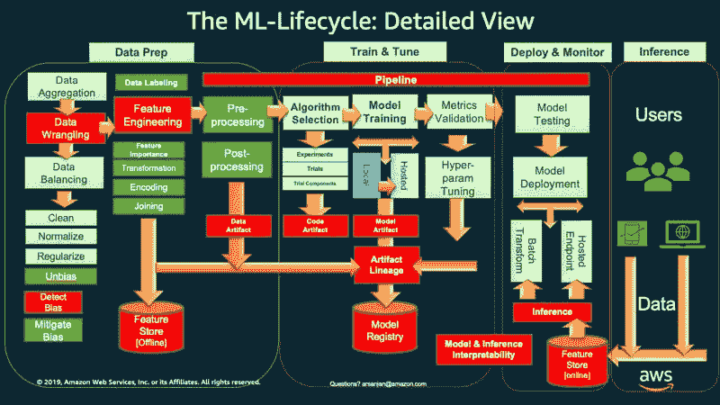

***图片来源:****[*ML-生命周期:详细查看*](https://awsfeed.com/whats-new/machine-learning/architect-and-build-the-full-machine-learning-lifecycle-with-aws-an-end-to-end-amazon-sagemaker-demo)*

*显而易见，一个经典的 ML 工作流程包括 3 个主要阶段，即*数据准备*、*模型训练&调优*(这是一个 ML 工作流程的核心)，以及*部署&监控*。接下来，我们继续深入探讨与每个阶段相关的步骤。*

**在了解 ML 工作流程的 3 个主要阶段之前，必须首先全面了解业务案例&批判性地评估 ML 解决问题陈述的要求。**

## *数据准备*

*   ***数据摄取&聚合:**它是将来自许多来源的数据收集到一个存储库中，可以从该存储库中访问、利用和分析这些数据。最常见的数据接收是批处理，它涉及定期收集数据。另一方面，使用流处理收集实时数据。*
*   ***探索性数据分析:**它是指对数据进行初步研究的基本过程，目的是使用汇总统计和图形表示来揭示模式、识别异常、测试假设和验证假设。*
*   ***数据角力:**是为了便于访问和分析而对混乱复杂的数据集进行清理和整合的行为。它还涉及纠正数据中的错误，如缺失值插补&异常值的处理。*
*   ***数据标签&标注:**是在原始数据(图片、文本文件、视频等)上添加一个或多个相关且有用的标签的行为。)并为机器学习模型的训练提供上下文。*
*   ***特征工程:**是利用领域专业知识从原始数据中提取特征(特性、特质、属性)的过程。这是最大似然算法的一个基本步骤，而深度学习任务可能并不明确要求这一步骤(因为在 DL 中，神经网络各层使用的基本特征预计是自动推断的&*
*   ***数据分割:**它包括将数据分割成训练、验证和测试数据集，用于核心机器学习阶段，以产生 ML 模型*

## *模型训练和调整*

*   ***算法选择:**这是一种在逐个实例的基础上从组合中选择算法的方法。这是由各种算法在许多实际应用中表现不同这一事实驱动的，即尽管一种算法在某些情况下表现良好，但在其他情况下表现不佳，反之亦然。*
*   ***模型训练:**对训练数据应用机器学习算法训练一个 ML 模型的过程。*
*   ***模型验证:**系统地将模型输出与独立的真实世界观察结果进行比较的过程，以便在生产中提供给最终用户之前，评估与现实的定量和定性一致性。*
*   ***超参数整定:**超参数是一个模型自变量，其值在学习过程开始前就已设定。超参数调整包括为学习算法选择一组超参数的迭代方法，直到达到最优。*

## *部署和监控*

*   ***模型测试:**在测试集上对经过充分训练的模型的性能进行评估的过程。*
*   ***模型打包:**将经过充分训练的 ML 模型导出为特定格式(如 PMML、PFA、ONNX 等)的过程。)以便最终用户可以消费它。*
*   ***模型服务:**在生产环境中部署打包的 ML 模型的过程。这可以通过两种主要方式实现:*
*   ***模型即服务:**模型被部署到一个简单的框架中，以提供一个实时响应请求的 REST API 端点*
*   ***嵌入式模型:**模型被打包成应用程序&然后发布*
*   ***性能监控:**基于实时和以前未见过的数据观察 ML 模型性能的过程，以便捕捉触发模型潜在再训练需求的信号。*

# *MLOps 原则*

*MLOps 的核心目标是规避开发&部署 ML 系统所涉及的*技术债务*。MLOps 的范例有某些支柱作为指导原则。这些保证了机器学习是*可复制的*、*协同的*、*可扩展的*和*连续的*。*

***再现性:**确保给定相同的输入，数据处理、ML 模型训练和 ML 模型部署的每个阶段应该产生相似的输出。它不仅涉及代码的版本化，还涉及数据、超参数&和其他元数据的版本化，以及工作流程每个阶段的有效文档。这使得每个生产模型都可以被审核&复制。确保再现性的一些关键实践是 ***版本化*** & ***实验跟踪****

***协作:**像 DevOps 一样，MLOps 的成功实施需要人们一起工作，协作通常是在数据科学家、ML 工程师、业务分析师和 IT 运营专业人员之间进行的。MLOps 鼓励团队将创建 ML 模型的整个过程透明化，从数据提取到模型部署和监控。*

***可扩展性:** MLOps 通过使 ML 计划更加高效和有效，使组织能够扩展以解决关键问题。这意味着训练大量模型的能力增强&也在生产中使用具有高比例数据的模型。*

***连续 X:** 一个训练好的模型的生命周期完全由用例以及底层数据的动态性质决定。如果没有连续的流程，数据科学家每次都必须花费大量精力来开发手动和临时模型。劳工和社会福利部鼓励以下做法:*

*   ***持续集成(CI)** 将测试和验证数据和模型添加到测试和验证代码和组件中。*
*   ***连续交付(CD)** 指的是自动部署另一个 ML 模型预测服务的 ML 训练管道的交付。*
*   ***持续培训(CT)** 是自动重新培训 ML 模型以便重新部署的 ML 系统特有的特征。*
*   ***持续监控(CM)** 关注生产数据的监控以及与最终用户业务指标相关的模型性能指标*

***自动化:**m lops 的目标是确保减少将模型投入生产的时间&成本。这意味着自动化端到端的 ML 工作流管道，而无需任何人工干预，这可以通过自动化触发器的形式来实现。自动化测试有助于在早期阶段快速发现问题，从而快速修复错误。*

*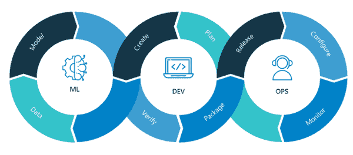*

****图片来源:*** [*Verta 推出面向混合环境的全新 ModelOps 产品*](https://nikolanews.com/verta-launches-new-modelops-product-for-hybrid-environments/)*

***下表总结了如何将 MLOps 的各种原则应用于通常的 ML 工作流程生命周期阶段。***

*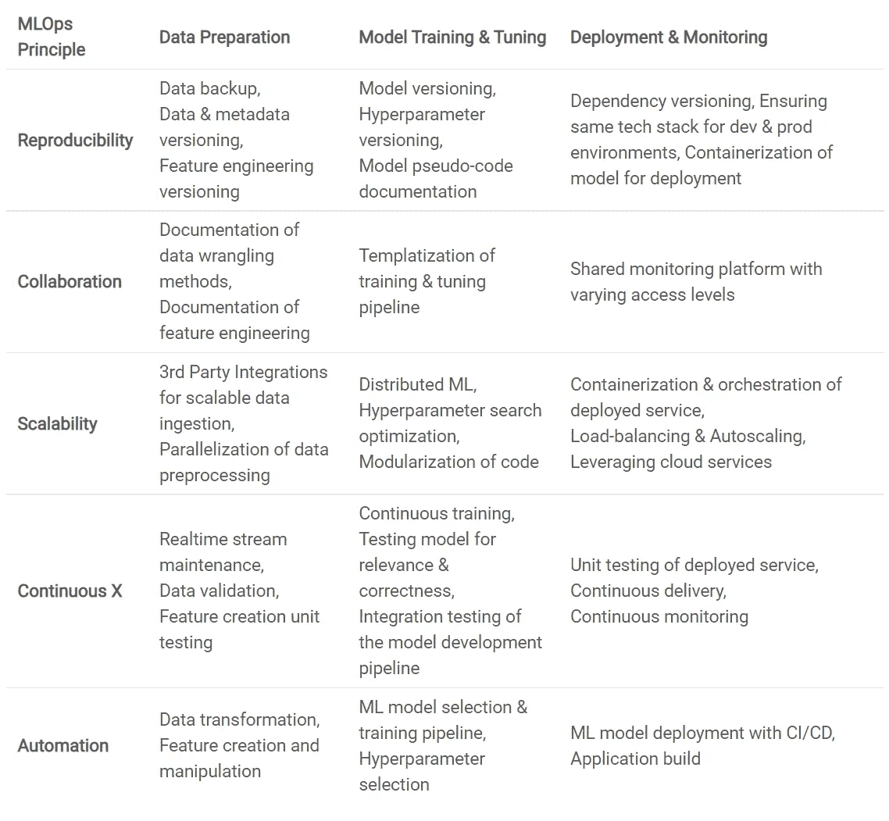*

# *MLOps 解决方案的优势*

*理解了 MLOps 的主要目标和概念后，我们现在完全能够体会它所带来的好处。*

*   *通过强大的机器学习生命周期管理实现快速创新*
*   *创建可重复的工作流和模型*
*   *为数据科学家提供明确的方向和可衡量的基准*
*   *在任何位置轻松部署高精度模型*
*   *机器学习资源管理系统与控制*
*   *数据科学团队和运营团队之间的开放式沟通，导致瓶颈的出现*
*   *数据和流程的有效治理*
*   *由于持续和集中的反馈，模型质量得到提高*
*   *严格的自动化测试和验证确保在提高可解释性的同时消除模型偏差*

## *评估 MLOps 的有效性*

*以下是可用于评估 MLOps 如何影响组织的一些指标(来自软件交付):*

*   ***部署频率:**取决于模型再培训需求&部署过程的自动化程度*
*   ***变更的交付时间:**这取决于探索性数据分析、模型选择&培训的持续时间，以及手动步骤的数量*
*   ***平均恢复时间(MTTR):** 这取决于手动执行模型调试的次数和持续时间&模型部署步骤*
*   ***变更失败率:**可以表示为当前部署的 ML 模型性能指标与之前模型的指标之差*

# *与采用 MLOps 相关的挑战*

*尽管 ML 看起来令人兴奋，但事实是随着这种技术操作技术变得越来越普遍，一个组织面临着一系列源于如何正确组合代码和数据以实现预测的问题。实施 MLOps 的组织面临的一些挑战如下:*

*   *组织对将机器学习纳入流程犹豫不决，因为在过去人们工作的地方很难依赖模型。*
*   *实现机器学习模型时对模型风险的评估和考虑*
*   *现有培训市场缺乏同样精通数据科学、开发运维与 IT 交叉领域能力的专家*
*   *对各种工具的依赖可能会导致人们沉迷于那些提供短期利益的工具，而不是那些提供长期利益的工具*
*   *忽视测试自动化，更加关注 CI/CD 部署*

*克服这些问题的关键是要意识到这些问题，以便建立一个坚实的知识基础，一个广阔的视角，并学会使用 MLOps 原则和实践，这将有助于实施一个完全自动化的集成框架，从而增强业务垂直市场。*

# *面向 MLOps 的工具和基础架构*

*理想情况下，MLOps 在实践中必须与语言、框架、平台和基础设施无关。有大量的工具和方法可以解决 MLOps 问题，从在云中采用现成的机器学习平台到通过结合开源库来实现内部解决方案。一个伟大的开源 MLOps 工具为用户提供了一个平台，以低廉的预算提供了充分的操作灵活性，并可以访问所有必要的资源。它在单一平台上为组织提供了更大的合作空间和更多的自由。*

*这里有一个[精选的 MLOps 工具&框架](https://github.com/kelvins/awesome-mlops)列表，它们迎合了 MLOps 领域的不同部分。浏览该列表时，需要注意的是 MLOps 领域正在快速发展，针对特定应用开发了更新的&更高级的工具。下图总结了目前业内用于开发 ML 基础设施的一些最流行的 MLOps 框架:*

*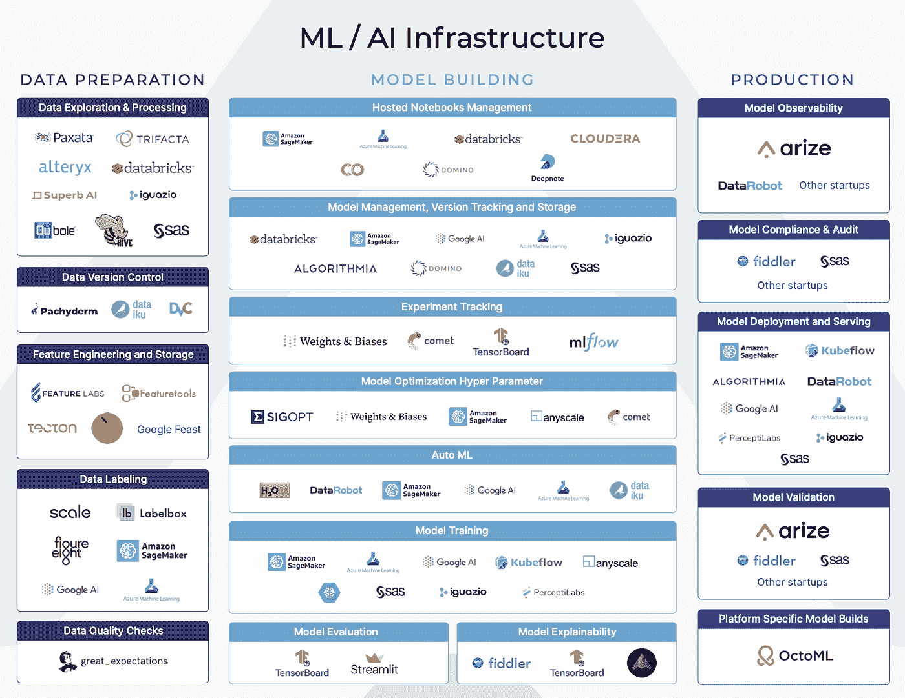*

****图片来源:*** [*最大化生产工作负载的 ML 基础设施工具— Arize AI*](https://ai-infrastructure.org/maximizing-ml-infrastructure-tools-for-production-workloads-arize-ai/)*

**在本系列接下来的部分中，我们将深入研究其中的一些工具(DVC、PyCaret & MLFlow ),以获得实践经验&在我们自己的项目中使用它们。**

## *MLOps 技术堆栈模板*

*考虑到现有的大量工具，为了促进和简化组织采用 MLOps 实践时可能用到的工具，可以使用下面给出的模板*(承蒙:Henrik skogstrm)*。很明显，它将整个工作流程分解成组件，人们可以记下需求&选择合适的工具来提出定制的技术堆栈。*

*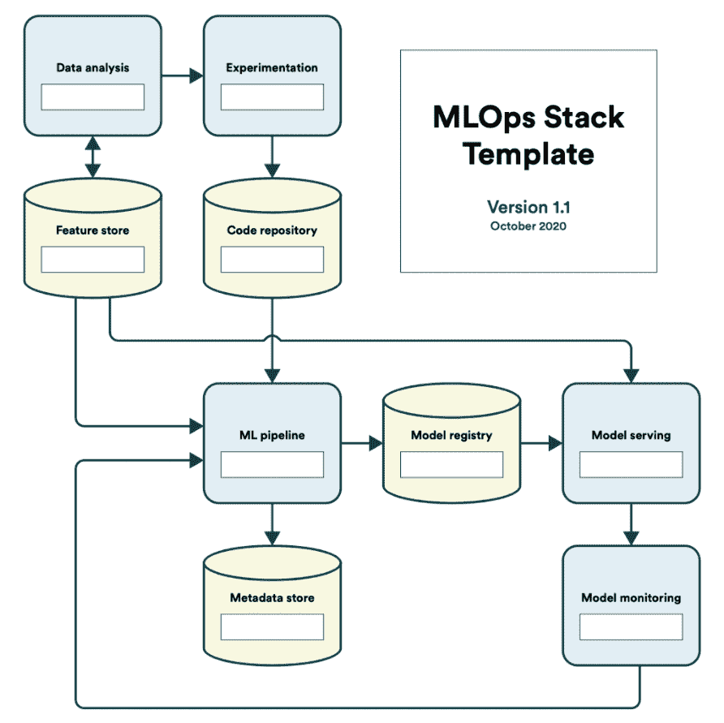*

****图片来源:***[*MLOps 堆栈*](https://valohai.com/blog/the-mlops-stack/)*

**在本系列的末尾，我们将会重新审视这个模板&用我们在这个过程中学到的各种工具来填充它。**

*您也可以[下载这个模板](https://valohai.com/assets/files/mlops-stack.pdf)供个人使用。*

# *采用 MLOps*

*尽管处于起步阶段，但 MLOps 趋势在过去几年中变得更加明显，这是由于许多知名公司和开源框架开始共享关于他们内部 ML 堆栈的信息以及他们采用 MLOps 实践来提高生产力的方式。这类公司的一些例子有:*

*   ***网飞:**它使用一个名为 [*Metaflow*](https://metaflow.org/) 的内部 ML 框架不可知库，通过训练机器学习模型和有效管理数据来快速实验。使用 Metaflow API，他们的 ML 工作负载可以与 AWS 云基础设施服务无缝交互。它还使用一个名为 [*跑道*](https://youtu.be/kvl4lCIMqio) 的内部工具来管理生产中的所有模型&自动提醒 ML 团队生产中过时的模型。*
*   ***优步:**优步的团队通过一个名为 [*米开朗基罗*](https://eng.uber.com/michelangelo-machine-learning-platform/) 的内部 ML 即服务平台来运作他们的 ML 模型，这使他们能够无缝地构建、部署和运营大规模的 ML 解决方案。他们还使用 [*流形*](https://eng.uber.com/manifold/)——一种与模型无关的可视化调试工具。*
*   ***脸书:**它开发了一个全新的平台， *FBLearner Flow* ，能够毫不费力地跨产品重用算法，扩展到执行数千个并发定制实验，并简单地组织实验。它每天可以接收数万亿个数据点，训练数千个模型(离线或实时)，然后将它们部署到服务器群进行实时预测。*
*   ***Carbon:** Carbon 使用 *DataRobot* 创建全面的信用风险模型，为他们节省了一个完整的端到端流程，使公司能够专注于获取正确的数据，并做出其他有助于推动业务发展的决策。*

*MLOps 要求了解数据偏差，以及决定采用数据偏差的公司内部的严格纪律。因此，每个组织都应该建立自己的一套实践，使 MLOps 原则适应其 AI 开发和自动化。*

# *与 MLOps 相关的会议*

*mlop 领域的学术和工业研究正在突飞猛进地发展，开发出更新和更有效的方法来解决 mlop 中的研究问题。这些研究的大部分都在公开会议上积极展示&随着 MLOps 多年来获得的牵引力，有一些会议致力于 MLOps 研究。以下是一些专门针对 MLOps 的会议，供感兴趣的学习者参考:*

*   *[MLOps 世界:生产中的机器学习大会](https://mlopsworld.com/)*
*   *[USENIX 操作机器学习会议(OpML)](https://www.usenix.org/conferences/byname/1027)*
*   *[OpML’20 演示的播放列表](https://youtube.com/playlist?list=PLbRoZ5Rrl5lc8bz4EV6_N6kHLGvkl7pOy)*

# *结束语*

*以上是 MLOps 博客系列**基础的第一部分。这是一个相当理论密集的博客，主要关注于建立一个强大的概念基础，以便在未来有效地使用 MLOps 工具。我希望你现在对核心原则有一个公平的理解&MLOps 的一些实践(& DevOps) &热衷于在你自己的 ML 项目中实际实现其中的一些。***

*在接下来的部分中，我们将使用各种工具和框架，通过实现我们在这篇文章中看到的一些 MLOps 实践来动手实践。*

*以下是 MLOps 基础系列的其他部分:*

*   *[**第二部分:**数据&模型管理同 DVC](/@tezansahu/fundamentals-of-mlops-part-2-data-model-management-with-dvc-6be2ad284ec4)*
*   *[**第三部分:**使用 PyCaret 的 ML 实验](/@tezansahu/fundamentals-of-mlops-part-3-ml-experimentation-using-pycaret-747f14e4c28d)*
*   *[**第四部分:**用 MLFlow 进行模型跟踪&用 FastAPI 进行部署](/@tezansahu/fundamentals-of-mlops-part-4-model-tracking-with-mlflow-deployment-with-fastapi-61614115436)*

*谢谢&快乐编码！*

# *附加参考*

## *研究论文*

*   *[m kinen，S. et al. *“谁需要 MLOps:科学家寻求实现什么数据，MLOps 如何提供帮助？”*华因(2021)](https://arxiv.org/pdf/2103.08942.pdf)*
*   *[Sculley，d .等人*“机器学习系统中隐藏的技术债务。*“NIPS(2015)](https://papers.nips.cc/paper/2015/file/86df7dcfd896fcaf2674f757a2463eba-Paper.pdf)*
*   *[Breck，e .等人*“你的 ML 测试成绩是多少？适用于 ML 生产系统的规则。”* NIPS (2016)](https://storage.googleapis.com/pub-tools-public-publication-data/pdf/45742.pdf)*
*   *[戈亚尔，A. *《机器学习操作》*伊吉蒂特(2020)第 4 卷](http://www.technology.eurekajournals.com/index.php/IJITIT/article/view/655/769)*

## *文章和博客*

*   *[什么是 DevOps？终极指南](https://searchitoperations.techtarget.com/definition/DevOps)*
*   *[动机&MLOps 的演变](https://ml-ops.org/content/motivation)*
*   *[ML Ops:作为工程学科的机器学习](https://towardsdatascience.com/ml-ops-machine-learning-as-an-engineering-discipline-b86ca4874a3f)*
*   *[MLOps 原则](https://ml-ops.org/content/mlops-principle)*
*   *[机器学习操作初学者指南](https://www.analyticsvidhya.com/blog/2021/06/mlops-a-beginners-guide-to-machine-learning-operations/)*
*   *[这 8 家公司如何实施 MLOps:深度指南](https://neptune.ai/blog/how-these-8-companies-implement-mlops)*
*   *[devo PS 的进化](https://www.oreilly.com/radar/the-evolution-of-devops/)*
*   *[10 家公司在 DevOps 大获成功](https://techbeacon.com/devops/10-companies-killing-it-devops)*
*   *[ML 工程的最佳实践](https://developers.google.com/machine-learning/guides/rules-of-ml)*
*   *[机器学习生命周期解释](https://www.analyticsvidhya.com/blog/2021/05/machine-learning-life-cycle-explained/)*
*   *[MLOps 的优势使其成为即将到来的行业趋势](https://geniusee.com/single-blog/mlops-practices-and-its-benefits)*

## *书*

*   *[介绍 MLOps:如何在企业中扩展机器学习。奥莱利出版社](https://itlligenze.com/uploads/5/137039/files/oreilly-ml-ops.pdf)*

## *多方面的*

*   *[AI/ML 工具的交互场景&框架](https://landscape.lfai.foundation/)*
*   *[生产中 ML 工具的策划列表](https://github.com/EthicalML/awesome-production-machine-learning)*

# *关于作者*

*嘿伙计们！我是 Tezan Sahu，微软的数据和应用科学家。我在孟买的 IIT 大学获得了学士学位，主修机械工程，辅修计算机科学与工程。我对 NLP、深度学习和区块链有浓厚的兴趣，喜欢使用前沿技术开发有趣的产品。*

***网址:** [特赞萨胡|微软](https://tezansahu.github.io/)
**LinkedIn:**[特赞萨胡| LinkedIn](https://www.linkedin.com/in/tezan-sahu/)
**邮箱 ID:**[tezansahu@gmail.com](mailto:tezansahu@gmail.com)*