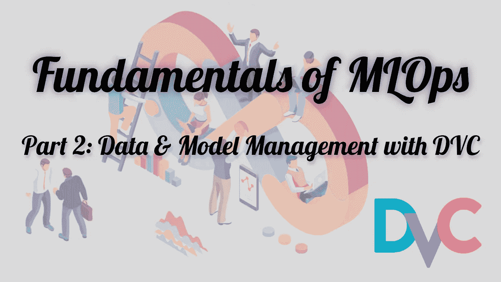
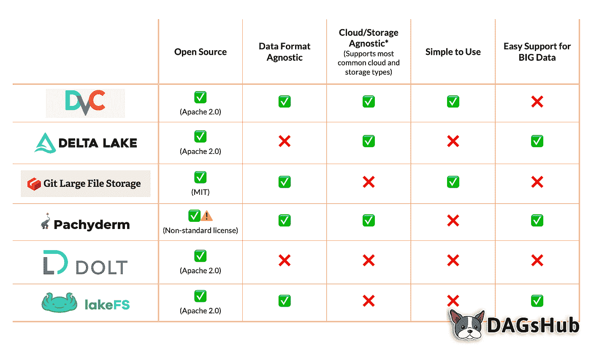
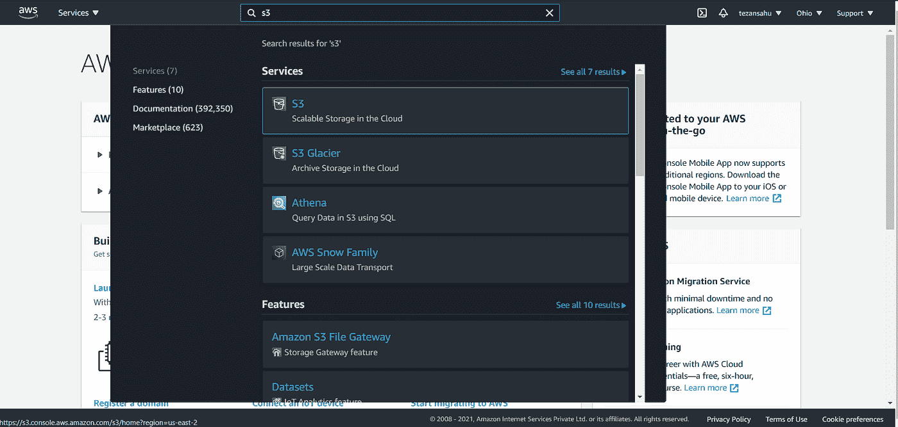
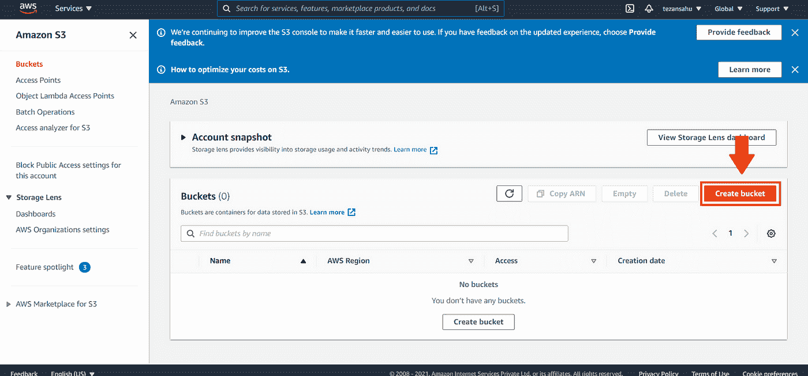
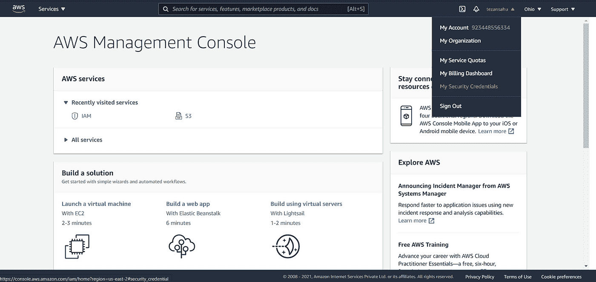
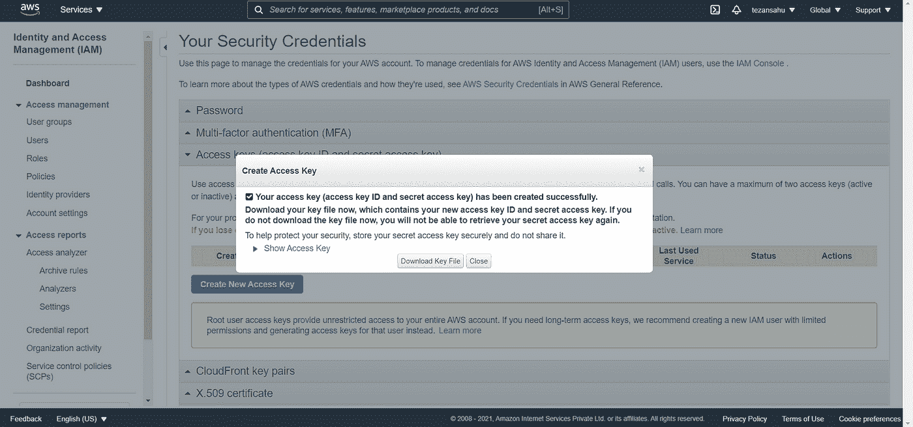
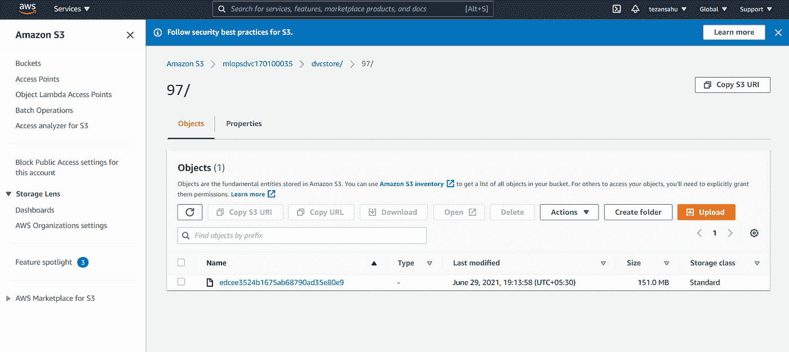
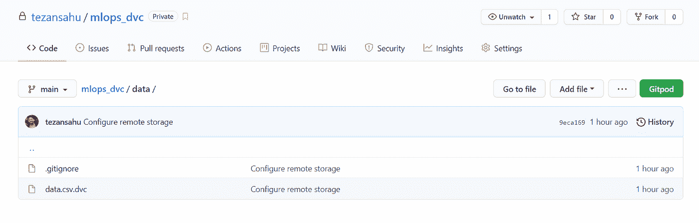
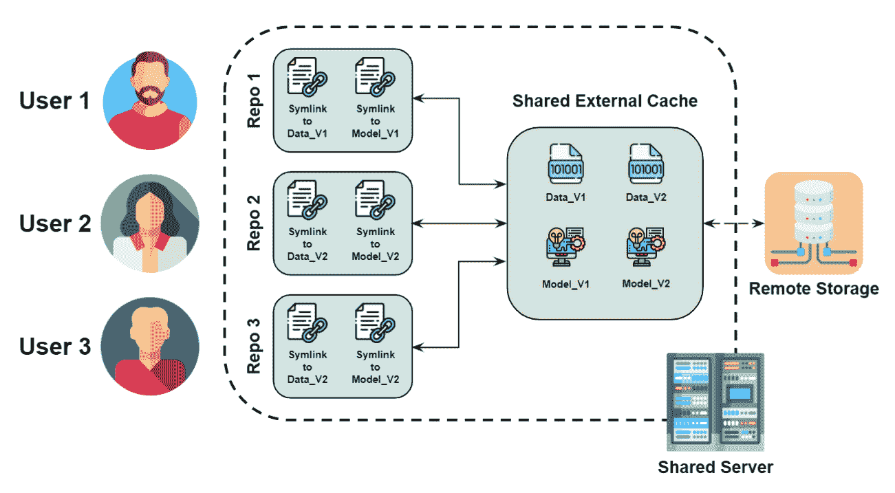

# MLOps 基础知识—第 2 部分| Data 数据和模型管理

> 原文：<https://medium.com/analytics-vidhya/fundamentals-of-mlops-part-2-data-model-management-with-dvc-6be2ad284ec4?source=collection_archive---------3----------------------->



在这个由 4 篇博客组成的系列文章的第 1 部分[中，我们了解了采用 MLOps 实践背后的动机&也了解了 MLOps 的一些基本原则。我们还浏览了用于在 ML 工作流生命周期的不同阶段实现 MLOps 的工具库&框架。从这个博客开始，我们将更深入地研究这些工具&学习如何在我们自己的项目中实际使用它们，以获得更好的可重复性&协作。](/@tezansahu/fundamentals-of-mlops-part-1-a-gentle-introduction-to-mlops-1b184d2c32a8)

# 内容

*   ML 项目中的版本控制
*   什么是数据版本控制(DVC)？
*   探索 DVC 的基本功能
*   初始化
*   使用 DVC 跟踪文件
*   远程存储数据
*   检索远程存储的数据
*   对数据进行修改
*   在数据版本之间切换
*   访问 DVC 追踪的数据
*   DVC Python API
*   在共享服务器上使用 DVC
*   结束语
*   附加参考

# ML 项目中的版本控制

软件开发包括记录和维护源代码、修改源代码和与其他开发人员合作的连续过程；版本控制系统(如 Git & Mercurial)使这项任务变得更加容易。类似地，在 ML 和数据科学中，创建 ML 模型并将其部署到生产中是一个迭代的过程，需要大量的版本控制来维护和再现。这样的项目与通常的软件开发项目形成了鲜明的对比，因为 ML 需要代码和数据——因此，这里的版本控制不限于代码，还涉及数据、超参数和其他元数据的版本控制。

我们都熟悉 [***Git***](https://git-scm.com/) 作为一种众所周知的&有用的版本控制工具，广泛应用于软件开发中。那么，尽管它是版本控制的圣杯，为什么只使用*的* Git 用于版本控制 ML 项目是不可取的(或者说是没有效率的)？

*   ML/DL 项目通常涉及大量数据，达到数百 MB(有时也有数 GB 和数 TB)，而 Git 允许推入 GitHub repo 的文件大小上限仅为 ***100MB*** 。*注意，解决方案像*`*git-lfs*`*[***(Git 大文件存储)***](https://git-lfs.github.com/) *避免了这样的问题，但是它们不够灵活。**
*   *在组织中的人之间的协作期间，可能需要将对数据(或管道的某个其他部分)的访问仅限于某一组人。如果数据与 GitHub repo 中的其他代码一起被直接跟踪，可能很难提供这种不同级别的访问。*
*   *此外，用于训练模型的实际数据可能已经远程存在于一些存储服务中(如亚马逊 S3、Azure Blob 存储等)。)&将所有这些数据复制到 GitHub repo 中并单独跟踪是一种浪费。*

*所有这些都需要一些特定的工具和框架来解决 ML 工件的版本化问题，如数据、超参数和模型，它们与现有的版本控制工具一起工作，为 ML 项目管理提供无缝的体验。*进入* ***数据版本控制！****

## *为什么数据和模型会改变？*

*在深入研究数据版本控制之前，我们将首先尝试列举一些关于 ML 系统中数据和模型为什么会改变的原因:*

*   *数据可以跨多个平台传播*
*   *数据可能会频繁变化，需要定期更新我们的模型才能运行良好*(想想构建推荐系统的点击率数据)**
*   *模型可以用这些新数据重新训练&也许是更新的训练技术*
*   *模型可能会随着时间而退化*
*   *表现不佳的模型可以迅速恢复到较早的服务版本*

# *什么是[数据版本控制(DVC)](https://dvc.org/) ？*

*数据版本控制*(概念，不是具体工具！)*是一个工具和程序的集合，试图使版本控制过程适应数据世界。帮助数据科学家管理他们的数据和模型并运行可重复实验的工具之一是 **DVC** 或**数据版本控制**。*

> *DVC，由[迭代开发。AI](https://iterative.ai/) 是一个用 Python 编写的开源命令行工具，用于数据科学& ML 项目管理&版本控制。为了利用大多数开发人员熟悉的现有工具集，它模拟了 Git 命令和工作流，以便他们可以快速将其集成到他们通常的 Git 实践中。*

*DVC 使用远程存储库(包括支持所有主要的云提供商)来存储项目的所有数据和模型。在实际的代码存储库中，存储了一个指向这个远程位置的指针，以访问实际的工件。*

## *DVC 的特色*

*使用 DVC 可以为您现有的数据科学工作流带来敏捷性、可再现性和协作性。DVC 的一些核心特征是:*

*   ***Git 兼容:**它运行在任何 Git 存储库之上，并且兼容任何标准的 Git 服务器或提供商(GitHub、GitLab 等)。)*
*   ***简单化的数据版本化:**通过替换大文件、数据集目录、ML 模型等来维护多个版本的数据&模型。带有包含指向原始数据的指针的小元文件(作为占位符)*
*   ***存储无关:**它可以使用[亚马逊 S3](https://aws.amazon.com/s3/) 、[微软 Azure Blob 存储](https://azure.microsoft.com/en-in/services/storage/blobs/)、 [Google Drive](https://www.google.com/intl/en_in/drive/) 、[谷歌云存储](https://cloud.google.com/storage)、[阿里云 OSS](https://www.alibabacloud.com/product/oss) 、SSH/SFTP、HDFS、HTTP、附网存储或磁盘作为远程存储数据*
*   ***可复制:**它通过使用隐式依赖图创建轻量级管道，并通过编码所涉及的数据和工件，使得 ML 项目可复制*
*   ***语言- &框架无关:**它独立于项目中使用的编程语言(Python、R、Julia、shell 脚本等等)或机器学习库(Keras、Tensorflow、PyTorch、Scipy 等等)*
*   ***低摩擦分支:**它支持即时 Git 分支，即使是大文件&也能防止实验间的数据重复*
*   *易于使用:安装速度快，不需要特殊的基础设施*

****注:*******DVC 不代替饭桶！*** *远程保存原始数据和模型引用的元文件在项目过程中会随着数据的变化而变化&需要 Git 进行版本控制。***

## **将 DVC 与其他解决方案进行比较**

**除了 DVC 之外，还有其他几个顶级的数据版本控制工具，可以帮助自动化工作和优化流程。下面是 DVC 和其他一些工具的快速比较:**

****

*****图片来源:*** [*对比数据版本控制工具*](https://dagshub.com/blog/data-version-control-tools/)**

# **探索 DVC 的基本功能**

**有了 DVC 的基本概述，让我们直接使用 DVC 来开发我们自己的 ML 项目，以理解它提供的各种功能。在本教程中，我们将学习如何:**

*   **安装 DVC 并初始化项目**
*   **将文件添加到远程存储库(亚马逊 S3)并在以后检索它们**
*   **在不同版本之间切换**
*   **从 DVC 存储库中搜索和导入文件**

**稍后，我们还将研究如何使用 DVC 作为 Python 包。**

## **装置**

**DVC 可以根据用户的操作系统从其存储库或二进制包中安装，其步骤可以在[文档](https://dvc.org/doc/install)中找到。**

**然而，由于 DVC 也可以用作 Python 库(我们将在后面探讨)，它可以简单地使用像`pip`或`conda`这样的包管理器来安装。根据项目中使用的远程存储类型，可能需要安装可选的依赖项。**

***使用此类软件包管理器时，建议在安装软件包之前创建&启用虚拟环境。***

**基于我们首选的软件包管理器，我们将安装 DVC(与亚马逊 S3 远程)如下:**

```
**$ pip install "dvc[s3]"                   # Using pip$ conda install -c conda-forge dvc-s3     # Using conda**
```

***在这种情况下，它会随 DVC 一起安装* `[*boto3*](https://boto3.amazonaws.com/v1/documentation/api/latest/index.html)` *库。***

**请随意查看 DVC 文档[来安装你可能想要使用的其他遥控器的依赖项。](https://dvc.org/doc)**

**现在，您可以键入`dvc --help`来查看所有可以与 DVC 一起使用的命令。**

# **初始化**

**安装 DVC 后，我们创建一个项目目录&将其初始化为 Git repo。创建一个相应的 GitHub repo &将其设置为 Git repo 的`origin`遥控器。稍后，我们使用`[dvc init](https://dvc.org/doc/command-reference/init)`将其初始化为 DVC 回购。这是我们的 ***工作区*** 。**

```
**$ mkdir mlops_dvc
$ cd mlops_dvc$ git init
$ git remote add origin <github-repo-link>
$ git branch -M main$ dvc init**
```

**这将创建一个具有下面提到的结构的内部`.dvc`文件夹，保存 DVC 操作所需的内部目录和文件。**

```
**mlops_dvc
├── .dvc
│   ├── .gitignore
│   ├── config 
│   ├── plots  
│   │   ├── confusion.json
│   │   ├── confusion_normalized.json
│   │   ├── default.json
│   │   ├── linear.json
│   │   ├── scatter.json
│   │   └── smooth.json
│   └── tmp
│       ├── links
│       │   └── cache.db
│       └── md5s
│           └── cache.db
├── .dvcignore
└── .git**
```

*   **`config`:配置文件，使用`dvc config`编辑**
*   **`plots/`:绘图模板目录**
*   **`tmp/`:杂项临时文件目录**
*   **`links/` : SQLite DB 存储从缓存到工作区的文件链接**
*   **`md5s/` : SQLite 数据库存储被跟踪文件的 MD5 哈希**
*   **`.dvcignore`:遍历 DVC 项目时排除的文件和目录**

**这些包括配置文件、本地缓存、绘图模板和临时文件 [*(更多信息)*](https://dvc.org/doc/user-guide/project-structure/internal-files) *。*它类似于 Git repo 初始化时创建的`.git/`文件夹。`dvc init`命令还创建了一个`.dvcignore`文件(类似于`.gitignore`)来包含 DVC 要忽略的路径列表。**

**现在，我们使用`git commit -m "Initialize DVC in repo"`将这些内部文件提交给 Git repo。**

**从现在开始，我们将创建和管理不同的 DVC 文件，并在使用 DVC 和处理 ML 项目时填充缓存。**

# **使用 DVC 跟踪文件**

**一旦我们的 DVC 回购被初始化，我们就可以开始向我们的 Git 回购添加数据和代码，正如我们的 ML 项目所要求的那样。为您的 ML 项目维护一个好的目录结构来分离数据、代码、模型、度量等是很好的。下面是一个非常通用的目录结构，可以用于大多数 ML 项目:**

```
**project_dir
├── data/             # Directory with raw and intermediate data
│   └── prepared/     # Processed dataset
├── metrics/          # Plots & logs with performance metrics
├── models/           # Trained models
└── src/              # Files for processing, training, evaluation**
```

**`data/`目录通常会有文件形式的训练数据(如 XML、CSV、TSV 等。)或可能非常大的文件夹(如属于不同类别的图像)中。对于本教程，我们将下载[这个玩具数据集](https://www.kaggle.com/razamh/pubg-dataset) ( `data.csv` ) &放在`mlops_dvc/data/`文件夹中。现在，在终端中键入以下命令来启用对`data.csv`文件的跟踪:**

```
**$ dvc add data/data.csv     # To start tracking a file or directory**
```

**这样，DVC 将有关新添加文件(或目录)的信息保存在一个名为`data/data.csv.dvc`的特殊`.dvc`文件中(一个可读格式的小文本文件)。这个元数据文件充当实际数据的占位符，可以很容易地使用 Git 进行版本控制，就像源代码一样。其内容如下:**

```
**outs:
- md5: 97edcee3524b1675ab68790ad35e80e9
  size: 158375420
  path: data.csv
  isexec: true**
```

***在后台，* `[*dvc add*](https://dvc.org/doc/command-reference/add)` *将数据移动到项目的缓存中，并链接回我们的工作区。您可以验证* `*.dvc/cache/*` *文件夹包含一个子文件夹* `*97*` *，有一个名为* `*edcee3524b1675ab68790ad35e80e9*` *的文件。我们刚刚添加的* `*data.csv*` *文件(* `*97ecdce...*` *)的* [*MD5 哈希值*](https://en.wikipedia.org/wiki/MD5) *决定了这个缓存路径。***

**现在，我们使用 Git 跟踪`data.csv.dvc`文件，而忽略实际的`data.csv`文件。**

```
**$ git add data/data.csv.dvc data/.gitignore  # Adds the actual data/data.csv file to .gitignore so that it is ignored by Git tracking
$ git commit -m "Add raw data"               # Commit the data/data.csv.dvc for Git tracking**
```

# **远程存储数据**

**一旦使用 DVC 跟踪数据，就可以安全地远程存储数据(如前所述，DVC 支持多种远程存储选项)。**

## **设置亚马逊 S3 存储桶**

**由于我们计划将数据存储在亚马逊 S3，我们首先必须设置我们的 S3 存储桶，它将存储我们的数据，如下所示:**

****步骤 1:** 登录您的 AWS 控制台**

****第二步:**在搜索框中搜索“s3”&选择 S3 服务**

****

****第 3 步:**单击 S3 仪表盘中的“创建时段”**

****

****步骤 4:** 输入一个存储段名称&选择“亚太(孟买)AP-south-1”AWS 区域。例如，我已经将 bucket 名称设置为`mlopsdvc170100035`。*(这是因为 S3 存储桶名称在一个分区-一组区域内必须是唯一的)*保留所有其他设置默认&点击“创建存储桶”按钮。**

****步骤 5:** 现在我们需要创建我们的*访问键*，它将使 DVC(在我们的本地系统上)能够与 Bucket 通信。为此，展开您的配置文件名&下的菜单，单击“我的安全凭证”。**

****

****步骤 6:** 点击“访问密钥(访问密钥 ID 和秘密访问密钥)”&然后点击“创建新的访问密钥”按钮。这将为您创建一个唯一的访问密钥对。**

****

**你应该下载密钥文件并保存好它，因为这是你唯一一次看到你的 ***秘密访问密钥*** 。**

****步骤 7:** 现在，创建两个名为`AWS_ACCESS_KEY_ID` & `AWS_SECRET_ACCESS_KEY`的环境变量，分别包含您的访问密钥&秘密访问密钥，当我们试图从我们的 S3 桶上传/下载数据时，这些变量将被`boto3`库获取。同样，创建&将`AWS_DEFAULT_REGION`变量设置为`ap-south-1`。
[供 Windows 用户参考](https://kb.wisc.edu/cae/page.php?id=24500)
[供 Linux 用户参考](https://phoenixnap.com/kb/linux-set-environment-variable#ftoc-heading-9)**

**这样，我们就建立了我们的 AWS 凭证& Amazon S3 bucket 来使用 DVC 远程存储我们的数据。**

## **将数据推送到远程存储**

**要远程存储 DVC 跟踪的数据和模型文件，我们首先需要如下配置远程存储位置:**

```
**$ dvc remote add -d storage s3://mlopsdvc170100035/dvcstore  
# Enter your respective bucket name$ git add .dvc/config
$ git commit -m "Configure remote storage"**
```

**第一个命令创建一个名为`storage` &的遥控器，将它链接到我们的 S3 桶中的一个(新创建的)文件夹`dvcstore`。`-d`标志确保该遥控器是用于上传&下载数据的默认遥控器。**

**接下来，我们将数据推送到远程存储 *(* `[*dvc push*](https://dvc.org/doc/command-reference/push)` *将本地缓存的数据复制到远程存储)* &稍后推送到我们的 GitHub repo:**

```
**$ dvc push
$ git push origin main**
```

**完成上述步骤后，您可以检查您的亚马逊 S3 控制台，发现数据已被推送到您的桶中。**

****

**在检查您的 GitHub repo 时，您应该注意到`data/`文件夹只包含`.gitignore` & `data.csv.dvc`文件，而实际的`data.csv`文件并不存储在 GitHub 上。**

****

# **检索远程存储的数据**

**根据需要，可使用`[dvc pull](https://dvc.org/doc/command-reference/pull)`检索 DVC 跟踪的数据和模型，并在本项目的其他版本中使用。经常在`git clone` & `git pull`之后执行。**

**为了在本教程中模拟这种情况，需要删除`.dvc/cache/`文件夹中的& `data/data.csv`文件，然后我们从 DVC 遥控器中拉出。**

```
**$ rm -rf .dvc/cache
$ rm -f data/data.csv$ dvc pull**
```

**我们可以很容易地验证`data.csv`文件(大约 150MB)已经从我们的远程设备下载到我们的工作区。**

# **对数据进行修改**

**在现实世界的 ML 项目中，我们可能在各种实验中使用多个版本的数据和模型。这种情况的一些潜在原因可能是:**

*   **不同的预处理技术用于不同的实验**
*   **新数据不时从外部来源流入系统**
*   **用不同超参数训练的新模型**

**在这种情况下，DVC 帮助有效地跟踪这些变化。为了模拟这种情况，我们将原始数据集加倍，如下所示:**

```
**# Copy the contents of data.csv to a temporary location
$ cp data/data.csv /tmp/data.csv # Append contents from this location to the end of data.csv
$ cat /tmp/data.csv >> data/data.csv**
```

**我们可以通过注意到这个新的`data.csv`文件的大小是旧文件的两倍来验证这个修改。现在，我们准备跟踪这个变化&上传新文件到我们的 S3 桶:**

```
**$ dvc add data/data.csv
$ git add data/data.csv.dvc
$ git commit -m "Update dataset"
$ dvc push**
```

***很明显，由于文件大小的增加，推送这个新文件花费的时间几乎是之前推送的两倍***

**您可以验证推送，检查更新的`data/data.csv.dvc`文件(`7663219...`)中的 MD5 哈希是否对应于 S3 存储桶中的文件路径。**

**现在你也可以推送到 GitHub 来跟踪新的变化。**

# **在数据版本之间切换**

**一旦我们有了数据和模型的几个版本，很明显我们可能需要在这些版本之间切换。正如 Git 使用`checkout`命令在不同版本的代码之间切换一样，DVC 提供了`checkout`命令来根据`.dvc`文件同步数据&模型。通常的做法是运行`git checkout <...>` *(切换一个分支或者签出一个* `*.dvc*` *文件版本)*，后面跟着`[dvc checkout](https://dvc.org/doc/command-reference/checkout)`。**

**为了获得数据集的先前版本& commit，我们执行以下操作:**

```
**$ git checkout HEAD~1 data/data.csv.dvc
$ dvc checkout
$ git commit data/data.csv.dvc -m "Revert updates"**
```

***注意，我们不需要再次执行* `*dvc push*` *，因为这个版本的数据集已经存储在我们的亚马逊 S3 存储桶中。因此，我们可以说 DVC 甚至不是一个严格意义上的版本控制系统！数据文件版本由* `*.dvc*` *文件的内容定义，版本控制通过 Git 提供。然后，DVC 生成这些* `*.dvc*` *文件，更改它们，并有效地同步工作区中 DVC 跟踪的数据以匹配它们。***

# **访问 DVC 追踪的数据**

**一旦我们能够有效地跟踪我们的数据和模型，下一个想法就是我们如何访问这些被跟踪的工件来重用数据集或部署模型？在这一节中，我们将讨论在 DVC 跟踪的存储库中查找相关文件并从中下载数据的方法。**

## **使用 DVC 搜索文件/目录**

**为了下载数据和模型，我们首先需要找到它们的位置&如果它们是可访问的。要探索托管在任何 Git 服务器上的 DVC 存储库，可以使用命令`[dvc list](https://dvc.org/doc/command-reference/list)`。它列出了项目内容，包括 DVC Git 跟踪的文件、模型和目录。该命令的语法如下:`dvc list <repo-url> [<file-path>]` *(* `*[...]*` *暗示* `*<file-path>*` *是可选的)***

**例如，在您在本教程中使用的各自的 GitHub repo 上运行`dvc list`(在其他目录中)会产生:**

```
**$ dvc list <https://github.com/><your-username>/<repo-name>
.dvcignore
data $ dvc list <https://github.com/><your-username>/<repo-name> data
.gitignore
data.csv
data.csv.dvc**
```

## **下载相关文件和目录**

**两个`[dvc get](https://dvc.org/doc/command-reference/get)` & `[dvc import](https://dvc.org/doc/command-reference/import)`都可以用来从 DVC 跟踪的存储库中下载文件或目录。然而，`dvc get`下载文件时不会保留任何将它连接到项目的元数据，而`dvc import`也会创建相应的`.dvc`文件保存到项目中。**

**`*dvc import*` *本质上是*`*dvc get*`*&*`*dvc add*`*的组合运用在一起。***

**这些命令的语法如下:`dvc get/import <repo-url> <file-path> -o <output-file-path>`**

**`data/data.csv.dvc`文件跟踪的`data.csv`文件存放在我们的 S3 &中，可以下载到如下任意项目中:**

```
**$ dvc get https://github.com/<your-username>/<repo-name> data/data.csv -o data_downloaded/data.csv$ dvc import https://github.com/<your-username>/<repo-name> data/data.csv -o data_downloaded/data.csv**
```

*****注意:*** `*dvc get*` *可以从任何地方调用，但是* `*dvc import*` *必须从 DVC 跟踪的存储库中调用。***

# **DVC Python API**

**如前所述，通过使用`import dvc.api`导入任何其他 Python 模块，DVC 也可以用作 Python 库。这个 API 的目标是给开发人员一些对 DVC 跟踪库中版本化的数据或模型的编程访问。我们将讨论的两个库函数是:**

## **`[get_url()](https://dvc.org/doc/api-reference/get_url)`**

**给定 DVC 跟踪的 GitHub 存储库 URL ( `repo` ) &文件路径(`path`)，它返回实际文件存储在 DVC 遥控器中的存储位置的 URL 字符串。**

****例如:****

```
**import dvc.apix = dvc.api.get_url(repo="https://github.com/<your-username>/<repo-name>", path="data/data.csv")
# x stores the URL of the corresponding file in your S3 bucket 
# (like s3://mlopsdvc<your-roll-number>/dvcstore/<path-to-file>)**
```

## **`[open()](https://dvc.org/doc/api-reference/open)`**

**给定 DVC 跟踪的 GitHub 库 URL ( `repo`)、文件路径(`path` ) &)文件打开的模式(`mode`)，它打开数据/模型文件&生成相应的文件对象。**

**示例:**

```
**import dvc.api
import pandaswith dvc.api.open(
    repo="https://github.com/<your-username>/<repo-name>", 
    path="data/data.csv", 
    mode="r"
) as fd:
    df = pandas.read_csv(fd)**
```

# **在共享服务器上使用 DVC**

**通常，在许多学术和专业环境中，个人笔记本电脑不用于计算密集型工作，因为它们的功能不足以处理大量数据或密集处理。相反，团队依赖于云或内部工作站，其中多人经常在同一个开发服务器上协作。虽然这样可以更好地利用资源，如 GPU 访问和集中数据存储，但如果管理不当，很有可能会在几个用户和存储库中不必要地重复相同的数据。**

**鉴于这种设置，DVC 可以在维护开发服务器上的共享缓存方面发挥关键作用，这样所有用户只需使用`dvc checkout`命令就可以获得近乎即时的工作空间恢复和切换速度。**

**在用`dvc init`初始化 DVC 存储库之后，默认情况下，DVC 将缓存放在存储库的`.dvc/cache`文件夹中。要在服务器上创建&使用共享缓存，必须为外部缓存创建一个目录，并配置适当的权限&链接。**

****

*****图片来源:*** *作者创作***

**下面给出了在服务器上设置共享 DVC 缓存的分步示例&在 DVC 跟踪的存储库中使用它:**

```
**# Create a folder to behave as external cache
$ mkdir -p /home/shared/dvc-cache # Move cache from current repo to external cache (optional)
$ mv .dvc/cache/* /home/shared/dvc-cache # Set cache of  DVC-tracked repository as folder made above
$ dvc cache dir /home/shared/dvc-cache # Set group permissions on new cache files
$ dvc config cache.shared group # Enable [symlinks](https://devdojo.com/devdojo/what-is-a-symlink) to avoid copies from cache to workspace
$ dvc config cache.type symlink**
```

**在检查存储库中的`.dvc/config`文件时，出现以下部分:**

```
**[cache]
    dir = /home/shared/dvc-cache
    shared = group
    type = symlink**
```

**`cache.type`可以是`reflink`、`hardlink`或`copies`。一旦对`cache.type`做了任何更改，在更改发生之前，需要使用`dvc checkout --relink`明确告知 DVC。**

# **结束语**

**在这篇文章中，我们通过使用 DVC 有效地管理我们的数据和模型，开始将一些 MLOps 原则付诸实践。正如我们所看到的，DVC 是一个强大而灵活的工具，我们刚刚介绍了它提供的一些基本特性。尽管在创建可复制的 ML 管道方面，DVC 还有很多内容，但我选择不在本系列中讨论这些内容，因为在接下来的博客中，我将介绍更多的工具和框架，用于更有效地创建和管理端到端的 ML 管道。尽管如此，感兴趣的人可以随意翻阅 DVC 文档来了解 DVC 的能力。**

**我希望你觉得 DVC 很有趣，并鼓励你今后在 ML & Data Science 项目中使用它来保持一个干净的工作空间。此外，请随意查看将 Google Drive 用作 DVC 远程存储的步骤。**

**在下一篇博客中，我们将把注意力从版本控制转移到使用数据&使用一个有趣而强大的 Python 库 PyCaret 创建端到端的 ML 管道来执行各种实验。**

**以下是 MLOps 基础系列的其他部分:**

*   **[**第一部分:**MLOps 的温柔介绍](/@tezansahu/fundamentals-of-mlops-part-1-a-gentle-introduction-to-mlops-1b184d2c32a8)**
*   **[**第三部分:**使用 PyCaret 的 ML 实验](/@tezansahu/fundamentals-of-mlops-part-3-ml-experimentation-using-pycaret-747f14e4c28d)**
*   **[**第 4 部分:**使用 MLFlow 进行模型跟踪&使用 FastAPI 进行部署](/@tezansahu/fundamentals-of-mlops-part-4-model-tracking-with-mlflow-deployment-with-fastapi-61614115436)**

**谢谢&快乐编码！**

# **附加参考**

*   **[对比数据版本控制工具](https://towardsdatascience.com/comparing-data-version-control-tools-2020-c11ef1c80ea7)**
*   **[DVC 文档](https://dvc.org/doc)**
*   **[练习 DVC 的片尾环境](https://katacoda.com/dvc)**
*   **[用 Python 和 DVC 实现数据版本控制](https://realpython.com/python-data-version-control/#share-a-development-machine)**
*   **[使用 DVC 为数据项目创建高效的版本控制系统](/qonto-way/using-dvc-to-create-an-efficient-version-control-system-for-data-projects-96efd94355fe)**

# **关于作者**

**嘿伙计们！我是 Tezan Sahu，微软的数据和应用科学家。我在孟买的 IIT 大学获得了学士学位，主修机械工程，辅修计算机科学与工程。我对 NLP、深度学习和区块链有浓厚的兴趣，喜欢使用前沿技术开发有趣的产品。**

****网址:** [特赞萨胡|微软](https://tezansahu.github.io/)
**LinkedIn:**[特赞萨胡| LinkedIn](https://www.linkedin.com/in/tezan-sahu/)
**邮箱 ID:**[tezansahu@gmail.com](mailto:tezansahu@gmail.com)**