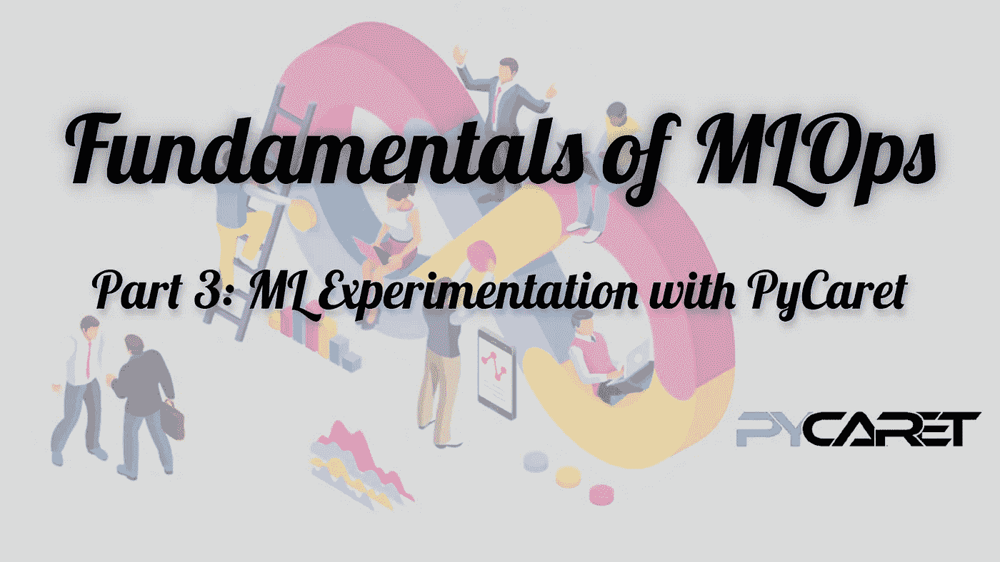
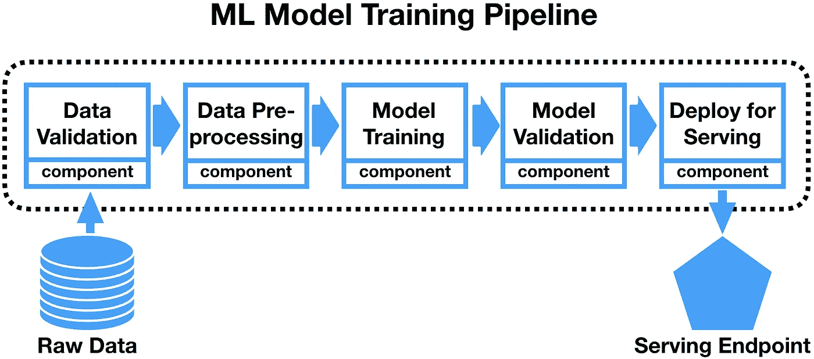
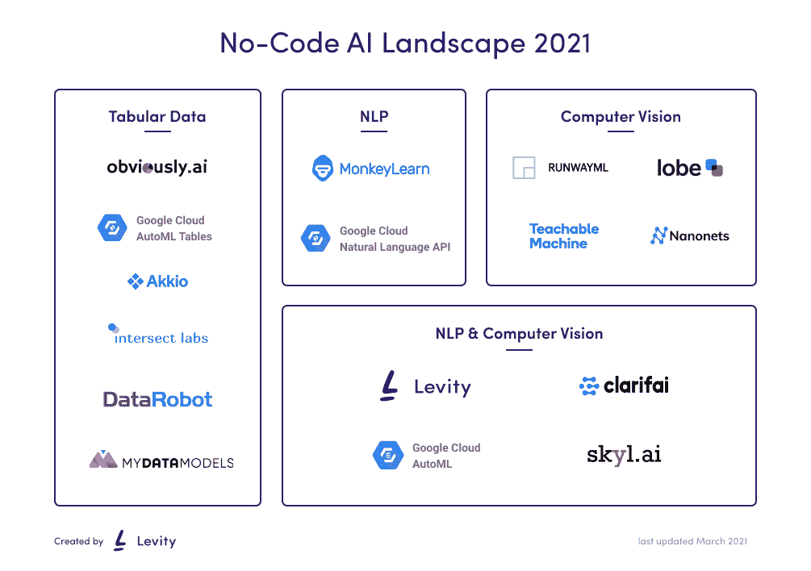
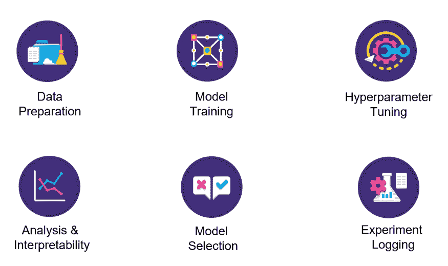

# MLOps 基础—第 3 部分|使用 PyCaret 的 ML 实验

> 原文：<https://medium.com/analytics-vidhya/fundamentals-of-mlops-part-3-ml-experimentation-using-pycaret-747f14e4c28d?source=collection_archive---------5----------------------->



在这个由 4 篇博客组成的系列文章的第 2 部分中，我们获得了一些关于 DVC 的经验，这是一个实现 ML 工件有效版本控制的工具。有了我们的数据，ML 工作流程的下一步是首先**执行 EDA** ，接着是**特征工程** & **模型训练**。尽管它们构成了 ML 系统整个基础设施的一小部分，但是很明显这些步骤构成了 ML 管道的核心。

随着全球竞争的加剧，组织总是试图更快地创建和交付更好的解决方案。要做到这一点，让 ML 管道中的迭代过程更快、更健壮和更高效是必不可少的。通过这篇文章，我们将了解一些关于“无代码”和“低代码”机器学习的宣传，主要目的是自动化 ML 管道，在这个过程中，深入了解一个名为 PyCaret 的 Python 库，它可以帮助大幅减少 ML 管道的实验时间。那么，让我们开始吧…

# 内容

*   ML 管道
*   无代码和低代码 ML
*   带有 PyCaret 的低代码 ML
*   使用 PyCaret 进行实验
*   [链接到 PyCaret 教程笔记本](https://nbviewer.jupyter.org/gist/tezansahu/f034faf9a86856f8d8859556a5ecf12c)
*   结束语
*   附加参考

# ML 管道

首先，让我们清楚机器学习管道的概念，因为我们以前使用过这个术语，但并没有真正理解它。在软件开发中，术语*‘管道’*来源于 CI/CD 的 DevOps 原则。它指的是一组自动化流程，允许开发人员和 DevOps 专业人员可靠、高效地编译、构建和部署他们的代码到他们的生产计算平台。这些过程可以被认为是模块化的可组合的代码块，它们在整个序列中执行特定的任务。

类似地，在 MLOps 世界中，ML Pipeline 本质上是一种为项目编码和自动化 ML 工作流的技术，以产生 ML 模型用于生产。端到端的 ML 管道由处理一切的各种顺序过程组成:从数据提取和预处理，通过模型训练和验证，到最终部署。



***图片来源:*** [*生产流水线 ML 系统*](/@ivelingangelov/pipelines-for-production-ml-systems-e1261b7a6afb)

这一概念带来的主要转变是，现在，团队不再构建和维护 ML 模型，而是将整个管道作为产品来关注和开发和维护，这是试验和开发稍加修改的新模型的蓝图。这确保了更快的迭代周期，并允许更大程度的可伸缩性。

# 无代码和低代码 ML

最初，ML 是一个需要相当复杂的技能组合的领域&开发应用程序需要适当的编码技能和领域知识。但最近，随着人工智能/人工智能应用程序的普及和效用的激增，没有人能不受其影响&每个人都希望贡献和利用人工智能的力量来构建酷的东西。这刺激了几个工具和平台的兴起，这些工具和平台旨在使人工智能/人工智能的力量民主化，并提供解决方案，使没有多少背景的人可以用来实际开发他们自己的人工智能模型并大规模部署它们。这种解决方案包括无代码和低代码工具和平台，不仅允许新手(没有 ML 专业知识)旋转他们的 ML 模型，而且允许有经验的数据科学家显著减少他们花费在迭代和实验 ML 模型上的时间。

## 无代码平台

无代码指的是一套技术，使用户能够创建应用程序和系统，而不必以传统方式编写它们。相反，主要功能是通过可视界面和引导用户操作(如拖放)以及根据需要与其他信息交换工具的预建连接来实现的。以下是最近几年出现的一些无代码 ML 平台:

*   [谷歌云汽车](https://cloud.google.com/automl)
*   [数据机器人](https://www.datarobot.com/)
*   [跑道 ML](https://runwayml.com/)
*   [叶形](https://www.lobe.ai/)



***图片来源:*** [*映射无代码 AI 景观*](https://levity.ai/blog/no-code-ai-map)

虽然它们允许非程序员快速创建原型模型，但这种平台的主要缺点是功能上的限制&对所用算法的粒度控制(以及可定制程度)的丧失，因为用户不能对现成的打包代码进行任何更改。

## 低代码平台

术语“低代码”只是指编码工作量的减少。这些工具还提供了许多元素，可以通过拖放来创建 ML 管道。但是，可以通过编写一些代码来修改它们。这允许实现更大的灵活性和定制，以完成所需的任务。在实践中，无代码平台和低代码平台之间几乎没有任何区别——标榜自己为“无代码”的平台也提供了一些定制空间(通常)。以下是业界广泛使用的一些低代码 ML 工具和平台:

*   [PyCaret](https://pycaret.org/)
*   [H2O 汽车](https://www.h2o.ai/products/h2o-automl/)
*   [自动 ViML](https://readthedocs.org/projects/auto-viml/)
*   [微软 PowerApps](https://docs.microsoft.com/en-us/powerapps/powerapps-overview)

低代码平台永远无法完全取代手工编码的算法。然而，它们可以帮助开发人员获得在 ML 工作流中执行某些任务的模块的所有权，以加速原型开发。

# 带 [PyCaret](https://pycaret.org/) 的低代码 ML

PyCaret 是一个基于 Python 的开源机器学习框架&用于自动化机器学习工作流的端到端模型管理解决方案。它是一个低代码包，可以用几行代码代替数百行代码，从而使实验速度成倍提高。它基本上是各种机器学习库和框架的包装器，包括 scikit-learn、XGBoost、LightGBM、CatBoost、spaCy、Optuna、Hyperopt、Ray 等。

## PyCaret 的模块化特性

以下是 PyCaret 提供的包含在任何 ML 管道中的一些基本特性:



***图片来源:****[*py caret 101—适合初学者*](/analytics-vidhya/pycaret-101-for-beginners-27d9aefd34c5)*

*PyCaret 包括广泛的**预处理**步骤&自动**特征工程**可以基于手头的任务类型&应用，也允许**使用不同的技术组装选定的模型**。*

## *PyCaret 模块*

*PyCaret 中的模块捕获实验过程中预期要执行的任务类型。它们允许用户相应地执行预处理&基于与任务相关的适当算法选择模型。以下是 PyCaret 中包含的模块:*

*   *[分类](https://pycaret.readthedocs.io/en/latest/api/classification.html)*
*   *[回归](https://pycaret.readthedocs.io/en/latest/api/regression.html)*
*   *[聚类](https://pycaret.readthedocs.io/en/latest/api/clustering.html)*
*   *[异常检测](https://pycaret.readthedocs.io/en/latest/api/anomaly.html)*
*   *[自然语言处理](https://pycaret.readthedocs.io/en/latest/api/nlp.html)*
*   *[关联规则挖掘](https://pycaret.readthedocs.io/en/latest/api/arules.html)*

**本帖中，我们将详细了解回归模块。您可以在闲暇时随意探索其他模块提供的功能。**

# *使用 PyCaret 进行实验*

## *装置*

*PyCaret 的安装很容易，只需要几分钟。所有硬依赖项也随 PyCaret 一起安装。可以使用`pip`进行安装。*

**使用这样的包管理器时，建议创建&启用虚拟环境，以避免与其他包的潜在冲突**

*PyCaret 的最新版本*(撰写本文时是 2 . 3 . 1)**

```
*$ pip install pycaret*
```

*如果您希望在笔记本中安装 PyCaret，请使用以下命令:*

```
*pip install pycaret          # For local Jupyter notebook!pip install pycaret         # For Google Colab or Azure Notebooks*
```

## *用 PyCaret 构建端到端 ML 管道*

*安装了 PyCaret 之后，我们现在可以开始研究这个库提供的所有很酷的功能了。下面的[笔记本](https://nbviewer.jupyter.org/gist/tezansahu/f034faf9a86856f8d8859556a5ecf12c)包含一个循序渐进的教程，让你熟悉 PyCaret 的基础知识(通过`pycaret.regression`模块&提升到中级水平，理解&实现端到端 ML 管道的各种构建模块。*

***基本 PyCaret** 部分将带您了解以下内容:*

*   *PyCaret 环境设置*
*   *模型算法的比较*
*   *培训和微调模型*
*   *通过地块评估模型*
*   *使用训练好的模型进行预测*
*   *保存和加载模型*

***中间 PyCaret** 部分将包括以下内容:*

*   *数据转换*
*   *特征工程*
*   *模型组装*
*   *超参数调整中的自定义网格搜索*

## *[链接到 PyCaret 教程笔记本](https://nbviewer.jupyter.org/gist/tezansahu/f034faf9a86856f8d8859556a5ecf12c)*

# *结束语*

*在前一篇文章中了解了数据版本控制之后，我们试图在本文中深入构建和自动化 ML 管道，首先了解低代码和无代码 ML 框架，然后通过 PyCaret 库获得一些实践培训。我们已经对 PyCaret 进行了相当深入的探索&现在可以试验端到端的 ML 管道了。Jupyter 笔记本提供了关于回归模块的深入教程。*

*现在有待回答的问题是*“我们如何部署这些模型&来推断它们，以便它们可以在野外使用？”*我们将在最后一篇文章中回答这个问题，届时我们将看看如何在 AWS 上使用 PyCaret 部署我们的训练模型，使用 MLFlow 记录我们的实验&快速启动一个 web 服务器来托管我们部署的模型，作为用户获取预测的 API。*

*以下是 MLOps 基础系列的其他部分:*

*   *[**第一部:**MLOps 温柔介绍](/@tezansahu/fundamentals-of-mlops-part-1-a-gentle-introduction-to-mlops-1b184d2c32a8)*
*   *[**第二部分:**数据&模型管理同 DVC](/@tezansahu/fundamentals-of-mlops-part-2-data-model-management-with-dvc-6be2ad284ec4)*
*   *[**第 4 部分:**使用 MLFlow 进行模型跟踪&使用 FastAPI 进行部署](/@tezansahu/fundamentals-of-mlops-part-4-model-tracking-with-mlflow-deployment-with-fastapi-61614115436)*

*谢谢&快乐编码！*

# *附加参考*

*   *[了解回归模型的最佳评估指标](https://www.analyticsvidhya.com/blog/2021/05/know-the-best-evaluation-metrics-for-your-regression-model/)*
*   *[PyCaret 功能文档](https://pycaret.org/functions/)*
*   *[PyCaret 预处理文档](https://pycaret.org/preprocessing/)*
*   *[绘制无代码人工智能景观](https://levity.ai/blog/no-code-ai-map)*
*   *[26 无/低代码 ML 工具检查 ou](/aixdesign/26-no-code-low-code-ml-tools-to-check-out-8b3414eaa489) t*
*   *[LightGBM 文档](https://lightgbm.readthedocs.io/en/latest/)*
*   *[如何使用残差图进行回归模型验证？](https://towardsdatascience.com/how-to-use-residual-plots-for-regression-model-validation-c3c70e8ab378)*
*   *[库克的距离/库克的 D:定义，释义](https://www.statisticshowto.com/cooks-distance/)*

# *关于作者*

*嘿伙计们！我是 Tezan Sahu，微软的数据和应用科学家。我在孟买的 IIT 大学获得了学士学位，主修机械工程，辅修计算机科学与工程。我对 NLP、深度学习和区块链有浓厚的兴趣，喜欢使用前沿技术开发有趣的产品。*

***网址:** [特赞萨胡|微软](https://tezansahu.github.io/)
**LinkedIn:** [特赞萨胡| LinkedIn](https://www.linkedin.com/in/tezan-sahu/)
**邮箱 ID:**[tezansahu@gmail.com](mailto:tezansahu@gmail.com)*