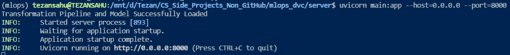
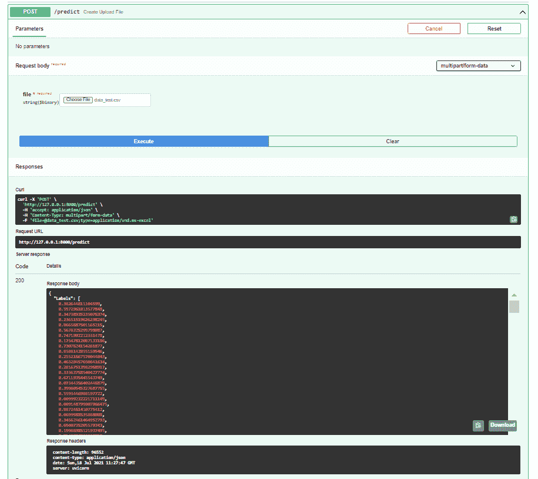

# MLOps 基础知识—第 4 部分|使用 MLFlow 进行跟踪以及使用 FastAPI 进行部署

> 原文：<https://medium.com/analytics-vidhya/fundamentals-of-mlops-part-4-tracking-with-mlflow-deployment-with-fastapi-61614115436?source=collection_archive---------2----------------------->


在过去的 3 篇文章中，我们对如何轻松复杂地版本化 ML 工件和构建 ML 管道有了一个明确的理解。到目前为止，您应该对使用 DVC 跟踪数据相当熟悉了&通过利用 PyCaret 中众多的预处理、特征工程和微调技术，尝试各种 ML 模型进行回归和分类任务。

在本系列的最后一篇博客中，我们将讨论有效记录实验结果、部署 ML 模型以及最终将它们作为 API 端点供用户与模型进行实际交互以获得期望的预测等主题。所以，让我们开始吧！

# 内容

*   实验跟踪:为什么重要？
*   用于跟踪 PyCaret 实验的 MLFlow
*   模型部署:它是什么？
*   将 PyCaret 模型部署到云
*   使用 FastAPI 进行实时服务
*   在线托管模型服务器
*   结束语

# 实验跟踪:为什么重要？

我们已经看到，为任何系统开发 ML 模型都是一个高度迭代的过程，涉及到大量的实验。这些实验通常在以下方面有所不同:

*   应用于数据的预处理步骤
*   不同模型算法的使用
*   不同超参数集的使用
*   培训和/或评估集

这些实验中的每一个都需要用适当的度量标准来评估，以得出某些结论，这有助于我们设计进一步的实验或做出明确的推断。因此，最重要的是我们要保持一份记录，或者仔细地跟踪我们的实验。


***图片来源:*** [*机器学习模型管理*](https://neptune.ai/blog/machine-learning-model-management)

**实验跟踪是 MLOps 的一部分，指的是在设计 ML 管道时，保存每个实验的所有实验相关信息(元数据，有助于得出有意义的结论)。**

实验跟踪有助于我们实现以下目标:

*   **跨实验比较结果:**记录跨实验的模型的超参数&性能度量，以及用一些一致的标签对它们进行标记，可以在尝试对实验进行比较分析时保持事情非常有条理
*   **管理分布式训练:**在分布式系统上训练模型的同时，维护不同机器上的各种运行的记录可以在以后帮助聚合&更有效地可视化结果
*   **通过报告管理团队协作:**团队中的几个成员采用不同的方法来解决问题，定期构建关于当前方法及其性能的报告&接下来可以尝试的潜在变化对团队内的有效协作至关重要
*   **维护模型的记录:**随着越来越多的模型被部署到生产中，记录开发的每个模型(以及元数据)变得势在必行，以便下游任务中的任何失败可以很容易地追溯到源头&很快纠正

# 用于跟踪 PyCaret 实验的 MLFlow

有几个工具和平台有助于 ML 实验跟踪。其中包括 [MLFlow](https://www.mlflow.org/docs/latest/tracking.html) 、[权重&偏差](https://wandb.ai/site)、[海王星](https://neptune.ai/)、[张量板](https://www.tensorflow.org/tensorboard)等。我们将尝试触及其中一个的表面——ml flow 跟踪*(通常是因为它在跟踪实验中提供了很大的灵活性&也与 PyCaret 集成)*

## MLFlow 基础知识

MLFlow 是一款独立于库的开源工具，提供各种解决方案来管理端到端的 ML 工作流:

*   [MLFlow 跟踪](https://www.mlflow.org/docs/latest/tracking.html) *(跟踪实验&比较它们的结果)*
*   [MLFlow 项目](https://www.mlflow.org/docs/latest/projects.html)
*   [MLFlow 模型](https://www.mlflow.org/docs/latest/models.html) *(将各种 ML 库中的模型部署到各种服务平台)*
*   [ml flow Model Registry](https://www.mlflow.org/docs/latest/model-registry.html)*(一个执行模型版本控制的中央存储库&管理模型生命周期)*


***图片来源:****[*data bricks 开源 MLflow 简化机器学习生命周期*](https://www.datanami.com/2018/06/05/databricks-launches-mlflow-to-simplify-machine-learning-lifecycle/)*

**本帖我们就来看看* ***MLFlow 跟踪*** *。您可以自由探索&使用其他认为必要的组件。**

*MLflow 跟踪组件提供了一个 API 和 UI，用于记录参数、代码版本、指标和输出文件，同时在实验过程中执行 ML 代码并查看结果。*

## *为 PyCaret 实验设置 MLFlow 跟踪*

*使用 MLFlow 跟踪实验的功能已经嵌入 PyCaret 2.0 中(安装`pycaret`时会自动安装`mlflow`包)&可以通过几个简单的步骤进行设置:*

***第一步:**通过导入`mlflow` &调用`set_tracking_uri(...)`函数设置跟踪服务器(本地或远程位置，日志&跟踪的数据将存储于此)，跟踪服务器的地址如下:*

```
*import mlflow

# To use a local folder to store the logs, prefic the full path with 'file:/' & use it
mlflow.set_tracking_uri('file:/<full-path-to-local-folder>')

# To use a remote storage location, provide the HTTP URI, for example:
mlflow.set_tracking_uri('<https://my-tracking-server:5000>')*
```

*如果没有显式设置，将在当前目录下创建一个名为`mlruns`的文件夹&日志将存储在那里。*

***步骤 2:** 调用`setup(...)`函数时，使用以下附加参数开始记录实验:*

*   *`log experiment = True` *(允许记录 MLFlow 服务器上的所有参数&指标)**
*   *`experiment_name = <name_of_experiment>` *(设置要记录的实验名称；如果没有设置，* `*'clf'*` *是默认名称)**
*   *`log_plots = True` *(可选:允许将特定图记录为* `*.png*` *文件)**
*   *`log_data = True` *(可选:允许记录实验中使用的训练&测试数据集)**

*现在，我们可以像往常一样使用 PyCaret 来选择和训练我们想要的模型，调整超参数并通过度量和绘图来评估它们。所有与实验相关的元数据将自动记录到我们的跟踪服务器上，稍后可以使用 MLFlow UI 查看。*

## *在 MLFlow 用户界面中导航*

*完成实验后，我们可以继续在 MLFlow UI 中查看日志。这个 UI 支持可视化、搜索和实验之间的比较，并提供下载各种 ML 工件(模型、数据和元数据)以供进一步分析。*

*   *如果跟踪服务器是本地文件夹，则可以通过转到该文件夹并运行`mlflow ui` *(从终端)*或`!mlflow ui` *(从笔记本)来启动 UI。*如果没有明确设置跟踪服务器，日志记录在当前目录下的`mlruns/`文件夹中。因此，命令`mlflow ui`可以从当前目录运行。进入`[http://localhost:5000](http://localhost:5000.)` [可以查看界面。](http://localhost:5000.)*
*   *如果使用远程跟踪服务器，只需转到`[http://ip-address-of-tracking-server:5000](http://ip-address-of-tracking-server:5000.)` [即可查看 UI。](http://ip-address-of-tracking-server:5000.)*

*以下是使用 MLFlow 跟踪的 PyCaret 实验的 UI 截图。正如您所看到的，在工作流的每一步中，每个模型的执行都被记录为一次运行，带有度量的细节、运行执行时间、度量&还有源函数。*

**

*除了正在使用的最终模型*(此处为 Light GBM)*，您还可以找到在`compare_models()`函数调用期间创建的所有其他模型的可点击链接。点击相应的模型会将您带到显示模型所有细节的页面，包括参数、指标、标签&以及图表&其他可下载的工件(如果在实验过程中创建的话)。它还包含代码片段，可用于使用`mlflow` &进行预测来加载保存的模型。如果需要，您还可以将您的模型“注册”到 *MLFlow 模型注册表*。*

**

*使用 MLFlow 进行跟踪的一个有趣方面是，它允许您下载并使用那些在实验过程中未被考虑的模型(如运行`compare_models()`后未被选择的模型)，因为它们对其他相关分析也很有用。*

## *MLFlow(超出 PyCaret)*

*正如我们在上面看到的，MLFlow 跟踪已经嵌入到 PyCaret 中&只需几个简单的步骤就可以设置好。然而，MLFlow 也提供了更多的灵活性&可以很容易地集成到其他几个 ML & DL 框架中，包括 Scikit-Learn、Tensorflow、Keras、PyTorch、FastAI 等，用于自动日志记录。你可以参考[文档](https://www.mlflow.org/docs/latest/tracking.html#automatic-logging)来理解它如何与这些框架一起使用。*

# *模型部署:它是什么？*

*理解了有效地试验我们的 ML 模型的各个方面之后，我们现在进入管道的最后阶段——将我们训练过的模型部署到生产中并使用它们进行推理。*

***模型部署可以被认为是在生产环境中展示一个经过训练的 ML 模型的过程，以供世界上的其他人进行推理。***

*为了最大限度地利用 ML 模型，它们必须被顺利地部署到生产中，以便企业可以开始在实践中使用它们。*

*有多种方法可以将 ML 模型部署和服务到生产环境中，其优势取决于具体的用例:*

***离线预测***

*   *当预测是针对单个事件时，通常在本地机器上完成&直接从 python 代码生成*
*   **例如:在黑客马拉松(或通常的课程作业)中对测试数据集的预测**

***批量预测***

*   *从文件/数据存储中定期输入的一组预测*
*   **例如:基于用户在电子商务网站上的活动模式，用于预测通过每周电子邮件向用户推荐的一组产品的模型**

***实时服务***

*   *通常通过对云中服务的模型的 HTTP 调用进行按需预测(期望低延迟)*
*   **例如:在用户上传图像的网站上提供的对象检测模型&将其提交给服务器以检测图像中的对象。模型的结果几乎会立即返回到网站上。**

***流媒体***

*   *类似于批处理或实时，但有一个额外的队列来处理传入预测请求的高容量和可变性，以处理速率而不是到达速率提供服务*
*   **例如:在线欺诈检测模型，交易排队&异步处理以验证事件是否为欺诈**

*不同的工具迎合了每一种方法。在这篇文章中，我们将探讨如何将我们的 ML 模型部署到云中&用于进行实时预测。*

# *将 PyCaret 模型部署到云*

*在之前的博客中，我们使用 PyCaret 开发了一个完整的 ML 管道。我们开始熟悉使用`save_model(...)`、`load_model(...)`、&、`predict_model(...)`。现在，我们将看到最终部署我们经过训练的&微调模型的步骤，以便&稍后可以使用它进行推理。*

*对于这个练习，我假设你已经完成了本系列第 3 部分的[教程](https://nbviewer.jupyter.org/gist/tezansahu/f034faf9a86856f8d8859556a5ecf12c) &有了预测超导材料临界温度的混合模型。*

## *模型最终确定*

*在 PyCaret 中设置实验时，我们将整个训练数据集分成训练和验证集。在管道中，我们在这个训练集上训练我们的模型，然后在保留的验证集上评估它，以验证我们的性能指标。但是一旦验证了我们选择的模型在保留的验证集上如预期的那样执行，我们可能想要在整个数据集上最后一次训练我们的模型(训练+验证)。这可以通过使用`finalize_model(...)`来完成。*

**要使用它，您必须运行* ***中级 PyCaret*** *部分的* `*setup(...)*` *函数，使用* `*blended_model = load_model("blended_expt2")*` *&加载您保存的混合模型，然后使用* `*final_blended = finalize_model(blended_model)*`在整个训练集上训练它*

*完成这一步后，我们现在可以继续将我们的模型部署到云中。*

## *AWS 上的模型部署*

*虽然可以使用我们在上一篇文章中看到的`save_model(...)`函数将一个经过训练的模型作为一个`.pkl`文件部署到本地，但是我们也可以将我们的模型部署到云中。PyCaret 允许用户将其模型部署到各种云平台，如 AWS、Azure & GCP。在这篇博客中，我们将看到如何将我们训练过的模型部署到 AWS，因为我们已经创建了我们的自由层 AWS 帐户&并且在学习使用 DVC 时已经在[第 2 部分](/@tezansahu/fundamentals-of-mlops-part-2-data-model-management-with-dvc-6be2ad284ec4)中设置了我们的 S3 存储桶。*

**虽然必要的库，即* `*boto3*` *会在您安装第 2 部分中的* `*dvc[s3]*` *时自动安装，但是如果没有安装，您现在可以使用* `*pip install boto3*` *安装。还应该配置必要的环境变量* `*AWS_ACCESS_KEY_ID*` *、*`*AWS_SECRET_ACCESS_KEY*`*&*`*AWS_DEFAULT_REGION*`*(如果已经完成，则忽略，同时遵循* [*第 2 部分*](/@tezansahu/fundamentals-of-mlops-part-2-data-model-management-with-dvc-6be2ad284ec4) *)。**

*现在，我们可以简单地将模型部署到我们的 S3 存储桶，使用:*

```
*# Deploy model
deploy_model(
    model = final_blended, 
    model_name = 'lightgbm_deploy_1', 
    platform = 'aws', 
    authentication = {'bucket' : 'mlopsdvc170100035'}
)# Enter your respective bucket name in place of 'mlopsdvc170100035'*
```

## *使用部署的模型进行推理*

*现在，正如我们使用`load_model(...)` & `predict_model(...)`来使用本地保存的模型进行推断一样(参见第 3 部分)，我们可以使用这个组合来使用部署在 AWS 上的模型进行推断:*

```
*loaded_model = load_model(
    'lightgbm_deploy_1', 
    platform = 'aws', 
    authentication = { 'bucket' : 'mlopsdvc170100035' }
)predictions = predict_model(loaded_model, data=data_unseen)predictions.head()    # View some of the predictions*
```

*现在，我们知道可以在应用程序中的任何地方使用上面的代码片段来加载部署的模型，并使用它进行批量预测。我们将在下一节中看到这一点，届时我们将使用我们的模型进行推理。*

# *使用 [FastAPI](https://fastapi.tiangolo.com/) 进行实时服务*

*一旦我们的模型被部署(本地或云上)，我们可以使用它来进行离线/批量预测，如前所述。但是，我们也可以为它提供一些平台，通过 HTTP 请求进行实时预测。为此，我们需要通过 API(应用程序接口)向外界公开我们的模型。这是我们将在当前部分解决的问题。*

## *通过 RESTful APIs 服务模型*

*对于那些不熟悉 API 或 RESTful API 的人，强烈建议您参考**附加资源**部分中的**RESTful API 简介**，以便更好地理解它。然而，作为一个快速的概述，REST API 将被请求资源的状态传递给客户机。在我们的场景中，所请求的资源将是从我们的 ML 模型中推断出来的。因此，我们的服务器将向客户端发送预测，客户端可以是任何东西——从 web 应用程序到移动设备。*

**

*[什么是 REST API？](https://phpenthusiast.com/blog/what-is-rest-api)*

*使用 RESTful APIs 来服务 ML 模型的一些优势是:*

*   *要增加客户端的数量，可以即时提供预测服务*
*   *分离模型环境和面向客户的层，以促进团队相互独立地工作*
*   *在不同的 API 端点组合几个模型是可能的*
*   *通过在[负载平衡器](/@itIsMadhavan/what-is-load-balancer-and-how-it-works-f7796a230034)后放置额外的实例，轻松扩展应用程序*

*Python 中有几个工具和框架(如 FastAPI、Flask、Django 等。)可用于创建一个后端服务器来加载和服务我们的模型以进行预测。我们将为这个博客继续使用 FastAPI，因为它非常强大，但使用起来非常简单，并且有很好的文档。*

## *FastAPI 简介*

*正如在其[网站](https://fastapi.tiangolo.com/)、*上提到的，“FastAPI 是一个现代、快速(高性能)的 web 框架，用于基于标准 Python 类型提示用 Python 3.6+构建 API。”**

**

****图片来源:****[*FastAPI—GitHub*](https://github.com/tiangolo/fastapi)**

**自从最近开始以来，它已经得到了广泛的认可和采用(包括像优步和网飞这样的公司)。它提供了几个很酷的特性，包括使用 [OpenAPI 规范](https://github.com/OAI/OpenAPI-Specification)，为 API 创建自动&交互文档，使用各种方案的安全&认证，编辑器支持(在 VSCode & PyCharm) &众多“插件”。**

**更多信息，请随意浏览 [FastAPI 文档](https://fastapi.tiangolo.com/)。**

## **装置**

**使用`pip install fastapi[all]`可以轻松安装 FastAPI。与`fastapi`一起，它安装了`starlette` & `pydantic`库，这些库构成了`fastapi`的主干。此外，它还会自动安装`uvicorn`，作为运行`fastapi`代码的服务器。**

**`*uvicorn*` *是一个轻量级的 ASGI 服务器，&也可以使用* `*pip install uvicorn[standard]*` *独立安装。涵盖 ASGI 服务器超出了本文的范围，但是你可以在* ***附加参考文献*** *一节中阅读。***

## **为 ML 模型创建一个 FastAPI 服务器**

**有了关于 FastAPI 的背景知识，我们就可以编写代码来加载我们部署的模型&使用 FastAPI 将它作为 API 端点。基本上，我们将启动一个服务器&为用户提供 API 端点`/predict`,上传任何包含数据的 CSV 文件以进行预测。以下是我们将努力完成的工作的大致轮廓:**

1.  **设置 FastAPI 应用程序**
2.  **将部署的模型加载到应用程序中**
3.  **创建一个 POST 端点`/predict`来接受一个输入的 CSV 文件&并将其转换成一个`pandas`数据帧**
4.  **使用模型对数据框架进行预测，并将结果返回给用户**

**所有这些只用了不到 50 行代码！*(不包括文件中的注释)***

**在深入研究代码之前，我们只需要安装几个包:**

```
**# To receive uploaded files (uploaded files are sent as "form data")
$ pip install python-multipart   

# To load environment variables from .env file into the application
$ pip install python-dotenv**
```

**在您希望存放服务器的文件夹中，创建一个`.env`文件，如下所示:**

```
**AWS_ACCESS_KEY_ID={your-access-key}
AWS_SECRET_ACCESS_KEY={your-secret-access-key}
AWS_DEFAULT_REGION=ap-south-1**
```

*****注意:*** *千万不要把你的* `*.env*` *文件上传到 GitHub。始终将其添加到* `*.gitignore*` *&创建一个仅包含变量名(而非变量值)的备选* `*.env.example*` *文件，以便使用代码的人知道应用程序需要什么环境变量。***

```
***# Import Uvicorn & the necessary modules from FastAPI*
import uvicorn
from fastapi import FastAPI, File, UploadFile, HTTPException*# Import the PyCaret Regression module*
import pycaret.regression as pycr*# Import other necessary packages*
from dotenv import load_dotenv
import pandas as pd
import os*# Load the environment variables from the .env file into the application*
load_dotenv() *# Initialize the FastAPI application*
app = FastAPI()*# Create a class to store the deployed model & use it for prediction*
class Model:
    def __init__(self, modelname, bucketname):
        *"""
        To initalize the model
        modelname: Name of the model stored in the S3 bucket
        bucketname: Name of the S3 bucket
        """*
        *# Load the deployed model from Amazon S3*
        self.model = pycr.load_model(
            modelname, 
            platform = 'aws', 
            authentication = { 'bucket' : bucketname }
        )

    def predict(self, data):
        *"""
        To use the loaded model to make predictions on the data
        data: Pandas DataFrame to perform predictions
        """*
        *# Return the column containing the predictions  
        #* *(i.e. 'Label') after converting it to a list*
        predictions = pycr.predict_model(self.model, data=data).Label.to_list()
        return predictions*# Load the model that you had deployed earlier on S3\. 
# Enter your respective bucket name in place of 'mlopsdvc170100035'*
model = Model("lightgbm_deploy_1", "mlopsdvc170100035")*# Create the POST endpoint with path '/predict'*
@app.post("/predict")
async def create_upload_file(file: UploadFile = File(...)):
    *# Handle the file only if it is a CSV*
    if file.filename.endswith(".csv"):
        *# Create a temporary file with the same name as the uploaded 
        # CSV file to load the data into a pandas Dataframe*
        with open(file.filename, "wb")as f:
            f.write(file.file.read())
        data = pd.read_csv(file.filename)
        os.remove(file.filename) *# Return a JSON object containing the model predictions*
        return {
            "Labels": model.predict(data)
        }    
    else:
        *# Raise a HTTP 400 Exception, indicating Bad Request 
        # (you can learn more about HTTP response status codes* [*here*](https://restfulapi.net/http-status-codes/)*)*
        raise HTTPException(status_code=400, detail="Invalid file format. Only CSV Files accepted.")*# Check if the environment variables for AWS access are available. 
# If not, exit the program*
if os.getenv("AWS_ACCESS_KEY_ID") == None or os.getenv("AWS_SECRET_ACCESS_KEY") == None:
    exit(1)**
```

**现在，我们只需运行`uvicorn main:app --host=0.0.0.0 --port=8000` &就可以看到我们的服务器已经启动&并在`http://0.0.0.0:8000`上运行。0.0.0.0 表示可以通过环回地址 127.0.0.1 以及机器的 IP 地址访问它**

****

**为了测试我们的端点，我们可以在`http://127.0.0.1:8000/docs`找到自动交互文档。您会看到 POST `/predict`端点已经创建，可以通过单击“立即尝试”来展开部分&进行测试。您可以上传任何 CSV 文件(与训练数据具有相同的列)&将其发送到服务器以返回实时预测:**

***您可以通过从* `*material_superconductivity.csv*` *文件&中抽取一些行来创建一个测试数据集，并将其保存为一个单独的文件。***

****

**您还可以使用上面文档中提到的`curl`命令，用您想要的 CSV 文件以编程方式查询`http://127.0.0.1:8000/predict`端点，以获得作为响应的预测。**

**这样，我们可以看到我们是如何轻松地部署和服务我们训练有素的 ML 模型，让用户通过 RESTful API 访问它。**

## **为 ML/DL 模型提供服务的通用模板**

**上面我们已经看到了如何使用 FastAPI 为部署在 AWS 上的 PyCaret 模型提供服务。这个概念可以扩展到任何 ML/DL 模型，使用 FastAPI 部署在本地或云上，以便用户可以通过 API 端点使用它。这样做的通用模板如下:**

```
**1\. Set up the FastAPI application
2\. Load the model(s) into the application
3\. Create required API endpoint(s) for users to submit data:
   - These could be CSV file(s), image(s), JSON object(s), etc.
   - Handle incoming data appropriately
4\. Use the indended model to predict the result(s) on the data submitted
5\. If successful, return the predictions, else raise an error**
```

**使用这个通用模板，可以部署和服务使用任何框架(scikit-learn、PyTorch、TensorFlow 等)构建的模型。)提供给用户(尽管其他框架也可能提供专用工具来服务于使用它们构建的模型)。**

# **在线托管模型服务器**

**在上面的例子中，我们在本地启动了 FastAPI 服务器并执行了预测。我们也可以使用几个选项在线托管这个 API 服务器:**

*   **[Heroku](https://towardsdatascience.com/autodeploy-fastapi-app-to-heroku-via-git-in-these-5-easy-steps-8c7958ef5d41)**
*   **[德塔](https://fastapi.tiangolo.com/deployment/deta/)**
*   **[码头工人](https://fastapi.tiangolo.com/deployment/docker/)**

**我们鼓励感兴趣的人尝试一下这些选项。**

# **结束语**

**恭喜你！您已经完成了这个关于 MLOps 基础知识的 4 篇博客系列的结尾部分。反思我们在这 4 篇文章中的学习，我们获得了一些使用工具的实践经验，这些工具可以自动化 ML 工作流程的每个阶段，并使其更加高效:**

*   **我们通过尝试理解 MLOps 的关键**原则&实践，开始了第[部分 1](/@tezansahu/fundamentals-of-mlops-part-1-a-gentle-introduction-to-mlops-1b184d2c32a8)****
*   **在[第 2 部分](/@tezansahu/fundamentals-of-mlops-part-2-data-model-management-with-dvc-6be2ad284ec4)中，我们首先学习了**对 ML 项目** &的版本控制，然后使用 **DVC** 对**亚马逊 S3** 中的&维护 ML 工件进行版本控制**
*   **在第 3 部分的[中，我们探讨了如何使用一个名为 **PyCaret** 的低代码 ML 框架高效地开发**端到端 ML 管道**](/@tezansahu/fundamentals-of-mlops-part-3-ml-experimentation-using-pycaret-747f14e4c28d)**
*   **我们通过学习使用 **MLFlow** &的**模型跟踪**完成了这个最后的第 4 部分，也看到了如何**部署**我们的模型到**&**使用 **FastAPI** 服务**它们****

****完成了这 4 个部分的内容后，现在我们可以重温在[第 1 部分](/@tezansahu/fundamentals-of-mlops-part-1-a-gentle-introduction-to-mlops-1b184d2c32a8) &中介绍的 MLOps 堆栈模板，使用我们在这 4 篇博客系列文章中学习使用的工具&框架来填充它。现在，我们的 MLOps 堆栈应该如下所示。****

********

****当然，在每一步都有很多其他工具可以使用(正如在[第一部分](/@tezansahu/fundamentals-of-mlops-part-1-a-gentle-introduction-to-mlops-1b184d2c32a8)中提到的)。不过本系列介绍的框架也是配套的&可以帮助你开始你的 MLOps 之旅！****

****希望你觉得这个 MLOps 系列的基础很有趣和有用。以下是本系列的其他博客:****

*   ****[**第 1 部分:**MLOps 简介](/@tezansahu/fundamentals-of-mlops-part-1-a-gentle-introduction-to-mlops-1b184d2c32a8)****
*   ****[**第二部分:**数据&模型管理同 DVC](/@tezansahu/fundamentals-of-mlops-part-2-data-model-management-with-dvc-6be2ad284ec4)****
*   ****[**第 3 部分:**使用 PyCaret 的 ML 实验](/@tezansahu/fundamentals-of-mlops-part-3-ml-experimentation-using-pycaret-747f14e4c28d)****

****谢谢&快乐编码！****

# ****附加参考****

*   ****[跟踪机器学习实验的 15 个最佳工具](https://neptune.ai/blog/best-ml-experiment-tracking-tools)****
*   ****[RESTful API 简介](https://searchapparchitecture.techtarget.com/definition/RESTful-API)****
*   ****[快速 API 入门](https://dev.to/supanthapaul/getting-started-with-fastapi-create-apis-quickly-using-python-2a9f)****
*   ****[使用 MLFlow 跟踪 ML 实验](https://towardsdatascience.com/tracking-ml-experiments-using-mlflow-7910197091bb)****
*   ****`[uvicorn](https://www.uvicorn.org/)` [文档](https://www.uvicorn.org/)****
*   ****[ASGI 文档](https://asgi.readthedocs.io/en/latest/)****

# ****关于作者****

****嘿伙计们！我是 Tezan Sahu，微软的数据和应用科学家。我在孟买的 IIT 大学获得了学士学位，主修机械工程，辅修计算机科学与工程。我对 NLP、深度学习和区块链有浓厚的兴趣，喜欢使用前沿技术开发有趣的产品。****

******网址:** [特赞萨胡|微软](https://tezansahu.github.io/)
**LinkedIn:** [特赞萨胡| LinkedIn](https://www.linkedin.com/in/tezan-sahu/)
**邮箱 ID:**[tezansahu@gmail.com](mailto:tezansahu@gmail.com)****