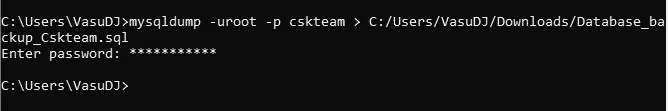
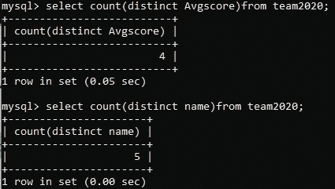
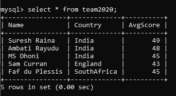

# 进一步了解 SQL(第 1 部分)

> 原文：<https://medium.com/analytics-vidhya/further-into-sql-part-1-afcaf61c8c92?source=collection_archive---------1----------------------->

欢迎回来，在这个故事中，我们将深入探讨 SQL，

如果你不熟悉我的故事，你可以参考我以前的故事来了解 SQL 的基础知识

现在，我们将开始导入和导出数据到 MySQL，以及数据分析，如公式化，排序，切片，并根据我们的要求过滤数据

表示如何将导入的 CSV 文件转换为查询

# 将 CSV 文件导入 MySQL:

为什么我们需要进口”。csv“文件，在实时问题/情况下，将有数百万条记录需要插入到表中，很难手动将这些数据输入到数据库中以便我们使用”。csv”文件，但该文件必须由表中提到的相同属性和相同的顺序组成。

表示 CSV 文件中的表列和列的字段

列名必须与表中提到的相同，数据类型和数据大小也必须相同。(否则会出现错误)

# 要导入的代码”。csv”文件:

## " load data local infile "C:/(文件位置与您的系统中的位置相同)/team2020.csv "到 table players 列中，这些列以" "结尾，可以用"'"括起来忽略 1 行；

(仅当您在中有列的名称时，才使用“忽略 1 行”。csv 文件如上图所示)

表示导入的代码。csv”文件。

表示 team2020 表格的视图

要检查所有数据是否正确导入(只需查看)请使用>“select * from team2020”

# 使用 MySQLdump 导出数据库或表

## 导出表

要使用 MySQLdump，您需要退出 my MySQL，然后使用以下代码:MySQL dump-u root-p csk team team 2020 > C:/(File _ Location _ of _ Backup)/table _ Backup _ team 2020 . SQL

表示如何 mysqldump，以便我们获得表的备份

## 导出数据库

要使用 MySQLdump，您需要退出 my MySQL，然后使用以下代码:MySQL dump-u root-p csk team > C:/(File _ Location _ of _ Backup)/Database _ Backup _ csk team . SQL

代表如何 mysqldump，以便我们得到数据库的备份

保存在上述位置的文件

# 数据分析:

让我们从简单的查询开始:

## ✒️How 在表格中查找记录的数量。

使用的查询:select count(*)作为 team2020 中的 No _ of _ Records

## ✒️How 找到了列中的唯一值:

使用的查询:select distinct(Avgscore)from team 2020；

## ✒️How 在列中查找唯一值的编号:

使用的查询:1:"从 team2020 中选择计数(distinct Avgscore"，2:"从 team2020 中选择 count(distinct Avgscore；"。

## ✒️How 求一列的总和、平均值和标准偏差

使用的查询:1-“select sum(Avgscore)作为 team2020 的合计；”，2-"选择 avg(Avgscore)作为 team2020 的平均值；"，3-“选择标准偏差(Avgscore)作为 team2020 的标准偏差；”

## ✒️How 根据下表中的某些条件从获取特定数据:

## 去寻找

> 1.Avgscore 大于或等于 46(均值)的选手，
> 
> 2.玩家 Max 和 Min AvgScore，
> 
> 3.对 Avgscore 的数据进行升序和降序排序，
> 
> 4.查找与国家相关的玩家数量，
> 
> 5.如何获取名字以 S 开头，名字包含 R，名字以 I 结尾的玩家？
> 
> 6.如何让排名第二和第三的玩家进入 avgscore

## 使用的查询:

> 1." select * from team2020，其中 Avgscore > = 46"

> 2.从 team2020 中选择最大值(Avgscore)、最小值(Avgscore)

> 3.(a)升序:“Select * from team 2020 Order by avg score；”(b)降序排列:“从 Avgscore desc 公司的 team2020 订单中选择*

> 4."选择国家，count(*)来自 team2020 Group by country"

> 5.(a)以 S 开头的名称:“Select * from team2020，其中名称如“S %”；”(b)包含 R 的名称:“Select * from team2020，其中名称类似于“% R %”；(c)以 I 结尾的名称:" Select * from team 2020 where Name like " % I "；"
> 
> 6.选择名称，AvgScore from team 2020 order by AvgScore desc 限制 2 偏移量 1(或)“Select Name，AvgScore from team 2020 order by 2 desc 限制 2 offset 1；”

(注意:在 order by 中使用 2，但得到的结果是相同的，因为在 select 中，每一列都将被编号为 1，2，3，这可以在 Order by 或 Group by 子句中使用)

## 我使用的查询很简单，我们可以一起使用 group by 子句、order by 子句、Limit 子句和 Offset 子句的组合

问题:找出第二和第三个国家的球员名单。

查询:" select count(count)，count from team 2020 group by 2 order by 1 desc 限制 2 offset 1；"

使用 Limit 和 offset 子句时的区别

好了，您已经完成了这个故事的结尾，我的建议是尝试上面的查询，尝试使用子句，并通过更改数字，表越大，您看到的差异越大，请继续关注 SQL(第 2 部分)中更多令人兴奋的查询。

> ~瓦苏·德万

我使用的查询很简单