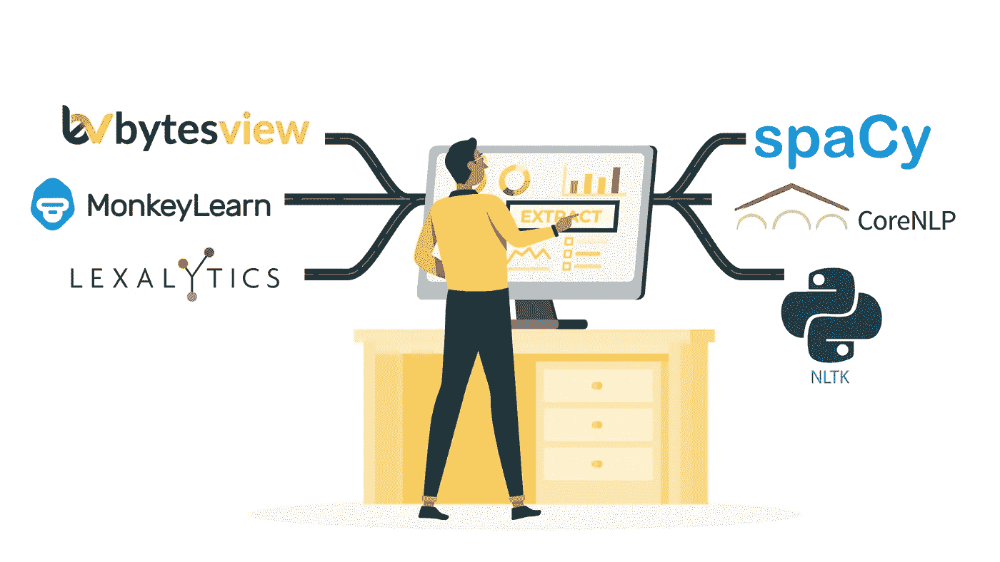
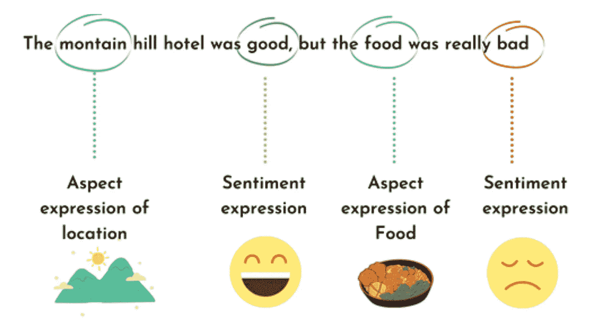
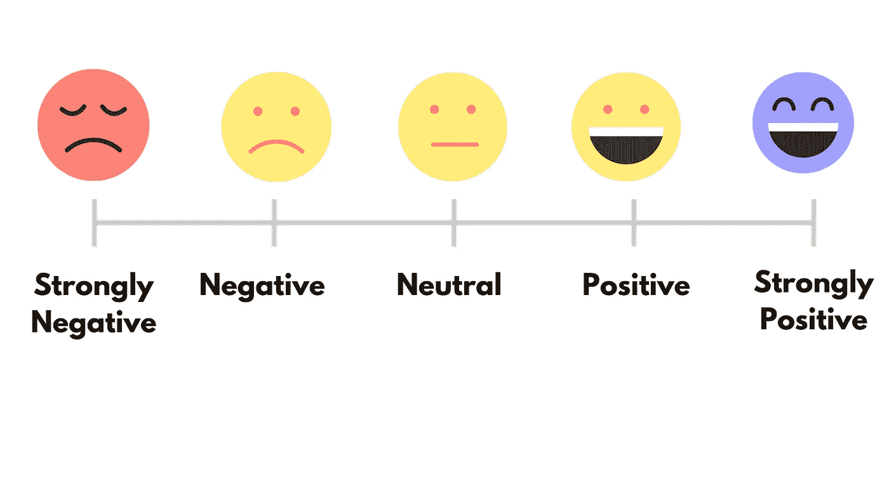

# 情感分析的未来

> 原文：<https://medium.com/analytics-vidhya/future-of-sentiment-analysis-13a9be14218b?source=collection_archive---------2----------------------->

情感分析是对文本背后的情感进行分类的过程。这是一个如此简单的任务，它也可以手工完成；只需阅读每一条反馈，并确定它是积极的还是消极的。

在许多分析领域中，人类最擅长的一个领域是识别感觉的能力。

然而，对于呈现给你的反馈，比如**40–50**甚至 **100** ，这是可行的。然而，如果你有一个数据集，比如说， **10，000 条**评论，手工分析它们就变得不可能了。

**更不用说会出现的时间和偏差。**

尽管数据增长对于任何不断扩张的业务来说都是不可避免的，但数据的价值仍然取决于分析质量。

[**BytesView**](https://www.bytesview.com/) 和其他情感分析工具正在迅速取代传统的民意调查、跟踪品牌和产品声誉、分析客户体验和进行市场研究的方法。

通过使用这些工具检查和评估客户情绪，品牌可以全面了解消费者行为，从而更好地为受众提供产品、服务和体验。

然而，情感分析将在未来进行更深入的研究，超越积极、消极或中立的概念，以达到并理解理解对话的意义及其揭示的消费者信息。

因此，随着这些互动背后的数据变得越来越大、越来越复杂，情感分析对这些企业变得越来越重要。

即使在今天，企业和品牌在任何项目中执行绝大多数的情感分析，利用来自社交媒体、调查反馈和其他用户生成内容来源的数据。

此外，品牌将能够通过透彻的理解和更大、更全面的数据库，轻松定制和个性化他们的服务。企业可以根据受众对品牌的实际感受进一步细分市场，而不是根据年龄、性别、收入和其他表面人口统计数据进行细分。

# **4 种情感分析类型**

## **基于方面的情感分析**

基于方面的情感分析是一种文本分析技术，它根据文本数据的方面对文本数据进行分类，并识别其情感。它用于通过将情绪与产品或服务的各个方面相关联来分析客户反馈数据。

例如，任何特定的产品或服务方面都可以是“客户体验”或“支持人员响应时间”

1.  情绪是对某事积极或消极的感觉。
2.  正在讨论的类别和特性是方面。

## **细粒度情感**

这种情感分析模型有助于极性精度的开发。情绪分析可以跨以下极性类别执行:非常积极、积极、中性、消极或非常消极。

评论和评级的研究受益于细粒度的情感分析。

在 1 到 5 的范围内，1 表示非常消极，5 表示非常积极。在 1 到 10 的范围内，1-2 表示非常消极，9-10 表示非常积极。

## **情绪检测**

识别和分析文本数据中表达的情感的过程被称为情感分析。

情感检测和分类是简单的任务，可以根据文本中表达的情感类型来完成，如恐惧、愤怒、快乐、悲伤、爱情、灵感或中性。

## **意图分析**

意图检测是分析文本数据以确定作者意图的过程。意图是人类行为和行动的基础，理解意图可以帮助你解释这些行为。

它可以帮助企业更好地了解他们的客户，并预测他们未来的行动方针。意图检测可以预测客户的意图，并帮助规划未来的行动过程。

# 以下是情感分析的一些有趣的应用方式。

## **识别和预测市场趋势**

它使您能够分析大量的市场研究数据，以便发现新兴趋势并更好地了解消费者的购买习惯。这种练习可以帮助你驾驭复杂的股市交易，并根据市场情绪做出决定。

## **关注品牌形象**

情感分析经常用于调查用户对产品或主题的看法。您还可以使用它来进行产品分析，并向开发团队提供所有相关数据。

## **检查民意调查和政治调查**

为了预测选举结果，任何人都可以使用情绪分析来汇编和分析大量文本数据，如新闻、社交媒体、观点和建议。它考虑到了公众对两位候选人的感受。

## **正在分析来自客户反馈的数据。**

来自客户反馈的数据可用于确定需要改进的地方。情绪分析可以帮助您从客户反馈数据中提取价值和见解，以及制定有效的客户满意度策略。

## **观察和分析社交媒体上的对话**

社交媒体上的对话是信息的金矿。看看社交媒体上关于你的品牌的对话，用情感分析看看你的客户在说什么；这可以帮助任何公司更有效地规划未来战略。

## **员工流动减少**

分析大量员工反馈数据，确定员工满意度。情绪分析工具使用这些见解来鼓舞士气和提高生产力，同时告知您员工的感受。