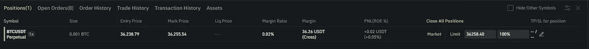

# 用 python-币安进行期货交易

> 原文：<https://medium.com/analytics-vidhya/futures-trading-with-python-binance-d738c71e17b5?source=collection_archive---------0----------------------->

## 温和的介绍


[行政长官](https://unsplash.com/@executium?utm_source=medium&utm_medium=referral)在[广场](https://unsplash.com?utm_source=medium&utm_medium=referral)拍照

朋友们好。最近，我一直试图使用 python-币安包装器来构建我自己的专有加密算法交易软件。我的策略中很大一部分是交易期货(美元-百万美元)，为了运用杠杆，做多-做空等等。所以我根据我对这个优秀图书馆的了解(向作者 Sam McHardy 大喊),整理了这个(希望如此)方便的小指南，特别关注未来。我们开始吧！

**请注意:**

1)我假设我亲爱的读者至少对这个库有点熟悉，因此理解并拥有币安 API 密匙(对于那些不熟悉的读者，请参见下面的链接)。

2)正如麦克哈迪先生自己否认的那样，这是一个非官方的库，意味着它不被币安公司支持。仅支持实际的 API 链接，这可能会经常发生变化。因此，我们必须自担风险使用图书馆。

3)还有，也是最重要的，请不要从这篇文章中以任何方式推断投资建议！这在很大程度上是一个“如何做”的指南，所以在市场上执行任何实时交易之前，请保持理智并仔细思考。

[](https://github.com/sammchardy/python-binance) [## 萨姆哈迪/python-币安

### 2021 年 5 月 11 日更新这是币安交易所 REST API v3 的非官方 Python 包装器。我绝不是…

github.com](https://github.com/sammchardy/python-binance) [](https://www.binance.com/en/support/faq/360002502072) [## 如何创建 API |币安，API，创建

### 创建一个 API 可以让你通过几种编程语言连接到币安的服务器。数据可以从…

www.binance.com](https://www.binance.com/en/support/faq/360002502072) 

首先，我们将安装库:

```
# In a terminal, environment (virtual or otherwise) activated
pip install python-binance
```

然后按照下面的方法将其导入 Python 使用我们的 API 键实例化一个客户端:

```
from binance.client import Clientuser_key = **********************
secret_key = **********************binance_client = Client(user_key, secret_key)
```

## 市场数据

在深入交易方面之前，我们可能首先希望检索我们正在交易的合约的一些市场数据。对于这个例子，让我们保持简单，并选择 BTC/USDT 永久未来的工作。如果我们希望获得合同的**当前**价格:

```
binance_client.futures_symbol_ticker(symbol='BTCUSDT')
```

产出:

```
# {'symbol': 'BTCUSDT', 'price': '48057.72', 'time': 1630312116135}
```

**编辑:**我最初引用了‘期货 _ 硬币 _ 符号 _ 报价器’方法；上面使用的替代方法具有更大的仪器覆盖范围。

假设我们现在希望为我们的合同检索 OHLCV 市场数据，以便对**历史**数据进行一些数据分析。我们可以使用以下方法:

```
binance_client.futures_historical_klines(
    symbol='BTCUSDT',
    interval='1d',  # can play with this e.g. '1h', '4h', '1w', etc.
    start_str='2021-06-01',
    end_str='2021-06-30'
)
```

默认情况下，输出将以列表格式返回给我们，但是我们可以非常容易地将其转换为 pandas 数据框架，使其更适合于分析目的:

```
import pandas as pddf = pd.DataFrame(binance_client.futures_historical_klines(
    symbol='BTCUSDT',
    interval='1d',
    start_str='2021-06-01',
    end_str='2021-06-30'
))df.head()
```

产出:

```
#    0         1         2   ...          9                  10 11
#0  1622505600000  37244.36  37893.76  ...  291774.994  10673866023.68145  0
#1  1622592000000  36694.37  38232.99  ...  223993.314   8358143926.28754  0
#2  1622678400000  37570.00  39470.00  ...  254932.483   9843247414.77212  0
#3  1622764800000  39247.40  39297.35  ...  345357.923  12774740375.75271  0
#4  1622851200000  36828.03  37900.49  ...  314764.238  11449282806.42592  0
#[5 rows x 12 columns]
```

如您所见，我们的列中的数据类型并不是我们想要的(即时间戳而不是日期，OHLCV 之外的多余列)。因此，我们将执行数据争论的一个片段，pandas 使它变得如此简单:

```
# crop unnecessary columns
df = df.iloc[:, :6]# ascribe names to columns
df.columns = ['date', 'open', 'high', 'low', 'close', 'volume']# convert timestamp to date format and ensure ohlcv are all numeric
df['date'] = pd.to_datetime(df['date'], unit='ms')
for col in df.columns[1:]:
    df[col] = pd.to_numeric(df[col])df.head()
```

产出:

```
#         date      open      high       low     close      volume
#0 2021-06-01  37244.36  37893.76  35500.00  36693.41  590822.540
#1 2021-06-02  36694.37  38232.99  35905.00  37569.99  441719.806
#2 2021-06-03  37570.00  39470.00  37150.15  39247.40  507429.005
#3 2021-06-04  39247.40  39297.35  35552.51  36828.03  700625.866
#4 2021-06-05  36828.03  37900.49  34800.00  35498.62  631028.448
```

好多了！好了，前戏到此为止——让我们开始交易吧。

## 贸易

有趣的部分是:首先，让我们 ping 一个测试订单，看看服务器是否接收到它。如果不是，那么可能需要对帐户 API 特权进行一些调查。

```
binance_client.create_test_order(
    symbol='BTCUSDT',
    type='MARKET',
    side='BUY',
    quantity=0.001
)
```

如果一切正常，我们应该会收到一个空字典:“{}”。

接下来，在进行实际交易之前，我们将快速浏览一下订单簿，以了解市场深度:

```
# into a pandas DataFrame for neater output 
df = pd.DataFrame(
    binance_client.futures_order_book(symbol='BTCUSDT')
)print(df[['bids', 'asks']].head())
```

产出:

```
#bids               asks
#0  [36261.99, 0.005]  [36262.22, 0.041]
#1  [36261.98, 0.100]  [36262.46, 0.099]
#2  [36261.84, 0.277]  [36262.60, 0.066]
#3  [36261.83, 0.005]  [36262.62, 0.001]
#4  [36261.79, 0.186]  [36262.74, 0.711]
```

现在，在我们下真正的期货订单之前，最重要的是设置**杠杆**。我们必须**非常非常小心**在确定我们的杠杆率时不要犯任何错误，因为一个小小的错误可能会导致我们承担比我们愿意(或能够)承担的风险大得多的风险！)来给定策略。这就是为什么在每次交易之前，我总是用下面的方法来确定我的杠杆:

```
binance_client.futures_change_leverage(symbol='BTCUSDT', leverage=1)
```

这将确保您在终端时段**为指定符号**执行的所有交易都采用上面设置的杠杆。如果你比我更有冒险精神，希望提高杠杆，那么你只需确保自己做好了承担额外风险的充分准备，了解风险是如何运作的，并在你的保证金账户中有足够的资金来弥补任何潜在的损失。

要下达期货**限价**订单:

```
binance_client.futures_create_order(
    symbol='BTCUSDT',
    type='LIMIT',
    timeInForce='GTC',  # Can be changed - see link to API doc below
    price=30000,  # The price at which you wish to buy/sell, float
    side='BUY',  # Direction ('BUY' / 'SELL'), string
    quantity=0.001  # Number of coins you wish to buy / sell, float
)
```

下达期货**市场**订单:

```
binance_client.futures_create_order(
    symbol='BTCUSDT',
    type='MARKET',
    timeInForce='GTC',
    side='BUY',
    quantity=0.001
)
```

瞧啊。该头寸应在您的币安账户视图中填充，如下所示(我的是在撰写本文时执行的市价单):



0.001 BTC/USDT 永久市场订单

如果交易尚未完成，可以非常简单地查看当前未完成的订单:

```
binance_client.futures_get_open_orders(symbol='BTCUSDT')
```

## 结论

希望这对大家有所帮助，请随意查看我的 Github 页面上的全部源代码，另外，我肯定会鼓励大家查看并拼凑一些 python-币安文档，以及币安 API 文档，因为可能还有我在这里没有介绍的其他功能:

[](https://github.com/jpstephens93) [## jpstephens93 -概述

### 此时您不能执行该操作。您已使用另一个标签页或窗口登录。您已在另一个选项卡中注销，或者…

github.com](https://github.com/jpstephens93)  [## 欢迎使用 python-币安版本 1 . 0 . 12-python-币安版本 0.2.0 文档

### 2021 年 5 月 11 日更新这是币安交易所 REST API v3 的非官方 Python 包装器。我绝不是…

python-binance.readthedocs.io](https://python-binance.readthedocs.io/en/latest/index.html)  [## 币安 API 文件

### 在 stream @compositeIndex REST 更新端点中添加了用于报价资产和指数价格的 WEBSOCKET 新字段“q”和“I”……

币安文件. github.io](https://binance-docs.github.io/apidocs/futures/en/#change-log) 

一如既往，我们非常欢迎建设性的反馈，所以请让我知道你认为我做得对还是错。我们也鼓励对未来的主题提出建议，以及任何问题，所以请不要犹豫发表评论，我会尽力尽快回复。