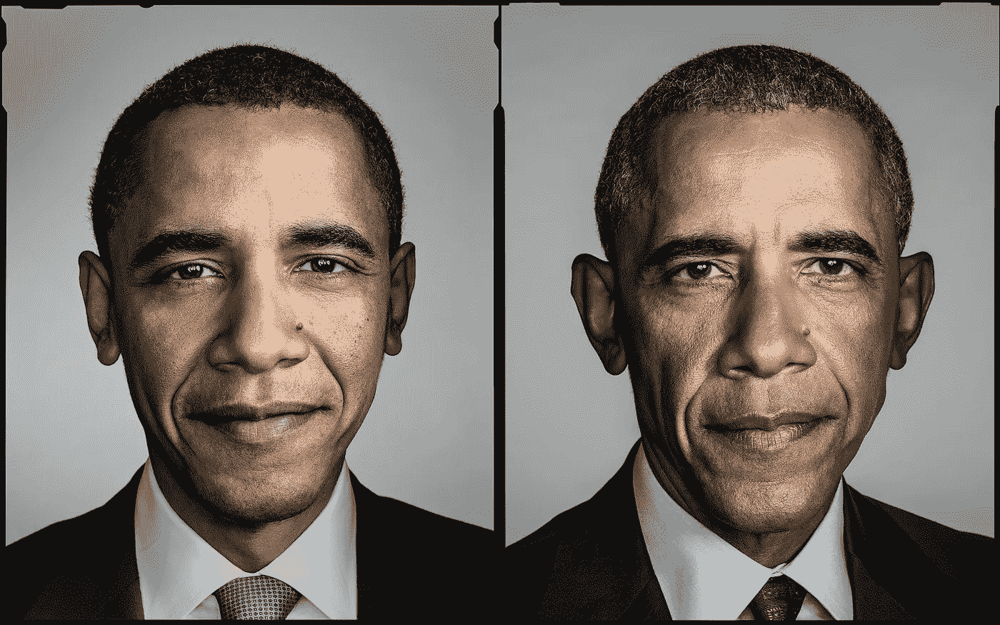
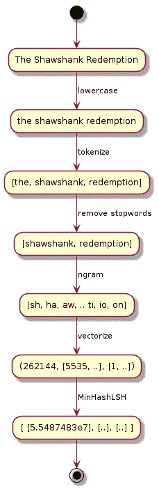

# Python 中使用 Spark 的模糊字符串匹配——真实世界示例

> 原文：<https://medium.com/analytics-vidhya/fuzzy-string-matching-with-spark-in-python-7fcd0c422f71?source=collection_archive---------3----------------------->



它们是相同的，但是不同的。

模糊字符串匹配是数据科学中数据清理过程中经常使用的一种技术。它试图匹配由于各种原因(如人为错误，不同的数据源，...)但实际上指的是同一个东西，比如美国总统上下文中的‘巴拉克·奥巴马’和‘b·奥巴马’。本文将通过必要的步骤(包括代码)来使用 Spark 的 Python API 对一个真实示例执行模糊字符串匹配。

# 真实世界的例子

例如，我们将使用包含电影细节的两个数据集。第一个数据集来自明尼苏达大学的研究实验室 GroupLens，包含 62423 部电影的信息([数据集](https://grouplens.org/datasets/movielens/latest/))。第二个数据集包含来自 IMDB 的 100 部电影([数据集](https://github.com/mielverkerken/FuzzyStringMatching/blob/master/imdb_sample.csv))。目标是根据电影标题将 IMDB 电影连接到 GroupLens 数据集中的相应电影，并显示两个平台的相应评级。开始吧！

## 火花初始化

我们将使用 [Spark](https://spark.apache.org/) ，一个用于大规模数据处理的统一分析引擎。首先，需要初始化 spark 上下文。

```
import pyspark
from pyspark.sql import SparkSession, functions as Fsc = pyspark.SparkContext('local[*]')
spark = SparkSession.builder.getOrCreate()
```

## 数据加载

在开始处理数据之前，需要将数据加载到分布式数据框架(DDF)中。这使我们能够在 spark 的弹性分布式数据集(RDD)之上使用高级 API。

GroupLens 数据集不包含具有电影及其相应评级的单个文件，而是包含电影细节的文件和包含 2500 万用户个人评级的单独文件。我们首先需要计算每部电影的平均评分，并将结果与电影的细节相结合。

让我们开始加载包含电影细节的文件，同时只保留必要的数据，方法是从标题中去掉发行年份，去掉类型。

```
stripYear = F.udf(lambda title: title[:-7])
movies_ddf = (spark.read.csv('movies.csv', header=True, inferSchema=True)
              .drop('genres')
              .withColumn('title', stripYear(F.col('title'))))
movies_ddf.show(5, False)+-------+---------------------------+
|movieId|title                      |
+-------+---------------------------+
|1      |Toy Story                  |
|2      |Jumanji                    |
|3      |Grumpier Old Men           |
|4      |Waiting to Exhale          |
|5      |Father of the Bride Part II|
+-------+---------------------------+
```

接下来，我们加载用户评级。

```
ratings_ddf = (spark.read.csv('ratings.csv', header=True, inferSchema=True)
                .drop('timestamp'))
ratings_ddf.show(5, False)+------+-------+------+
|userId|movieId|rating|
+------+-------+------+
|1     |296    |5.0   |
|1     |306    |3.5   |
|1     |307    |5.0   |
|1     |665    |5.0   |
|1     |899    |3.5   |
+------+-------+------+
```

然后我们可以计算每部电影的平均收视率，并加入两个 DDF 的。

```
lens_ddf = (ratings_ddf
  .groupby('movieId')
  .avg('rating')
  .select(F.col('movieId'), F.col('avg(rating)').alias('Rating'))
  .join(movies_ddf, 'movieId'))
lens_ddf.show(5, False)+-------+------------------+-------------------------+
|movieId|Rating            |Title                    |
+-------+------------------+-------------------------+
|1088   |3.25002094679514  |Dirty Dancing            |
|1580   |3.5817083457378187|Men in Black (a.k.a. MIB)|
|3175   |3.6077836141619484|Galaxy Quest             |
|44022  |3.2593627146699773|Ice Age 2: The Meltdown  |
|175197 |2.754918032786885 |The Dark Tower           |
+-------+------------------+-------------------------+
```

100 个 IMDB 电影数据集已经在单个文件中包含了所有需要的数据。轻松点。

```
imdb_df = (spark.read.csv('imdb_sample.csv', sep=';', header='true')
           .select('Id', 'Title', F.col('ImdbScore').alias('Rating')))
imdb_df.show(5, False)+---+------------------------+------+
|Id |Title                   |Rating|
+---+------------------------+------+
|1  |The Shawshank Redemption|9.2   |
|2  |The Godfather           |9.2   |
|3  |The Godfather: Part II  |9     |
|4  |Pulp Fiction            |8.9   |
|5  |Schindler's List        |8.9   |
+---+------------------------+------+
```

## 基线连接

现在数据被正确加载，我们到达使用*‘模糊字符串匹配’*链接 GroupLens 和 IMDB 电影的有趣部分。作为基线，通过使用*标题*连接两个数据集，在 100 个匹配中产生 64 个匹配。不错，但我们肯定可以做得更好！

```
result = imdb_df.join(lens_ddf, 'Title')
result.count()# 64 matches
```

## 记录链接

为了匹配等效的电影标题，我们需要一个度量来告诉我们两个字符串有多相似。Jaccard 距离是两个有限集之间相似性的常用指标。它被定义为 1 减去交集的大小除以两个集合的并集的大小。

> ***D(A，B) = 1 - |A∩B|/|A∪B|***

在我们使用这个距离函数之前，字符串需要被转换成一个集合。常用的两个技巧:*词袋*和 *n-Grams* 。对于这个用例，单词包并不合适，因为拼写错误的单词永远不会与它们的原始单词相匹配。相反，我们将在角色层面使用 *2 个字母*。人们可以为 n 选择另一个值，但是因为*标题*相对较短，并且(几乎所有)n-grams 的概率较小，所以低值是优选的。

英语中包含了很多非常常见的单词，叫做*停用词*。将这些包含在我们的集合中可能会错误地减少或增加 Jaccard 距离。根据上下文，删除空格、大写字母或标点符号也是有益的。

这种方法的唯一问题是，为两个数据集中的所有元素成对计算该距离会随着数据集的大小呈指数增长，即 *O(n )* 。幸运的是已经存在一种叫做[*MinHash*](https://en.wikipedia.org/wiki/MinHash)*的技术，以较低的[复杂度](http://web.eecs.utk.edu/~jplank/plank/classes/cs494/494/notes/Min-Hash/index.html)来估计这个距离，在 Spark 中实现。*

## *预处理流水线*

**

*预处理管道:“肖申克的救赎”*

*让我们看一下整个流程。首先，字符串被转换成小写。然后，小写字符串被连续标记化，最常见的(英语)单词被`[StopWordsRemove](https://spark.apache.org/docs/latest/ml-features#stopwordsremover)r`删除。在将这些关键字放入正确的格式后，我们应用`[NGra](https://spark.apache.org/docs/latest/ml-features#n-gram)m`，产生成对的字符。在我们用`[MinHashLSH](https://spark.apache.org/docs/latest/ml-features#minhash-for-jaccard-distance)`估计 *Jaccard 距离*之前，字符对被矢量化。*

*在 Spark 中实现这一点最简单的方法是使用机器学习管道。此管道包含现有的转换器和用户定义的 SQLTransformers。GroupLens 和 IMDB DDF 通过相同的管道进行转换。在包含单个角色的电影的数据集中存在一些异常。这些导致 n 元文法的空集，因此不能被散列，因此应该被过滤掉。*

*首先，我们在 GroupLens 数据集上拟合管道并应用转换。*

```
*from pyspark.ml import Pipeline
from pyspark.ml.feature import StopWordsRemover, Tokenizer, NGram, HashingTF, MinHashLSH, RegexTokenizer, SQLTransformermodel = Pipeline(stages=[
    SQLTransformer(statement="SELECT *, lower(Title) lower FROM __THIS__"),
    Tokenizer(inputCol="lower", outputCol="token"),
    StopWordsRemover(inputCol="token", outputCol="stop"),
    SQLTransformer(statement="SELECT *, concat_ws(' ', stop) concat FROM __THIS__"),
    RegexTokenizer(pattern="", inputCol="concat", outputCol="char", minTokenLength=1),
    NGram(n=**2**, inputCol="char", outputCol="ngram"),
    HashingTF(inputCol="ngram", outputCol="vector"),
    MinHashLSH(inputCol="vector", outputCol="lsh", numHashTables=**3**)
]).fit(lens_ddf)result_lens = model.transform(lens_ddf)
result_lens = result_lens.filter(F.size(F.col("ngram")) > 0)*
```

*然后，我们在 IMDB 数据集上应用相同的拟合管道。*

```
*result_imdb = model.transform(IMDB_df)
result_imdb = result_imdb.filter(F.size(F.col("ngram")) > 0)*
```

## *相似连接*

*现在两个数据集都准备好了，我们可以通过提供一个最大 Jaccard 距离将它们连接在一起，从而产生一个匹配。降低该阈值将提供更精确的匹配，从而产生更少的假阳性，但是可能会导致遗漏一些真阳性。如果两个字符串长度相等，Jaccard 距离为 0.5 相当于三分之二的匹配。*

```
*result = model.stages[-1].approxSimilarityJoin(result_imdb, result_lens, 0.5, "jaccardDist")
(result
 .select('datasetA.id', 'datasetA.Title', 'datasetB.Title', 'jaccardDist')
 .sort(F.col('datasetA.id'))
 .show(5))+---+--------------------+--------------------+-------------------+
| id|               Title|               Title|        jaccardDist|
+---+--------------------+--------------------+-------------------+
|  1|The Shawshank Red...|Shawshank Redempt...|0.05555555555555558|
|  1|The Shawshank Red...|          Redemption|0.47058823529411764|
| 10|          Fight Club|          Fight Club|                0.0|
| 10|          Fight Club|   Female Fight Club|             0.4375|
| 10|          Fight Club|   Zombie Fight Club|             0.4375|
+---+--------------------+--------------------+-------------------+*
```

*不是降低 Jaccard 距离以获得更少但更正确的匹配，而是以额外的计算成本选择具有最小距离的匹配。这是通过在 *id 上聚合来完成的。**

```
*from pyspark.sql import Windoww = Window.partitionBy('datasetA.id')
result = (result
           .withColumn('minDist', F.min('jaccardDist').over(w))
           .where(F.col('jaccardDist') == F.col('minDist'))
           .drop('minDist'))
(result
 .select('datasetA.Title', 'datasetB.Title', 'jaccardDist')
 .sort(F.col('datasetA.id'))
 .show(5))+--------------------+--------------------+--------------------+
|               Title|               Title|         jaccardDist|
+--------------------+--------------------+--------------------+
|The Shawshank Red...|Shawshank Redempt...| 0.05555555555555558|
|          Fight Club|          Fight Club|                 0.0|
| Inglorious Basterds|Inglourious Basterds| 0.10526315789473684|
|The Lord of the R...|Lord of the Rings...|0.045454545454545414|
|        Forrest Gump|        Forrest Gump|                 0.0|
+--------------------+--------------------+--------------------+*
```

*现在可以显示包含 IMDB 和 GroupLens 评级的最终数据框。*

```
*result.select('datasetA.Title', 'datasetB.Title', 'datasetA.Rating', 'datasetB.Rating').show(5)+--------------------+--------------------+------+-----------------+
|               Title|               Title|Rating|   Rating (stars)|
+--------------------+--------------------+------+-----------------+
|               Alien|               Alien|   8.5|4.055518882196001|
|Star Wars Episode...|Star Wars: Episod...|   8.7|4.144122313069856|
|       The Lion King|       The Lion King|   8.4| 3.14922480620155|
|The Lord of the R...|Lord of the Rings...|   8.8|4.091188818716808|
|Once upon a Time ...|    Once Upon a Time|   8.6|3.363636363636363|
+--------------------+--------------------+------+-----------------+*
```

## *结论*

*人工检查告诉我们，100 部 IMBD 电影中有 92 部与 GroupLens 数据集的同类电影匹配，只有少数错误匹配。表明使用 Spark 可以轻松实现高效和有效的模糊字符串匹配。*

*   *[笔记本(GitHub)](https://github.com/mielverkerken/FuzzyStringMatching/blob/master/fuzzy_string_matching.ipynb)*