# 用 Python 玩井字游戏

> 原文：<https://medium.com/analytics-vidhya/game-of-tic-tac-toe-with-python-913e25667e4c?source=collection_archive---------7----------------------->

井字游戏。一个我们都熟悉的游戏，也是一个非常简单的游戏。但是用 Python 创建井字游戏有多难呢？嗯！这很简单。可以使用基本的 python 编程语言创建井字游戏。这里，在这篇文章中，我将演练用 python 创建你自己的井字游戏的步骤。

源代码:[https://github.com/pujesh/TicTacToe](https://github.com/pujesh/TicTacToe)

首先，让我向您展示我的文件结构。

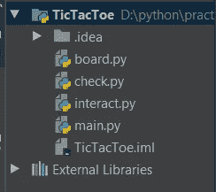

图:文件夹结构

这里，我们的主项目是 TicTacToe，在 src 目录下，我创建了 4 个模块。我们的程序从 main.py 开始，它让玩家在 X 和 O 之间选择，并显示初始棋盘。然后从 interact.py 模块调用 **user_interact()** 函数。互动模块用于与玩家互动，并获取每一步棋在棋盘中的位置。这是大部分工作发生的地方。每次用户输入更新后的电路板时，该模块都会打印出来，并通过 check.py 模块中的 **check_position()** 函数检查所提供的位置是否可用。通过调用 **update_board()** 更新板卡，并通过调用 board.py 模块中的 **display_board()** 函数显示更新后的板卡。在用户第四次输入后，程序通过从检查模块调用 **check_result()** 函数开始检查可能的赢。如果 check_result 函数找到一个赢家，它会宣布一个赢家，并通过跨越所有三个位置来显示棋盘。电路板上的十字标记通过电路板模块的 **cross_board()** 函数执行。

这只是对整个程序如何运行的概述。让我们从 main.py 开始，深入了解每个模块的更多细节。

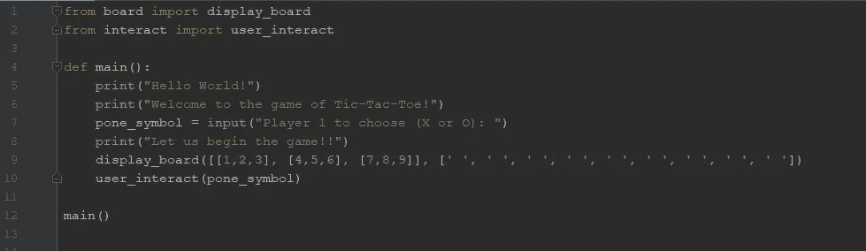

图:main.py

**main.py:**

主模块是我们程序的起点，我们从欢迎玩家开始，并让玩家 1 选择 X 或 o。一旦用户提供了选项，它就会显示初始棋盘并调用 user_interact()函数。

图:main.py 输出

上图是从 main.py 模块获得的输出。图中突出显示的部分显示了程序要求用户输入的步骤。一旦用户提供“X ”,程序就会显示井字游戏棋盘。我们可以看到有两块展板正在展示。这是因为，左边的板显示可供用户选择的位置，一旦用户在板上输入位置，右边的板就会显示。现在让我们看看 user_interact()函数在被主模块调用后做了什么。

**interact.py**

这个 interact.py 只包含一个函数(user_interact())，我将分两部分来描述它。
第一部分:

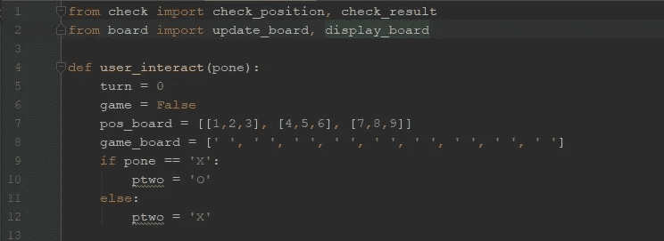

图:interact.py (a)

第一部分只包含导入和初始化语句。在这里，我们初始化了一个位置板(pos_board ),玩家可以在其中查看板和游戏板(game_board)中的可用位置，其中所有字段最初都是空白的。然后，根据玩家 1 所做的选择，给每个玩家分配一个符号“X”或“O”。我们也给游戏赋值 False，这表示程序需要循环直到游戏结束。变量 turn 表示循环执行的圈数/次数。
第二部分:

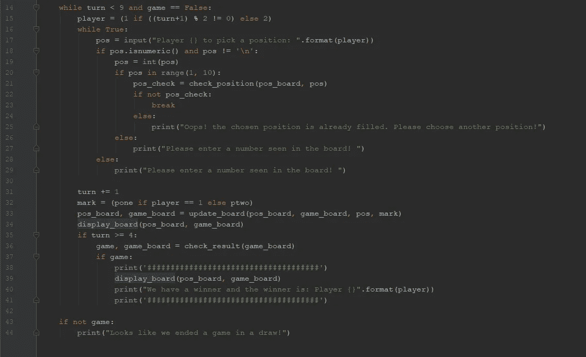

图:interact.py (b)

现在，主要逻辑从本模块的第二部分开始。我们知道只有两个玩家，游戏在 9 步中结束，因此，我们将运行一个循环，直到它循环 9 次或当游戏找到一个赢家。每次，它都要求玩家在位置板上选择一个可用的位置。玩家可以通过选择 1 到 9 之间的一个数字和位置板上的一个数字来选择位置。如果号码超出范围或者是一个字母，或者如果玩家选择了一个位置牌上没有列出的号码，我们会要求玩家重新输入该号码。这是通过 check_position()函数完成的。例如:

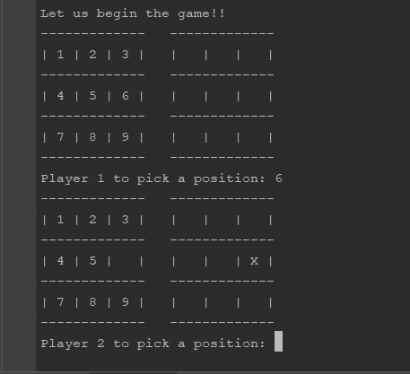

图:1 号玩家选择了位置 6

在这里，我们可以看到玩家 1 选择了位置 6，它在范围之下，在位置板上可用。因此，程序接受输入并打印出更新的电路板。它从位置棋盘(左边的棋盘)上删除位置，并在游戏棋盘(右边的棋盘)上插入一个“X”标记。

图 2:玩家 2 选择了错误的位置

现在，当玩家 2 试图选择玩家 1 选择的位置 6 时，程序通知用户该位置已经有人了。在第二次尝试时，玩家 2 试图选择位置表中不存在的数字 10，类似地，当玩家 2 试图选择一个字母时，游戏重复地要求一个有效的位置，并且直到得到一个位置才前进。
每次输入后，程序用“X”或“O”标记更新位置/游戏棋盘，并显示更新后棋盘的输出。
因为，我们知道游戏只能在第四回合或之后找到赢家，这是我们在变量“回合”大于或等于 4 之后开始检查赢家的时候。我们通过调用 check_result()函数来实现这一点。当满足获胜标准时，该函数返回一个真值和一个划掉了行/列/对角线的游戏棋盘。当游戏有赢家时，它显示棋盘，并通过将变量“game”更新为 True 来结束循环。如果未达到获胜标准，游戏将继续进行，直到以平局结束。
这是交互模块的整体流程。它进入一个循环，直到游戏找到一个赢家或以平局结束。

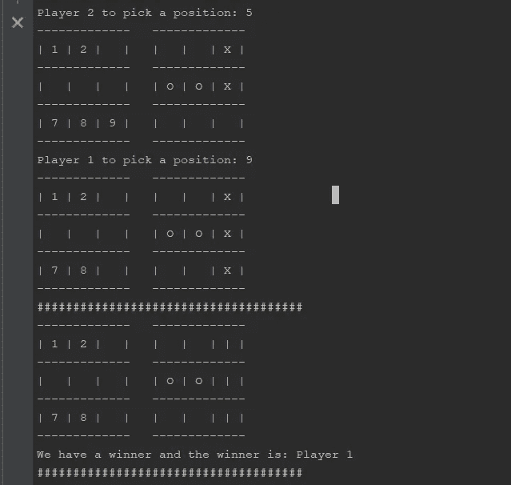

图:比赛以胜利者结束

在上图中，我们可以看到玩家 1 已经赢得了比赛，位置 3，6，9 被划掉。在 draw 的情况下，我们可以看到以下方式的输出:

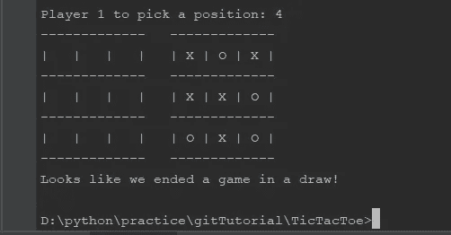

图:比赛以平局结束

**check.py**

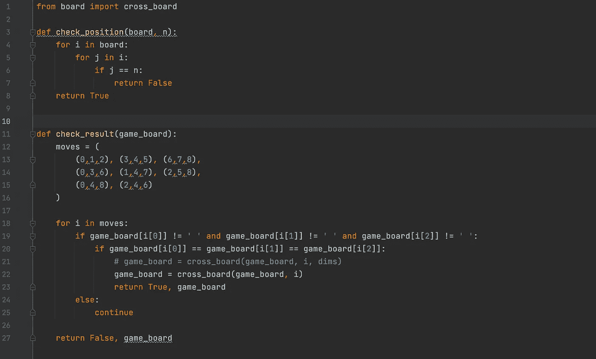

图:check.py

因此，这里我们有 check.py 模块，它主要用于检查可用位置和结果。我们可以看到，每当玩家进入一个位置时，check_position()函数都会被调用。这确保了玩家提供的位置是有效的和可用的。如果该位置可用，则该函数返回 True，否则该函数返回 False。

模块中定义的另一个函数是 check_result()函数。该功能用于在玩家选择位置后检查游戏是赢还是平。因为，游戏只有在第 4 次运行后才能拥有，我们还增加了在转数大于 4 后检查的功能。您可以在上面的 interact.py 模块中看到这一点(图:interact.py (b)，第 35 & 36 行)。
我们已经定义了一个名为“移动”的元组，它包含了棋盘上赢得游戏的所有可能的位置组合。然后，我们运行一个循环，检查棋盘上任何有提到的移动的位置是否有相同的符号(“X”或“O”)。如果我们在任何一步中发现任何位置都有相同的符号，我们就宣布游戏获胜，否则游戏继续进行，直到所有的位置都被填满，游戏以平局结束。

**board.py**

我们必须创建的最后一个模块是 board.py 模块。该模块处理显示、更新和划掉板上的位置。

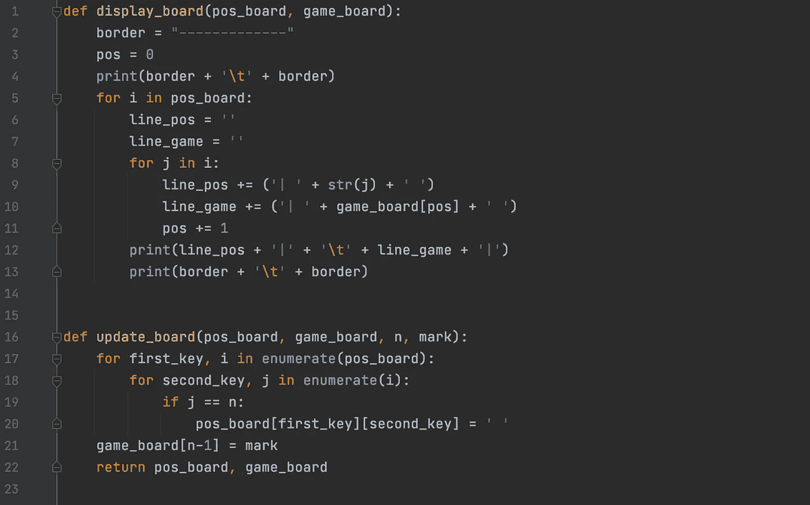

图:board.py (a)

这里，我们有两个函数— display_board()和 update_board()。顾名思义，函数 display_board()显示电路板。该函数接受两个参数— pos_board(位置板—显示板中的可用位置)和 game_board(游戏板—显示 X 和 O 的位置)。每次展示棋盘时，都有两个棋盘在展示，就像我们在上面看到的那样。一个显示棋盘上的可用位置(位置棋盘)，而另一个(游戏棋盘)显示玩家已经占据的位置。我们得到的参数 pos_board，game_board 总是在每回合后更新。这些板是通过 update_board()函数更新的。
update _ board()函数带四个参数——pos _ board、game_board、n(要更新的位置)和 mark(第 n 个位置要填充的标记‘X’或‘O’)。一旦该函数被调用，它就开始在位置板内循环，并在第 n 个位置值与位置板中的位置号匹配时删除该位置号。在这里，因为我们已经不同地实现了位置板和游戏板，所以游戏板通过一行代码更新了标记(图:board.py (a)，第 21 行)。
**注:**我们可以看到我们定义的 game_board 的方式更容易实现。我们也可以对 pos_board 这样做，去掉多余的代码行。

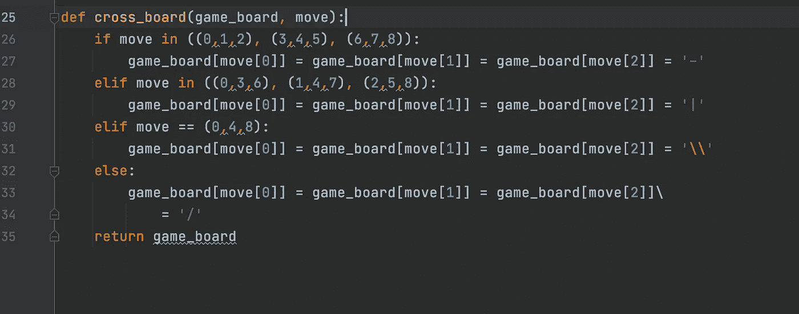

图:board.py (b)

board.py 模块的另一部分由 cross_board 函数组成。一旦我们确认游戏已经结束并且其中一个玩家赢了(当我们从 check.py 模块中的 check_result()函数获得 True 值时)，我们就调用这个函数来划掉赢得游戏的位置。我们使用“-”、“|”、“/”和“\”符号根据移动来划掉位置。

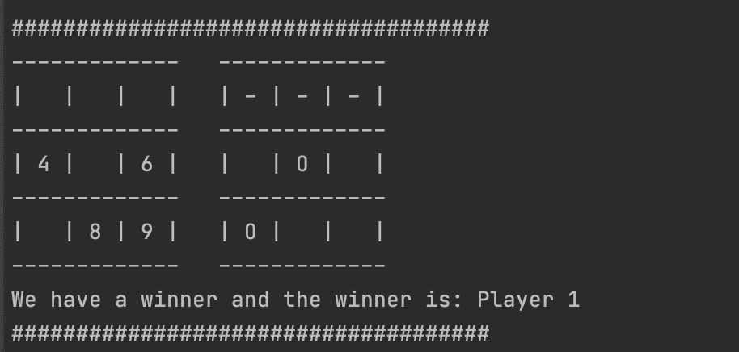

图:1、2、3 位用“-”号划掉，表示比赛获胜。

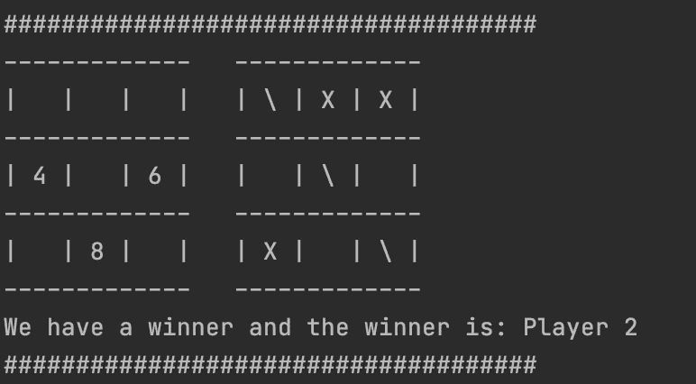

图 5:另一个游戏获胜的例子，位置 1，5 和 9 用“O”标记填充，但用“\”标记划掉。

所以，这总结了 python 编程创建井字游戏。有不同的方法可以用来实现这个目标。我希望你能尝试一下你的方法，让我知道我是否能做得更好。这都是关于优化我们的代码和冗余。希望你喜欢我关于用 python 玩井字游戏的帖子。

**Dhanyabaad！！**🙏🏼