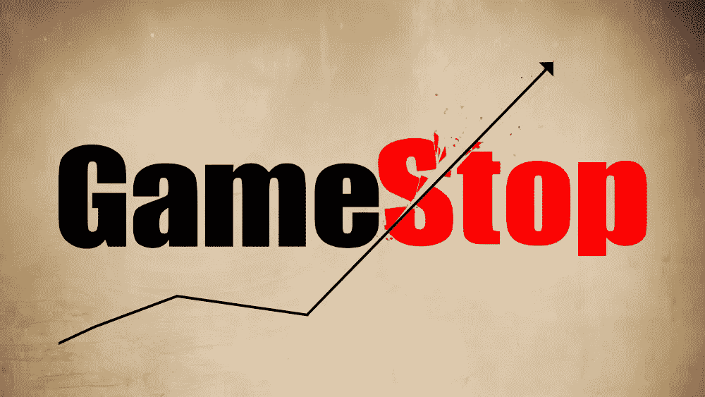

# GameStop 卖空与股票市场:初步分析

> 原文：<https://medium.com/analytics-vidhya/gamestop-short-squeeze-vs-the-stock-market-a-preliminary-analysis-934017cdd145?source=collection_archive---------10----------------------->

## GME 做空——市场崩盘

空头挤压对大盘有什么影响？

# GameStop 到底怎么了？

据广泛报道，GameStop Corp .(纽约证券交易所: [GME](https://finance.yahoo.com/quote/GME/) )是发生在……之间的[做空](https://www.investopedia.com/terms/s/shortsqueeze.asp)的目标