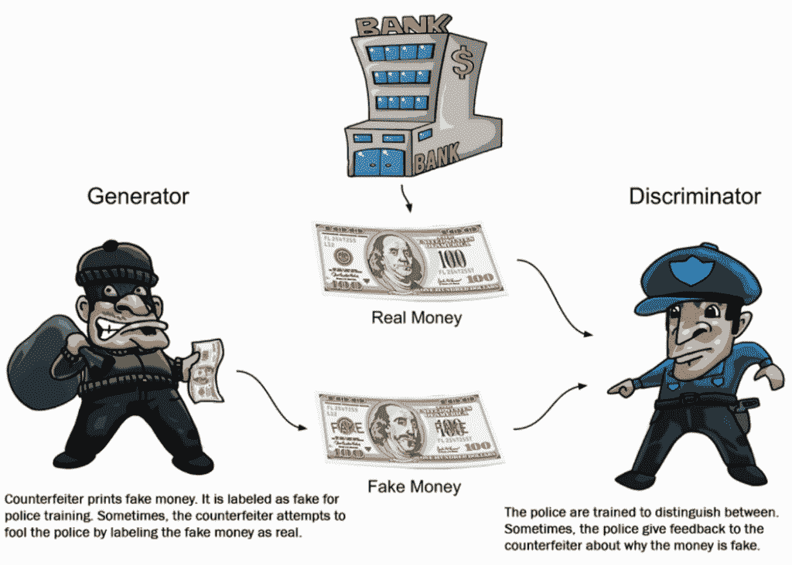
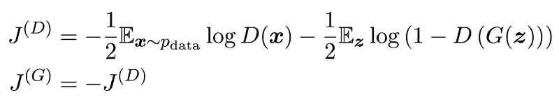
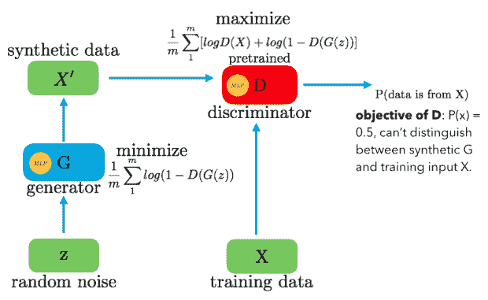

# 甘:生成性对抗网络

> 原文：<https://medium.com/analytics-vidhya/gan-generative-adversarial-network-fbef2a96e183?source=collection_archive---------9----------------------->

虚假新闻文章充斥几乎所有社交媒体平台的选举。想象一下，如果这些文章包含伴随的“虚假图像”和“虚假音频”，将会产生怎样的影响。在这样一个世界里，宣传可能会更容易传播。本质上，这些新的生成模型，**有时间和数据，可以从几乎*任何*分布中生成非常令人信服的样本。**

GANs 在诸如 ***生成图像数据集的示例、生成逼真的照片、图像到图像翻译、文本到图像翻译、语义图像到照片翻译、人脸正面视图生成、生成新的人体姿态、人脸老化、视频预测、3D 对象生成等情况下有大量的应用。***

GAN 是一种使用深度学习方法(如卷积神经网络)的生成建模方法。

生成建模是机器学习中的一项无监督学习任务，它涉及自动发现和学习输入数据中的规律或模式，使得模型可以用于生成或输出新的示例，这些示例很可能是从原始数据集中提取的。

gan 是一种训练生成模型的聪明方法，它通过将问题构建为具有两个子模型的监督学习问题:我们训练以生成新示例的生成器模型，以及尝试将示例分类为真实(来自领域)或虚假(生成)的鉴别器模型。

**“生成对抗网络”**甘采取了一种不同于其他类型神经网络的学习方法。GANs 算法架构使用两个神经网络，称为**生成器**和**鉴别器**，它们相互“竞争”以产生想要的结果。生成器的工作是创建逼真的假图像，而鉴别器的工作是区分真实图像和假图像。如果两者都在高水平上发挥作用，结果就是图像看起来和现实生活中的照片一样。

自 2014 年 Ian J. Goodfellow 和合著者在文章《生成对抗网络》中提出以来，生成对抗网络取得了巨大的成功。

# 最初为什么要开发 GANs？

人们已经注意到，大多数主流神经网络可以很容易地被愚弄，通过在原始数据中仅添加少量噪声来对事物进行错误分类。令人惊讶的是，添加噪声后的模型在错误预测中的置信度比正确预测时更高。这种对手的原因是大多数机器学习模型从有限的数据量中学习，这是一个巨大的缺点，因为它容易**过度拟合。**同样，输入和输出之间的映射几乎是线性的。

**朴素贝叶斯**是一个生成模型的例子，更常用作判别模型。

例如，朴素贝叶斯通过汇总每个输入变量和输出类的概率分布来工作。当进行预测时，计算每个变量的每个可能结果的概率，组合独立的概率，并预测最可能的结果。反向使用时，可以对每个变量的概率分布进行采样，以生成新的可信(独立)特征值。

生成模型的其他示例包括潜在狄利克雷分配(LDA)和高斯混合模型(GMM)。

深度学习方法可以作为生成模型。两个流行的例子包括受限玻尔兹曼机器，或 RBM，和深度信念网络，或 DBN。

深度学习生成建模算法的两个现代例子包括变分自动编码器或 VAE，以及生成对抗网络或 GAN。

# GANs 是如何工作的？

gan 通过让两个神经网络相互对抗来学习数据集的概率分布。

一个被称为**生成器**的神经网络生成新的数据实例，而另一个被称为**鉴别器**的神经网络评估它们的真实性；即鉴别器决定它检查的每个数据实例是否属于实际的训练数据集。

与此同时，生成器正在创建新的合成/伪造图像，并将其传递给鉴别器。它这样做是希望它们也能被认为是真的，即使它们是假的。假图像是使用卷积的逆运算(称为转置卷积)从 100 维噪声(均匀分布在-1.0 到 1.0 之间)生成的。

以下是 GAN 采取的步骤:

*   生成器接收随机数并返回图像。
*   这个生成的图像与从实际的地面实况数据集中提取的图像流一起被输入鉴别器。
*   鉴别器接受真实和伪造的图像，并返回概率，一个介于 0 和 1 之间的数字，1 代表对真实性的预测，0 代表伪造。

# 甘斯背后的数学

鉴别器的工作是执行**二元分类**来检测真假，因此其**损失函数是二元交叉熵**。

发生器所做的是**密度估计**，从噪声到真实数据，并将其馈送给鉴别器以欺骗它。

设计中遵循的方法是将其建模为一个**极小极大游戏**。

成本函数:

J(D) 中的**第一项表示将实际数据提供给鉴别器，鉴别器将希望最大化预测一的对数概率，表明数据是真实的。**

**第二项**代表 g 产生的样本。

在这里，鉴别器想要最大化预测零的对数概率，这表明数据是假的。另一方面，生成器试图最小化鉴别器正确的对数概率。这个问题的解是博弈的一个均衡点，这个均衡点是鉴别器损失的一个鞍点。

**目标函数**

**甘斯建筑**

d()给出了给定样本来自训练数据 x 的概率。

对于生成器，我们希望最小化 log(1-D(G(z))，即当值 D(G(z))很高时，D 将假设 G(z)只不过是 X，这使得 1-D(G(z))非常低，我们希望最小化它，甚至更低。

对于鉴别器，我们要最大化 D(X)和(1-D(G(z))。所以 D 的最优状态会是 P(x)=0.5。然而，我们想训练生成器 G，使它为鉴别器 D 产生结果，这样 D 就不能区分 z 和 x。

现在的问题是为什么这是一个极大极小函数？

这是因为鉴别器试图最大化目标，而生成器试图最小化目标，由于这种最小化/最大化，我们得到了极大极小项。它们都通过交替**梯度下降来一起学习。**

尽管 GAN 的想法在理论上很简单，但要建立一个可行的模型却非常困难。在 GAN 中，有两个耦合在一起的深层网络，使得梯度的反向传播具有两倍的挑战性。

**深度卷积 GAN (DCGAN)** 是演示如何构建实用 GAN 的模型之一，该 GAN 可以自学如何合成新图像。DCGAN 非常类似于 GAN，但特别关注于使用深度卷积网络来代替普通 GAN 中使用的全连接网络。

卷积网络有助于发现图像中的深度相关性，也就是说，它们寻找空间相关性。这意味着 DCGAN 将是图像/视频数据的更好选择，而 *GAN* s 可以被视为 DCGAN 和许多其他架构 *(CGAN、CycleGAN、StarGAN 和许多其他架构)*发展的一般理念。

好了，这篇关于 GANs 的文章到此结束，在这里我们讨论了这个很酷的人工智能领域以及它是如何实际实现的。我希望你们喜欢读它。

感谢您阅读这篇文章！！！

— — — — — — — — — — — — — — — — — — — — — — — — — — — — — — —

参考:

[1] X. Zhang、S. Karaman 和 S. Chang，“检测和模拟 GAN 伪图像中的伪像”，在 Proc .2019 年 IEEE 信息取证与安全国际研讨会。

[2]托洛萨纳、鲁本、鲁本·维拉-罗德里格斯、朱利安·菲尔雷斯、艾塔米·莫拉莱斯和哈维尔·奥尔特加-加西亚。"深度伪装与超越:人脸操作与伪装检测综述."信息融合 64(2020):131–148。

[3]Heo，Yehjune。"基于生成对抗网络的指纹反欺骗限制."国际计算机与信息工程杂志 15，第 6 期(2021):349–353。

[4]笈多，维舒，西垣正胜，大垣哲。"使用生成对抗网络的无监督生物特征反欺骗."

[5]古德费勒、伊恩、让·普热-阿巴迪、迈赫迪·米尔扎、徐炳、戴维·沃德-法利、谢尔吉尔·奥泽尔、亚伦·库维尔和约舒阿·本吉奥。"生成性对抗网络。"神经信息处理系统进展 27 (2014)。

[6]拉德福德，亚历克，卢克·梅斯，和苏密特·钦塔拉。"深度卷积生成对抗网络的无监督表示学习."arXiv 预印本 arXiv:1511.06434 (2015)。

[7]杨，建伟，，李。"学习卷积神经网络进行人脸反欺骗."arXiv 预印本 arXiv:1408.5601 (2014)。

[8][https://poloclub.github.io/ganlab/](https://poloclub.github.io/ganlab/)

[9]https://towards data science . com/the-math-behind-gans-generative-adversarial-networks-3828 f 3469 d9c