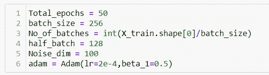

# 生成对抗网络

> 原文：<https://medium.com/analytics-vidhya/gan-generative-adversarial-networks-beb6b102a0b5?source=collection_archive---------16----------------------->

GANs 是一种使用深度学习方法进行生成建模的方法。

让我们用一个简单的例子来理解 GANs。

他们的是假货币和真货币。警察能够区分假币和真币，并向假币制造者提供反馈，下次会做得更好。我知道这有点令人困惑，但过一会儿我相信你会明白的。

模型的训练分两步进行。

第一步:

负责鉴别的警察受过训练，能辨别假钞和真钞。

第二步:

我们的伪钞生成器被训练，鉴别层被冻结。

让我们看看代码，更好地理解。

在这里，我只讨论了主要部分的完整代码回购终于可用。

我们刚刚初始化了变量。

这是我们的发电机模型。它会给出输出，我们可以在 28*28 图像中调整它的大小。你用不同数量的进动子尝试不同数量的层。

这是我们的鉴别器模型。

这是我们的第二步，我们冻结了我们的鉴别器模型。

正如你所观察到的，我们首先训练我们的鉴别器(警察),然后冻结它并训练出发电机。你可以观察到他们互相帮助，越做越好。只是去扔代码，再次阅读这篇文章，我相信你会得到它。第一步需要一些时间，但是让它稳定下来。

一些需要注意的小技巧-

*   噪声应该是高斯分布的样本。
*   LeakyRelu

这是 50 个纪元后的输出，这些数字是由我们的机器生成的。是不是很迷人。

通过使用 DCGANs，您可以获得更好的图像质量，但我们将改天继续。

GitHub 回购链接—[https://github.com/tjjain/GAN](https://github.com/tjjain/GAN)

我已经尽可能用最简单的语言解释了。我刚刚开始写这些东西，如果你能告诉我我可以在哪里改进以提供更好的内容，那将是非常棒的。