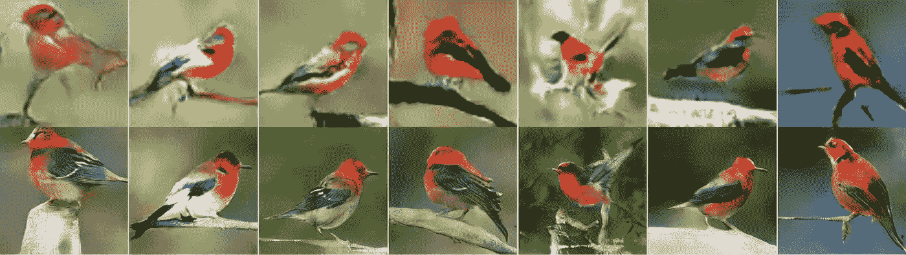
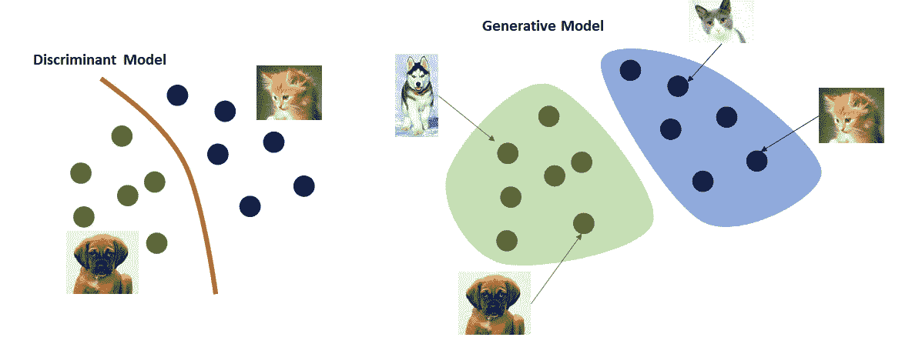
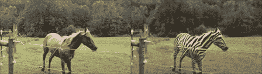
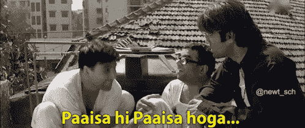
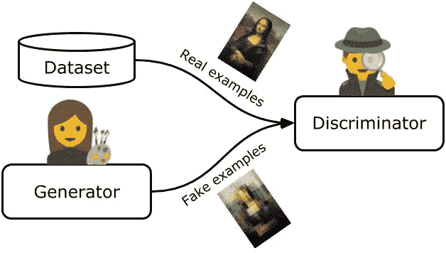

# 直觉

> 原文：<https://medium.com/analytics-vidhya/gans-intuition-a0bb6503bd25?source=collection_archive---------15----------------------->

[来源](https://arxiv.org/pdf/1612.03242.pdf)

M 机器学习算法非常适合识别隐藏在数据中的模式，并使用这些信息来执行分类和回归等任务。机器学习是否仅限于执行这些任务？或者还有别的什么？我们结账吧。

***假设我们手头有一个任务要在狗&猫之间进行分类，我们会用什么方法来解决这个问题？*** 一个非常通用的方法是，在数据上拟合一个函数(红线),就像一个边界，一边属于狗，另一边属于猫。有一个机会，我们可以观察到一些渗透者(错误分类)。

一般来说，我们试图找到给定数据(X)的标签(Y)。以统计的方式，计算标签(狗或猫)给定输入图像的概率 **P(Y|X)** 。这种建模称为**判别建模。**

现在的问题是，我们能不能反过来做，反过来做？ ***我们能生成狗和猫的图像吗？*** 这就是被称为**创成式造型**的领域进化的地方。这里我们试图解决的问题是 **P(X|Y)** ，生成给定 Y 的 X。

从上图可以看出，我们只需从狗和猫各自的分布中提取样本，问题就解决了。 ***就这么简单？*** 🤔

一个 28X28 的图像将有 784 个像素，因此它将位于 784 维空间中，并且它们的分布当然不会是正态分布。因此，很难在如此高维的空间中找到它们的分布，并从中提取出逼真的样本。

# 甘的入关

事情在 2014 年发生了变化，当时蒙特利尔大学的博士生 Ian Goodfellow 发明了生成对抗网络(GANs)。这项技术使计算机能够使用两个独立的神经网络，而不是一个来模拟数据。

[来源](https://arxiv.org/pdf/1703.10593.pdf)

Gans 并不是第一个用于生成数据的算法，但它们的结果和通用性使它们与众不同。比如生成具有真实世界质量的假图像的能力，比如将一匹马的视频片段变成一匹奔跑的斑马。

# 类似

比方说，镇上很快将举行一场著名画家画作的拍卖。镇上的伪造者嗅到了赚钱的机会。

伪造者就像…

因此，尽管他一点也不擅长绘画，他还是决定伪造。这并不是摆在他面前的唯一问题，拍卖现场有一位艺术专家来检查画作的真实性&没有他的批准，一幅画不会进入拍卖，但他在这一领域也是新手。伪造者松了一口气。

一位艺术专家笑着说:“首先，伪造者伪造了非常糟糕的达·芬奇的作品，在看了那些不能称之为艺术品的东西之后。”。他不用费什么力气就能把它贴上假货的标签。

但是伪造者不准备放弃，他试了一次又一次。伊夫非常聪明，每次他的画被拒绝时，他都记下可能出了什么问题。他改进了那个，又试了一次。最终，他变得擅长绘画。另一方面，一个艺术专家也在不断学习，不断提升自己。

在一个时间点上，伪造者伪造了一幅非常好的达芬奇艺术品的复制品，现在一位艺术专家很困惑，是真品还是赝品？既然艺术专家变得非常擅长他的工作，那幅伪造的画一定是一幅极好的画。

如果我们从第三人称的角度来看这种情况，伪造者和艺术专家之间正在进行某种竞争。伪造者想要愚弄艺术专家，而艺术专家试图避免这种不利的关系。只有当伪造者和艺术专家变得非常强大时，一幅质量优秀的伪造画才会出现。

**甘的行为与上述情景十分相似。**

**什么是生成性敌对网络？**

它是一类机器学习技术，由两个模型(伪造者和艺术专家)组成

*【伪造者】- >生成伪造数据*

****鉴别器*** (美工专家)——>从真实事例中辨别假数据。*

***创成式**一词表示模型的总体用途。要创建新的数据，这取决于训练数据的选择，就像上面的例子，伪造者必须研究达芬奇的作品来创建一个假的。*

***对抗性**这个词指向了发生在生成者(伪造者)和鉴别者(艺术专家)之间的游戏本质。生成器的目标是创建与训练集中的真实数据无法区分的示例。伪造者有着非常相似的目标。鉴别器的目标是将生成器产生的假样本与来自训练数据集的真实样本区分开。目标与艺术专家非常相似。 ***他们两个不断地试图瞒住对方。生成器在创建令人信服的数据方面做得越好，鉴别器就需要更好地辨别真假。****

***网络**表示最常用于表示生成器和鉴别器的机器学习模型的类别。 ***神经网络。****

**这只是 GANs 的直观部分，但 GANs 的架构是什么？它是如何工作的？它是如何训练的？如何评价？这些也是 GANs 很有意思的地方。**

# *参考资料:*

1.  *[Ian j . good fellow 等人的生成对抗网](https://arxiv.org/pdf/1406.2661.pdf)*
2.  *[生成对抗网络(GANs)——计算机爱好者](https://youtu.be/Sw9r8CL98N0)*
3.  *Jakub Langr 和 Vladimir Bok 的《GANs 在行动》*