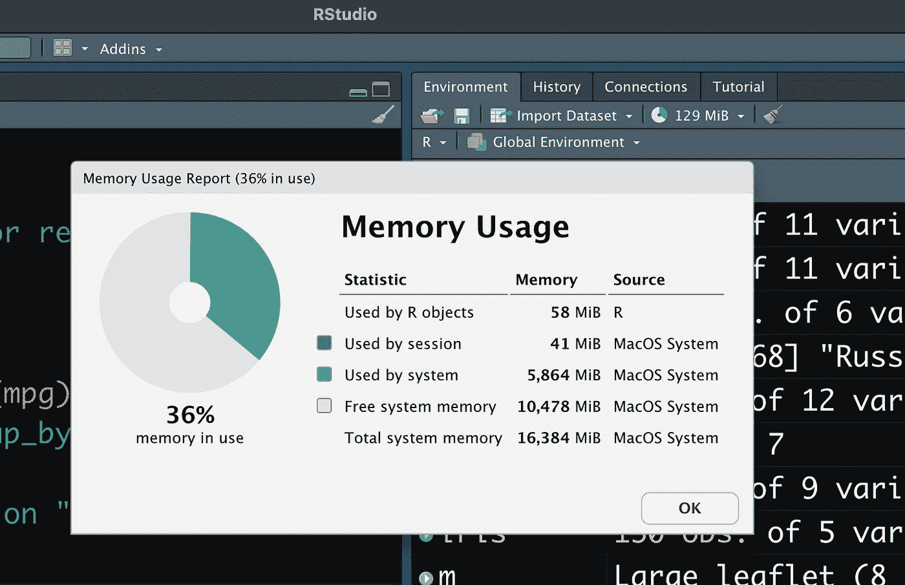

# 垃圾收集:了解 RStudio 中的内存使用报告

> 原文：<https://medium.com/analytics-vidhya/garbage-collection-understanding-the-memory-usage-report-in-rstudio-d9506db3ddb2?source=collection_archive---------7----------------------->

RStudio 的内存使用报告(图片:Pierre DeBois)

当 RStudio 为 R 编程引入其流行的 IDE 1.4 版本时，添加了一个新的调试指标，称为内存使用。内存使用报告的目的是揭示一个程序使用了多少内存。利用这个计量器可以帮助开发人员提高程序的运行效率。