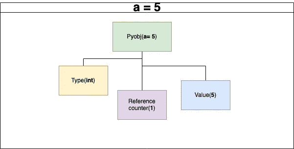
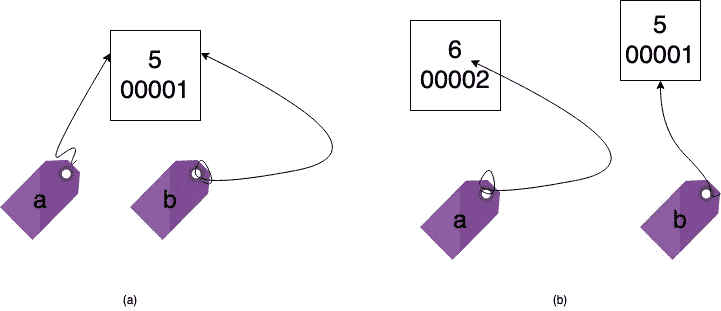

# Python 中的垃圾收集器(GC )(第一部分)

> 原文：<https://medium.com/analytics-vidhya/garbage-collector-gc-in-python-part-i-ec4ccbe2519b?source=collection_archive---------11----------------------->


垃圾收集工

亲爱的读者们，这篇博客文章试图解释 GC 模块的实现。

> **垃圾收集器(GC)** {wiki 定义}:
> 垃圾收集器(GC)是**自动内存管理**的一种形式。垃圾收集器，或者只是收集器，试图回收垃圾，或者不再被**程序**使用的**对象**占用的内存。

GC 的基本思想，是将 python 中****不需要的对象*** 的内存块释放。*

*以下是理解 CPython 中 GC 模块实现的先决条件。他们是，*

*   ****【Python 核心 obj】****
*   ****记忆参考****
*   ****参考计数器****

# *PyObj*

*   *PyObj 是一个 python 核心对象。*
*   *python 中的所有对象最终都被称为 PyObj。*
*   *PyObj 有三个属性，*

*>*类型**

*>*值**

**>参考计数器(ref_count)**

*   *检查 python 中的任何对象，都会有这些属性。*

**

*PyObj 结构*

```
*# source code to see pyobj propertiesimport sys

a = 5                                               
print(type(a)) # this line will print obj type

print(a) # this line will print obj value          

print(sys.getrefcount(a)) # this line will reference count of an obj.*
```

**源代码*:[https://github . com/Ibrahim sha 23/GC _ python _ meetup/blob/main/5 . py](https://github.com/ibrahimsha23/gc_python_meetup/blob/main/5.py)*

# *内存引用*

*   *在 python 中， [*一切都是对象*](http://.) 。*

```
*a = 5; b = 5;*
```

*   *为变量 [**a 和 b**](http://.) 赋值相同的值( **Eg: 5** )会为 C、C++、Java 等其他编程语言中的每次赋值创建一个新的内存块。*

> *Python 不会为具有相同值的多个赋值创建新的内存分配(例如:a = 5；b=5)。**在内部，python 为每个赋值变量标记内存引用(内存位置)**。*

**

*内存引用*

*   *参考上图(a-section)，[***a 和 b 值的内存位置相同***](http://.) 。*

> *在对变量‘a’从 [**5 重新分配到**](http://.)**6 值后，现在引用从 00001[**更改到 00002**](http://.) 内存位置。***

```
***import sysa = 5b = 5def print_id(var_val, var):
    print("id of {0} - {1}".format(var_val, id(var))) print_id("a", a) # o/p: id of a - 140336997356632print_id("b", b) # o/p: id of b - 140336997356632 print("===================== value change ===============") a = 6 # new valueprint_id("a", a) # o/p: id of a - 140336997356608print_id("b", b) # o/p: id of b - 140336997356632***
```

****源代码*:[https://github . com/Ibrahim sha 23/GC _ python _ meetup/blob/main/6 . py](https://github.com/ibrahimsha23/gc_python_meetup/blob/main/6.py)***

*   ***上面的代码块包含了作为注释的内存引用的输出，您可以看到**变量 a 的内存地址从 140336997356632 变为 140336997356608。*****
*   ***注意:要知道变量的内存地址，我们可以使用 python 内置的方法`**id.**`***

```
 ***id(variable_name)***
```

******感谢阅读！******

***在 ***part-II 博客*** (即将发表)上，将解释关于引用计数器及其弊端。***

***在 ***第三部分的博客*** (即将发布)上，将会解释 GC 的实现。***

***请在评论中分享你的建议。***

***要联系我，请在 LinkedIn 上联系我。***